# Line Encoding

## Decode Settings
<figure markdown>
  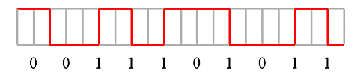
  <figcaption>Decode Settings</figcaption>
</figure>

## Example
<figure markdown>
  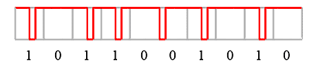
  <figcaption>Decode Example</figcaption>
</figure>
<figure markdown>
  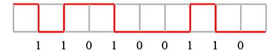
  <figcaption>Decode Figure</figcaption>
</figure>
<figure markdown>
  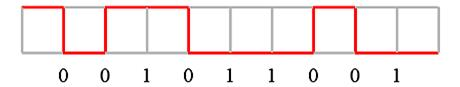
  <figcaption>Decode Figure</figcaption>
</figure>
<figure markdown>
  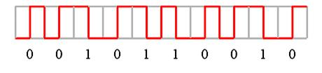
  <figcaption>Decode Figure</figcaption>
</figure>
<figure markdown>
  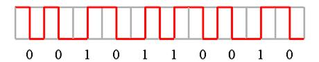
  <figcaption>Decode Figure</figcaption>
</figure>
<figure markdown>
  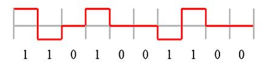
  <figcaption>Decode Figure</figcaption>
</figure>
<figure markdown>
  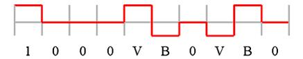
  <figcaption>Decode Figure</figcaption>
</figure>
<figure markdown>
  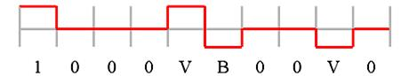
  <figcaption>Decode Figure</figcaption>
</figure>
<figure markdown>
  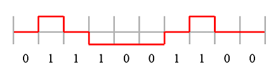
  <figcaption>Decode Figure</figcaption>
</figure>
<figure markdown>
  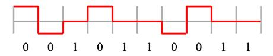
  <figcaption>Decode Figure</figcaption>
</figure>
<figure markdown>
  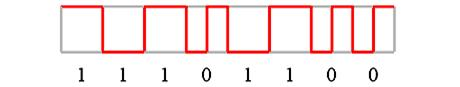
  <figcaption>Decode Figure</figcaption>
</figure>

## What is Line Encoding?

Line encoding is a signal processing technique that converts digital data into electrical waveforms suitable for transmission over physical media such as copper wires, optical fibers, or radio channels. Rather than transmitting raw binary data as simple high-low voltage levels (which would suffer from DC bias, lack of synchronization, and poor error detection), line encoding schemes map logical 1s and 0s to carefully designed signal patterns that incorporate clock recovery information, maintain DC balance, limit consecutive identical bits, and improve noise immunity. Line encoding is fundamental to all digital communication systems, from low-speed serial interfaces like RS-232 to high-speed networks like Gigabit Ethernet and optical fiber links.

Different line codes offer various trade-offs in bandwidth efficiency, clock recovery capability, DC balance, error detection, and implementation complexity. Common encoding schemes include NRZ (Non-Return-to-Zero), NRZI (Non-Return-to-Zero Inverted), Manchester encoding (used in Ethernet 10BASE-T), differential Manchester (used in Token Ring), 4B/5B (Fiber Channel), 8B/10B (Gigabit Ethernet, USB 3.0, SATA, PCI Express), 64B/66B (10 Gigabit Ethernet), and MLT-3 (100BASE-TX Fast Ethernet). Each encoding scheme is optimized for specific application requirements: Manchester provides excellent clock recovery at the cost of doubling bandwidth; 8B/10B provides DC balance and error detection with only 20% overhead; and 64B/66B achieves 96.9% efficiency for ultra-high-speed links.

In logic analyzer applications, line encoding analysis tools decode captured physical layer signals into logical data streams, allowing protocol analyzers to interpret higher-level communications. Understanding line encoding is essential for debugging signal integrity issues, verifying physical layer compliance, identifying transmission errors, and diagnosing bit-level problems in serial communication systems. The line encoding decoder translates captured waveforms (transitions, voltages, timing) back into binary data sequences, effectively reversing the encoding process to reveal the original information being transmitted.

## Line Encoding Schemes

### NRZ (Non-Return-to-Zero)

**Encoding:**
- Logic '1': High voltage level
- Logic '0': Low voltage level
- Signal does not return to zero between bits

**Characteristics:**
- **Bandwidth**: Most efficient (1 bit per symbol)
- **Clock recovery**: Poor (long runs of 1s or 0s have no transitions)
- **DC component**: Present (can cause baseline wander)
- **Complexity**: Simplest to implement

**Applications:**
- Short-distance digital interfaces (logic level signals)
- UART/RS-232 asynchronous serial
- Simple point-to-point connections

### NRZI (Non-Return-to-Zero Inverted)

**Encoding:**
- Logic '1': Transition (change level)
- Logic '0': No transition (maintain level)

**Characteristics:**
- **Clock recovery**: Better than NRZ for 1s, poor for long 0s
- **Differential**: Immune to polarity inversion
- **Bit stuffing**: Often combined with bit stuffing to ensure transitions

**Applications:**
- USB (with bit stuffing after six consecutive 1s)
- HDMI and DisplayPort (transition encoding variants)

### Manchester Encoding

**Encoding:**
- Logic '1': High-to-low transition at bit center (or low-to-high, depending on convention)
- Logic '0': Low-to-high transition at bit center (or high-to-low)

**Characteristics:**
- **Clock recovery**: Excellent (transition in every bit period)
- **DC balance**: Perfect (equal high and low time)
- **Bandwidth**: Poor (requires 2× bandwidth)
- **Self-clocking**: No separate clock needed

**Applications:**
- Ethernet 10BASE-T (IEEE 802.3)
- RFID and NFC
- Consumer IR protocols
- Early magnetic recording (MFM - Modified Frequency Modulation)

### Differential Manchester

**Encoding:**
- Transition always at bit center
- Logic '1': No transition at bit boundary
- Logic '0': Transition at bit boundary

**Characteristics:**
- **Clock recovery**: Excellent (guaranteed mid-bit transition)
- **DC balance**: Good
- **Noise immunity**: Better than Manchester

**Applications:**
- IEEE 802.5 Token Ring
- Some industrial control networks

### 4B/5B Encoding

**Encoding:**
- Maps 4 data bits to 5 code bits
- Ensures no more than 3 consecutive zeros
- 16 valid data patterns + special control codes

**Characteristics:**
- **Efficiency**: 80% (4/5)
- **Clock recovery**: Good (limited run length)
- **DC balance**: Requires additional encoding layer (NRZI)
- **Error detection**: Invalid codes detectable

**Applications:**
- 100BASE-FX Fast Ethernet
- FDDI (Fiber Distributed Data Interface)

### 8B/10B Encoding

**Encoding:**
- Maps 8 data bits to 10 code bits
- Maintains running disparity (DC balance)
- 256 data characters (Dx.y) + 12 control characters (Kx.y)
- Limits run length to 5 consecutive bits

**Characteristics:**
- **Efficiency**: 80% (8/10)
- **DC balance**: Excellent (running disparity tracking)
- **Clock recovery**: Very good (max 5 consecutive bits)
- **Error detection**: Invalid codes and disparity errors detectable
- **Control characters**: In-band signaling for framing and control

**Applications:**
- Gigabit Ethernet (1000BASE-X)
- Fibre Channel
- SATA (Serial ATA)
- USB 3.0
- PCI Express (Gen 1 and Gen 2)
- 10 Gigabit Ethernet XAUI

### 64B/66B Encoding

**Encoding:**
- Maps 64 data bits to 66 code bits (2-bit sync header + 64 data bits)
- Sync header alternates: 01 or 10
- Scrambling used for DC balance

**Characteristics:**
- **Efficiency**: 96.9% (64/66)
- **DC balance**: Achieved through scrambling
- **Clock recovery**: Sync header provides frequent transitions
- **Overhead**: Very low (3.1%)

**Applications:**
- 10 Gigabit Ethernet (10GBASE-R)
- 40/100 Gigabit Ethernet
- High-speed serial links

### MLT-3 (Multi-Level Transmit)

**Encoding:**
- Three voltage levels: +V, 0, -V
- Logic '1': Transition to next level in sequence (+V → 0 → -V → 0 → +V...)
- Logic '0': No transition

**Characteristics:**
- **Bandwidth**: Reduced by 3× compared to NRZ
- **EMI reduction**: Lower frequency spectrum
- **Combined with 4B/5B**: Used in 100BASE-TX

**Applications:**
- 100BASE-TX Fast Ethernet (MLT-3 + 4B/5B)
- FDDI physical layer

## Common Applications

Line encoding analysis is used across digital communication systems:

**Serial Communication Debugging:**
- UART, RS-232, RS-485 signal analysis
- USB signal quality and compliance testing
- SPI, I2C, and other serial bus debugging

**Networking:**
- Ethernet physical layer analysis (10/100/1000 Mbps)
- Fiber optic link testing
- High-speed serial fabric debugging (PCIe, SATA, SAS)

**Protocol Development:**
- Implementing custom serial protocols
- Verifying physical layer compliance
- Testing encoder/decoder circuits

**Signal Integrity:**
- Eye diagram analysis
- Jitter and timing margin measurement
- Pre-emphasis and equalization validation

**Standards Compliance:**
- Validating transmitter outputs against specifications
- Receiver sensitivity testing
- Interoperability testing

## Decoder Configuration

When configuring a logic analyzer for line encoding analysis:

### Channel Assignment

**Minimum Configuration:**
- **DATA**: The encoded signal line
- **Optional**: CLK (clock reference, if separate clock exists)

### Decoder Parameters

**Encoding Scheme Selection:**
Choose the appropriate encoding:
- NRZ, NRZI
- Manchester, Differential Manchester
- 4B/5B, 8B/10B, 64B/66B
- MLT-3
- Custom/proprietary encodings

**Timing Parameters:**
- **Bit rate**: Data rate in bps
- **Sample rate**: Typically 10-100× bit rate for accurate edge detection
- **Clock recovery**: Enable automatic clock recovery or provide external clock
- **Bit order**: MSB-first or LSB-first

**Decoding Options:**
- **Show encoded symbols**: Display 10-bit codes for 8B/10B
- **Show decoded data**: Display original 8-bit data
- **Display control characters**: Highlight K-codes (8B/10B)
- **Disparity tracking**: Show running disparity (8B/10B)
- **Error detection**: Flag invalid codes, disparity errors, run-length violations

### Analysis Tips

**Clock Recovery Validation:**
Verify the decoder correctly recovers clock from the data stream. Look for bit slips or framing errors if clock recovery fails, especially with long runs of identical bits in NRZ/NRZI.

**DC Balance Verification:**
For DC-balanced codes (Manchester, 8B/10B), verify the signal spends equal time high and low. DC imbalance causes baseline wander and can lead to errors over AC-coupled links.

**Run-Length Verification:**
Check that maximum run length limits are respected (e.g., 5 bits for 8B/10B). Violations indicate encoding errors or signal corruption.

**Error Rate Monitoring:**
Track coding violations and invalid symbols. High error rates indicate signal integrity problems, improper termination, or timing issues.

**Symbol-Level Analysis:**
For block codes (8B/10B, 64B/66B), display both encoded symbols and decoded data to understand mapping and identify errors at the symbol level.

## Reference

- [Wikipedia: Line Code](https://en.wikipedia.org/wiki/Line_code): Overview of line encoding schemes
- [Manchester Code](https://en.wikipedia.org/wiki/Manchester_code): Manchester encoding details
- [8b/10b Encoding](https://en.wikipedia.org/wiki/8b/10b_encoding): 8B/10B code specification
- [IEEE 802.3 Ethernet Standards](https://standards.ieee.org/standard/802_3-2018.html): Physical layer encoding
- [Digilent: Manchester Encoding Guide](https://digilent.com/reference/test-and-measurement/guides/manchester-encoding): Practical decoding guide
