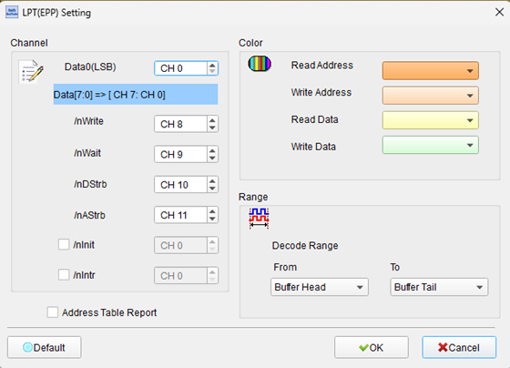
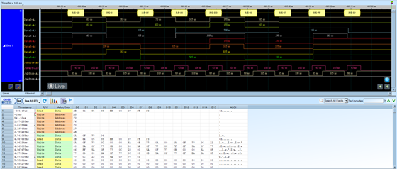

# LPT (Parallel Port / Centronics Interface)


## Decode Settings
<figure markdown>
  
  <figcaption>Decode Settings</figcaption>
</figure>

## Example
<figure markdown>
  
  <figcaption>Decode Example</figcaption>
</figure>

## What is LPT?

### Overview

LPT (Line Print Terminal), commonly known as the parallel port or Centronics interface, is a legacy parallel communication interface that was the standard connection method for printers and other peripherals on IBM PC-compatible computers from the 1980s through the early 2000s. Originally designed by Centronics for their dot-matrix printers in the 1970s and later standardized as IEEE 1284, the parallel port uses an 8-bit parallel data bus to transfer data from a computer to a peripheral device, typically achieving transfer rates of 50-150 KB/s in standard mode and up to 2 MB/s in enhanced modes (EPP/ECP). The interface became ubiquitous due to its simplicity, reliability, and sufficient speed for the printing needs of its era.

The parallel port connector on PCs is typically a 25-pin DB-25 connector (LPT1, LPT2, etc. in DOS/Windows), while printer-side Centronics connectors use a distinctive 36-pin connector. The interface includes 8 bidirectional data lines (D0-D7), multiple control signals (STROBE, AUTOFEED, SELECT IN, INIT), and status signals (ACK, BUSY, PAPER OUT, SELECT, ERROR). The original Centronics protocol operates in a simple handshaking mode where the computer asserts STROBE to indicate valid data, and the printer responds with ACK when ready for the next byte. IEEE 1284 later standardized enhanced modes including Nibble mode (4-bit reverse channel), Byte mode (8-bit bidirectional), EPP (Enhanced Parallel Port), and ECP (Extended Capabilities Port) with DMA support and hardware compression.

While USB has largely replaced parallel ports for printing, LPT remains relevant in several contexts: legacy industrial equipment and CNC machines that rely on parallel port control, embedded systems using parallel ports for GPIO expansion or simple data acquisition, retro computing and vintage hardware preservation, and as a teaching tool for understanding parallel communication protocols. Many embedded development boards and FPGA platforms still provide parallel port interfaces for prototyping and debugging. Understanding LPT protocols is valuable for maintaining legacy systems, reverse-engineering printer protocols, and implementing parallel communication in embedded applications.

### Key Features

- **8-bit Parallel Data**: Byte-wide data transfer on D[7:0]
- **Bidirectional**: IEEE 1284 supports reverse channel communication
- **Multiple Modes**: Standard (SPP), Nibble, Byte, EPP, ECP
- **Hardware Handshaking**: STROBE/ACK protocol for flow control
- **Status Reporting**: Printer status (busy, paper out, error, etc.)
- **Simple Protocol**: Easy to implement with GPIO
- **Legacy Standard**: Decades of device compatibility
- **Port Addresses**: I/O mapped at 0x378 (LPT1), 0x278 (LPT2) on PCs
- **DB-25 Connector**: 25-pin D-sub on PC side
- **Centronics Connector**: 36-pin on printer/peripheral side

## Technical Specifications

### Signal Description

**Data Lines** (8 bits, bidirectional in IEEE 1284)

- **D0-D7**: 8-bit parallel data bus

**Control Signals** (outputs from PC to printer)

- **STROBE (nStrobe)**: Active low, indicates valid data on D0-D7
- **AUTOFEED (nAutoFd)**: Active low, auto line feed after carriage return
- **SELECT IN (nSelectIn)**: Active low, selects printer
- **INIT (nInit)**: Active low, initializes/resets printer

**Status Signals** (inputs from printer to PC)

- **ACK (nAck)**: Active low, acknowledges received byte
- **BUSY**: Active high, printer busy (buffer full or processing)
- **PAPER OUT (PError)**: Active high, out of paper
- **SELECT (Select)**: Active high, printer online/selected
- **ERROR (nFault)**: Active low, printer error condition

**Pin Assignments** (DB-25 connector, PC side)

| Pin | Signal | Direction | Description |
|-----|--------|-----------|-------------|
| 1 | STROBE | Output | Data strobe (active low) |
| 2-9 | D0-D7 | Bidirectional | 8-bit data bus |
| 10 | ACK | Input | Acknowledge (active low) |
| 11 | BUSY | Input | Busy signal (active high) |
| 12 | PAPER OUT | Input | Out of paper (active high) |
| 13 | SELECT | Input | Printer selected (active high) |
| 14 | AUTOFEED | Output | Auto line feed (active low) |
| 15 | ERROR | Input | Error (active low) |
| 16 | INIT | Output | Initialize printer (active low) |
| 17 | SELECT IN | Output | Select printer (active low) |
| 18-25 | GND | - | Ground |

**Electrical Characteristics**

- **Logic Levels**: TTL (0-0.8V = low, 2.0-5V = high)
- **Output Drive**: 2.6 mA minimum (TTL standard)
- **Input Load**: 50 µA maximum
- **Cable Length**: Up to 3-6 meters typical (10-15 feet)

### Standard Centronics Protocol (SPP)

**Write Cycle Timing**

1. **Data Setup**: Place byte on D0-D7
2. **Data Stable**: Wait 0.5 µs minimum (data setup time)
3. **Assert STROBE**: Pull STROBE low
4. **STROBE Pulse Width**: Minimum 0.5 µs
5. **Deassert STROBE**: Pull STROBE high
6. **Wait for ACK**: Printer asserts ACK (low)
7. **ACK Pulse Width**: Typically 5-10 µs
8. **BUSY Signal**: Printer may assert BUSY during processing
9. **Wait for READY**: BUSY goes low, ACK goes high
10. **Next Byte**: Repeat for next data byte

**Timing Diagram**

```
D[7:0]:  ========<  Valid Data  >===========
STROBE:  ‾‾‾‾‾‾‾‾|___|‾‾‾‾‾‾‾‾‾‾‾‾‾‾‾‾‾‾‾‾
ACK:     ‾‾‾‾‾‾‾‾‾‾‾‾‾‾‾|_________|‾‾‾‾‾‾
BUSY:    ________|‾‾‾‾‾‾‾‾‾‾‾‾‾|________
         ↑       ↑       ↑       ↑
         Data    STROBE  ACK     Ready
```

**Timing Parameters**

- **Data Setup Time**: 0.5 µs minimum (before STROBE)
- **Data Hold Time**: 0.5 µs minimum (after STROBE)
- **STROBE Pulse Width**: 0.5-500 µs (0.5 µs min, typical 1-2 µs)
- **STROBE to ACK**: 0-20 µs typical
- **ACK Pulse Width**: 5-10 µs typical
- **BUSY Duration**: Variable, depends on printer processing

### IEEE 1284 Modes

**1. Standard (SPP - Standard Parallel Port)**
- Original Centronics protocol
- Unidirectional (PC to printer)
- ~50-150 KB/s typical

**2. Nibble Mode**
- Bidirectional using status lines
- 4-bit reverse channel (using status pins)
- Slow reverse direction (~50 KB/s)

**3. Byte Mode**
- Bidirectional using data lines
- Full 8-bit reverse channel
- ~150-300 KB/s bidirectional

**4. EPP (Enhanced Parallel Port)**
- High-speed bidirectional
- Hardware-assisted protocol
- Address and data cycles
- ~500 KB/s to 2 MB/s
- Popular for non-printer devices (ZIP drives, scanners)

**5. ECP (Extended Capabilities Port)**
- DMA support for offloading CPU
- Hardware compression (RLE)
- FIFO buffering
- Channel addressing
- Up to 2 MB/s
- Best for high-volume printing

### EPP Protocol (Enhanced Parallel Port)

EPP adds address and data strobes for faster, more complex devices:

- **nWrite**: Write strobe (combined with STROBE)
- **nDataStrobe**: Data cycle
- **nAddressStrobe**: Address cycle
- **nWait**: Device not ready (replaces BUSY)
- **nInterrupt**: Interrupt request

**EPP Write Cycle**
1. Place address on D[7:0]
2. Assert nAddressStrobe (address cycle)
3. Place data on D[7:0]
4. Assert nDataStrobe (data cycle)
5. Device responds via nWait

## Common Applications

**Legacy Printing**
- Dot-matrix printers
- Inkjet printers (pre-USB)
- Laser printers (early models)
- Receipt printers
- Label printers

**Industrial Automation**
- CNC machine control (Mach3, LinuxCNC)
- Stepper motor drivers
- Relay control boards
- Industrial printers and markers
- Manufacturing test equipment

**Embedded Systems**
- GPIO expansion (bit-banging)
- Parallel data acquisition
- Simple display interfaces
- Custom peripheral control
- Prototyping and development

**Data Transfer**
- LapLink cables (PC-to-PC file transfer)
- External storage devices (ZIP drives, CD-R)
- Portable hard drives (pre-USB era)
- Tape backup drives

**Retro Computing**
- Vintage PC peripherals
- Classic gaming devices
- Parallel port dongles (software protection keys)
- Old scanners and cameras
- Retro hardware projects

**Diagnostic and Testing**
- POST (Power-On Self Test) cards
- Logic analyzers (parallel data capture)
- In-circuit emulators
- JTAG programmers (via parallel port)
- Device programmers (EPROM, GAL)

**Educational**
- Teaching parallel communication
- Microcontroller interfacing
- Digital electronics labs
- Signal timing analysis

## Decoder Configuration

When analyzing LPT parallel port traffic with a logic analyzer, configure the following parameters:

### Signal Connections

**Minimum Configuration** (unidirectional write)
- D[7:0] - Data lines (8 channels)
- STROBE - Data strobe (1 channel)
- ACK - Acknowledge (1 channel)
- BUSY - Busy signal (1 channel)
- **Total**: 11 channels

**Full Configuration** (bidirectional with status)
- Add AUTOFEED, SELECT IN, INIT (3 channels)
- Add PAPER OUT, SELECT, ERROR (3 channels)
- **Total**: 17 channels

**EPP/ECP Mode**
- Monitor nWrite, nDataStrobe, nAddressStrobe, nWait if available

### Sampling Requirements

- **Minimum Sample Rate**: 10 MS/s (for typical ~1 µs STROBE)
- **Recommended**: 20-50 MS/s for timing analysis
- For slow printers: 5 MS/s sufficient

### Decoder Parameters

- **Protocol Mode**: Standard (SPP), EPP, ECP, Nibble, or Byte
- **Data Format**: ASCII, hex, or binary
- **STROBE Polarity**: Active low (standard)
- **ACK Polarity**: Active low (standard)
- **Endianness**: LSB first (D0 = bit 0)

### Display Options

- Show data bytes in hex or ASCII
- Decode printer control codes (ESC sequences, PCL)
- Display timing between bytes (throughput)
- Annotate handshaking (STROBE/ACK pairs)
- Show status signal state changes
- Decode printer commands (if recognizable format)

### Trigger Settings

- Trigger on STROBE falling edge (start of byte)
- Trigger on ACK falling edge (byte acknowledged)
- Trigger on specific data pattern (e.g., ESC character 0x1B)
- Trigger on BUSY assertion (printer buffer full)
- Trigger on ERROR assertion (printer fault)

### Analysis Tips

1. **Verify Handshaking**
   - STROBE should pulse for each data byte
   - ACK should respond after each STROBE
   - BUSY should prevent new STROBE until printer ready

2. **Check Timing**
   - STROBE pulse width ≥ 0.5 µs
   - Data stable during STROBE low
   - ACK response within 20 µs typical

3. **Decode Printer Commands**
   - Look for ESC sequences (0x1B followed by commands)
   - PCL (Printer Command Language) starts with ESC
   - PostScript starts with "%!" header
   - Plain text or bitmap data

4. **Monitor Status Signals**
   - BUSY indicates buffer full or processing
   - PAPER OUT warns of no paper
   - ERROR signals printer malfunction
   - SELECT confirms printer online

5. **Calculate Throughput**
   - Measure time between consecutive STROBE pulses
   - Typical: 10-50 µs per byte = 20-100 KB/s
   - Fast printers: 5 µs per byte = 200 KB/s

6. **Identify Protocol Mode**
   - Simple STROBE/ACK = Standard SPP
   - Frequent direction changes = Nibble or Byte mode
   - Address/Data strobes = EPP mode

7. **Check for Electrical Issues**
   - Slow rise/fall times indicate cable issues
   - Noisy signals suggest poor grounding
   - Missing ACK may indicate cable disconnection

### Common Issues

**No ACK Response**
- **Symptom**: STROBE pulses but no ACK from printer
- **Cause**: Printer off, cable disconnected, printer not ready
- **Solution**: Check power, cables, printer online status

**BUSY Stuck High**
- **Symptom**: Printer continuously asserts BUSY
- **Cause**: Printer buffer full, processing error, paper jam
- **Solution**: Clear printer error, check for paper jam, reset printer

**Data Corruption**
- **Symptom**: Wrong characters printed, garbled output
- **Cause**: Timing violations, cable interference, ground issues
- **Solution**: Shorten cable, improve grounding, slow down transfers

**STROBE Too Fast**
- **Symptom**: Intermittent data loss or corruption
- **Cause**: STROBE pulse width < 0.5 µs minimum
- **Solution**: Add delay in software, check hardware timing

**ERROR Signal Asserted**
- **Symptom**: Printer signals ERROR (pin 15 low)
- **Cause**: Printer fault, paper jam, cover open, toner/ink issue
- **Solution**: Check printer status display, resolve physical issue

**Bidirectional Communication Failure**
- **Symptom**: Can write but not read from device
- **Cause**: Wrong mode (SPP instead of EPP/ECP), driver issue
- **Solution**: Configure IEEE 1284 mode in BIOS/driver

### Advanced Analysis

**Protocol Decoding**
- Parse ESC/P printer commands (Epson ESC/P2)
- Decode PCL (HP Printer Command Language)
- Interpret PostScript programs
- Identify bitmap formats (raw, RLE compressed)

**Timing Characterization**
- Measure precise STROBE timing
- Analyze ACK latency distribution
- Profile printer processing time
- Calculate effective bandwidth

**Mode Detection**
- Identify IEEE 1284 negotiation sequence
- Detect mode switches (SPP ↔ EPP ↔ ECP)
- Verify mode-specific signaling

**Error Analysis**
- Capture error conditions (BUSY timeout, ERROR assertion)
- Identify retry patterns
- Analyze flow control behavior

**EPP/ECP Analysis**
- Decode address vs. data cycles
- Monitor nWait handshaking
- Analyze DMA patterns (ECP)
- Verify compressed data (ECP RLE)

## Reference

- [IEEE 1284-1994](https://standards.ieee.org/standard/1284-1994.html): Standard Signaling Method for a Bidirectional Parallel Peripheral Interface
- [Parallel Port Central](http://www.lvr.com/parport.htm): Comprehensive parallel port resource
- [Centronics Interface History](https://en.wikipedia.org/wiki/Parallel_port): Wikipedia
- [EPP/ECP Specifications](https://www.lammertbies.nl/comm/info/parallel): Enhanced modes documentation
- [Linux Parallel Port Documentation](https://www.kernel.org/doc/html/latest/driver-api/parport.html)

---
**Last Updated**: 2026-02-02
