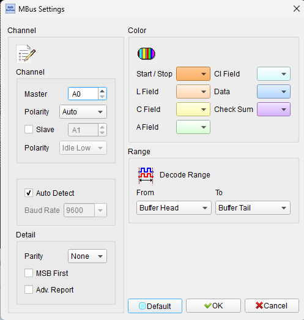
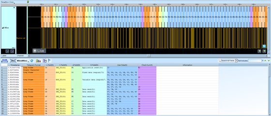

# M-Bus

## Decode Settings
<figure markdown>
  
  <figcaption>Decode Settings</figcaption>
</figure>

## Example
<figure markdown>
  
  <figcaption>Decode Example</figcaption>
</figure>

## What is M-Bus?

M-Bus (Meter-Bus) is a European standard communication protocol designed for remote reading and management of utility meters including water, gas, heat, and electricity consumption. Standardized as EN 13757 by the European Committee for Standardization (CEN), M-Bus was developed specifically to address the requirements of automatic meter reading (AMR) systems in residential, commercial, and industrial utility installations. The protocol provides a cost-effective two-wire interface enabling a single master device to interrogate hundreds of slave meters connected in parallel along a common bus, dramatically simplifying installation compared to individual meter connections.

The M-Bus specification comprises multiple parts: EN 13757-2 defines the physical and data link layers for wired M-Bus communication, EN 13757-3 specifies the application layer protocols, and EN 13757-4 covers Wireless M-Bus for radio-based meter reading. Wired M-Bus employs an asymmetric communication scheme where the master transmits using voltage level modulation (+36V for logical "1", +24V for logical "0") while slave meters respond using current modulation, drawing minimal quiescent current and pulsing additional current to signal data bits. This approach allows the bus to provide both communication and power to the connected meters, eliminating the need for individual power supplies at each meter location in many installations.

M-Bus has achieved widespread deployment across Europe and globally in utility metering applications, with support from the Open Metering System (OMS) Group which promotes interoperability across different meter manufacturers and utility types. The protocol supports extensive diagnostic and configuration capabilities including primary and secondary addressing, meter parameter setting, data readout in various formats, and alarm reporting. M-Bus enables utilities to perform remote meter reading, detect tampering or faults, manage billing cycles, and optimize resource distribution without manual meter inspection visits.

## Technical Specifications

### Physical Layer - Wired M-Bus

**Transmission Medium:**
- Two-wire unshielded twisted pair cable
- Bus topology with parallel connections
- Maximum cable length: 350-1000 meters (depends on power supply and device count)
- Maximum devices: Up to 250 meters per segment (with appropriate power supply)

**Voltage Levels (Master to Slave):**
- **Logical "1" (Mark)**: +36V DC
- **Logical "0" (Space)**: +24V DC
- **Idle state**: +36V
- **Marking (logical 1)**: +36V
- **Spacing (logical 0)**: +24V

**Current Modulation (Slave to Master):**
- **Quiescent current**: ≤1.5 mA per slave
- **Logical "1" (Mark)**: Quiescent current only
- **Logical "0" (Space)**: Quiescent current + 11-20 mA additional
- **Master detects**: Current variations on bus

### Data Rates

**Standard Baud Rates:**
- **300 baud**: Standard mode, maximum range and device count
- **2400 baud**: Fast mode, reduced range/device count
- **9600 baud**: Extended mode (less common)

All devices on a bus segment must operate at the same baud rate.

### Frame Structure

M-Bus uses variable-length frames:

**Short Frame:**
- Start: 0x10
- Control (C): 1 byte
- Address (A): 1 byte
- Checksum: 1 byte
- Stop: 0x16

**Control Frame (Long):**
- Start: 0x68
- Length (L): 1 byte
- Length repeat (L): 1 byte
- Start: 0x68
- Control (C): 1 byte
- Address (A): 1 byte
- Control Information (CI): 1 byte
- Data: Variable length (L-3 bytes)
- Checksum: 1 byte
- Stop: 0x16

**Single Character Frame:**
- Single byte: 0xE5 (acknowledgment from slave)

### Control Field (C-Field)

Function codes in the Control field:
- **0x73 or 0x7B**: SND_NKE (send link reset)
- **0x40 or 0x58**: SND_UD (send user data)
- **0x5B or 0x7A**: REQ_UD2 (request user data class 2)
- **0x5A or 0x7B**: REQ_UD1 (request user data class 1)

### Addressing

**Primary Addressing:**
- **Address range**: 1-250 (1 byte)
- **Broadcast**: 254 (0xFE)
- **Reserved**: 0, 255

**Secondary Addressing:**
- 8-byte address composed of:
  - Manufacturer ID (2 bytes)
  - Serial number (4 bytes)
  - Version (1 byte)
  - Medium (1 byte)
- Used for automatic device discovery and selection

### Application Layer

**Data Records:**
M-Bus application layer encodes meter readings as variable-length data records containing:
- Data Information Block (DIB): Describes data type, unit, and format
- Value Information Block (VIB): Provides measurement unit and scaling
- Data value: Actual measurement (1-N bytes depending on type)

**Common Data Types:**
- Energy (Wh, kWh, MWh, J, kJ, MJ)
- Volume (m³, l)
- Mass (kg, t)
- Power (W, kW, MW)
- Flow rate (m³/h, l/h)
- Temperature (°C)
- Time/Date

### Wireless M-Bus (EN 13757-4)

**Radio Frequency Bands:**
- 868 MHz (Europe): Most common
- 433 MHz: Alternative band
- 169 MHz: Long-range low-power

**Transmission Modes:**
- S mode: Stationary, frequent transmissions
- T mode: Frequent transmission, telegram-based
- C mode: Compact, bidirectional
- N mode: Network-compatible, low power

**Modulation:**
- FSK (Frequency Shift Keying)
- Data rates: 2.4 kbps to 100 kbps (mode-dependent)

## Common Applications

M-Bus is deployed extensively in utility metering and building management:

- **Water meters**: Residential and commercial water consumption monitoring
- **Heat meters**: District heating systems, apartment buildings
- **Gas meters**: Natural gas and propane consumption tracking
- **Electricity meters**: Sub-metering in multi-tenant buildings
- **Cold water meters**: Drinking water and process water measurement
- **Hot water meters**: Domestic hot water consumption
- **BTU meters**: Energy consumption in HVAC systems
- **Flow meters**: Industrial process monitoring
- **District heating networks**: Centralized heat distribution systems
- **Building automation**: Integration with BEMS (Building Energy Management Systems)
- **Smart city infrastructure**: Municipal utility monitoring
- **Industrial facilities**: Multi-utility consumption tracking
- **Hotels and resorts**: Guest room utility sub-metering
- **Shopping centers**: Tenant utility billing
- **Hospitals**: Department-level resource tracking
- **University campuses**: Building-by-building consumption monitoring

## Decoder Configuration

When configuring a logic analyzer to decode M-Bus signals:

### Channel Assignment - Wired M-Bus

**Voltage Monitoring (Master to Slave):**
- **Bus voltage**: Monitor voltage level on M-Bus lines
- Observe 36V (mark) and 24V (space) transitions

**Current Monitoring (Slave to Master):**
- **Bus current**: Monitor current with series resistor or current probe
- Detect current pulses (11-20 mA) representing slave responses

For typical logic analyzers, voltage-level decoding is more practical. Current monitoring requires specialized equipment.

### Protocol Parameters

- **Baud rate**: Select 300, 2400, or 9600 baud
- **Frame format**: Enable long frame, short frame, and single character recognition
- **Address display**: Show primary or secondary addressing
- **Checksum verification**: Enable checksum checking

### Decoding Options

- **Frame type identification**: Display short frame, control frame, acknowledgment
- **Control field decoding**: Interpret C-field function codes
- **Address display**: Show primary address or decode secondary address components
- **Application layer**: Parse DIB/VIB and display data values with units
- **Manufacturer decode**: Translate manufacturer IDs to names
- **Medium type**: Display meter type (water, gas, heat, electricity)
- **Timestamp extraction**: Show date/time from meter data

### Trigger Configuration

- **Frame start**: Trigger on 0x68 (long frame start) or 0x10 (short frame start)
- **Specific address**: Trigger on frames to/from specific meter address
- **Function code**: Trigger on specific C-field value (e.g., REQ_UD2)
- **Acknowledgment**: Trigger on 0xE5 slave response
- **Data threshold**: Trigger when specific meter reading exceeds value

### Sampling Requirements

**Minimum Sampling Rate:**
- At least 10× the baud rate
- Example: 2400 baud requires 24 kHz minimum sampling

**Recommended Sampling Rate:**
- 20× baud rate for clear waveform analysis
- Example: 2400 baud requires 48 kHz sampling

**Buffer Depth:**
- Long frames can be several hundred bytes
- Typical capture: 10-100 frames = 10-50 kB buffer recommended

### Analysis Tips

When analyzing M-Bus communications:

1. **Identify master polling sequence**: Observe systematic polling of slave addresses
2. **Check voltage levels**: Verify proper 36V/24V levels for master transmissions
3. **Monitor current responses**: Slave current modulation should be 11-20 mA additional
4. **Verify checksum**: All frames include checksum for error detection
5. **Decode application data**: Parse DIB/VIB to understand meter readings
6. **Observe timing**: Note slave response delays (typically <330 ms at 2400 baud)
7. **Secondary addressing**: Watch for multi-frame sequences during device selection
8. **Broadcast messages**: Identify broadcast frames (address 0xFE) for network-wide commands

### Common Protocol Sequences

**Meter Data Request:**
1. Master sends REQ_UD2 to specific address
2. Slave responds with control frame containing meter data
3. Master may send SND_NKE to reset link if no response

**Device Selection (Secondary Addressing):**
1. Master sends SND_NKE with broadcast address (0xFE)
2. Master sends secondary address selection frame
3. Selected meter responds
4. Master assigns primary address or requests data

**Polling Cycle:**
1. Master polls each meter sequentially by primary address
2. Each meter responds with current readings
3. Master processes and stores data
4. Cycle repeats periodically (minutes to hours)

## Reference

- [M-Bus Official Website](https://m-bus.com/)
- [EN 13757-2: Wired M-Bus Communication](https://knowledge.bsigroup.com/products/communication-systems-for-meters-wired-m-bus-communication)
- [EN 13757-4: Wireless M-Bus Communication](https://knowledge.bsigroup.com/products/communication-systems-for-meters-wireless-m-bus-communication)
- [M-Bus Documentation: Physical Layer](https://m-bus.com/documentation-wired/04-physical-layer)
- [OMS-Group: Open Metering System](https://oms-group.org/)
