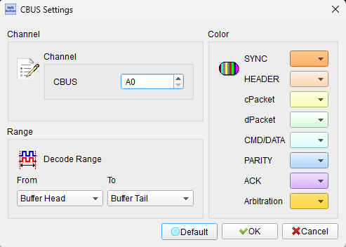
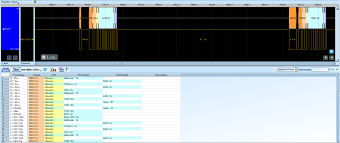

# MHL-CBUS (Mobile High-Definition Link Control Bus)

## Decode Settings
<figure markdown>
  
  <figcaption>Decode Settings</figcaption>
</figure>

## Example
<figure markdown>
  
  <figcaption>Decode Example</figcaption>
</figure>

## What is MHL-CBUS?

MHL-CBUS is the bidirectional control channel protocol used in the Mobile High-Definition Link (MHL) standard, which enables high-definition audio and video transmission from mobile devices to displays and TVs over standard USB connectors. Developed by the MHL Consortium (founded by Nokia, Samsung, Silicon Image, Sony, and Toshiba in 2010), the CBUS protocol operates over a single pin in the 5-pin MHL connector, providing device discovery, capability negotiation, register access, and DDC (Display Data Channel) communication while the main differential pairs carry TMDS-encoded video and audio data. MHL was designed to solve the mobile-to-TV connectivity challenge, allowing smartphones and tablets to output HD video to external displays using their existing micro-USB charging port.

The CBUS pin serves multiple critical functions: device detection through impedance checking and discovery pulses, reading EDID (Extended Display Identification Data) from sink devices to determine display capabilities, register read/write operations for configuration, capability exchange between source and sink, and tunneling DDC commands for HDCP content protection and display control. The protocol operates as a point-to-point single-wire bidirectional link with timing-based encoding, where both source and sink can initiate communication after following appropriate arbitration procedures. The physical CBUS signal shares the same pin used for USB data lines (D+/D- on micro-USB connectors), with MHL mode detected through specific voltage and impedance signatures that distinguish it from standard USB operation.

MHL evolved through several versions (1.0, 2.0, 3.0) with CBUS capabilities expanding alongside increased video bandwidth and feature sets. MHL 1.x and 2.x supported 1 Mbps CBUS operation, while MHL 3.0 introduced higher-speed CBUS for faster capability exchange and control. The standard competed with alternative mobile display standards like SlimPort (DisplayPort over USB) and was eventually overtaken by USB-C with DisplayPort Alt Mode and wireless solutions like Miracast. However, MHL remains deployed in millions of mobile devices, adapters, displays, and automotive infotainment systems from the 2010s, making CBUS protocol understanding relevant for debugging legacy mobile device connectivity, display compatibility issues, and embedded mobile video applications.

## Technical Specifications

### Physical Layer

**Signal Characteristics:**
- Single bidirectional wire (CBUS pin in 5-pin MHL connector)
- Shares micro-USB connector's D+/D- pins when in MHL mode
- Current-mode signaling with specific voltage levels
- Point-to-point topology (one source, one sink)

**Electrical Characteristics:**
- **Operating voltage**: Typically 3.3V logic levels
- **Signaling**: Current-based or voltage-based encoding (version-dependent)
- **Impedance**: Specific impedance used for MHL mode detection (1 kΩ to VBUS)
- **Pull-up/down**: Controlled by MHL bridge chip for mode detection

### Data Rates

**CBUS Speed by MHL Version:**
- **MHL 1.x**: 1 Mbps (megabit per second)
- **MHL 2.x**: 1 Mbps
- **MHL 3.0**: Enhanced CBUS with higher speeds (specific rates vary by implementation)

### Protocol Structure

**Frame Format:**
- Packet-based structure with headers and payload
- Variable-length packets depending on command type
- Address and data fields for register access
- Acknowledge/handshake mechanisms

**Communication Types:**

**Device Discovery:**
- Source detects MHL-capable sink through impedance checking
- Discovery pulses exchanged to establish MHL mode
- Transition from USB to MHL signaling

**EDID Reading:**
- Source reads Extended Display Identification Data from sink
- Uses DDC-like protocol tunneled over CBUS
- Determines display resolution, refresh rates, audio capabilities, and supported features

**Register Access:**
- Read and write operations to configuration registers
- Source and sink both have accessible register spaces
- Used for feature negotiation and status monitoring

**Capability Exchange:**
- Source and sink advertise supported features
- Video formats (resolution, color depth, refresh rate)
- Audio formats (channels, sample rates, codecs)
- Power requirements and capabilities
- Control features (RCP, RAP, UCP)

**DDC Command Tunneling:**
- Display Data Channel commands carried over CBUS
- HDCP (High-bandwidth Digital Content Protection) negotiation
- I2C-like transaction structure for compatibility

**Control Protocols:**
- **RCP (Remote Control Protocol)**: Consumer electronics remote control commands
- **RAP (Remote Application Protocol)**: Application-level control messages
- **UCP (User Control Protocol)**: User input events

### Arbitration and Bus Control

**Bus Ownership:**
- Both source and sink can initiate communication
- Arbitration mechanism prevents collisions
- Priority rules determine access when both request simultaneously

**Timing Requirements:**
- Bit timing defines 1s and 0s through pulse width or timing periods
- Start and stop conditions delimit packets
- Acknowledge timing for transaction completion

## Common Applications

MHL-CBUS is found in mobile device video connectivity applications:

**Mobile Devices:**
- Smartphones with MHL output (Samsung Galaxy, HTC, LG, Sony Xperia models)
- Tablets with MHL-enabled micro-USB ports
- Digital cameras with MHL video output
- Portable media players with HD output

**Display Devices:**
- Smart TVs with MHL-enabled HDMI inputs
- Computer monitors with MHL support
- Projectors with MHL connectivity
- Automotive infotainment displays

**Adapters and Cables:**
- MHL-to-HDMI adapters (passive and active)
- MHL cables with charging pass-through
- MHL docking stations
- Car audio/video adapters with MHL

**Automotive Systems:**
- In-vehicle infotainment (IVI) systems
- Rear-seat entertainment displays
- Mobile device integration in vehicles
- Navigation display mirroring

**Debugging and Development:**
- MHL protocol analyzers and test equipment
- Mobile device accessory development
- Display compatibility testing
- MHL bridge chip development and validation

**Legacy System Support:**
- Maintaining older MHL-equipped devices
- Troubleshooting mobile-to-TV connectivity
- MHL accessory repair and diagnostics
- Consumer electronics support

## Decoder Configuration

When configuring a logic analyzer to decode MHL-CBUS signals:

### Channel Assignment

**Minimum Configuration (1 channel):**
- **CBUS**: The MHL control bus signal line

**Recommended Configuration (3-5 channels):**
- **CBUS**: Control bus data
- **MHL+**: Positive differential data line (for context)
- **MHL-**: Negative differential data line (for context)
- **VBUS**: Power line (optional, for power events)
- **ID**: USB ID pin (optional, for mode detection)

### Protocol Parameters

**Timing Settings:**
- **Data rate**: 1 Mbps for MHL 1.x/2.x (1 µs per bit)
- **Bit encoding**: Pulse width or timing-based (implementation-specific)
- **Sampling rate**: Minimum 10 MHz (10x oversampling recommended)
- **Packet format**: Variable-length with headers

**Decoding Options:**
- **Packet type identification**: Discovery, EDID read, register access, RCP, RAP, UCP
- **Address and data display**: Show register addresses and values
- **EDID parsing**: Decode EDID data into human-readable capabilities
- **Command interpretation**: Translate RCP key codes and RAP commands
- **Acknowledge detection**: Show ACK/NACK status

### Trigger Settings

**Common trigger configurations:**
- **Discovery sequence**: Trigger on MHL mode detection/discovery pulses
- **EDID read**: Trigger on EDID data transfer start
- **Specific register access**: Trigger on read/write to important registers
- **RCP commands**: Trigger on remote control protocol commands
- **Errors**: Trigger on NACK, timeout, or protocol violations

### Display Options

**Visualization:**
- **Packet view**: Show complete packets with headers, addresses, data, checksums
- **Transaction grouping**: Group related packets (e.g., complete EDID read)
- **Command labels**: Display human-readable command names (e.g., "RCP Play")
- **Timing annotations**: Mark bit boundaries and packet timing
- **State machine view**: Show MHL connection state transitions

### Analysis Tips

**Connection Sequence Capture:**
Start capture before connecting the MHL device to observe the complete discovery sequence, impedance detection, mode transition, capability exchange, and EDID reading. This provides full context for the MHL connection establishment.

**EDID Validation:**
When capturing EDID transfers, verify the EDID data matches expected display capabilities. Incorrect EDID can cause resolution mismatches, audio problems, or connection failures. Compare decoded EDID against known display specifications.

**RCP Command Analysis:**
Monitor Remote Control Protocol commands to understand user interactions. Common RCP codes include Play (0x44), Pause (0x46), Stop (0x45), Volume Up (0x41), Volume Down (0x42). Verify device response to RCP commands.

**Timing and Latency:**
Measure time from device connection to video output. MHL should establish connection and display video within seconds. Long delays indicate negotiation problems or compatibility issues.

**Power Negotiation:**
MHL sources can draw power from the sink (display) for charging. Monitor power capability exchange and verify source doesn't exceed sink's power delivery limits. Power issues can cause connection drops or device resets.

**Error Recovery:**
Observe behavior during error conditions (NACK, timeout, CRC error). Well-designed implementations retry with backoff. Repeated errors without recovery indicate hardware problems or incompatibility.

**Compatibility Testing:**
When debugging source-sink compatibility issues, capture CBUS during connection with known-good reference devices. Compare capability exchange, register values, and command sequences to identify differences causing incompatibility.

## Reference

- [MHL Consortium](https://www.mhltech.org/): Official MHL specifications and documentation
- [MHL 3.0 White Paper](https://mhltech.org/docs/MHL3Whitepaper.pdf): Technical overview of MHL 3.0
- [Wikipedia: Mobile High-Definition Link](https://en.wikipedia.org/wiki/Mobile_High-Definition_Link): MHL Overview
- [Synopsys: MHL Protocol Overview](https://www.synopsys.com/designware-ip/technical-bulletin/mhl-protocol.html): Technical introduction
- [Rohde & Schwarz: MHL Testing](https://www.rohde-schwarz.com/): Test equipment documentation
