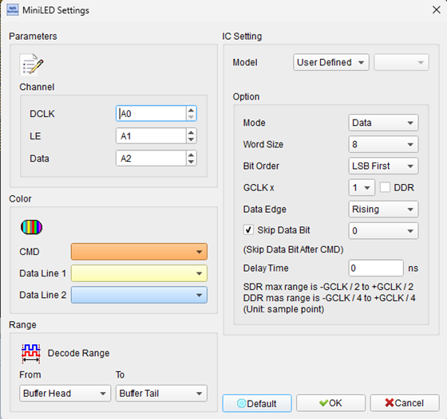
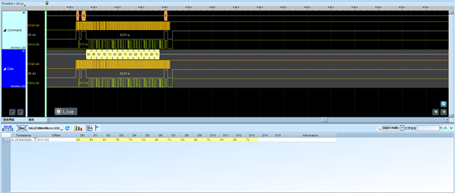

# Mini LED and Micro LED Display Technology

## Decode Settings
<figure markdown>
  
  <figcaption>Decode Settings</figcaption>
</figure>

## Example
<figure markdown>
  
  <figcaption>Decode Example</figcaption>
</figure>

## What are Mini LED and Micro LED?

Mini LED and Micro LED are advanced display technologies representing the evolution of LED-based displays toward smaller pixel sizes, higher brightness, improved contrast ratios, and better power efficiency compared to traditional LCD and OLED displays. **Mini LED** refers to LEDs with chip sizes between 100-300 micrometers, typically used as backlight arrays for LCD panels ("Mini LED backlight") or as direct-view display pixels in large-format LED walls. **Micro LED** refers to even smaller LEDs with chip dimensions less than 100 micrometers (often 10-50 µm), used as self-emissive display pixels without requiring separate backlighting, similar to OLED but with higher brightness, longer lifespan, and no burn-in issues. Both technologies enable finer pixel pitches, local dimming with thousands of zones (Mini LED backlight), and modular scalable displays for commercial and consumer applications.

The primary distinction between Mini LED and Micro LED lies in their application and manufacturing complexity. Mini LED technology is primarily used to enhance LCD displays by replacing edge-lit or full-array LED backlights with thousands of tiny LEDs arranged in a dense matrix behind the LCD panel, enabling precise local dimming that dramatically improves contrast ratios (10,000:1 or higher) and HDR (High Dynamic Range) performance while maintaining LCD's cost-effectiveness and manufacturing maturity. In contrast, Micro LED technology creates self-emissive displays where each subpixel (red, green, blue) is an individual microscopic LED, eliminating the need for LCD layers, color filters, or backlights entirely. This results in perfect blacks (pixels can be completely off), infinite contrast ratios, ultra-high brightness (>4000 nits), wide color gamut, fast response times, and no viewing angle limitations, but at significantly higher manufacturing complexity and cost due to mass transfer challenges—placing millions of tiny LEDs precisely on a substrate.

From a logic analyzer perspective, "Mini/Micro LED" as a protocol decoder refers to the communication interfaces used to control these displays: driver ICs that multiplex and PWM-control thousands or millions of LED elements, serial interfaces (SPI, I2C, MIPI) for display configuration and data streaming, and specialized protocols for modular LED panels. The decoder analyzes signals between display controllers and LED driver chips, capturing pixel data, brightness/gamma settings, synchronization signals, and diagnostic information. Applications include debugging display artifacts (incorrect colors, dead pixels, brightness non-uniformity), validating driver IC communication, measuring refresh rates and PWM frequencies, and troubleshooting power sequencing and initialization of Mini/Micro LED displays in consumer electronics, automotive displays, AR/VR headsets, and large-format commercial LED walls.

## Technical Specifications

### LED Chip Size Definitions

**Mini LED:**
- **Chip size**: 100-300 µm (micrometers) in length or width
- **Typical use**: LCD backlighting (Mini LED backlight), large direct-view displays
- **Pixel pitch**: 0.5-1.5 mm for direct-view applications

**Micro LED:**
- **Chip size**: <100 µm, typically 10-50 µm
- **Packaging**: Flip-chip, mass transfer bonding
- **Pixel pitch**: <1 mm, enabling ultra-fine-pitch displays
- **Self-emissive**: No backlight required

### Display Performance Characteristics

**Mini LED (Backlit LCD):**
- **Contrast ratio**: >10,000:1 (up to 1,000,000:1 with full-array local dimming)
- **Brightness**: 1,000-2,000 nits peak
- **Local dimming zones**: 1,000-10,000+ zones depending on panel size
- **Response time**: LCD-limited (~5-10 ms)
- **Viewing angle**: LCD-limited (reduced at extreme angles)
- **Lifespan**: 50,000-100,000 hours

**Micro LED (Self-Emissive):**
- **Contrast ratio**: Infinite (true black, pixels off)
- **Brightness**: >4,000 nits (up to 10,000+ nits)
- **Color gamut**: >100% DCI-P3, approaching Rec. 2020
- **Response time**: <1 µs (near-instantaneous)
- **Viewing angle**: 180° (no degradation)
- **Lifespan**: >100,000 hours (no burn-in)

### Communication Interfaces

**Driver IC Interfaces (Common):**

**SPI (Serial Peripheral Interface):**
- Configuration and control of LED driver ICs
- Data rates: 1-50 MHz typical
- Used for: Register configuration, brightness settings, gamma tables

**I2C / I3C:**
- Low-speed control interface
- Data rates: 100 kHz - 12.5 MHz (I3C)
- Used for: Driver IC initialization, diagnostic readback

**MIPI DSI / CSI:**
- High-speed serial interfaces for video data
- Data rates: Up to several Gbps
- Used for: Streaming pixel data to display controllers

**Parallel RGB / LVDS:**
- Traditional video interfaces
- Used for: Pixel clock, RGB data, sync signals

**Proprietary Protocols:**
- Manufacturer-specific interfaces for modular LED panels
- Data and clock lines for panel cascading
- Used for: Large LED wall configurations

### Driver IC Functionality

**LED Driver Chips:**
- Constant current drivers for each LED channel
- PWM (Pulse Width Modulation) for brightness control (typically 8-16 bit resolution)
- Multiplexing to control large LED arrays with fewer ICs
- Thermal management and over-current protection
- Diagnostic features (open LED detection, short circuit detection)

**PWM Frequency:**
- Mini LED backlight: 1-10 kHz (high enough to avoid flicker)
- Micro LED display: 1-20 kHz or higher for better color depth and camera compatibility

**Color Depth:**
- Mini LED: 8-12 bits per RGB channel (via PWM)
- Micro LED: 10-16 bits per RGB channel (HDR)

### Standards and Specifications

**Industry Standards:**
- **T/SLDA 001-2022**: General specifications for Mini LED commercial displays (China)
- **Micro LED Specifications**: Published by Mini/Micro LED Display Industry Branch (first global standard)
- **Chip size requirements**: Micro LED must be <100 µm length or width (per standard)

**Testing and Qualification:**
- Appearance, structure, functionality
- Optical properties (brightness, color, uniformity)
- Electrical requirements (power, efficiency)
- Pixel failure/runaway rates
- EMC and safety compliance
- Mean time between failures (MTBF)

## Common Applications

Mini LED and Micro LED technologies are used across display markets:

**Consumer Electronics:**
- Premium TVs with Mini LED backlighting (Samsung, LG, TCL)
- Laptop displays (Apple MacBook Pro with Mini LED)
- Tablet displays (iPad Pro with Mini LED)
- Smartphone displays (future Micro LED adoption)
- Gaming monitors with Mini LED HDR

**Automotive Displays:**
- Instrument clusters with Mini LED backlighting
- Head-up displays (HUD) using Micro LED
- Infotainment and center console displays
- Rear-seat entertainment with HDR Mini LED

**AR/VR and Wearables:**
- Micro LED microdisplays for AR glasses (ultra-compact, high brightness)
- VR headsets requiring high pixel density
- Smartwatches with Micro LED (future applications)

**Commercial and Professional:**
- Large-format LED video walls (fine-pitch Mini/Micro LED)
- Digital signage and advertising displays
- Broadcast studio monitors with Mini LED HDR
- Medical imaging displays requiring high accuracy
- Aerospace cockpit displays

**Industrial and Special Applications:**
- High-brightness outdoor displays
- Transparent LED displays (retail, architecture)
- Flexible and curved LED displays
- Military and defense visualization systems

## Decoder Configuration

When configuring a logic analyzer to decode Mini/Micro LED display signals:

### Channel Assignment

**For SPI Interface:**
- **SCK (SCLK)**: Serial clock
- **MOSI (SDI)**: Master-out-slave-in data
- **MISO (SDO)**: Master-in-slave-out data (optional, for readback)
- **CS#**: Chip select
- **Optional**: Enable, reset, or interrupt signals

**For I2C Interface:**
- **SCL**: Serial clock
- **SDA**: Serial data (bidirectional)

**For Parallel Video (RGB/LVDS):**
- **Pixel Clock**: Video clock signal
- **RGB Data**: Red, Green, Blue data lines (6-10 bits each)
- **HSYNC, VSYNC**: Horizontal and vertical sync
- **DE (Data Enable)**: Valid pixel indicator

**For MIPI DSI:**
- **Clock Lane**: High-speed differential clock
- **Data Lanes**: 1-4 differential data lanes
- **Control signals**: Reset, power enable, etc.

### Protocol Parameters

**SPI Configuration:**
- **Clock polarity (CPOL)** and **Phase (CPHA)**: Check driver IC datasheet
- **Clock speed**: Match actual SPI clock (1-50 MHz)
- **Bit order**: MSB-first or LSB-first

**I2C Configuration:**
- **Address**: Driver IC I2C address (e.g., 0x3C, 0x50)
- **Clock speed**: 100 kHz (Standard) or 400 kHz (Fast)

**Decoding Options:**
- **Register interpretation**: Map register addresses to functions (brightness, gamma, enable)
- **Pixel data display**: Show pixel values (if streaming pixel data)
- **PWM settings**: Decode PWM frequency and duty cycle configuration
- **Diagnostic readback**: Decode temperature, current, fault status

### Trigger Settings

**Common Trigger Conditions:**
- **Initialization sequence**: Trigger on power-up or reset signal
- **Frame start**: Trigger on VSYNC (start of new frame)
- **Specific register access**: Trigger on writes to brightness or gamma registers
- **Pixel data stream**: Trigger on pixel clock or data enable signal
- **Error conditions**: Trigger on fault indicators or diagnostic registers

### Display Options

**Visualization:**
- **Layered decode**: Show physical layer (SPI/I2C), register layer, function layer
- **Register names**: Display human-readable register names
- **Pixel data**: Show RGB values, optionally as color swatches (if applicable)
- **Timing diagrams**: Annotate timing (setup/hold, frame timing)
- **Error highlighting**: Flag timing violations, CRC errors, communication failures

### Analysis Tips

**Initialization Sequence:**
Capture from display power-up to observe complete initialization: IC reset, register configuration, gamma table loading, brightness settings, and display enable. Verify correct sequence per driver IC datasheet.

**Brightness Control:**
Monitor PWM configuration registers or PWM signals directly. Verify PWM frequency is high enough to avoid flicker (>1 kHz) and matches expected values. For local dimming (Mini LED backlight), verify dimming zones are controlled independently.

**Pixel Data Integrity:**
For parallel video or MIPI DSI interfaces, verify pixel data timing meets specifications. Check setup/hold times relative to pixel clock. Incorrect timing causes artifacts (color shifts, tearing, corruption).

**Gamma Calibration:**
Capture gamma table writes during initialization. Gamma tables map input pixel values to corrected output brightness for color accuracy. Verify tables are loaded correctly and match expected curves.

**Temperature and Current Monitoring:**
Read diagnostic registers periodically to monitor LED driver temperature and current. Over-temperature or over-current conditions indicate thermal issues or LED failures.

**Pixel Failures and Uniformity:**
If observing display artifacts (dead pixels, brightness non-uniformity), capture driver IC status registers during affected frames. Check for open/short circuit detection flags indicating failed LEDs.

**Refresh Rate and PWM Frequency:**
Measure frame rate (VSYNC period) and PWM frequency (LED on/off modulation). For camera compatibility, ensure PWM >1 kHz. For HDR content, verify high bit-depth PWM (12-16 bit).

**Multi-Driver Synchronization:**
Large displays use multiple driver ICs in parallel or daisy-chain. Verify synchronization signals (clock, latch, enable) are distributed correctly and drivers operate in lockstep. Timing skew causes visible seams or artifacts.

**Manufacturer Documentation:**
Mini LED and Micro LED driver ICs vary widely across manufacturers. Always consult specific driver IC datasheets for register maps, timing requirements, initialization sequences, and command protocols.

## Reference

- [Mini/Micro LED Display Technology Overview](https://www.minimicroled.com/): Industry information
- [MicroLED Industry Association](https://www.microledassociation.com/): Standards and resources
- [T/SLDA 001-2022: Mini LED Commercial Display Standard](https://www.minimicroled.com/mini-led-commercial-displays-standards/): Chinese industry standard
- [Micro LED Specifications](https://en.leyard.com/cmscontent/1651.html): First global Micro LED specs
- [MIPI Display Working Group](https://www.mipi.org/specifications/display-interface): MIPI DSI specifications
- Driver IC Datasheets - Manufacturer-specific (Macroblock, Novatek, Texas Instruments, etc.)

**Note**: Mini LED and Micro LED encompass a wide range of implementations and proprietary technologies. The communication protocols and driver ICs vary significantly across manufacturers and applications. Always refer to specific display module and driver IC documentation for accurate decoding and troubleshooting.
