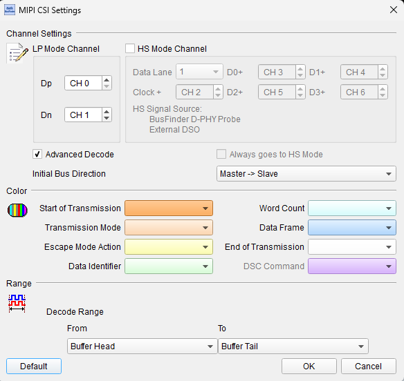

# MIPI CSI

## Decode Settings
<figure markdown>
  
  <figcaption>Decode Figure</figcaption>
</figure>

## What is MIPI CSI?

MIPI CSI-2 (Camera Serial Interface version 2) is a high-speed serial interface specification developed by the MIPI Alliance for transmitting image and video data from camera sensors to application processors in mobile devices and embedded systems. The standard was created to replace parallel camera interfaces that required numerous data lines (8, 10, or 12 bits plus control signals), providing instead a compact serial interface with only 1 to 4 differential data lanes plus a clock lane. This dramatic reduction in pin count simplifies board design, reduces connector complexity, minimizes electromagnetic interference, and enables higher data rates necessary for modern high-resolution image sensors.

CSI-2 operates over MIPI D-PHY or C-PHY physical layers, with D-PHY being the most common implementation supporting data rates up to 2.5 Gbps per lane (typical implementations) and up to 9 Gbps per lane in the latest D-PHY specifications. C-PHY, introduced in 2014, provides approximately 2.3× more effective bandwidth than D-PHY while using fewer pins by embedding clock information in the data stream using 3-phase encoding. The protocol supports multiple pixel formats including RAW Bayer data, YUV, RGB, and compressed formats like JPEG, enabling direct connection to various sensor types. Virtual channels allow multiplexing of multiple image streams over a single physical interface, enabling multi-camera systems or simultaneous capture of different image formats from the same sensor.

MIPI CSI-2 has become the de facto standard camera interface in smartphones, tablets, automotive surround-view systems, drones, IoT devices, and embedded vision systems. The specification's low power consumption (lowest energy per bit in the industry), high bandwidth supporting resolutions from VGA to 8K and beyond at high frame rates, and sub-microsecond command latency make it ideal for modern imaging applications. CSI-2 is complemented by MIPI Camera Command Set (CCS) for standardized camera control, typically implemented over I2C for sensor configuration, exposure control, and feature selection.

## Technical Specifications

### Physical Layer - D-PHY

The most common CSI-2 implementation uses MIPI D-PHY:

**Lane Configuration:**
- **Clock Lane**: Differential clock pair (CP, CN): present in D-PHY
- **Data Lane 0**: Differential data pair (DP0, DN0): required minimum
- **Data Lane 1**: Differential data pair (DP1, DN1): optional
- **Data Lane 2**: Differential data pair (DP2, DN2): optional
- **Data Lane 3**: Differential data pair (DP3, DN3): optional

**Typical Configurations:**
- 1-lane: Clock + 1 data lane (low-cost cameras)
- 2-lane: Clock + 2 data lanes (common in smartphones)
- 4-lane: Clock + 4 data lanes (high-resolution/high-frame-rate cameras)

**D-PHY Modes:**
- **Low-Power (LP) Mode**: Low-speed control signaling, ~10 Mbps
- **High-Speed (HS) Mode**: High-speed differential data transmission
- **Ultra Low Power State (ULPS)**: Minimum power consumption, lanes inactive

### Physical Layer - C-PHY

C-PHY provides higher efficiency with fewer pins:

**Three-Phase Encoding:**
- Uses 3-wire differential signaling (trio) instead of traditional 2-wire differential pairs
- Embeds clock in data stream (no separate clock lane needed)
- **1-trio**: Minimum configuration
- **2-trio**: Higher bandwidth
- **3-trio**: Maximum bandwidth

**Advantages over D-PHY:**
- ~2.3× better bandwidth efficiency per wire
- Reduced pin count
- Better for high-speed long-distance transmission

### Data Rates and Bandwidth

**D-PHY Data Rates (per lane):**
- Early implementations: 80-500 Mbps per lane
- Common current: 1-2.5 Gbps per lane
- Maximum (D-PHY v2.5): Up to 9 Gbps per lane

**Total Bandwidth Examples (D-PHY):**
- 2 lanes @ 1 Gbps = 250 MB/s
- 4 lanes @ 2.5 Gbps = 1.25 GB/s

**Resolution/Frame Rate Support:**
- 1920×1080 @ 60 fps (Full HD): ~2.9 Gbps
- 3840×2160 @ 30 fps (4K): ~5.9 Gbps
- 3840×2160 @ 60 fps (4K): ~11.9 Gbps (requires 4 lanes @ 3 Gbps or C-PHY)

### Packet Structure

**Short Packets (4 bytes):**
- **Data Identifier (DI)**: 1 byte - data type and virtual channel
- **Data Field**: 2 bytes - frame/line numbers or other short data
- **Error Correction Code (ECC)**: 1 byte

**Long Packets (Variable length):**
- **Data Identifier (DI)**: 1 byte - data type and virtual channel
- **Word Count (WC)**: 2 bytes - payload length in bytes
- **Payload Data**: Variable length (image/video data)
- **Checksum (CS)**: 2 bytes - CRC-16

### Data Types

CSI-2 supports numerous data type identifiers for different pixel formats:

**Raw Bayer Data:**
- RAW6, RAW7, RAW8: 6/7/8-bit Bayer pattern data
- RAW10, RAW12, RAW14: 10/12/14-bit high dynamic range Bayer

**YUV Formats:**
- YUV420 8-bit, YUV420 10-bit
- YUV422 8-bit, YUV422 10-bit

**RGB Formats:**
- RGB444, RGB555, RGB565, RGB666, RGB888

**Compressed:**
- JPEG, User-defined compression

**Embedded Data:**
- Sensor metadata, statistics, timing information

### Virtual Channels

CSI-2 supports up to 4 virtual channels (VC 0-3) allowing:
- Multiple camera sensors on one physical interface
- Different image formats from single sensor simultaneously
- Separate image and metadata streams

### Sync and Frame Structure

**Frame Start/End Packets:**
- Frame Start (FS): Marks beginning of frame for each VC
- Frame End (FE): Marks completion of frame

**Line Start/End Packets:**
- Line Start (LS): Beginning of line transmission
- Line End (LE): End of line transmission

Typical sequence per frame:
1. Frame Start (FS)
2. For each line:
   - Line Start (LS)
   - Pixel Data (long packet)
   - Line End (LE)
3. Frame End (FE)

## Common Applications

MIPI CSI-2 is the standard camera interface for modern imaging systems:

- **Smartphones**: Primary and secondary camera connections
- **Tablets**: Front and rear camera interfaces
- **Automotive cameras**: Surround-view, backup, ADAS, in-cabin monitoring
- **Drones**: Aerial photography and FPV cameras
- **Action cameras**: GoPro-style high-resolution sports cameras
- **Security cameras**: IP surveillance and video monitoring systems
- **Machine vision**: Industrial inspection, quality control systems
- **Robotics**: Computer vision and navigation cameras
- **Medical imaging**: Endoscopes, surgical cameras, diagnostic devices
- **VR/AR headsets**: Inside-out tracking cameras
- **Dash cameras**: Automotive event recorders
- **Smart doorbells**: Video doorbell cameras
- **IoT devices**: Smart home cameras and sensors
- **Embedded vision**: Factory automation, logistics scanning
- **Microscopy**: Digital microscope camera connections
- **Document scanners**: High-speed scanning systems

## Decoder Configuration

When configuring a logic analyzer to decode MIPI CSI-2 signals:

### Channel Assignment - D-PHY

**Clock Lane:**
- **CP (Clock Positive)**
- **CN (Clock Negative)**

**Data Lanes (at least Lane 0 required):**
- **DP0, DN0**: Data Lane 0 (required)
- **DP1, DN1**: Data Lane 1 (optional)
- **DP2, DN2**: Data Lane 2 (optional)
- **DP3, DN3**: Data Lane 3 (optional)

All CSI-2 signals are differential. Logic analyzers require either differential inputs or capture of both P and N signals for each lane.

### Protocol Parameters

- **Number of lanes**: Select 1, 2, 3, or 4 active data lanes (D-PHY)
- **Lane data rate**: Configure expected HS mode data rate per lane
- **PHY type**: D-PHY or C-PHY
- **Virtual channel**: Select VC 0-3 for filtering
- **Data type**: Expected pixel format (RAW, YUV, RGB, etc.)

### Decoding Options

- **Packet type identification**: Display packet type (FS, FE, LS, LE, pixel data)
- **Data type decoding**: Show pixel format (RAW10, YUV422, RGB888, etc.)
- **Virtual channel display**: Indicate which VC each packet belongs to
- **Payload extraction**: Show image data payload
- **ECC verification**: Check Error Correction Codes on short packets
- **CRC verification**: Check checksums on long packets
- **Frame/line counting**: Track frame and line numbers
- **Embedded data parsing**: Decode sensor metadata when present

### Trigger Configuration

- **Frame Start**: Trigger on Frame Start packet (beginning of new frame)
- **Line Start**: Trigger on Line Start packet
- **Specific data type**: Trigger on specific pixel format packet
- **Virtual channel**: Trigger on specific VC packets
- **HS burst start**: Trigger when High-Speed mode transmission begins
- **Error condition**: Trigger on CRC or ECC error

### Sampling Requirements

MIPI CSI-2 requires high-speed capture capability:

**Minimum Sampling Rate:**
- At least 4× the lane data rate for each differential pair
- Example: 2.5 Gbps per lane requires 10 GHz sampling rate

**Recommended Sampling Rate:**
- 10× lane data rate for detailed analysis
- Example: 2.5 Gbps per lane requires 25 GHz sampling rate

**Practical Considerations:**
- High-speed CSI-2 requires oscilloscopes or specialized protocol analyzers
- Multi-GHz sampling across multiple differential channels
- Large capture buffers (single HD frames can be megabytes)
- Many test equipment vendors offer dedicated MIPI CSI-2 analysis tools

### Analysis Tips

When analyzing MIPI CSI-2 signals:

1. **Verify lane initialization**: Check LP-11 idle state before HS transmission
2. **Monitor HS entry/exit**: Observe proper LP-to-HS transitions at frame/line boundaries
3. **Check packet integrity**: Verify ECC and CRC to identify transmission errors
4. **Validate frame structure**: Ensure proper FS→LS→Data→LE→FE sequence
5. **Virtual channel separation**: If multi-VC, verify correct VC assignment
6. **Observe data types**: Confirm expected pixel formats in transmitted packets
7. **Measure bandwidth utilization**: Calculate actual data throughput vs. theoretical
8. **Synchronize with I2C**: Correlate CSI-2 data with I2C camera control commands

### Common Protocol Sequences

**Camera Initialization:**
1. I2C commands configure sensor (exposure, gain, format)
2. CSI-2 lanes in LP-11 idle state
3. Sensor begins streaming

**Single Frame Capture:**
1. Frame Start (FS) packet
2. For each line (e.g., 1080 lines for Full HD):
   - Line Start (LS) packet
   - Pixel data long packet (e.g., RAW10 data for one line)
   - Line End (LE) packet
3. Frame End (FE) packet
4. Next frame or return to idle

**Multi-Stream with Virtual Channels:**
- VC0: Full resolution image data
- VC1: Embedded metadata from sensor
- VC2: Downscaled preview stream
- Packets interleaved with VC identifier in Data Identifier byte

## Reference

- [MIPI Alliance: CSI-2 Specification](https://www.mipi.org/specifications/csi-2)
- [MIPI Alliance: D-PHY Specification](https://www.mipi.org/specifications/d-phy)
- [MIPI Alliance: C-PHY Specification](https://www.mipi.org/specifications/c-phy)
- [MIPI CSI-2 Specification Brief (PDF)](https://2384176.fs1.hubspotusercontent-na1.net/hubfs/2384176/MIPI_CSI-2_Specification_Brief.pdf)
- [NXP: MIPI Application Note](https://nxp.com/docs/en/application-note/AN13573.pdf)
