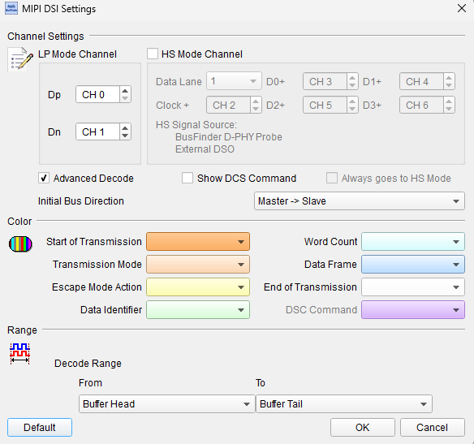
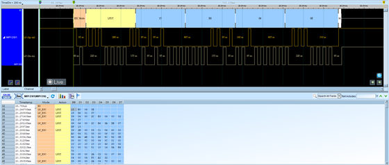
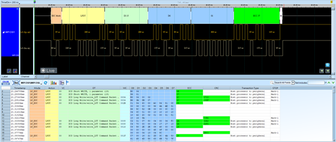

# MIPI DSI

## Decode Settings
<figure markdown>
  
  <figcaption>Decode Settings</figcaption>
</figure>

## Example
<figure markdown>
  
  <figcaption>Decode Example</figcaption>
</figure>
<figure markdown>
  
  <figcaption>Decode Figure</figcaption>
</figure>

## What is MIPI DSI?

MIPI DSI (Display Serial Interface) is a high-speed serial interface specification developed by the MIPI Alliance for connecting application processors to display panels in mobile and embedded devices. The standard was created to replace parallel RGB interfaces that required numerous signal lines and suffered from electromagnetic interference (EMI) issues and high power consumption. MIPI DSI reduces the pin count dramatically by using only 1 to 4 differential data lanes plus a differential clock lane, significantly simplifying board design and reducing connector complexity while enabling higher resolutions and faster refresh rates than parallel interfaces.

The MIPI DSI specification operates over the MIPI D-PHY physical layer, which provides source-synchronous differential signaling with data rates up to 9 Gbps per lane in recent D-PHY versions, though typical implementations in mobile processors support 1-2.5 Gbps per lane. The protocol defines two operational modes: video mode for continuous video streaming similar to traditional display interfaces, and command mode for sending both control commands and pixel data in bursts, enabling power savings by allowing the display interface to enter low-power states between updates. The protocol works in conjunction with the MIPI Display Command Set (DCS), which standardizes commands for display configuration, sleep control, color management, and other panel-specific operations.

MIPI DSI has become the dominant display interface in smartphones, tablets, automotive displays, and embedded systems requiring efficient high-resolution display connections. The specification's power efficiency features including Ultra Low Power State (ULPS), burst mode transmission, and the ability to dynamically adjust lane counts make it ideal for battery-powered devices. DSI-2, an updated version of the specification, extends capabilities further with features like higher data rates, improved latency, and support for advanced display technologies including foldable displays and high refresh rate panels.

## Technical Specifications

### Physical Layer - MIPI D-PHY

MIPI DSI operates over MIPI D-PHY, a source-synchronous differential signaling physical layer:

**Lane Configuration:**
- **Clock Lane**: Differential clock pair (CP, CN): always present
- **Data Lane 0**: Differential data pair (DP0, DN0): required, always active
- **Data Lane 1**: Differential data pair (DP1, DN1): optional
- **Data Lane 2**: Differential data pair (DP2, DN2): optional
- **Data Lane 3**: Differential data pair (DP3, DN3): optional

**Typical Configurations:**
- 1-lane: Clock + 1 data lane (minimum)
- 2-lane: Clock + 2 data lanes (common in smartphones)
- 4-lane: Clock + 4 data lanes (high-resolution displays)

**D-PHY States:**
- **Low-Power (LP) Mode**: Low-speed signaling for control, ~10 Mbps
- **High-Speed (HS) Mode**: High-speed differential signaling, up to 2.5 Gbps per lane (typical), up to 9 Gbps (D-PHY v2.5)
- **Ultra Low Power State (ULPS)**: Minimum power state, lanes inactive

### Data Rates and Bandwidth

**Per-Lane Data Rates:**
- Early implementations: 80-500 Mbps per lane
- Common current: 1-2.5 Gbps per lane
- Maximum (D-PHY v2.5): Up to 9 Gbps per lane

**Total Bandwidth Examples:**
- 1 lane @ 1 Gbps = 125 MB/s
- 2 lanes @ 1 Gbps = 250 MB/s
- 4 lanes @ 2.5 Gbps = 1.25 GB/s

**Resolution/Refresh Rate Support:**
Sufficient for common display requirements:
- 1920×1080 @ 60 Hz (Full HD): ~3 Gbps total (24-bit color)
- 2560×1440 @ 60 Hz (2K): ~5.3 Gbps total
- 3840×2160 @ 30 Hz (4K): ~6 Gbps total

### Operating Modes

**Video Mode:**
- Continuous streaming of pixel data similar to RGB parallel interface
- Real-time video transmission with frame sync
- Higher power consumption but simplifies timing
- Three sub-modes:
  - Non-burst with sync events
  - Non-burst with sync pulses
  - Burst mode (data sent in bursts, allowing LP during blanking)

**Command Mode:**
- Display has frame buffer (display memory)
- Commands and data sent in packets as needed
- Display updates from internal frame buffer
- Enables ULPS for power savings between updates
- Suitable for static content (UI, text)

### Packet Structure

**Packet Types:**

**Short Packets (4 bytes):**
- Data Identifier (DI): Packet type and virtual channel
- Data 0 and Data 1: Command/parameter bytes
- Error Correction Code (ECC): 1 byte

**Long Packets (Variable length):**
- Data Identifier (DI): Packet type and virtual channel
- Word Count (WC): Payload length (2 bytes)
- Payload Data: Variable length (0-65535 bytes)
- Checksum (CS): 2-byte CRC

**Common Packet Types:**
- Video mode packets: VSYNC start/end, HSYNC start/end, pixel data
- Command packets: DCS commands, generic read/write
- Peripheral return packets: Acknowledgment, error reporting

### MIPI Display Command Set (DCS)

Standardized commands for display control:

**Power Management:**
- Enter/Exit Sleep Mode
- Display On/Off
- Set Display Brightness

**Display Configuration:**
- Set Pixel Format (color depth)
- Set Column Address (horizontal addressing)
- Set Page Address (vertical addressing)
- Write Memory Start/Continue

**Display Features:**
- Set Tear Effect (TE) On/Off
- Set Gamma Curve
- Set Backlight Control

### Virtual Channels

DSI supports up to 4 virtual channels (VC 0-3) allowing multiple data streams over the same physical interface, enabling split-screen displays or multi-display systems.

## Common Applications

MIPI DSI is the standard display interface for modern mobile and embedded devices:

- **Smartphones**: Primary display and secondary displays (foldable phones)
- **Tablets**: High-resolution touchscreen displays
- **Automotive displays**: Digital instrument clusters, center console displays, rear-seat entertainment
- **Laptops**: Some ultra-thin laptop internal displays
- **VR/AR headsets**: High refresh rate near-eye displays
- **Digital cameras**: LCD viewfinders and rear displays
- **Portable gaming consoles**: Handheld gaming device displays
- **Smartwatches**: Small high-resolution OLED displays
- **E-readers**: E-ink and color display modules
- **Medical devices**: Portable diagnostic equipment displays
- **Industrial HMIs**: Embedded touchscreen interfaces
- **Drones**: FPV display systems and control interfaces
- **IoT devices**: Smart home control panels and displays
- **Portable test equipment**: Handheld oscilloscopes and meters
- **Digital signage**: Compact display modules

## Decoder Configuration

When configuring a logic analyzer to decode MIPI DSI signals:

### Channel Assignment

**Clock Lane (Required):**
- **CP (Clock Positive)**
- **CN (Clock Negative)**

**Data Lanes (at least Lane 0 required):**
- **DP0, DN0**: Data Lane 0 (required)
- **DP1, DN1**: Data Lane 1 (optional)
- **DP2, DN2**: Data Lane 2 (optional)
- **DP3, DN3**: Data Lane 3 (optional)

All signals are differential pairs. For logic analyzers without differential inputs, both P and N signals must be captured for each lane.

### Protocol Parameters

- **Number of lanes**: Select 1, 2, 3, or 4 active data lanes
- **Lane data rate**: Configure expected HS mode data rate per lane (e.g., 1 Gbps)
- **Operating mode**: Video mode or Command mode
- **Virtual channel**: Select VC 0-3 for filtering (if multi-VC system)
- **D-PHY version**: Specify D-PHY standard version if known

### Decoding Options

- **Packet type identification**: Display packet type names (VSYNC, HSYNC, RGB data, DCS commands)
- **Payload extraction**: Show packet payload data
- **ECC verification**: Check Error Correction Codes on short packets
- **CRC verification**: Check checksums on long packets
- **DCS command decoding**: Interpret Display Command Set commands by name
- **Virtual channel filtering**: Filter by specific virtual channel
- **LP/HS mode indication**: Show Low-Power vs. High-Speed transmission periods
- **ULPS detection**: Identify Ultra Low Power State entry/exit

### Trigger Configuration

- **Packet type trigger**: Trigger on specific packet type (VSYNC, HSYNC, DCS command)
- **DCS command**: Trigger on specific Display Command Set command
- **Virtual channel**: Trigger on packets from specific VC
- **HS burst start**: Trigger when High-Speed mode begins
- **LP command**: Trigger on Low-Power mode command transmission

### Sampling Requirements

MIPI DSI uses high-speed differential signaling that requires significant sampling rates:

**Minimum Sampling Rate:**
- At least 4× the lane data rate for each differential pair
- Example: 1 Gbps per lane requires 4 GHz sampling rate minimum

**Recommended Sampling Rate:**
- 10× lane data rate for detailed waveform analysis
- Example: 1 Gbps per lane requires 10 GHz sampling rate

**Note**: High-speed MIPI DSI requires logic analyzers with:
- Multi-GHz sampling capability
- Differential or high-speed single-ended inputs
- Deep capture buffers (video frames can be large)
- Many specialized protocol analyzers and oscilloscopes offer dedicated MIPI DSI decode capabilities

### Analysis Tips

When analyzing MIPI DSI signals:

1. **Start with LP mode**: Low-power commands are slower and easier to capture initially
2. **Verify lane initialization**: Check LP-11 idle state before HS bursts
3. **Monitor HS entry/exit**: Watch for proper LP-to-HS and HS-to-LP transitions
4. **Check packet integrity**: Verify ECC and CRC for packet errors
5. **Observe ULPS**: Identify power-saving periods in command mode
6. **Decode DCS commands**: Understand display configuration from command sequences
7. **Measure burst timing**: In video mode, verify blanking periods and burst characteristics
8. **Virtual channel separation**: If multi-VC, ensure correct VC assignment

### Common Protocol Sequences

**Initialization (Command Mode):**
1. LP-11 idle state
2. Host sends DCS commands in LP mode or HS bursts:
   - Exit Sleep Mode (0x11)
   - Set Pixel Format (0x3A)
   - Set Column/Page Address (0x2A, 0x2B)
   - Display On (0x29)

**Frame Update (Command Mode):**
1. Write Memory Start (0x2C) DCS command
2. HS burst with pixel data
3. Return to LP-11 or ULPS

**Video Mode Continuous Streaming:**
1. Continuous HS transmission
2. VSYNC Start packet (frame start)
3. Multiple lines of:
   - HSYNC Start packet
   - Pixel data packets (RGB)
   - HSYNC End packet
4. VSYNC End packet (frame end)
5. Repeat for next frame

## Reference

- [MIPI Alliance: DSI Specification](https://www.mipi.org/specifications/dsi)
- [MIPI Alliance: DSI-2 Specification](https://mipi.org/specifications/dsi-2)
- [MIPI Alliance: D-PHY Specification](https://www.mipi.org/specifications/d-phy)
- [MIPI Alliance: Display Command Set (DCS)](https://www.mipi.org/specifications/display-command-set)
- [NXP: MIPI DSI Application Note](https://nxp.com/docs/en/application-note/AN13573.pdf)
