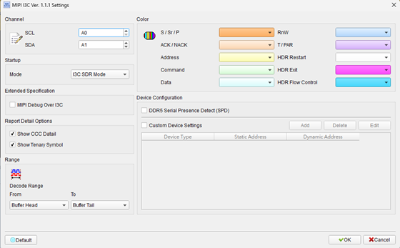
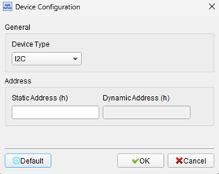
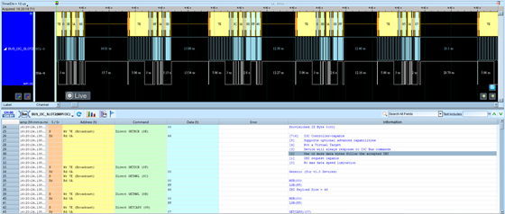

# MIPI I3C (Improved Inter-Integrated Circuit)

## Decode Settings

<figure markdown>
  
</figure>

## Example
<figure markdown>
  
  <figcaption>Decode Example</figcaption>
</figure>
<figure markdown>
  
  <figcaption>Decode Figure</figcaption>
</figure>

## What is MIPI I3C?

MIPI I3C (Improved Inter-Integrated Circuit) is an advanced two-wire serial communication bus specification developed by the MIPI Alliance as a modernized successor to the widely-used I²C (Inter-Integrated Circuit) protocol. Introduced in 2017 with version 1.0 and subsequently enhanced through versions 1.1, 1.2, and beyond, I3C was designed to address the performance limitations of I²C while maintaining backward compatibility with legacy I²C devices on the same bus. The specification exists in two variants: MIPI I3C (full featured) and MIPI I3C Basic (royalty-free subset), both targeting mobile devices, IoT (Internet of Things), sensors, data center applications, and modern embedded systems requiring higher throughput, lower latency, and reduced power consumption compared to traditional I²C. I3C achieves data rates up to 12.5 Mbps (SDR mode) and 25 Mbps (HDR modes), significantly faster than I²C's maximum 3.4 Mbps.

The I3C protocol introduces several key innovations including In-Band Interrupts (IBI) that allow slaves to notify the master without requiring dedicated interrupt pins, Dynamic Address Assignment (DAA) that automatically configures slave addresses at bus initialization (eliminating manual address configuration and conflicts), Hot-Join capability enabling devices to join the bus after system power-up, and high-data-rate (HDR) modes for specialized high-performance applications. The two-wire interface uses SDA (Serial Data) and SCL (Serial Clock) like I²C, but with push-pull signaling options for higher speeds instead of I²C's open-drain, reducing power consumption and enabling faster edges. I3C implements Common Command Codes (CCC) for advanced bus management operations including slave discovery, capability querying, and power state control. The protocol supports multiple masters, multi-level addressing (7-bit static or 7-bit dynamic plus optional 64-bit Provisioned ID), and broadcast/directed messaging.

Backward compatibility is a cornerstone of I3C design, allowing I²C legacy devices to coexist on the same bus with I3C devices through intelligent protocol switching. The bus master detects device capabilities during initialization and communicates with I²C devices using traditional I²C timing while leveraging I3C enhancements when communicating with native I3C slaves. This migration path has accelerated I3C adoption in mobile smartphones, tablets, wearables, automotive systems, and computing platforms from manufacturers including Qualcomm, MediaTek, NXP, STMicroelectronics, and others. I3C's combination of high performance, low power, low pin count, and legacy I²C compatibility positions it as the next-generation standard for sensor and peripheral connectivity in modern electronic systems.

## Technical Specifications

### Physical Interface

**Signal Lines:**
- **SDA (Serial Data)**: Bidirectional data line
- **SCL (Serial Clock)**: Clock line (master-generated)

**Electrical Characteristics:**
- **Voltage levels**: Typically 1.2V, 1.8V, or 3.3V I/O (implementation-dependent)
- **Drive modes**: 
  - Open-drain for I²C compatibility
  - Push-pull for high-speed I3C operation
- **Bus capacitance**: Lower than I²C (optimized for faster edges)

**Topology:**
- **Multi-master, multi-slave**: Up to 127 slaves per bus segment (some addresses reserved)
- **Mixed bus**: I3C and I²C legacy devices can coexist
- **Daisy-chain or star configurations** (physical layout flexible)

### Data Rates and Modes

**Standard Data Rate (SDR) Modes:**
- **SDR0**: Up to 12.5 Mbps (push-pull I3C)
- I²C fallback: 100 kHz (Standard Mode), 400 kHz (Fast Mode), 1 MHz (Fast Mode Plus), 3.4 MHz (High-Speed Mode)

**High-Data-Rate (HDR) Modes:**
- **HDR-DDR (Double Data Rate)**: Up to 25 Mbps, data on both clock edges
- **HDR-TSP (Ternary Symbol Pure)**: 3-level encoding for even higher throughput
- **HDR-TSL (Ternary Symbol Legacy)**: 3-level encoding with I²C compatibility

### Dynamic Address Assignment (DAA)

**Purpose**: Automatic slave address configuration at bus initialization

**Process:**
1. Master sends ENTDAA (Enter Dynamic Address Assignment) CCC
2. Each I3C slave responds with its 48-bit Provisioned ID (unique device identifier)
3. Master assigns a 7-bit dynamic address to each slave based on PID
4. Slaves store dynamic address and use it for all subsequent communication
5. Eliminates manual address jumpers and prevents address conflicts

**Static Addresses:**
- I²C legacy slaves use fixed static addresses
- Some I3C slaves may have static addresses for legacy compatibility

### Common Command Codes (CCC)

**Broadcast CCCs (to all slaves):**
- **ENTDAA**: Enter Dynamic Address Assignment mode
- **RSTDAA**: Reset Dynamic Address Assignment
- **ENEC**: Enable Events (e.g., enable IBI)
- **DISEC**: Disable Events (e.g., disable IBI)
- **SETMWL**: Set Max Write Length
- **SETMRL**: Set Max Read Length
- **ENTHDR**: Enter HDR mode (specify which HDR mode)

**Direct CCCs (to specific slave):**
- **GETPID**: Get Provisioned ID
- **GETBCR**: Get Bus Characteristics Register
- **GETDCR**: Get Device Characteristics Register
- **SETDASA**: Set Dynamic Address from Static Address
- **GETSTATUS**: Get device status
- **GETMXDS**: Get Max Data Speed

### In-Band Interrupts (IBI)

**Purpose**: Slaves can request master attention without dedicated interrupt pin

**Operation:**
1. Slave initiates IBI by driving SDA low during idle bus (START condition)
2. Master detects IBI and ACKs (if IBIs are enabled)
3. Slave can optionally send mandatory data byte (MDB) with IBI payload
4. Master services the slave (typically reads status or data)
5. Master can NACK to reject IBI if busy

**Benefits:**
- Reduces pin count (no separate interrupt lines for multiple sensors)
- Lower latency than polling for events
- Configurable per-slave enable/disable

### Hot-Join

**Feature**: Devices can join the bus after system power-up

**Process:**
1. New device asserts Hot-Join request on bus
2. Master detects Hot-Join
3. Master initiates ENTDAA to assign address to new device
4. Device becomes active participant on bus

**Use Case**: Dynamic device addition in modular systems, hot-swappable sensors

### I²C Compatibility

**Mixed Bus Operation:**
- I3C master detects I²C slaves during initialization
- Master communicates with I²C slaves using I²C timing and open-drain signaling
- I3C slaves can use push-pull for higher speed when bus is free of I²C traffic
- Master manages bus speed dynamically based on active device types

### Timing Specifications (SDR Mode Example)

**Clock Frequency:**
- **I3C SDR**: Up to 12.5 MHz
- **I²C modes**: 100 kHz, 400 kHz, 1 MHz, 3.4 MHz (as appropriate)

**Rise/Fall Times:**
- Faster than I²C due to push-pull and lower bus capacitance
- Typically <10 ns for I3C push-pull

**Setup and Hold Times:**
- Data setup time (tSU): Typically 3 ns (I3C), longer for I²C
- Data hold time (tHD): Typically 0 ns (I3C)

## Common Applications

I3C is rapidly being adopted across multiple industries:

- **Mobile smartphones and tablets**: Sensor hub connectivity (accelerometers, gyroscopes, magnetometers, pressure sensors)
- **Wearables**: Smartwatches, fitness trackers with multiple sensors
- **IoT devices**: Smart home sensors, environmental monitors, asset trackers
- **Automotive systems**: ADAS sensors, in-cabin monitoring, battery management systems
- **Computing platforms**: Laptop and desktop sensor interfaces, thermal management
- **Data centers**: Server sensor monitoring (temperature, voltage, current)
- **Industrial IoT**: Factory automation sensors, predictive maintenance devices
- **Medical devices**: Wearable health monitors, diagnostic sensors
- **Drones and robotics**: IMU (Inertial Measurement Unit) and environmental sensor interfaces
- **Consumer electronics**: Smart speakers, cameras, home appliances
- **Aerospace**: Avionics sensor systems with multiple distributed sensors
- **Gaming peripherals**: Motion controllers, VR headsets with sensor arrays
- **Smart meters**: Utility metering with sensor integration
- **5G infrastructure**: Base station sensor monitoring and control
- **Storage systems**: SSD/NVMe sensor and management interfaces

## Decoder Configuration

When configuring a logic analyzer to decode MIPI I3C protocol:

### Channel Assignment

**Essential Signals:**
- **SDA**: Serial Data (required)
- **SCL**: Serial Clock (required)

**Optional Signals:**
- **Bus enable/reset**: For context on bus initialization

### Protocol Parameters

- **Protocol type**: MIPI I3C or I3C Basic
- **Voltage level**: 1.2V, 1.8V, or 3.3V (match bus I/O)
- **Mode detection**: Auto-detect I²C vs. I3C timing
- **Address format**: 7-bit dynamic or static
- **I²C compatibility**: Enable mixed bus decoding

### Decoding Options

- **Frame decoding**: Parse START, address, R/W, data, STOP conditions
- **CCC identification**: Decode Common Command Codes and display names (ENTDAA, GETPID, etc.)
- **Dynamic address tracking**: Monitor DAA process and display assigned addresses
- **IBI detection**: Identify In-Band Interrupt requests and payload
- **Hot-Join recognition**: Flag Hot-Join events
- **I²C vs. I3C mode**: Annotate bus speed mode and drive type (open-drain vs. push-pull)
- **HDR mode**: Decode HDR-DDR, HDR-TSP, HDR-TSL if present
- **Timing measurement**: Verify setup/hold times, clock frequency
- **Error detection**: Flag protocol violations (NACK, invalid timing, etc.)

### Trigger Configuration

- **START condition**: Trigger on any START or repeated START
- **Specific address**: Trigger when specific dynamic or static address accessed
- **CCC command**: Trigger on specific Common Command Code (e.g., ENTDAA)
- **IBI event**: Trigger on In-Band Interrupt request
- **Hot-Join**: Trigger on Hot-Join assertion
- **HDR mode entry**: Trigger when entering high-data-rate mode
- **I²C transaction**: Trigger on I²C legacy device access

### Analysis Tips

When analyzing I3C communications:

1. **Capture bus initialization**: Begin capture at power-up to see ENTDAA process
2. **Identify device types**: Distinguish I3C native slaves from I²C legacy devices
3. **Track dynamic addresses**: Note which PID maps to which assigned address
4. **Monitor IBI usage**: Observe which slaves use In-Band Interrupts and frequency
5. **Verify timing mode**: Confirm push-pull drive for I3C, open-drain for I²C segments
6. **Check clock speed**: I3C should run at higher speeds when I²C devices are inactive
7. **Analyze CCC usage**: Understand bus configuration through CCC commands
8. **Observe Hot-Join**: If applicable, verify dynamic device addition works correctly
9. **Validate I²C compatibility**: Ensure I²C devices operate correctly on mixed bus
10. **Look for HDR transitions**: If using HDR modes, verify proper mode entry and exit

### Common Protocol Patterns

**Bus Initialization with DAA:**
1. Master releases bus from reset
2. Master sends RSTDAA CCC to clear any previous dynamic addresses
3. Master sends ENTDAA CCC (broadcast)
4. First I3C slave responds with 48-bit Provisioned ID
5. Master ACKs and assigns 7-bit dynamic address
6. Slave ACKs assigned address
7. Repeat steps 4-6 for additional I3C slaves
8. Master exits DAA mode
9. Bus ready for normal operation

**I3C Read Transaction:**
1. Master sends START condition
2. Master sends 7-bit dynamic address + R (read) bit
3. Slave ACKs
4. Slave sends data byte(s)
5. Master ACKs each byte (or NACKs final byte)
6. Master sends STOP condition

**In-Band Interrupt (IBI):**
1. Slave initiates START condition (drives SDA low while SCL high)
2. Master detects IBI, sends ACK
3. Slave sends its 7-bit address + mandatory data byte (if configured)
4. Master reads data
5. Master issues STOP or repeated START to service the device

**Hot-Join Process:**
1. New device asserts Hot-Join on bus
2. Master detects Hot-Join event
3. Master sends ENTDAA CCC
4. New device responds with Provisioned ID
5. Master assigns dynamic address
6. Device joins active bus participants

**Mixed I3C and I²C Transaction:**
1. Master reads I3C sensor at 12.5 Mbps (push-pull)
2. Master then needs to access I²C legacy device
3. Master switches to open-drain mode, reduces clock to 400 kHz
4. Master performs I²C transaction with legacy device
5. Master returns to I3C push-pull mode for subsequent I3C transactions

## Reference

- [MIPI Alliance: I3C Sensor Specification](https://mipi.org/specifications/i3c-sensor-specification)
- [MIPI Alliance: I3C Basic v1.2 Release](https://mipi.org/press-releases/mipi-releases-i3c-basic-v1-2-utility-and-control-bus-interface-for-mobile-iot-data-center-applications)
- [MIPI Alliance: I3C Basic Speed and Flexibility Update](https://mipi.org/press-releases/new-version-of-i3c-basic-boosts-speed-and-flexibility)
- [MIPI Alliance: I3C v1.2 Hot-Join Application Note (PDF)](https://www.mipi.org/hubfs/I3C-Resources/MIPI-Alliance-I3C-v1-2-Hot-Join-App-Note-public-edition.pdf)
- [MIPI Alliance: Current Specifications](https://www.mipi.org/current-specifications)
