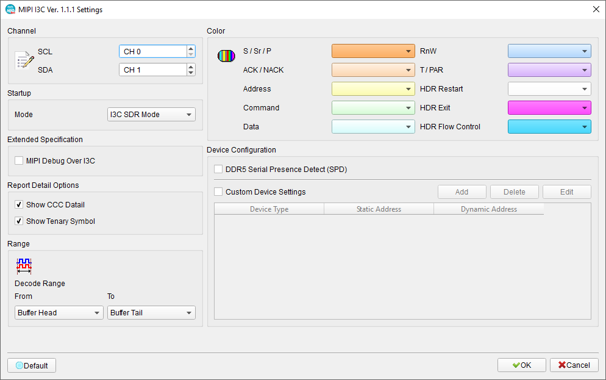
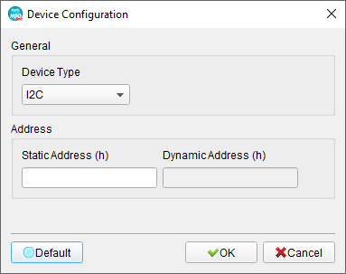
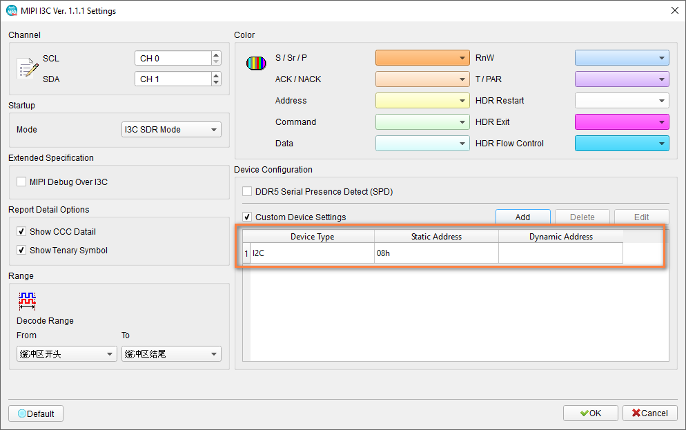
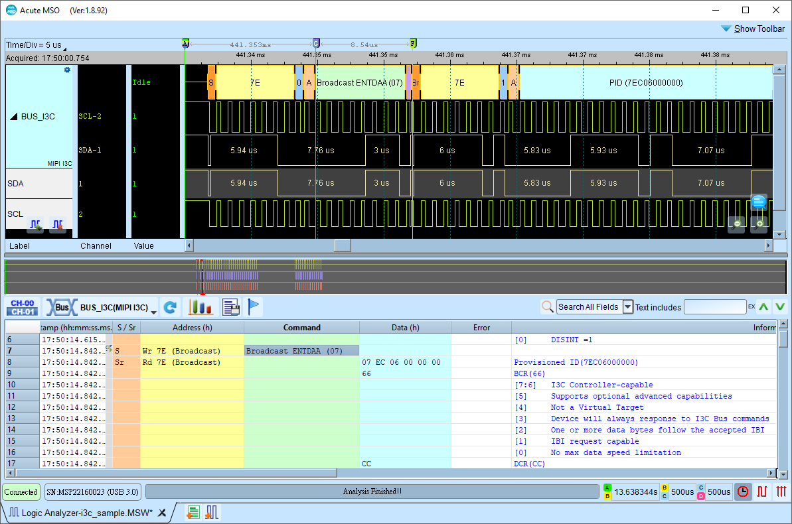
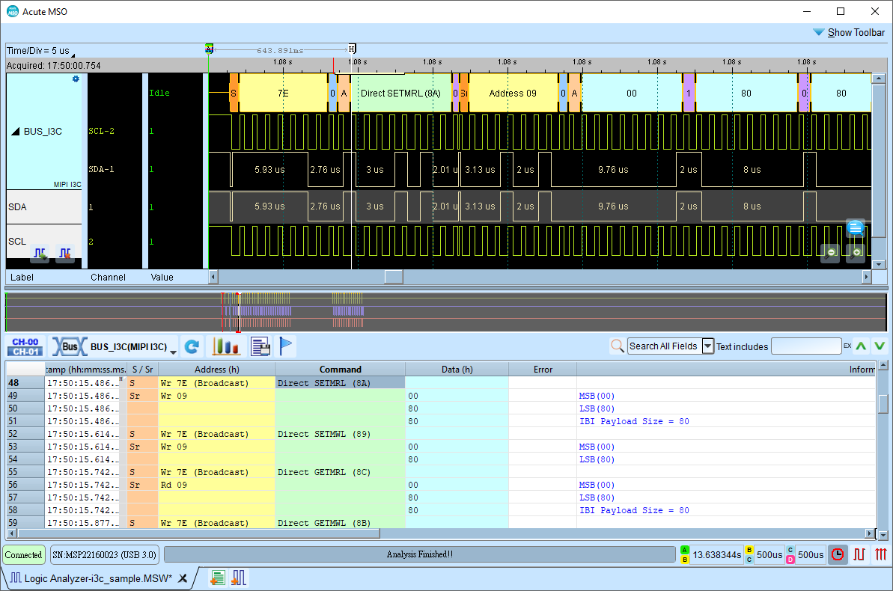
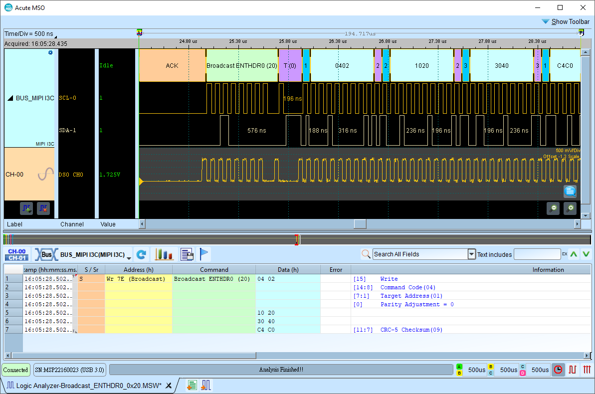
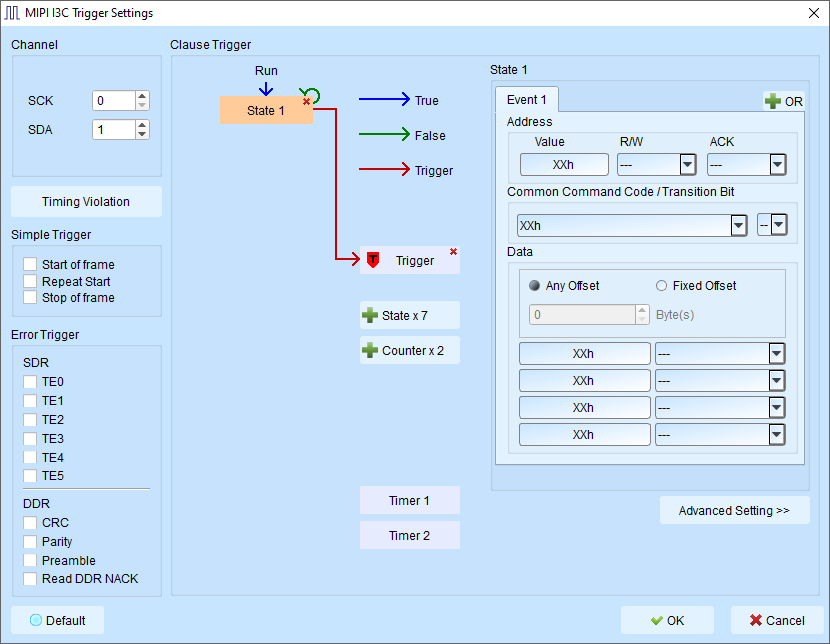

# MIPI I3C (Improved Inter-Integrated Circuit)

## What is MIPI I3C?

MIPI I3C (Improved Inter-Integrated Circuit) is an advanced two-wire serial communication bus specification developed by the MIPI Alliance as a modernized successor to the widely-used I²C (Inter-Integrated Circuit) protocol. The specification exists in two variants: MIPI I3C (full featured) and MIPI I3C Basic (royalty-free subset), both targeting mobile devices, IoT (Internet of Things), sensors, data center applications, and modern embedded systems requiring higher throughput, lower latency, and reduced power consumption compared to traditional I²C. I3C achieves data rates up to 12.5 Mbps (SDR mode) and 25 Mbps (HDR modes), significantly faster than I²C's maximum 3.4 Mbps.

The I3C protocol introduces several key innovations including **In-Band Interrupts (IBI)** that allow slaves to notify the master without requiring dedicated interrupt pins, **Dynamic Address Assignment (DAA)** that automatically configures slave addresses at bus initialization (eliminating manual address configuration and conflicts), **Hot-Join capability** enabling devices to join the bus after system power-up, and **high-data-rate modes (HDR-DDR, HDR-TSP, HDR-TSL, and so on)** for specialized high-performance applications. The two-wire interface uses SDA (Serial Data) and SCL (Serial Clock) like I²C, but with push-pull signaling options for higher speeds instead of I²C's open-drain, reducing power consumption and enabling faster edges. I3C implements **Common Command Codes (CCC)** for advanced bus management operations including slave discovery, capability querying, and power state control. The protocol supports multiple masters, multi-level addressing (7-bit static or 7-bit dynamic plus optional 64-bit Provisioned ID), and broadcast/directed messaging.

Backward compatibility is a cornerstone of I3C design, allowing I²C legacy devices to coexist on the same bus with I3C devices through intelligent protocol switching. The bus master detects device capabilities during initialization and communicates with I²C devices using traditional I²C timing while leveraging I3C enhancements when communicating with native I3C slaves. This migration path has accelerated I3C adoption in mobile smartphones, tablets, wearables, automotive systems, and computing platforms from manufacturers including Qualcomm, MediaTek, NXP, STMicroelectronics, and others. I3C's combination of high performance, low power, low pin count, and legacy I²C compatibility positions it as the next-generation standard for sensor and peripheral connectivity in modern electronic systems.

## Technical Specifications

### Physical Interface

- **SCL (Serial Clock)**: Clock line (master-generated)
- **SDA (Serial Data)**: Bidirectional data line

### Electrical Characteristics

- **Voltage levels**: Typically 1.2V, 1.8V, or 3.3V I/O (implementation-dependent)
- **Drive modes**: 

    - Open-drain for I²C compatibility
    - Push-pull for high-speed I3C operation

- **Bus capacitance**: Lower than I²C (optimized for faster edges)

### Topology

- **Multi-master, multi-slave**: Up to 127 slaves per bus segment (some addresses reserved)
- **Mixed bus**: I3C and I²C legacy devices can coexist

## Decode Configuration

<figure markdown>
  
</figure>

### Startup

The logic analyzer does not know what I3C Bus is currently in. We somehow may miss the ENTHDR0 - ENTHDR7 CCCs when we start capturing the data.
To prevent unpredictable results, we need to inform the logic analyzer what mode to start decoding with. The default value is I3C SDR mode.

There are several options we currently support:

- I3C SDR mode
- I²C mode
- I3C HDR-DDR mode
- I3C HDR-TSP mode
- I3C HDR-TSL mode

### Extended Specification

- MIPI Debug Over I3C - This is additional decoded information, defined by MIPI I3C Debug Working Group.

    For more information, please refer to official docs from [MIPI Alliance](https://www.mipi.org/specifications/debug-over-i3c).

### Report Detail Options

- Show CCC Detail: This offers more detailed information about the Common Command Codes (CCC) that are used in the I3C protocol.
- Show Tenary Symbol: This preserves the decoded tenary symbol in report when decoding HDR-TSL / HDR-TSP modes.

### Device Configuration

There is an common issue decoding Mixed-bus topology setup (i.e. there are both I3C and I²C devices on the same bus).
When a controller sends an I²C transaction, the logic analyzer does not know it is an I3C transaction. Thus it cannot decide whether to
use a T-bit (I3C transaction) or ACK/NACK (I²C transaction) after the data bytes.

Hence, you may need to configure the device configuration to tell the logic analyzer which address the I²C device is on.
This ensure that when the frame is addressing the I²C device, the logic analyzer will show ACK/NACK accordingly instead of T-bit.

Check the checkbox to enable the device configuration.

<figure markdown>
  
</figure>

Here you can configure the static address of the I²C device to the list. After being set, you will see in the table as below.

<figure markdown>
  
</figure>

There is another DDR5 Serial Presence Detect (SPD) checkbox for additional device address information that is used for DDR5 SPD detection.

### Common Pattern Example

**Bus Initialization with DAA**:

<figure markdown>
  { width="800" }
</figure>

**Common Command Code (CCC)**:

<figure markdown>
  { width="800" }
</figure>

**HDR-DDR mode**:

<figure markdown>
  { width="800" }
</figure>

## Trigger Configuration

<figure markdown>
  { width="800" }
</figure>

### Simple Triggers

- **START condition**: Trigger on any START
- **REPEATED START condition**: Trigger on any REPEATED START
- **STOP condition**: Trigger on any STOP

### Error Triggers

**SDR Mode**

- TE0
- TE1
- TE2
- TE3
- TE4
- TE5

**HDR-DDR Mode**

- CRC Error
- Parity Error
- Preamble Error
- NACK Error

## External References

- [MIPI I3C & MIPI I3C Basic - from MIPI Alliance](https://www.mipi.org/specifications/i3c-sensor-specification)
- [MIPI Alliance: Debug Over I3C](https://www.mipi.org/specifications/debug-over-i3c)
