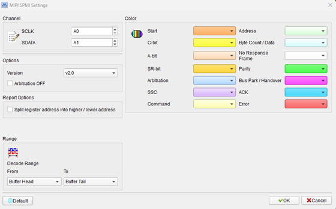
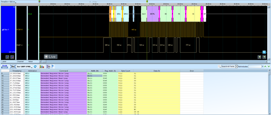

# MIPI SPMI (System Power Management Interface)

## Decode Settings
<figure markdown>
  
  <figcaption>Decode Settings</figcaption>
</figure>

## Example
<figure markdown>
  
  <figcaption>Decode Example</figcaption>
</figure>

## What is MIPI SPMI?

MIPI SPMI (System Power Management Interface) is a high-speed, low-latency, bidirectional two-wire serial bus specification developed by the MIPI Alliance specifically for real-time power management control in mobile devices, tablets, and other battery-powered systems. First adopted in 2008 (v1.0) and enhanced in 2012 (v2.0), SPMI was created to replace legacy point-to-point power management interfaces with a standardized, scalable bus architecture optimized for the unique requirements of dynamic voltage and frequency scaling (DVFS) in multi-core application processors. The protocol enables baseband processors or application processors to control Power Management ICs (PMICs) that regulate voltages for CPU cores, GPU, memory, peripherals, and other system components, allowing fine-grained, real-time power control essential for balancing performance and battery life in modern mobile systems.

SPMI's two-wire interface consists of SCLK (Serial Clock) and SDATA (Serial Data), supporting multi-master (up to 4 masters) and multi-slave (up to 16 slaves) topologies with sophisticated arbitration mechanisms for shared bus access. The specification defines two speed classifications: Low Speed (32 kHz to 15 MHz) and High Speed (32 kHz to 26 MHz), with the protocol optimized for low-latency register writes critical for voltage regulation—the Register 0 Write command provides ultra-fast single-cycle operation for time-critical power adjustments during CPU frequency transitions. SPMI v2.0 introduced request-capable slaves that can initiate bus arbitration to asynchronously notify the master of power-related events (over-temperature, battery low, power button press, etc.), ACK/NACK acknowledgment for improved error handling, and enhanced arbitration with primary/secondary master priorities and round-robin algorithms for fair multi-master bus sharing.

The protocol supports both 8-bit and 16-bit register addressing with burst read/write capabilities (up to 16 bytes with 8-bit addressing, 8 bytes with 16-bit addressing), parity bit error detection using odd parity, and specialized power management commands including dedicated reset, sleep, shutdown, wakeup, and authenticate opcodes. SPMI has been widely adopted by leading PMIC vendors (Qualcomm, Dialog Semiconductor, Maxim Integrated, Texas Instruments, etc.) and deployed in billions of smartphones, tablets, and wearables from manufacturers including Samsung, Xiaomi, OPPO, Vivo, and others. The protocol's combination of low latency, multi-master capability, request-capable slaves, and power management-specific features makes it the de facto standard for PMIC control buses in modern mobile and portable computing platforms.

## Technical Specifications

### Physical Interface

**Signal Lines:**
- **SCLK (Serial Clock)**: Clock signal generated by active master
- **SDATA (Serial Data)**: Bidirectional data line (open-drain with pull-up)

**Electrical Characteristics:**
- **Voltage levels**: Typically 1.8V I/O (platform-dependent)
- **Pull-up resistor**: Required on SDATA (typically 1-10 kΩ)
- **Drive type**: Open-drain (multi-master wired-AND)

**Bus Topology:**
- **Multi-master**: Up to 4 masters per bus
- **Multi-slave**: Up to 16 slaves per bus (4-bit slave ID: 0x0-0xF)
- **Point-to-multipoint**: All devices share two-wire bus

### Clock Frequencies

**Speed Classifications:**

**Low Speed:**
- **Frequency range**: 32 kHz to 15 MHz
- **Typical use**: Standard register access, configuration

**High Speed:**
- **Frequency range**: 32 kHz to 26 MHz
- **Typical use**: High-performance systems, burst transfers

**Adaptive Clocking:**
- Bus can operate at different speeds depending on master and transaction requirements
- Clock speed negotiated during bus initialization

### Addressing

**Slave Addressing:**
- **4-bit Slave ID (SID)**: 16 possible slaves (0x0-0xF)
- Each PMIC or power management device assigned unique SID

**Register Addressing:**
- **8-bit addressing**: Register addresses 0x00-0xFF (256 registers per slave)
- **16-bit extended addressing**: Register addresses 0x0000-0xFFFF (65,536 registers per slave)

**Address Mapping:**
- **Peripheral ID (PPID)**: High byte identifies peripheral type, low byte identifies instance
- Example: 0x1234 might map to LDO #4 within PMIC

### Frame Structure

**Command Frame:**

1. **Start Condition (SC)**
   - SDATA falls while SCLK is high (I²C-like START)

2. **Slave ID (SID)**
   - 4-bit slave identifier (0x0-0xF)

3. **Opcode**
   - 5-bit command type (Register Write, Register Read, Extended Register Write/Read, etc.)

4. **Register Address**
   - 8-bit or 16-bit depending on opcode
   - Transmitted high byte first for 16-bit addressing

5. **Byte Count (for burst)**
   - Number of bytes to read/write (for burst operations)

6. **Data**
   - 8-bit data byte(s)
   - Multiple bytes for burst transfers

7. **Parity Bit**
   - Odd parity computed over address and data fields

8. **Acknowledge/Not-Acknowledge (SPMI v2.0)**
   - Slave sends ACK or NACK after data byte reception

9. **Stop Condition (SC)**
   - SDATA rises while SCLK is high (I²C-like STOP)

### Command Types (Opcodes)

**Basic Register Access:**
- **Register Write**: Write single byte to 8-bit address register
- **Register Read**: Read single byte from 8-bit address register
- **Register Write Extended**: Write single byte to 16-bit address register
- **Register Read Extended**: Read single byte from 16-bit address register

**Register 0 Write:**
- **Ultra-low latency**: Single-cycle write to register 0 (most critical register)
- **Typical use**: Immediate voltage adjustment during DVFS transition

**Burst Transfers:**
- **Register Write Burst**: Write up to 16 bytes (8-bit addr) or 8 bytes (16-bit addr)
- **Register Read Burst**: Read up to 16 bytes (8-bit addr) or 8 bytes (16-bit addr)
- **Efficient**: Reduces protocol overhead for multi-register access

**Power Management Commands:**
- **Reset**: Reset slave device
- **Sleep**: Enter low-power sleep mode
- **Shutdown**: Power down slave
- **Wakeup**: Wake slave from sleep
- **Authenticate**: Security/authentication command (platform-specific)

### Multi-Master Arbitration

**Master Priorities:**
- **Primary master**: Highest priority (typically application processor)
- **Secondary masters**: Lower priorities (co-processors, etc.)
- **Round-robin**: Masters at same priority level use round-robin arbitration

**Arbitration Process:**
1. Master checks if bus is idle (both SCLK and SDATA high)
2. Master asserts START condition
3. If multiple masters assert START simultaneously, arbitration occurs
4. Master with higher priority wins
5. Lower priority master backs off and retries

**Bus Ownership:**
- Master holds bus from START to STOP
- Other masters wait for bus release

### Request-Capable Slaves (SPMI v2.0)

**Feature:**
- Slaves can request master attention for asynchronous events

**Request Mechanism:**
1. Slave asserts request by pulling SDATA low (similar to I²C clock stretching)
2. Master detects request and polls slave for status
3. Slave provides event information (interrupt source, status register)
4. Master services the event (reads additional registers, adjusts settings)

**Use Cases:**
- Over-temperature alert
- Battery voltage low
- Power button press
- USB charger detection
- Fault conditions (overcurrent, overvoltage)

### Parity and Error Detection

**Odd Parity:**
- Parity bit transmitted after data
- Computed over address and data fields
- Slave checks parity; can NACK if parity error detected (SPMI v2.0)

**ACK/NACK (SPMI v2.0):**
- Slave ACKs successful reception
- Slave NACKs if parity error or unable to process command
- Master can retry on NACK

## Common Applications

MIPI SPMI is essential in mobile and battery-powered devices:

- **Smartphones**: PMIC control for CPU, GPU, memory, display, camera, sensors
- **Tablets**: Multi-rail power management for application processor and peripherals
- **Wearables**: Smartwatches, fitness trackers with battery management
- **Laptops and convertibles**: Power management for Always-Connected PCs
- **Automotive infotainment**: Touchscreen displays, infotainment processors
- **IoT devices**: Battery-powered sensors, gateways, edge compute nodes
- **Portable gaming consoles**: Handheld gaming devices with PMIC control
- **E-readers**: Low-power displays with efficient power management
- **Portable medical devices**: Battery-operated diagnostic and monitoring equipment
- **Drones**: Flight controller and sensor power management
- **Smart home devices**: Voice assistants, smart displays, security cameras
- **Industrial handhelds**: Rugged tablets, barcode scanners, PDAs
- **Point-of-sale terminals**: Mobile payment devices, card readers
- **Portable audio**: Bluetooth speakers, wireless headphones with PMIC

## Decoder Configuration

When configuring a logic analyzer to decode MIPI SPMI protocol:

### Channel Assignment

**Essential Signals:**
- **SCLK**: Serial Clock (required)
- **SDATA**: Serial Data (required)

**Optional Signals:**
- **Bus enable/reset**: For context on bus state

### Protocol Parameters

- **Protocol version**: SPMI v1.0 or v2.0
- **Speed class**: Low Speed (up to 15 MHz) or High Speed (up to 26 MHz)
- **Master configuration**: Single-master or multi-master
- **Slave IDs**: Known SID-to-PMIC mappings for annotation

### Decoding Options

- **Frame decoding**: Parse START, SID, opcode, address, data, parity, ACK/NACK, STOP
- **Opcode identification**: Annotate Register Write, Read, Burst, Register 0 Write, Power commands
- **Register address and data**: Display address and data in hex
- **Parity validation**: Check odd parity and flag errors
- **ACK/NACK display**: Show slave acknowledgment status (v2.0)
- **Multi-master arbitration**: Identify master ownership and arbitration events
- **Request events**: Flag slave request assertions (v2.0)
- **Burst transfer parsing**: Display byte count and all data bytes in burst
- **Timing measurement**: Measure command latency, register access time

### Trigger Configuration

- **START condition**: Trigger on frame start
- **Specific slave**: Trigger when specific SID accessed
- **Register 0 Write**: Trigger on low-latency voltage control command
- **Specific register**: Trigger on specific register address
- **Burst transfer**: Trigger on burst read/write commands
- **Power command**: Trigger on Reset, Sleep, Shutdown, Wakeup
- **Slave request**: Trigger on slave request event (v2.0)
- **Parity error**: Trigger when parity check fails
- **NACK**: Trigger on slave not-acknowledge (v2.0)

### Analysis Tips

When analyzing MIPI SPMI communications:

1. **Identify slaves**: Map slave IDs (SIDs) to physical PMICs in system
2. **Monitor Register 0 Writes**: Frequent Register 0 Writes indicate real-time DVFS voltage adjustments
3. **Track power state transitions**: Observe Reset, Sleep, Shutdown, Wakeup commands during system power events
4. **Validate parity**: Ensure all frames have correct odd parity
5. **Check ACK/NACK**: Verify slaves acknowledge commands (v2.0)
6. **Observe multi-master arbitration**: In multi-master systems, watch for arbitration and bus ownership
7. **Analyze slave requests**: Request-capable slaves signal asynchronous events (v2.0)
8. **Measure latency**: Register 0 Write should complete within microseconds for responsive DVFS
9. **Decode burst transfers**: Multi-byte reads/writes configure multiple registers efficiently
10. **Correlate with system events**: Link SPMI activity to CPU frequency changes, screen on/off, charging, etc.

### Common Protocol Patterns

**Register Write (Single):**
1. Master sends START
2. Master sends 4-bit slave ID (e.g., 0x5 for PMIC #5)
3. Master sends opcode (Register Write = 0x00)
4. Master sends 8-bit register address (e.g., 0x3A)
5. Master sends 8-bit data (e.g., 0x42)
6. Master sends parity bit
7. Slave sends ACK (v2.0)
8. Master sends STOP

**Register 0 Write (Low Latency):**
1. Master sends START
2. Master sends SID
3. Master sends Register 0 Write opcode (special, minimal overhead)
4. Master sends 8-bit data (new voltage level)
5. Parity bit
6. ACK (v2.0)
7. STOP
8. Total time <10 µs for fast DVFS response

**Register Read:**
1. Master sends START
2. Master sends SID
3. Master sends Register Read opcode
4. Master sends 8-bit register address
5. Master releases SDATA (reads data from slave)
6. Slave drives SDATA and sends 8-bit data
7. Slave sends parity bit
8. Master sends ACK (if more data) or NACK (if done)
9. STOP

**Burst Write:**
1. Master sends START
2. Master sends SID
3. Master sends Register Write Burst opcode
4. Master sends 8-bit start register address
5. Master sends byte count (e.g., 4 bytes)
6. Master sends data byte 1, parity, ACK
7. Master sends data byte 2, parity, ACK
8. Master sends data byte 3, parity, ACK
9. Master sends data byte 4, parity, ACK
10. STOP

**Slave Request (SPMI v2.0):**
1. Slave detects event (e.g., over-temperature)
2. Slave pulls SDATA low (request assertion)
3. Master detects request on SDATA
4. Master sends Register Read to slave's status register
5. Slave provides status information
6. Master services the event (e.g., reduces CPU voltage/frequency)
7. Slave releases SDATA (request deasserted)

## Reference

- [MIPI Alliance: System Power Management Interface](https://www.mipi.org/specifications/system-power-management-interface)
- [MIPI SPMI Interface Overview (PDF)](https://2384176.fs1.hubspotusercontent-na1.net/hubfs/2384176/MIPI_SPM_Interface_Overview_r01.pdf)
- [Wikipedia: System Power Management Interface](https://en.wikipedia.org/wiki/System_Power_Management_Interface)
- [Synopsys: Verification IP for MIPI SPMI](https://synopsys.com/verification/verification-ip/mipi/spmi.html)
- [Soliton Technologies: SPMI Specifications](https://www.solitontech.com/wp-content/uploads/2020/12/Soliton-SPMI_SVS-Specifications2.pdf)
