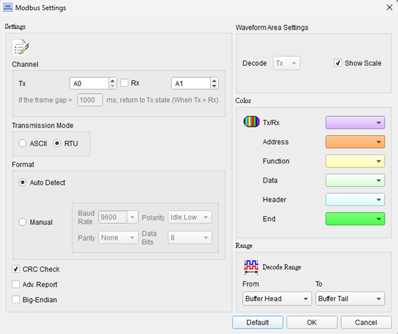
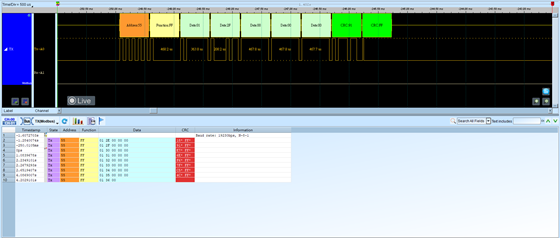

# Modbus


## Decode Settings
<figure markdown>
  
  <figcaption>Decode Settings</figcaption>
</figure>

## Example
<figure markdown>
  
  <figcaption>Decode Example</figcaption>
</figure>

## What is Modbus?

### Overview

Modbus is an open, royalty-free industrial communication protocol originally developed by Modicon (now Schneider Electric) in 1979 for connecting programmable logic controllers (PLCs) with industrial sensors, actuators, and control devices. As one of the oldest and most widely deployed industrial protocols, Modbus has achieved de facto standard status in factory automation, process control, building management systems, and energy monitoring applications worldwide. The protocol's longevity reflects its simplicity, reliability, and the pragmatic decision by Modicon to publish the specification openly, enabling broad industry adoption and interoperability across equipment from hundreds of manufacturers.

Modbus defines a simple request-response application layer protocol that operates over various physical layers and network types. The three primary variants are: **Modbus RTU** (serial transmission over RS-232/RS-485), **Modbus ASCII** (human-readable serial format), and **Modbus TCP/IP** (Ethernet-based). Modbus RTU remains the most prevalent in industrial applications due to its efficiency, error checking capabilities, and suitability for long-distance serial communication over rugged RS-485 networks. The protocol's master-slave (client-server) architecture ensures deterministic communication with clear addressing, making it suitable for real-time industrial control systems.

### Modbus Organization

The Modbus Organization (modbus.org), established to maintain and promote the protocol, provides freely available specifications, implementation guides, conformance test procedures, and developer resources. The organization ensures the protocol evolves to meet modern requirements while maintaining backward compatibility with the millions of existing Modbus devices deployed globally.

## Modbus RTU Technical Specifications

### Physical Layer (Typical Implementation)

**Serial Interface**:
- **RS-485** (most common): Multi-drop, differential signaling, up to 32 devices (120 with repeaters), 1200 meters max distance
- **RS-232**: Point-to-point, single-ended, 15 meters max distance, simpler but limited
- **RS-422**: Similar to RS-485 but optimized for point-to-multipoint

**Baud Rates**:
- Standard: 1200, 2400, 4800, 9600, 19200, 38400 bps
- Many devices support up to 115200 bps
- Must match across all devices on the bus

**Serial Format**:
- **8 data bits, No parity, 1 stop bit (8N1)** - most common
- **8 data bits, Even parity, 1 stop bit (8E1)** - also common
- Other formats possible (7E1, etc.) but less standard

### Frame Structure

**RTU Frame**:
```
[Slave Address] [Function Code] [Data...] [CRC-16]
  1 byte          1 byte          0-252 bytes  2 bytes
```

**Slave Address** (1 byte):
- Valid slave addresses: 1-247
- Address 0: Broadcast (all slaves listen, no response)
- Address 248-255: Reserved

**Function Code** (1 byte):
- Indicates requested operation (read/write, register type)
- Standard function codes: 1-127
- Exception responses: 128-255 (original function code + 128)

**Data Field** (variable):
- Register addresses, quantities, values
- Format depends on function code
- Maximum 252 bytes for Modbus RTU

**CRC-16** (2 bytes):
- Cyclic Redundancy Check for error detection
- Calculated over entire message (address + function + data)
- Low byte transmitted first, then high byte

### Inter-Frame Timing

**Silence Periods**:
- Minimum 3.5 character times of silence before message start
- Minimum 3.5 character times of silence after message end
- Defines frame boundaries in continuous bit stream
- Critical for proper frame synchronization

At 9600 baud: 1 character = 11 bits = ~1.15ms, so 3.5 char = ~4ms silence required.

## Data Model

Modbus organizes data into four primary tables:

### Coils (Discrete Outputs)

- **Address Range**: 00001-09999 (in Modbus addressing documentation)
- **Data Type**: Single bit (ON/OFF)
- **Access**: Read-write
- **Typical Use**: Digital outputs (relay states, valve positions, motor on/off)
- **Function Codes**: 01 (Read), 05 (Write Single), 15 (Write Multiple)

### Discrete Inputs

- **Address Range**: 10001-19999
- **Data Type**: Single bit (ON/OFF)
- **Access**: Read-only
- **Typical Use**: Digital inputs (switch states, sensor alarms, limit switches)
- **Function Code**: 02 (Read)

### Holding Registers

- **Address Range**: 40001-49999
- **Data Type**: 16-bit word (0-65535 unsigned, or -32768 to +32767 signed)
- **Access**: Read-write
- **Typical Use**: Configuration parameters, setpoints, control values, output data
- **Function Codes**: 03 (Read), 06 (Write Single), 16 (Write Multiple), 23 (Read/Write Multiple)

### Input Registers

- **Address Range**: 30001-39999
- **Data Type**: 16-bit word
- **Access**: Read-only
- **Typical Use**: Measurement values, sensor readings, status information
- **Function Code**: 04 (Read)

**Note on Addressing**: The address ranges above are documentation conventions. Protocol data uses 0-based addressing (0-65535), where address 0 corresponds to documented address 1, 40001, etc.

### Extended Data Types

For values beyond 16 bits:
- **32-bit Integer**: Two consecutive registers
- **32-bit Float**: IEEE 754 floating-point across two registers
- **64-bit Values**: Four consecutive registers
- **Byte Order**: Big-endian or little-endian (device-specific; commonly big-endian per specification)

## Common Function Codes

| Code | Name | Description |
|------|------|-------------|
| 01 | Read Coils | Read 1-2000 coil states |
| 02 | Read Discrete Inputs | Read 1-2000 input states |
| 03 | Read Holding Registers | Read 1-125 register values |
| 04 | Read Input Registers | Read 1-125 register values |
| 05 | Write Single Coil | Write one coil ON or OFF |
| 06 | Write Single Register | Write one 16-bit register |
| 15 | Write Multiple Coils | Write multiple coils |
| 16 | Write Multiple Registers | Write multiple registers |
| 23 | Read/Write Multiple Registers | Combined read and write operation |

## Exception Responses

When errors occur, slave responds with:
- Exception function code: Original code + 128 (e.g., 03 → 131)
- Exception code byte indicating error type:
  - 01: Illegal Function (unsupported function code)
  - 02: Illegal Data Address (invalid register/coil address)
  - 03: Illegal Data Value (value out of range)
  - 04: Slave Device Failure (unrecoverable error)
  - 05: Acknowledge (command accepted, processing takes time)
  - 06: Slave Device Busy (retry later)

## Decoder Configuration

When configuring a Modbus RTU decoder:

- **Serial Parameters**: Set baud rate, parity, stop bits to match network
- **Slave Address Filter**: Optionally filter by specific slave address(es)
- **Function Code Interpretation**: Enable decoding of function names and parameters
- **Register Display**: Show register addresses and values in decimal/hex
- **Data Type**: Configure multi-register interpretation (int32, float, etc.)
- **CRC Validation**: Verify checksums and flag errors
- **Timing Analysis**: Measure inter-frame gaps and response times

## Common Applications

Modbus is the workhorse of industrial automation:

**Industrial Automation**:
- PLC-to-PLC communication
- SCADA systems
- Factory floor equipment
- Conveyor systems
- Robotic cells

**Building Automation**:
- HVAC control systems
- Energy management
- Lighting control (non-DALI systems)
- Access control integration

**Energy and Utilities**:
- Smart meters
- Power monitoring equipment
- Solar inverters
- Battery management systems
- Substation automation

**Process Control**:
- Chemical processing
- Water/wastewater treatment
- Oil and gas facilities
- Food and beverage production

**Environmental Monitoring**:
- Weather stations
- Air quality monitoring
- Water quality sensors

## Advantages

- **Simplicity**: Easy to implement and understand
- **Open Protocol**: Royalty-free, publicly available specifications
- **Universal Support**: Supported by thousands of devices worldwide
- **Proven Reliability**: Decades of successful deployment
- **Interoperability**: Mix equipment from different manufacturers
- **Diagnostic Capability**: Built-in error reporting
- **Scalability**: Works from simple point-to-point to complex multi-drop networks

## Reference

- [Modbus Organization: Protocol Specification](https://www.modbus.org/file/secure/modbusprotocolspecification.pdf)
- [Modbus over Serial Line Specification V1.02](https://modbus.org/docs/Modbus_over_serial_line_V1_02.pdf)
- [IETF: Modbus Application Protocol](https://datatracker.ietf.org/doc/html/draft-dube-modbus-applproto-00.txt)
- [Automatas: Modbus Data and Control Functions](https://www.automatas.org/modbus/dcon7.html)
