# NAND Flash

## Decode Settings
<figure markdown>
  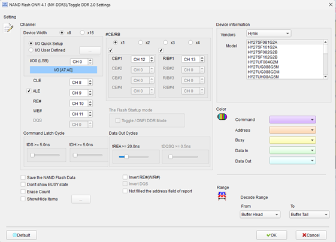
  <figcaption>Decode Settings</figcaption>
</figure>

## Example
<figure markdown>
  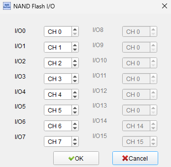
  <figcaption>Decode Example</figcaption>
</figure>
<figure markdown>
  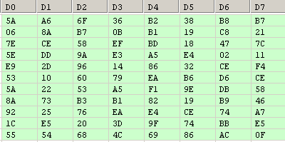
  <figcaption>Decode Figure</figcaption>
</figure>
<figure markdown>
  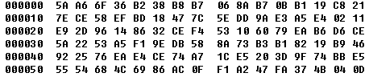
  <figcaption>Decode Figure</figcaption>
</figure>
<figure markdown>
  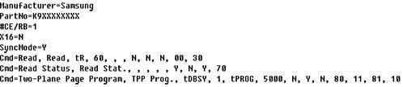
  <figcaption>Decode Figure</figcaption>
</figure>
<figure markdown>
  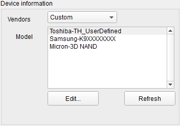
  <figcaption>Decode Figure</figcaption>
</figure>
<figure markdown>
  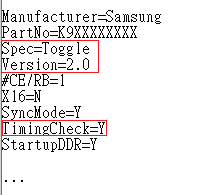
  <figcaption>Decode Figure</figcaption>
</figure>
<figure markdown>
  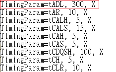
  <figcaption>Decode Figure</figcaption>
</figure>
<figure markdown>
  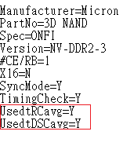
  <figcaption>Decode Figure</figcaption>
</figure>
<figure markdown>
  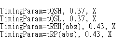
  <figcaption>Decode Figure</figcaption>
</figure>
<figure markdown>
  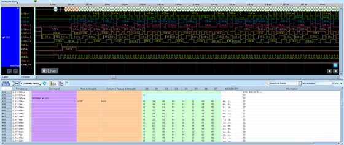
  <figcaption>Decode Figure</figcaption>
</figure>
<figure markdown>
  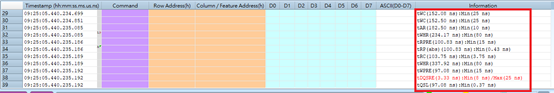
  <figcaption>Decode Figure</figcaption>
</figure>

## What is NAND Flash?

NAND Flash is a type of non-volatile memory technology that stores data in an array of memory cells based on floating-gate transistors. First introduced by Toshiba in 1987, NAND flash revolutionized data storage by offering high density, low cost per bit, and the ability to electrically erase and reprogram data in blocks. The name "NAND" derives from the NOT-AND logic gate configuration used in the memory cell architecture, which enables higher density compared to NOR flash by connecting cells in series rather than parallel.

The NAND flash interface protocol, standardized primarily through the Open NAND Flash Interface (ONFI) Working Group since 2006, defines how host controllers communicate with NAND memory devices. Traditional parallel NAND interfaces use multiplexed buses where commands, addresses, and data share common I/O lines, distinguished by control signals CLE (Command Latch Enable) and ALE (Address Latch Enable). Modern ONFI specifications have evolved to include high-speed interfaces with data rates exceeding 1600 MT/s, advanced error correction requirements, and innovative features like the Separate Command Address (SCA) protocol introduced in ONFI 5.2 that enables simultaneous command and data transfer for improved bandwidth utilization.

NAND flash technology has evolved through multiple generations of cell technology, progressing from Single-Level Cell (SLC) storing one bit per cell to Multi-Level Cell (MLC) with two bits, Triple-Level Cell (TLC) with three bits, and Quad-Level Cell (QLC) with four bits per cell. While higher bit-per-cell densities reduce cost and increase capacity, they also decrease performance and endurance, requiring sophisticated error correction codes and wear-leveling algorithms. NAND flash has become the dominant storage technology for solid-state drives, memory cards, USB flash drives, and embedded storage in mobile devices and consumer electronics.

## Technical Specifications

### Physical Interface - Parallel NAND

**Control Signals:**
- **CE# (Chip Enable)**: Active-low device select
- **CLE (Command Latch Enable)**: Indicates command cycle on I/O bus
- **ALE (Address Latch Enable)**: Indicates address cycle on I/O bus
- **WE# (Write Enable)**: Active-low strobe for latching data/command/address
- **RE# (Read Enable)**: Active-low output enable for reading data
- **R/B# (Ready/Busy)**: Indicates device status (ready for new commands or busy)
- **WP# (Write Protect)**: Active-low hardware write protection

**Data Bus:**
- **I/O[7:0]**: 8-bit multiplexed command/address/data bus (x8 devices)
- **I/O[15:0]**: 16-bit bus for x16 devices

### Memory Organization

**Hierarchical Structure:**
- **Cell**: Basic storage unit (SLC, MLC, TLC, or QLC)
- **Page**: Smallest programmable unit (typically 2KB, 4KB, 8KB, or 16KB + spare area)
- **Block**: Smallest erasable unit (typically 64, 128, or 256 pages)
- **Plane**: Group of blocks that can be operated on in parallel
- **LUN (Logical Unit)**: Independent memory array within a die
- **Die/Chip**: Complete memory device

**Spare Area:**
Each page includes additional bytes (typically 64-512 bytes) for metadata:
- Error Correction Code (ECC) parity data
- Bad block markers
- Wear-leveling information
- File system metadata

### Data Rates and Timing

**Interface Modes (ONFI specification):**
- **Asynchronous Mode 0**: Up to 10 MB/s
- **Asynchronous Mode 5**: Up to 50 MB/s
- **Synchronous Mode (SDR)**: Up to 200 MB/s
- **Toggle Mode (DDR)**: Up to 400 MB/s
- **ONFI 4.x (NV-DDR2)**: Up to 800 MB/s
- **ONFI 5.x (NV-DDR3)**: Up to 1600 MB/s
- **ONFI 5.2 (SCA protocol)**: Further increased throughput with separate command/data buses

### Command Set

**Basic Commands (examples):**
- **00h/30h**: Read page (00h = first cycle, 30h = second cycle/execute)
- **80h/10h**: Program page (80h = setup, 10h = execute)
- **60h/D0h**: Erase block (60h = setup, D0h = execute)
- **70h**: Read status
- **90h**: Read ID
- **FFh**: Reset
- **ECh**: Read parameter page (ONFI)
- **EFh**: Set features
- **EEh**: Get features

**Command Structure:**
Commands are issued by asserting CLE while toggling WE# to latch command bytes on the I/O bus. Addresses follow with ALE asserted. Data transfer occurs with both CLE and ALE low.

### ONFI 5.2 Separate Command Address (SCA) Protocol

**Additional Signals:**
- **CA[1:0]_x**: Separate command/address packet buses
- **CA_CEy_x_n**: Command/address bus chip enable
- **CA_CLK_x**: Dedicated command/address clock

**Benefits:**
- Issue new commands while previous operations transfer data
- Improved pipeline efficiency and overall bandwidth
- Reduced host controller complexity for command scheduling

## Common Applications

NAND flash memory is ubiquitous in modern digital storage:

- **Solid-state drives (SSDs)**: Consumer, enterprise, and data center storage
- **Memory cards**: SD, microSD, CompactFlash for cameras and mobile devices
- **USB flash drives**: Portable storage devices
- **Smartphones and tablets**: Internal embedded storage
- **Digital cameras**: Storage for photos and videos
- **MP3 players and portable media**: Music and video storage
- **Gaming consoles**: Game storage and saved game data
- **Automotive systems**: Infotainment, navigation, and autonomous driving data logging
- **Industrial equipment**: Data logging and firmware storage
- **Embedded systems**: Code storage and data logging in IoT devices
- **Network infrastructure**: Configuration storage in routers, switches, and access points
- **Medical devices**: Patient data and diagnostic image storage
- **Aerospace and defense**: Mission data recording and flight data storage
- **Point-of-sale terminals**: Transaction logging and application storage
- **Security cameras**: Video recording in surveillance systems
- **Set-top boxes**: Firmware and user preference storage

## Decoder Configuration

When configuring a logic analyzer to decode NAND flash signals:

### Channel Assignment - Parallel NAND

**Control Signals:**
- **CE#**: Chip Enable
- **CLE**: Command Latch Enable
- **ALE**: Address Latch Enable
- **WE#**: Write Enable
- **RE#**: Read Enable
- **R/B#**: Ready/Busy (optional but helpful)

**Data Bus:**
- **I/O[7:0]**: 8-bit data bus (for x8 devices)
- **I/O[15:8]**: Additional 8 bits for x16 devices (if applicable)

### Protocol Parameters

- **Bus width**: Select x8 or x16 configuration
- **Interface mode**: Asynchronous, Synchronous (SDR), or Toggle (DDR)
- **Timing mode**: Select ONFI timing mode (0-5) or vendor-specific timing
- **Page size**: Configure expected page size (e.g., 2KB, 4KB, 8KB)
- **Spare area size**: Set spare area bytes per page

### Decoding Options

- **Command decoding**: Display command names (Read, Program, Erase, etc.)
- **Address parsing**: Show row address (block/page) and column address separately
- **Operation state machine**: Track multi-cycle command sequences
- **Data payload**: Display read/write data in hex/ASCII
- **Status register**: Decode status byte (pass/fail, ready/busy, write protected)
- **Timing measurement**: Measure tWC, tRC, tREA, and other critical timing parameters
- **ECC visibility**: Optionally parse spare area for ECC bytes (if format known)

### Trigger Configuration

- **Command trigger**: Trigger on specific command codes (e.g., Read, Program, Erase)
- **Address trigger**: Trigger when specific block or page is accessed
- **Operation completion**: Trigger on R/B# transition indicating operation done
- **Error condition**: Trigger on status register indicating program/erase failure
- **Chip select**: Trigger on CE# assertion to capture complete transactions

### Analysis Tips

When analyzing NAND flash communications:

1. **Identify command sequences**: NAND operations typically require multi-cycle command sequences (setup command + address + execute command)
2. **Monitor R/B#**: Track device busy periods - read operations take microseconds, program operations milliseconds, and erase operations tens of milliseconds
3. **Verify timing**: Ensure setup and hold times (tWP, tWH, tRP, tREA) meet datasheet specifications
4. **Check status after operations**: Read status register (70h command) after Program/Erase to verify success
5. **Observe block management**: Look for patterns in block access that indicate wear-leveling or bad block management
6. **Capture full page operations**: Ensure sufficient buffer depth to capture complete page reads/writes including spare area

### Common Protocol Patterns

**Read Page Sequence:**
1. Command 00h (Read setup)
2. 5-byte address (column + row address)
3. Command 30h (Read execute)
4. Wait for R/B# ready
5. Toggle RE# to clock out data

**Program Page Sequence:**
1. Command 80h (Program setup)
2. 5-byte address
3. Data input (page + spare)
4. Command 10h (Program execute)
5. Wait for R/B# ready
6. Command 70h (Read status)
7. Check status byte for pass/fail

**Erase Block Sequence:**
1. Command 60h (Erase setup)
2. 3-byte row address (block address)
3. Command D0h (Erase execute)
4. Wait for R/B# ready
5. Command 70h (Read status)
6. Check status byte for pass/fail

## Reference

- [ONFI 5.2 Specification (PDF)](https://onfi.org/files/ONFI_5_2_Rev1.0.pdf)
- [ONFI Working Group Official Site](https://onfi.org/)
- [AllPCB: ONFI NAND Flash Interface Explained](https://www.allpcb.com/allelectrohub/onfi-nand-flash-interface-explained)
- [Cadence: ONFI 5.2 What's New](https://community.cadence.com/cadence_blogs_8/b/fv/posts/onfi-5-2-what-s-new-in-open-nand-flash-interface-s-latest-5-2-standard)
- [Intel: NAND Flash Interface Guide](https://www.intel.com/content/www/us/en/docs/programmable/683829/current/nand-flash-interface-using-altera-devices.html)
