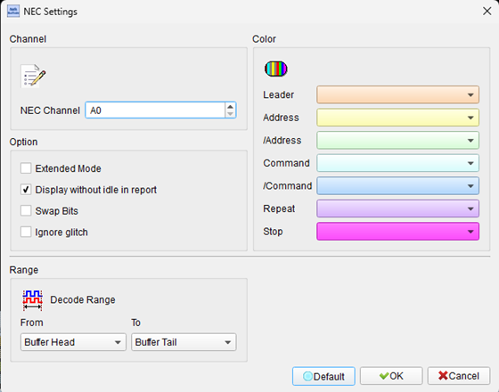
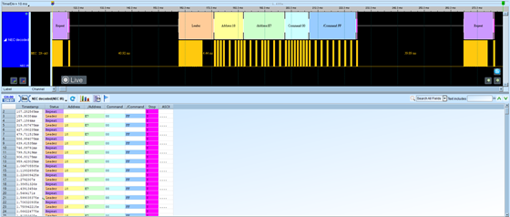

# NEC IR (Infrared Remote Control Protocol)


## Decode Settings
<figure markdown>
  
  <figcaption>Decode Settings</figcaption>
</figure>

## Example
<figure markdown>
  
  <figcaption>Decode Example</figcaption>
</figure>

## What is NEC IR?

The NEC infrared transmission protocol is one of the most widely used infrared remote control protocols for consumer electronics, developed by NEC Corporation (Nippon Electric Company) of Japan. Introduced in the 1980s, the NEC protocol became a de facto standard for infrared remote controls due to its robust design, ease of implementation, and excellent noise immunity. The protocol uses pulse distance encoding modulated onto a 38 kHz carrier frequency, where data bits are distinguished by the length of the space (silence) following each pulse burst rather than by pulse width variation. This encoding scheme provides reliable communication over typical living room distances (up to 10 meters) while being resistant to ambient infrared noise from sunlight, incandescent lamps, and other sources.

The NEC protocol transmits 32 bits of data per frame, consisting of an 8-bit device address, an 8-bit inverse of the address (for error detection), an 8-bit command code, and an 8-bit inverse of the command. Each transmission begins with a distinctive 9 ms leading pulse burst followed by a 4.5 ms space, serving as an AGC (Automatic Gain Control) burst that allows the receiver to adapt its sensitivity. Data bits are encoded using a 562.5 µs pulse burst followed by either a 562.5 µs space (for logical 0) or a 1.6875 ms space (for logical 1), with bits transmitted LSB (Least Significant Bit) first. The frame duration is approximately 67.5 ms, and when a button is held down, the protocol sends a shorter repeat code every 108 ms consisting of a 9 ms pulse, 2.25 ms space, and 562.5 µs pulse, allowing the receiver to distinguish between single button presses and continuous holds.

The NEC protocol's simplicity and reliability have led to its adoption across countless consumer electronics products worldwide, including televisions, DVD players, air conditioners, audio systems, and set-top boxes. Many manufacturers have extended the protocol or created variations (such as extended NEC protocol supporting 16-bit addresses), but the core encoding scheme remains consistent. The protocol's widespread use has made it a popular choice for hobbyist and maker projects, with extensive library support in microcontroller ecosystems like Arduino and Raspberry Pi, making it one of the easiest infrared protocols to implement and decode for custom remote control applications.

## Technical Specifications

### Physical Layer

**Infrared Carrier:**
- **Carrier frequency**: 38 kHz (optimal 38.222 kHz)
- **Wavelength**: 940 nm (typical infrared LED)
- **Duty cycle**: 33% (1/3) — carrier on 1/3 of the time, off 2/3
- **Modulation**: On-off keying (OOK) — carrier burst represents mark, absence represents space

**Communication Range:**
- **Typical range**: 5-10 meters (line of sight)
- **Beam angle**: 30-60° cone (depends on LED and receiver)

### Timing Specifications

**Pulse Duration (Carrier Burst):**
- **Standard pulse**: 562.5 µs (21.3 cycles of 38 kHz carrier)

**Bit Encoding (Pulse Distance):**
- **Logical '0'**: 562.5 µs pulse + 562.5 µs space = 1.125 ms total
- **Logical '1'**: 562.5 µs pulse + 1.6875 ms space = 2.25 ms total

**Frame Header (AGC Burst):**
- **Leading pulse burst**: 9 ms (16× standard pulse)
- **Header space**: 4.5 ms (8× standard pulse)

**Frame Termination:**
- **Stop bit**: 562.5 µs pulse burst

**Total Frame Duration:**
- **Normal transmission**: ~67.5 ms (header + 32 bits + stop)

### Message Frame Format

**32-Bit Data Frame Structure:**

1. **9 ms leading pulse burst** (AGC burst)
2. **4.5 ms space**
3. **8-bit address** (device ID, LSB first)
4. **8-bit logical inverse of address** (error detection)
5. **8-bit command** (button/function code, LSB first)
6. **8-bit logical inverse of command** (error detection)
7. **562.5 µs stop pulse**

**Example Bit Stream:**
```
[9ms pulse][4.5ms space][A0][A1]...[A7][~A0][~A1]...[~A7][C0][C1]...[C7][~C0][~C1]...[~C7][562.5µs pulse]
```

**Address and Command Validation:**
- The inverse address bits should be the bitwise NOT of the address
- The inverse command bits should be the bitwise NOT of the command
- Receiver validates by checking: Address XOR Inverse_Address = 0xFF
- Similarly: Command XOR Inverse_Command = 0xFF

### Repeat Code

When a button is held down continuously:

**First transmission**: Full 32-bit frame (as above)

**Repeat code** (every 108 ms while button held):
1. **9 ms leading pulse burst**
2. **2.25 ms space** (half of normal header space)
3. **562.5 µs stop pulse**

**Total repeat duration**: ~11.8 ms

**Repeat interval**: 108 ms from start of previous frame

The receiver detects the 2.25 ms space (instead of 4.5 ms) to identify repeat codes, instructing it to repeat the previous command without re-decoding address and command bytes.

### Extended NEC Protocol

Some manufacturers use an extended version supporting more devices:

**16-bit address variant:**
- Uses both the address byte and its inverse as a 16-bit address (256 × 256 = 65,536 devices)
- No address error checking in this variant
- Command bytes and inverses remain unchanged

## Common Applications

The NEC IR protocol is ubiquitous in consumer electronics and beyond:

- **Televisions**: Remote control for power, channel, volume, menu navigation
- **DVD and Blu-ray players**: Transport controls, menu navigation
- **Audio systems**: Amplifiers, CD players, home theater receivers
- **Air conditioners**: Temperature control, mode selection, fan speed
- **Set-top boxes**: Cable, satellite, and streaming device remotes
- **Media players**: Apple TV, Roku, Amazon Fire TV remotes (many use NEC-based protocols)
- **Projectors**: Power, input selection, menu controls
- **Digital cameras**: Wireless shutter release (some models)
- **Smart home devices**: IR-controlled lights, fans, curtains
- **Retro gaming consoles**: Aftermarket IR controllers
- **DIY maker projects**: Arduino, Raspberry Pi, ESP32 IR remote control projects
- **Industrial equipment**: Remote control for machinery, displays
- **Medical devices**: Non-contact control interfaces for sterile environments
- **Automotive accessories**: Headrest DVD players, in-car entertainment
- **Learning remotes**: Universal remotes that can learn and replay NEC codes
- **IR automation systems**: Home automation, lighting control

## Decoder Configuration

When configuring a logic analyzer to decode NEC IR protocol:

### Signal Capture Method

**Option 1: Direct IR Receiver Output (Recommended)**
- Capture the demodulated digital output from an IR receiver module (e.g., TSOP38238, VS1838B)
- IR receiver provides clean digital pulses (active low typically)
- No carrier frequency demodulation needed

**Option 2: Raw IR LED Signal**
- Capture the IR LED output directly with infrared photodiode
- Requires analog channel or fast digital sampling to see 38 kHz modulation
- More complex to decode but useful for analyzing carrier quality

### Channel Assignment

**Essential Signal:**
- **IR_DATA**: Demodulated IR receiver output (digital, active low typical)

**Optional Signals:**
- **Reference timing source**: System clock or trigger for correlation

### Protocol Parameters

- **Protocol type**: NEC IR (or Extended NEC if 16-bit addressing)
- **Carrier frequency**: 38 kHz (for reference, if analyzing raw signal)
- **Bit encoding**: Pulse distance encoding
- **Bit order**: LSB first
- **Logic polarity**: Typically active low (depends on IR receiver module)

### Decoding Options

- **Frame decoding**: Parse 32-bit frames into address, inverse address, command, inverse command
- **Address display**: Show device address in hex or decimal
- **Command display**: Show command code in hex or decimal
- **Validation checking**: Verify address and command inverses, flag errors
- **Repeat code identification**: Distinguish full frames from repeat codes
- **Timing measurement**: Measure pulse and space durations, verify against specification
- **Carrier frequency analysis**: If capturing raw signal, measure carrier frequency accuracy

### Trigger Configuration

- **Start of frame**: Trigger on 9 ms leading pulse burst
- **Specific address**: Trigger when specific device address is decoded
- **Specific command**: Trigger when specific command code is transmitted
- **Repeat code**: Trigger on repeat code (2.25 ms space after leading pulse)
- **Error condition**: Trigger when validation fails (address/command mismatch with inverse)

### Analysis Tips

When analyzing NEC IR signals:

1. **Verify AGC burst**: Ensure leading pulse is ~9 ms and header space is ~4.5 ms
2. **Check bit timing**: Logical 0 should be ~1.125 ms, logical 1 should be ~2.25 ms
3. **Validate inverses**: XOR address with inverse address should equal 0xFF; same for command
4. **Identify repeats**: Look for shortened frames (11.8 ms) with 2.25 ms space
5. **Measure repeat interval**: Should be approximately 108 ms from frame start to frame start
6. **Check LSB-first order**: First bit transmitted is bit 0 (LSB), last is bit 7 (MSB)
7. **Observe noise immunity**: Protocol should be resistant to short glitches
8. **Capture complete button press**: Record both initial frame and several repeat codes
9. **Compare button codes**: Press different buttons and note command code differences
10. **Test range and angle**: Verify signal quality at various distances and angles

### Common Protocol Patterns

**Single Button Press:**
1. User presses button on remote
2. Full 32-bit frame transmitted (~67.5 ms)
3. User releases button
4. No further transmission

**Button Hold:**
1. User presses and holds button
2. Full 32-bit frame transmitted
3. After ~40 ms, first repeat code sent
4. Subsequent repeat codes every 108 ms while button held
5. User releases button
6. Transmission stops

**Rapid Button Presses:**
1. User presses button 1
2. Full frame for button 1
3. User releases, presses button 2 before 108 ms
4. Full frame for button 2 (no repeat codes between)

**Extended NEC (16-bit Address):**
```
[9ms pulse][4.5ms space][A_low byte][A_high byte][Command][~Command][562.5µs pulse]
```
- Uses 16-bit address (no inversion)
- Command and inverse command remain for validation

## Reference

- [Altium: NEC Infrared Transmission Protocol](https://techdocs.altium.com/display/FPGA/NEC+Infrared+Transmission+Protocol)
- [SB-Projects: IR Protocol Guide - NEC](https://www.sbprojects.net/knowledge/ir/nec.php)
- [EmbeddedExpert: NEC Protocol Decoding with STM32](https://blog.embeddedexpert.io/?p=1138)
- [Wikipedia: Consumer IR (Infrared Remote Control)](https://en.wikipedia.org/wiki/Consumer_IR)
- [IR Remote Protocol Documentation (PDF)](https://sibotic.files.wordpress.com/2013/12/adoh-necinfraredtransmissionprotocol-281113-1713-47344.pdf)
