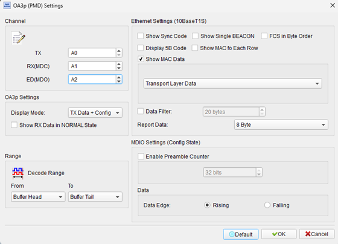
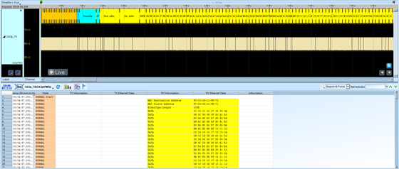

# OA3P (OPEN Alliance 3-Pin)

## Decode Settings
<figure markdown>
  
  <figcaption>Decode Settings</figcaption>
</figure>

## Example
<figure markdown>
  
  <figcaption>Decode Example</figcaption>
</figure>

## What is OA3P?

OA3P (OPEN Alliance 3-pin) is a protocol specification developed by the OPEN Alliance SIG (Special Interest Group) for automotive Ethernet physical layer (PHY) testing, device qualification, and signal monitoring. The protocol defines testing requirements and decode capabilities for automotive Ethernet implementations, ensuring device consistency, reliability, and stability under various operating conditions including temperature extremes, voltage variations, and electromagnetic interference typical of automotive environments. OA3P specifically supports the 10BASE-T1S Ethernet standard—a 10 Mbit/s automotive Ethernet specification designed for low-cost, short-distance communication in vehicles—along with associated management and diagnostic interfaces such as MDC (Management Data Clock) and MDO (Management Data Output) signals.

The OPEN Alliance develops comprehensive specifications for automotive Ethernet spanning speeds from 10 Mbit/s to multi-gigabit rates (10 Gbit/s and beyond), covering PHY features, channel requirements, transceiver specifications, interoperability testing, and EMC (electromagnetic compatibility) validation. OA3P protocol decoding capabilities enable logic analyzers to capture and interpret automotive Ethernet transmit (TX) and receive (RX) data streams, monitor PHY management communications over MDC/MDO interfaces, track energy detection events, and analyze MAC (Media Access Control) layer data including IPv4 headers for network-level diagnostics. This makes OA3P essential for automotive system developers, test engineers, and validation teams working with in-vehicle networks where Ethernet is increasingly replacing traditional automotive buses like CAN, LIN, and FlexRay for high-bandwidth applications.

OA3P is particularly relevant for debugging and validating automotive Ethernet implementations in ADAS (Advanced Driver Assistance Systems), infotainment systems, camera networks, sensor fusion ECUs, gateway modules, and Ethernet backbone architectures in modern vehicles. The protocol supports configuration management, allowing engineers to verify correct PHY initialization, monitor link establishment, validate data integrity, troubleshoot communication failures, and measure performance metrics like latency and packet loss. As automotive Ethernet adoption accelerates—driven by bandwidth demands of autonomous driving, high-resolution cameras, and software-defined vehicles—OA3P provides the essential tooling for ensuring reliable, standards-compliant implementations across the automotive supply chain.

## Technical Specifications

### Supported Ethernet Standards

**10BASE-T1S:**
- **Data rate**: 10 Mbit/s (10 megabits per second)
- **Topology**: Multi-drop bus (up to 8 nodes per segment) or point-to-point
- **Cable**: Single twisted pair (unshielded or shielded)
- **Physical layer**: IEEE 802.3cg standard for automotive and industrial Ethernet
- **Modulation**: PAM-2 (2-level Pulse Amplitude Modulation)
- **Collision detection**: CSMA/CD (Carrier Sense Multiple Access with Collision Detection)

**Channel Requirements:**
- **Cable length**: Up to 25 meters (depending on topology and cable quality)
- **Operating temperature**: -40°C to +125°C (automotive grade)
- **Supply voltage**: Typically 1.8V to 5V (PHY-dependent)

### Signal Monitoring and Decode Capabilities

**Data Channels:**
- **TX (Transmit)**: Outgoing Ethernet frames from device under test
- **RX (Receive)**: Incoming Ethernet frames to device under test
- **Full-duplex or half-duplex**: Depending on 10BASE-T1S configuration

**Management Interface:**
- **MDC (Management Data Clock)**: Clock signal for MDIO management interface
- **MDO (Management Data Output)**: Data output for PHY register access
- **MDIO Protocol**: IEEE 802.3 Clause 45 management interface for PHY configuration and status

**Energy Detection:**
- **Energy Detect**: PHY capability to detect presence of signal on line
- **Link Status**: Monitor link up/down events
- **Wake-up Detection**: Low-power mode wake-up signal monitoring

### Protocol Layer Decode

**Physical Layer (Layer 1):**
- Signal quality and integrity
- Differential voltage levels
- Timing and bit synchronization

**MAC Layer (Layer 2):**
- Ethernet frame decoding (preamble, SFD, addresses, EtherType, payload, FCS)
- Destination and source MAC addresses
- VLAN tags (if present)
- Frame Check Sequence (FCS) validation

**Network Layer (Layer 3):**
- **IPv4 Header**: Source/destination IP addresses, protocol type, header checksum
- **IPv6 Header**: Extended addressing and flow control (if supported)

**Configuration Management:**
- PHY register read/write operations via MDIO
- Configuration parameters (duplex mode, speed, auto-negotiation settings)
- Status monitoring (link status, auto-negotiation status, error counters)

### Timing and Performance

**Frame Timing:**
- **Inter-frame gap (IFG)**: Minimum 96 bit times between frames
- **Preamble**: 7 bytes (56 bits) of alternating 1s and 0s
- **Start Frame Delimiter (SFD)**: 1 byte (10101011) marking frame start

**Performance Metrics:**
- **Throughput**: Up to 10 Mbit/s effective data rate
- **Latency**: Low latency for real-time automotive applications
- **Packet loss**: Monitor dropped frames and retransmissions
- **Error rate**: Track CRC errors, alignment errors, collision rate

## Common Applications

OA3P is used across automotive Ethernet implementations and validation:

**Automotive Systems:**
- ADAS (Advanced Driver Assistance Systems) ECUs
- Camera networks (surround-view, front, rear cameras)
- Sensor fusion modules (combining radar, LiDAR, camera data)
- Infotainment head units and displays
- Instrument clusters with Ethernet backbones
- Gateway ECUs bridging multiple networks
- Zonal architecture controllers

**In-Vehicle Networking:**
- Ethernet backbone for high-bandwidth applications
- Camera streaming and video processing
- Sensor data aggregation
- Over-the-air (OTA) software updates
- Diagnostics and logging
- Time-sensitive networking (TSN) for real-time control

**Development and Validation:**
- PHY compliance testing and qualification
- Automotive Ethernet interoperability testing
- EMC testing and validation
- Temperature and stress testing
- Production line testing and burn-in
- Field debugging and troubleshooting

**Test Equipment:**
- Logic analyzers with OA3P decode support
- Protocol analyzers for automotive Ethernet
- Oscilloscopes with automotive triggers
- Network test equipment for automotive
- Compliance test suites

**System Integration:**
- Multi-ECU network validation
- Gateway functionality testing
- Ethernet switch configuration and validation
- VLAN configuration and testing
- Quality of Service (QoS) validation

## Decoder Configuration

When configuring a logic analyzer to decode OA3P signals:

### Channel Assignment

**Minimum Configuration (2 channels for data):**
- **TX**: Transmit differential pair (TX+ and TX-) or single-ended
- **RX**: Receive differential pair (RX+ and RX-) or single-ended

**Recommended Configuration (4+ channels):**
- **TX+/TX-**: Transmit differential signals
- **RX+/RX-**: Receive differential signals
- **MDC**: Management Data Clock (optional, for MDIO decoding)
- **MDO**: Management Data Output (optional, for MDIO decoding)

**Full Configuration (includes management and diagnostics):**
- Data lines (TX, RX)
- Management interface (MDC, MDIO/MDO)
- Energy detect signal (if accessible)
- Link status indicators (if accessible)

### Protocol Parameters

**10BASE-T1S Settings:**
- **Data rate**: 10 Mbit/s
- **Encoding**: PAM-2 (2-level pulse amplitude modulation)
- **Bit order**: MSB first
- **Frame format**: IEEE 802.3 Ethernet (preamble, SFD, addresses, payload, FCS)

**MDIO Settings (if capturing management interface):**
- **Protocol**: IEEE 802.3 Clause 45 (or Clause 22 for legacy)
- **Clock speed**: Typically 2.5 MHz or PHY-specific
- **Frame structure**: Start, operation code, PHY address, register address, data

**Decoding Options:**
- **MAC layer**: Decode Ethernet frames (source/destination MAC, EtherType, payload)
- **IPv4/IPv6**: Decode network layer headers
- **VLAN tags**: Show VLAN ID and priority if present
- **FCS validation**: Check frame check sequence for errors
- **Energy detect events**: Show link up/down transitions
- **Configuration display**: Show PHY register values from MDIO transactions

### Trigger Settings

**Common Trigger Conditions:**
- **Frame start**: Trigger on preamble or SFD (Start Frame Delimiter)
- **Specific MAC address**: Trigger on frames to/from particular devices
- **EtherType**: Trigger on specific protocol (e.g., IPv4, ARP, custom)
- **Link events**: Trigger on link up/down (energy detect changes)
- **MDIO transaction**: Trigger on PHY register read/write
- **Error conditions**: Trigger on FCS errors or malformed frames

### Display Options

**Visualization:**
- **Layered decode**: Show physical layer, MAC layer, network layer
- **Packet view**: Display full Ethernet frames with all fields
- **MAC address labels**: Map addresses to device names (e.g., "Camera1", "Gateway")
- **Timestamp**: Show frame timestamps for latency analysis
- **Error highlighting**: Flag FCS errors, collisions, runts, jabbers
- **Statistics**: Show throughput, error rate, packet counts
- **Color coding**: Different colors for TX vs. RX, or by EtherType

### Analysis Tips

**Differential Signal Capture:**
For best signal quality, capture differential pairs (TX+/TX-, RX+/RX-) rather than single-ended. Use matched probes and differential inputs on logic analyzer.

**Link Establishment:**
Capture from power-up or cable connection to observe full link establishment sequence: energy detection, auto-negotiation (if applicable), and first frames.

**MAC Address Verification:**
Verify source and destination MAC addresses match expected devices. Incorrect MACs indicate misconfiguration or address conflicts.

**FCS Validation:**
Monitor Frame Check Sequence errors. High FCS error rates indicate signal integrity problems, EMI, cable issues, or PHY malfunctions. Check cabling, termination, and grounding.

**MDIO Configuration:**
Capture MDIO transactions during initialization to verify PHY registers are configured correctly (duplex mode, speed, auto-negotiation, etc.). Compare to datasheet recommended settings.

**Collision Detection:**
For half-duplex or multi-drop 10BASE-T1S, monitor for collisions. Excessive collisions indicate network overload or timing issues. Verify CSMA/CD behavior.

**Latency Measurement:**
Measure time between TX frame and corresponding RX response (e.g., request and reply). Automotive applications often have strict latency requirements (<10 ms for some ADAS functions).

**Throughput Analysis:**
Calculate actual throughput vs. theoretical 10 Mbit/s. Account for overhead (preamble, IFG, headers). Low throughput may indicate configuration issues or bus contention.

**Energy Detect and Wake-up:**
If capturing low-power modes, monitor energy detect signal for wake-up events. Verify PHY correctly detects link and transitions from sleep to active.

**Temperature and Stress Testing:**
Automotive systems operate -40°C to +125°C. Capture during temperature cycling to verify reliable operation across range. Look for increased errors at temperature extremes.

**EMC and Noise:**
Automotive environments have high EMI (ignition, motors, inverters). Capture with and without noise sources active to verify immunity. Shield cables and use proper grounding.

**Standards Compliance:**
Refer to OPEN Alliance specifications for compliance testing requirements. Verify signal levels, timing, and behavior match standards.

## Reference

- [OPEN Alliance SIG - Official Website](https://opensig.org/): Automotive Ethernet standards organization
- [OPEN Alliance 3-pin (OA3p) Protocol](https://acutena.com/pages/oa3p-open-alliance-3-pin): Protocol overview and decode capabilities
- [OPEN Alliance Specifications](https://opensig.org/specifications/): Complete specification portfolio
- [Automotive Ethernet Specifications Overview](https://opensig.org/automotive-ethernet-specifications/): Summary of all speeds and standards
- [IEEE 802.3cg - 10BASE-T1S Standard](https://standards.ieee.org/): Physical layer specification for 10 Mbit/s automotive Ethernet
- [10BASE-T1S Wikipedia](https://en.wikipedia.org/wiki/Ethernet_over_twisted_pair#10BASE-T1S): Overview of 10BASE-T1S technology
- OPEN Alliance Technical Committee Documents - Available to members for detailed test specifications and compliance requirements
