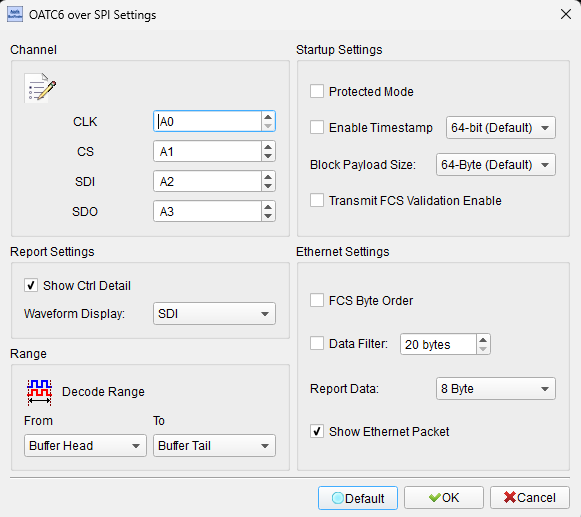
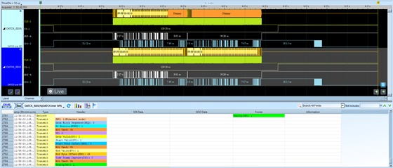

# OATC6 over SPI (OPEN Alliance TC6)

## Decode Settings
<figure markdown>
  
  <figcaption>Decode Settings</figcaption>
</figure>

## Example
<figure markdown>
  
  <figcaption>Decode Example</figcaption>
</figure>

## What is OATC6 over SPI?

OATC6 (OPEN Alliance Technical Committee 6) over SPI refers to the implementation of the OPEN Alliance TC6 Ethernet communication standard using SPI (Serial Peripheral Interface) as the physical transport layer. The OPEN Alliance TC6 specification defines a protocol for transmitting Ethernet frames over media-independent communication interfaces (xMII), specifically designed for automotive and industrial applications where traditional Ethernet PHY connections may be replaced with simpler serial interfaces to reduce wiring complexity, cost, and EMI (electromagnetic interference). The TC6 protocol enables Ethernet communication between microcontrollers and peripherals using existing serial interfaces like SPI, eliminating the need for dedicated Ethernet MACs and PHYs in certain embedded system architectures.

The protocol operates by encapsulating Ethernet frames within SPI transactions, using a defined frame structure that includes headers, Ethernet payload data, optional timestamps, frame check sequences (FCS), and control information for flow control and synchronization. MIPI Alliance introduced the PAL/SPI (Protocol Adaptation Layer over SPI) specification in April 2023, enabling peripheral devices in automotive applications to tunnel control and data information over long-distance automotive SerDes (serializer/deserializer) systems. The TC6-over-SPI approach balances protocol overhead, latency, and throughput considerations for automotive camera, sensor, and display applications where high-speed Ethernet data must coexist with lower-speed control channels on the same physical connection.

OATC6 over SPI is particularly relevant in automotive ADAS (Advanced Driver Assistance Systems), autonomous vehicles, and industrial IoT applications where cameras, LiDAR sensors, radar modules, and display controllers require both high-bandwidth data paths (for video/sensor data) and control channels (for configuration, status, diagnostics). By using SPI—already ubiquitous in embedded systems—as the physical layer, TC6 enables Ethernet connectivity without requiring additional Ethernet hardware, reducing BOM (Bill of Materials) costs and simplifying PCB design. The protocol supports protected mode for control frames, configurable timestamps (32-bit or 64-bit), and flexible payload block sizes (32-bit or 64-bit), providing adaptability to different application requirements and performance/overhead trade-offs.

## Technical Specifications

### Physical Layer (SPI)

**SPI Signal Lines:**
- **CLK (SCLK)**: Serial clock from master
- **CS (Chip Select)**: Active-low chip select
- **SDI (MOSI)**: Serial data input (master-to-slave)
- **SDO (MISO)**: Serial data output (slave-to-master)

**SPI Configuration:**
- **Clock speed**: Variable, typically 1-50 MHz depending on application
- **Clock polarity (CPOL)** and **Phase (CPHA)**: Per TC6 specification
- **Bit order**: MSB-first (Most Significant Bit first)
- **Full-duplex**: Simultaneous bidirectional data transfer

### Frame Structure

**TC6 Frame Format:**

**Header:**
- Start delimiter and frame type indicator
- Length field (Ethernet frame size)
- Control flags (protected mode, timestamp presence)

**Ethernet Payload:**
- Standard Ethernet frame (destination MAC, source MAC, EtherType, payload, FCS)
- Encapsulated within TC6 frame structure

**Footer:**
- Frame Check Sequence (FCS) for data integrity (CRC validation)
- Optional timestamp (32-bit or 64-bit format)
- End delimiter

**Block Payload Sizes:**
- **64-bit blocks**: Higher throughput, more overhead
- **32-bit blocks**: Lower latency, reduced overhead
- Configurable based on application requirements

### Protocol Features

**Protected Mode:**
- Control frames can operate in protected mode
- Ensures reliable delivery of critical control information
- Separate from standard Ethernet data frames

**Timestamping:**
- Optional 32-bit or 64-bit timestamps
- Enables time synchronization and latency measurement
- Important for time-sensitive automotive applications (sensor fusion, ADAS)

**Flow Control:**
- Mechanisms to prevent buffer overflow
- Backpressure signaling between master and slave
- Ensures data integrity under high load

**Error Detection:**
- FCS (Frame Check Sequence) using CRC
- Detects transmission errors and corrupted frames
- Retransmission or error reporting on failure

### Data Rates and Performance

**Throughput:**
- Depends on SPI clock speed and frame overhead
- Example: 25 MHz SPI can achieve ~10-20 Mbps Ethernet throughput (after protocol overhead)
- Higher SPI speeds (50+ MHz) increase throughput proportionally

**Latency:**
- Low latency compared to traditional network stacks
- Suitable for real-time automotive and industrial control applications
- Latency influenced by frame size, SPI clock, and processing delays

## Common Applications

OATC6 over SPI is used in automotive and industrial systems:

**Automotive ADAS and Autonomous Vehicles:**
- Camera module communication (front, rear, surround-view cameras)
- LiDAR sensor data and control
- Radar module interfaces
- Sensor fusion ECUs (Electronic Control Units)
- Display controllers for instrument clusters and infotainment

**Automotive SerDes Systems:**
- Long-distance camera and sensor connections over coaxial or twisted-pair cables
- Serializer/deserializer chips with SPI control channels
- High-speed video/data with embedded control (TC6 for control, MIPI CSI-2 for video)

**Industrial IoT and Automation:**
- Industrial camera systems (machine vision)
- High-speed sensor networks
- Distributed control systems with Ethernet backhaul
- Embedded devices requiring both control and data paths

**Robotics:**
- Vision systems and sensor integration
- Real-time control and telemetry
- Modular robotic components with Ethernet connectivity

**Medical Devices:**
- Imaging equipment with networked cameras
- Diagnostic instrument data aggregation
- Embedded medical device control

**Test and Development:**
- Automotive Ethernet test equipment
- Protocol analyzers and compliance testing
- ECU and sensor module development

## Decoder Configuration

When configuring a logic analyzer to decode OATC6 over SPI signals:

### Channel Assignment

**Minimum Configuration (4 channels):**
- **CLK**: SPI clock
- **CS**: Chip select (active low)
- **SDI (MOSI)**: Master-to-slave data
- **SDO (MISO)**: Slave-to-master data

### SPI Protocol Parameters

**SPI Settings:**
- **Clock polarity (CPOL)**: Check TC6 specification (typically 0 or 1)
- **Clock phase (CPHA)**: Check TC6 specification (typically 0 or 1)
- **Bit order**: MSB-first
- **Clock speed**: Match actual SPI clock frequency

### TC6 Protocol Parameters

**Frame Decoding Options:**
- **Frame type identification**: Ethernet data, control frames, protected mode
- **Header parsing**: Extract length, control flags, timestamp presence
- **Ethernet frame extraction**: Display MAC addresses, EtherType, payload
- **FCS validation**: Check frame check sequence (CRC)
- **Timestamp display**: Show 32-bit or 64-bit timestamps if present
- **Block size**: 32-bit or 64-bit payload blocks

**Display Formats:**
- **Ethernet layer**: Show decoded Ethernet frames (MAC, IP, TCP/UDP if applicable)
- **TC6 layer**: Show TC6 headers, footers, control information
- **Hex/ASCII**: Raw data view for detailed analysis

### Trigger Settings

**Common Trigger Conditions:**
- **CS assertion**: Trigger on chip select (start of SPI transaction)
- **Ethernet frame start**: Trigger on TC6 frame header detection
- **Specific MAC address**: Trigger on frames to/from specific device
- **Error conditions**: Trigger on FCS errors or protocol violations
- **Control frames**: Trigger on protected mode control frames

### Display Options

**Visualization:**
- **Layered decode**: Show SPI physical layer, TC6 protocol layer, Ethernet layer
- **Frame boundaries**: Mark start and end of TC6 frames
- **Timestamp annotation**: Display timestamps for time-sensitive analysis
- **Error highlighting**: Flag FCS errors, framing errors, length mismatches
- **Color coding**: Different colors for control vs. data frames

### Analysis Tips

**Frame Synchronization:**
Ensure proper synchronization to TC6 frame boundaries. Incorrect framing causes all subsequent data to be misinterpreted. Look for frame delimiters and validate FCS.

**SPI Timing Verification:**
Verify SPI clock speed, polarity, and phase match TC6 and device specifications. Timing violations cause bit errors and frame corruption.

**Ethernet Frame Validation:**
Extract Ethernet frames from TC6 encapsulation and validate:
- MAC addresses are correct
- EtherType matches expected protocol (IP, ARP, custom)
- Payload length matches header length field
- Ethernet FCS is valid (if not stripped by TC6)

**Throughput and Overhead Analysis:**
Calculate effective Ethernet throughput by measuring time between frames and accounting for TC6 overhead (headers, footers, timestamps). Compare to theoretical maximum based on SPI clock.

**Timestamp Consistency:**
If timestamps are enabled, verify monotonic increasing timestamps and reasonable values. Check for timestamp rollover (32-bit timestamps wrap after ~4.3 seconds at 1 ns resolution).

**Flow Control Behavior:**
Monitor for backpressure or flow control signaling during high data rates. Verify no frame drops or buffer overflows occur.

**Protected Mode Control Frames:**
Distinguish protected mode control frames from regular Ethernet data. Verify critical control messages are delivered reliably.

**Error Recovery:**
Observe behavior during CRC errors or corrupted frames. Verify retransmission or error reporting mechanisms function correctly.

**Long Captures:**
For automotive applications, capture over extended periods (seconds to minutes) to observe periodic control messages, keep-alives, and error handling under various conditions.

## Reference

- [OPEN Alliance TC6 Specification](https://acutena.com/pages/open-alliance-technical-committee-6-tc6): OATC6 overview
- [MIPI PAL/SPI Specification](https://mipi.org/blog/new-pal-spi-updated-pal-csi-2-extend-options-for-a-phy-in-automotive): Protocol Adaptation Layer over SPI
- [MIPI Alliance: Automotive Sensor Connectivity](https://mipi.org/articles/new-developments-in-mipis-high-speed-automotive-sensor-connectivity-framework): Automotive applications
- [SPI Protocol Basics](https://en.wikipedia.org/wiki/Serial_Peripheral_Interface): SPI fundamentals
- OPEN Alliance Official Documentation - TC6 technical specifications

**Note**: OATC6 over SPI is a relatively recent protocol (2023) for automotive and industrial applications. Refer to the latest OPEN Alliance TC6 and MIPI PAL/SPI specifications for detailed protocol implementation, timing requirements, and compliance testing procedures.
