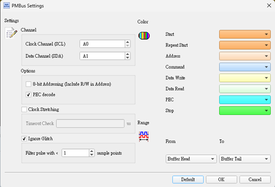
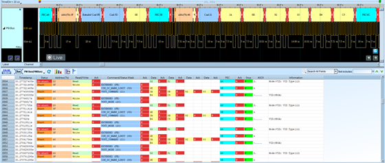
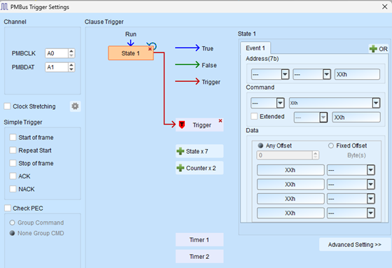
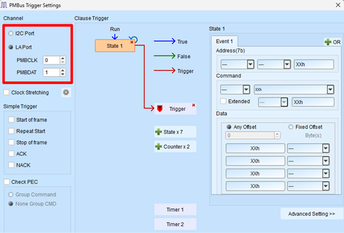
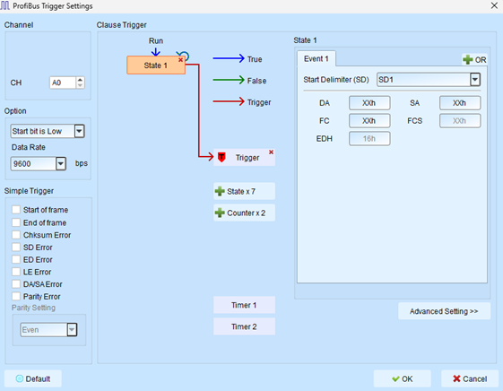

# PMBus

## Decode Settings
<figure markdown>
  
  <figcaption>Decode Settings</figcaption>
</figure>

## Example
<figure markdown>
  
  <figcaption>Decode Example</figcaption>
</figure>
<figure markdown>
  
  <figcaption>Decode Figure</figcaption>
</figure>
<figure markdown>
  
  <figcaption>Decode Figure</figcaption>
</figure>
<figure markdown>
  
  <figcaption>Decode Figure</figcaption>
</figure>

## What is PMBus?

PMBus (Power Management Bus) is an open standard digital communication protocol designed for monitoring, configuration, and control of power conversion devices. Developed by the PMBus Implementers Forum, the specification provides a comprehensive command language for power supplies, voltage regulators, and related power management components. PMBus enables intelligent power system management through standardized commands for reading telemetry, configuring operating parameters, managing faults, and coordinating multiple power supplies within complex systems.

The protocol is built on the SMBus (System Management Bus) specification, which itself is derived from the I2C protocol, providing a proven physical layer with widespread hardware support. PMBus extends SMBus with power-specific commands, data formats, and behaviors tailored to the requirements of power conversion systems. The standard defines over 100 standardized commands covering voltage/current/temperature telemetry, output control, fault reporting, sequencing, margining, and blackbox data logging. PMBus also includes specialized data formats such as Linear11 and Linear16 for efficient representation of electrical quantities with wide dynamic ranges.

PMBus has been widely adopted across computing, telecommunications, and industrial markets as the standard interface for digital power management. The current specification (version 1.4) consists of three parts: Part I defines the transport layer based on SMBus, Part II defines the command language and data formats, and Part III defines AVSBus (Adaptive Voltage Scaling Bus) for high-speed voltage control applications up to 50 MHz. PMBus provides significant advantages over analog control methods including remote configuration, real-time telemetry, fault diagnostics, and coordinated multi-rail power management.

## Technical Specifications

### Physical Layer

PMBus uses SMBus as its physical transport layer, which is based on I2C:

**Signal Lines:**
- **SCL (Serial Clock)**: Clock signal generated by master (host controller)
- **SDA (Serial Data)**: Bidirectional data line
- **SMBALERT# (optional)**: Open-drain alert signal for interrupt-driven fault reporting
- **CONTROL (optional)**: Device-specific control signals

**Electrical Characteristics:**
- **Voltage levels**: 3.3V or 5V logic levels (SMBus-compatible)
- **Pull-up resistors**: Required on SCL, SDA, and SMBALERT# (typically 4.7kΩ to 10kΩ)
- **Drive capability**: Open-drain outputs with passive pull-up
- **Bus capacitance**: Maximum 400 pF

### Data Rate and Timing

PMBus inherits timing specifications from SMBus:
- **Clock frequency**: 10 kHz to 100 kHz (standard), up to 400 kHz (Fast Mode)
- **Typical operation**: 100 kHz clock frequency
- **Timeout**: 35 ms maximum for clock stretching

### Protocol Architecture

**Addressing:**
- **7-bit addressing**: Standard I2C/SMBus addressing (128 possible addresses)
- **Address range**: 0x10 to 0x7F typically used for PMBus devices
- **Multi-master support**: Multiple hosts can control the bus
- **Address assignment**: Fixed or configurable via hardware pins or commands

**Transaction Types:**
- **Write Byte**: Send single-byte command or data
- **Write Word**: Send two-byte data
- **Read Byte**: Read single-byte response
- **Read Word**: Read two-byte response
- **Block Write/Read**: Transfer multiple bytes (up to 255 bytes)
- **Process Call**: Combined write-read transaction

### Data Formats

PMBus defines specialized data formats for representing power-related quantities:

**Linear11 Format:**
- 11-bit mantissa (Y) + 5-bit exponent (N)
- Value calculation: X = Y × 2^N
- Range: ±15.3×10⁻⁶ to ±33.5×10⁶
- Used for: Current, power, temperature (non-voltage telemetry)

**Linear16 Format:**
- 16-bit mantissa + separate exponent register
- Greater precision for output voltage measurements
- Exponent shared across related measurements

**Direct Format:**
- Linear real-world representation: X = (1/m) × (Y - b)
- Coefficients m (slope) and b (offset) defined per manufacturer
- Provides application-optimized resolution

**Unsigned Integer:**
- 8-bit or 16-bit unsigned values
- Used for percentages, counters, and enumerated settings

### Command Set

PMBus defines over 100 standard commands organized by function:

**Output Control:**
- OPERATION: Enable/disable output
- ON_OFF_CONFIG: Configure turn-on/turn-off behavior
- VOUT_COMMAND: Set output voltage
- VOUT_MARGIN_HIGH/LOW: Set voltage margining limits

**Telemetry:**
- READ_VOUT: Output voltage
- READ_IOUT: Output current
- READ_TEMPERATURE_1/2/3: Temperature sensors
- READ_VIN: Input voltage
- READ_PIN: Input power

**Limit Configuration:**
- VOUT_OV_FAULT_LIMIT: Overvoltage fault threshold
- IOUT_OC_FAULT_LIMIT: Overcurrent fault threshold
- OT_FAULT_LIMIT: Overtemperature fault threshold

**Status and Fault:**
- STATUS_WORD: Summary status register
- STATUS_VOUT: Output voltage status
- STATUS_IOUT: Output current status
- STATUS_TEMPERATURE: Temperature status
- CLEAR_FAULTS: Clear latched fault conditions

**Identification:**
- PMBUS_REVISION: Protocol version
- MFR_ID: Manufacturer identification
- MFR_MODEL: Device model number
- MFR_SERIAL: Serial number

## Common Applications

PMBus is implemented across diverse power management applications:

- **Server power supplies**: Rack-mount and blade server power distribution
- **Telecommunications equipment**: Base stations and central office power systems
- **Data center infrastructure**: Power distribution units and busway monitoring
- **Storage systems**: SAN, NAS, and storage array power management
- **Networking equipment**: Switches, routers, and optical transport systems
- **Computing platforms**: Workstations, desktops, and embedded systems
- **Point-of-load regulators**: Distributed power architecture for processors and ASICs
- **Battery chargers**: Intelligent charging systems with telemetry
- **Solar inverters**: Renewable energy power conversion monitoring
- **Industrial power supplies**: Factory automation and process control
- **Medical equipment**: Precision-regulated medical device power systems
- **Test and measurement**: Programmable power supplies and electronic loads
- **LED lighting**: Intelligent driver control and monitoring
- **Motor drives**: Variable frequency drives and servo controllers
- **Automotive systems**: High-voltage power conversion in electric vehicles
- **Rack-mounted equipment**: Any 19-inch rack equipment with digital power management

## Decoder Configuration

When configuring a logic analyzer to decode PMBus signals:

### Channel Assignment

- **SCL (Serial Clock)**: Assign to PMBus clock line
- **SDA (Serial Data)**: Assign to PMBus data line
- **SMBALERT# (optional)**: Assign if monitoring fault alerts

All signals should be probed at the device pins or along the bus traces. Ensure proper ground connection to the system ground.

### Protocol Parameters

- **Protocol**: Select PMBus (or SMBus/I2C if PMBus-specific decoding unavailable)
- **Clock frequency**: Set to expected frequency (typically 100 kHz)
- **Address display**: Enable 7-bit address format
- **Data format**: Configure for byte, word, and block transactions

### Decoding Options

- **Command decoding**: Display PMBus command names (READ_VOUT, VOUT_COMMAND, etc.)
- **Data format interpretation**: Decode Linear11, Linear16, and Direct formats to real values
- **Unit conversion**: Show voltage in V, current in A, temperature in °C
- **Status register decoding**: Parse STATUS_WORD bits into individual fault flags
- **Address labels**: Assign device names to addresses for clarity
- **SMBALERT# correlation**: Show which device asserted the alert signal

### Trigger Configuration

- **Start condition**: Trigger on I2C/SMBus start condition
- **Device address**: Trigger on specific PMBus device address
- **Command code**: Trigger on specific PMBus commands (e.g., READ_VOUT)
- **SMBALERT#**: Trigger when alert signal is asserted
- **Data value**: Trigger when telemetry exceeds threshold
- **Write operations**: Trigger on VOUT_COMMAND or other configuration changes

### Analysis Tips

When analyzing PMBus communications:

1. **Identify device addresses**: Capture bus traffic during initialization to map addresses to devices
2. **Monitor polling intervals**: Observe telemetry read command frequency (typically 100ms to 1s)
3. **Verify ACK/NAK**: Ensure devices acknowledge commands properly
4. **Check CRC/PEC**: If Packet Error Checking is enabled, verify CRC bytes
5. **Correlate SMBALERT#**: When alert asserts, look for subsequent STATUS_WORD reads
6. **Watch for clock stretching**: PMBus devices may hold SCL low while preparing data
7. **Decode blackbox data**: Block read transactions may contain logged fault information

### Common Issues to Look For

- **Missing ACK**: Device not responding (wrong address, powered off, or fault condition)
- **Bus contention**: Multiple devices driving SDA simultaneously (addressing conflict)
- **Timeout**: Device holds SCL low beyond 35ms (firmware issue or busy condition)
- **Invalid data format**: Incorrect Linear11/Linear16 coefficient interpretation
- **Repeated retries**: Host retrying commands due to NAK or timeout

## Reference

- [PMBus Specifications (Current and Archive)](https://pmbus.org/current-specifications/)
- [SMBus Specification v3.3.1](https://smbus.org/specs/)
- [PMBus Introduction and Overview](https://pmbus.org/wp-content/uploads/2017/07/introduction_to_pmbus.pdf)
- [PMBus Implementers Forum FAQ](https://pmbus.org/resources/faq/)
