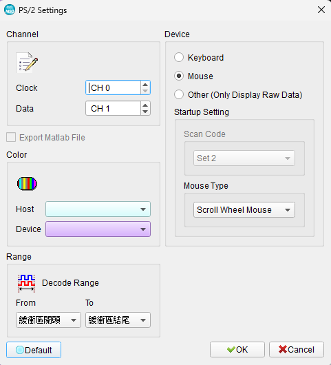
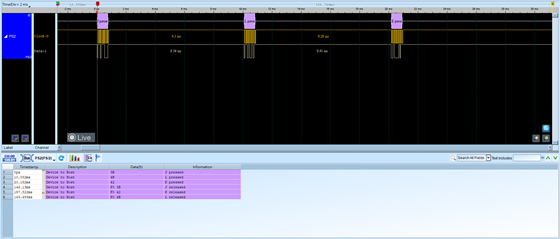
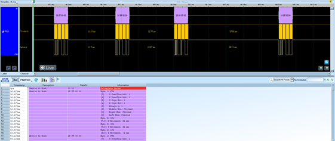
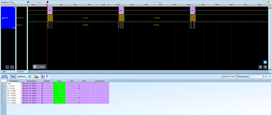

# PS/2

## Decode Settings
<figure markdown>
  
  <figcaption>Decode Settings</figcaption>
</figure>

## Example
<figure markdown>
  
  <figcaption>Decode Example</figcaption>
</figure>
<figure markdown>
  
  <figcaption>Decode Figure</figcaption>
</figure>
<figure markdown>
  
  <figcaption>Decode Figure</figcaption>
</figure>

## What is PS/2?

PS/2 (Personal System/2) is a synchronous serial communication protocol developed by IBM in 1987 for connecting keyboards and mice to computers. Introduced with the IBM Personal System/2 series, the PS/2 interface replaced the larger 5-pin DIN keyboard connector used in the IBM PC/AT and the DE-9 RS-232 serial mouse connector. The protocol uses a 6-pin mini-DIN connector and became the de facto standard for keyboard and mouse connections on personal computers for over two decades.

The PS/2 protocol is a bidirectional synchronous serial interface using two main signal lines: Data and Clock. Communication normally flows from the peripheral device to the host computer, with the host controlling the communication direction by manipulating the Clock line. The protocol transmits data in 11-bit frames at a clock frequency of 10-16.7 kHz, providing reliable communication for human interface devices with minimal latency and CPU overhead.

While largely superseded by USB in modern computers, PS/2 interfaces remain relevant in several contexts. Many motherboards continue to include PS/2 ports for legacy compatibility, industrial systems rely on PS/2 for its simplicity and deterministic timing, and enthusiast mechanical keyboard users prefer PS/2 for full n-key rollover capabilities. Additionally, PS/2 remains important for embedded systems, BIOS-level operations where USB drivers are unavailable, and KVM (Keyboard-Video-Mouse) switches.

## Technical Specifications

### Physical Interface

The PS/2 connector uses a 6-pin mini-DIN configuration, with some keyboards using a 5-pin DIN variant. Both connector types are electrically identical and interchangeable with simple adapters. The connector pinout is:

- **Pin 1**: Data
- **Pin 2**: Not connected (or reserved)
- **Pin 3**: Ground
- **Pin 4**: +5V DC power (up to 275 mA)
- **Pin 5**: Clock
- **Pin 6**: Not connected (or reserved)

Cables typically contain four to six 26 AWG wires with mylar foil shielding and are usually about 1.8 meters (6 feet) in length. Standard color coding uses purple for keyboards and green for mice, though the ports are electrically similar and differ only in their device drivers and command sets.

### Communication Protocol

PS/2 uses bidirectional synchronous serial communication with the following timing characteristics:

- **Clock frequency**: 10-16.7 kHz
- **T1** (Data to CLK falling edge): 5-25 μs
- **T2** (CLK rising to data): 5 μs to T4-5 μs
- **T3** (CLK high time): 30-50 μs
- **T4** (CLK low time): 30-50 μs
- **T5** (Inhibit time): 0-50 μs

Data must be stable within 1 microsecond after the rising edge of the clock signal. The host can inhibit device transmission by holding the Clock line low, providing flow control and preventing data collisions.

### Data Frame Format

Each transmission consists of an 11-bit frame:

- **Bit 0**: Start bit (always 0)
- **Bits 1-8**: Data byte (LSB first)
- **Bit 9**: Parity bit (odd parity)
- **Bit 10**: Stop bit (always 1)

The device generates the clock signal during transmission, clocking data on the falling edge. The host samples data on the rising edge of the clock. For host-to-device communication, the host requests bus control by pulling Clock low for at least one clock period.

## Common Applications

PS/2 interfaces are used in various computing and embedded applications:

- **Desktop computers**: Keyboard and mouse connections on legacy and modern motherboards
- **Industrial PCs**: Reliable human interface device connectivity in factory automation
- **Point-of-sale systems**: Barcode scanner keyboards and input devices
- **Embedded systems**: Simple keyboard/mouse interfaces without USB complexity
- **KVM switches**: Multi-computer control systems for data centers and server rooms
- **BIOS and firmware**: Pre-boot keyboard access before USB drivers load
- **Mechanical keyboards**: Enthusiast keyboards utilizing full n-key rollover capabilities
- **Medical equipment**: Sealed keyboards for sterile environments
- **Gaming**: Older gaming peripherals and legacy game systems
- **Test equipment**: Diagnostic tools and development systems requiring PS/2 protocol analysis
- **Security systems**: Access control keypads and secure input devices
- **Thin clients**: Minimal computing devices with basic input requirements

## Decoder Configuration

When configuring a logic analyzer to decode PS/2 signals:

### Channel Assignment

- **Clock (CLK)**: Assign to PS/2 clock line (Pin 5)
- **Data (DATA)**: Assign to PS/2 data line (Pin 1)

Both signals can be probed at the connector pins or along the cable. Ensure proper grounding by connecting the logic analyzer ground to Pin 3 of the PS/2 connector.

### Protocol Parameters

- **Clock frequency**: Set expected range to 10-16.7 kHz
- **Data format**: 11-bit frame (1 start + 8 data + 1 parity + 1 stop)
- **Bit order**: LSB first (least significant bit transmitted first)
- **Parity**: Odd parity on bit 9

### Decoding Options

- **Frame display**: Show complete 11-bit frames with start, data, parity, and stop bits
- **Data byte view**: Display only the 8-bit data value in hexadecimal
- **Parity checking**: Verify odd parity and flag errors
- **Scan code interpretation**: Decode keyboard scan codes to readable key names (for keyboard devices)
- **Mouse packet decoding**: Parse mouse movement and button data (for mouse devices)

### Trigger Configuration

- **Start bit**: Trigger on Data line going low while Clock is high
- **Specific scan code**: Trigger when a particular keyboard key is pressed
- **Clock edge**: Trigger on falling or rising edges of the Clock line
- **Transmission start**: Trigger when device begins sending data

### Analysis Tips

When analyzing PS/2 communications, monitor both device-to-host and host-to-device transmissions. Device-to-host is the common direction for keyboard scan codes and mouse movements. Host-to-device commands include LED control (keyboard), sample rate changes (mouse), and device resets. The host can inhibit device transmission by holding Clock low, which should be visible in the capture. Look for the specific timing requirements, especially the data stability window around Clock edges.

## Reference

- [Wikipedia: PS/2 port](https://en.wikipedia.org/wiki/PS/2_port)
- [The PS/2 Mouse/Keyboard Protocol](https://www.burtonsys.com/ps2_chapweske.htm)
- [PS/2 Keyboard Interface Specification](https://www.networktechinc.com/ps2-prots.html)
- [IBM Personal System/2 Hardware Interface Technical Reference](https://bitsavers.org/pdf/ibm/pc/ps2/Personal_System_2_Hardware_Interface_Technical_Reference_May88.pdf)
