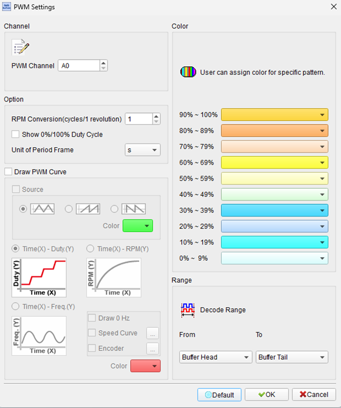
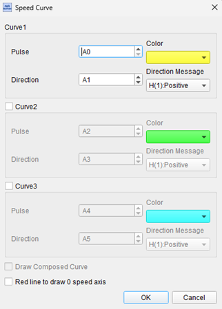
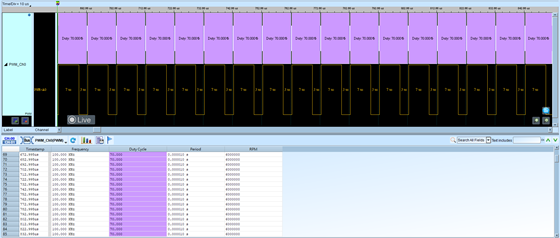
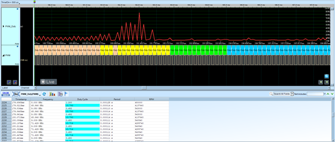
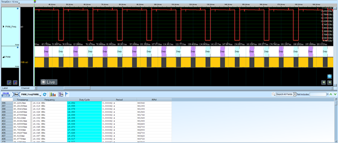
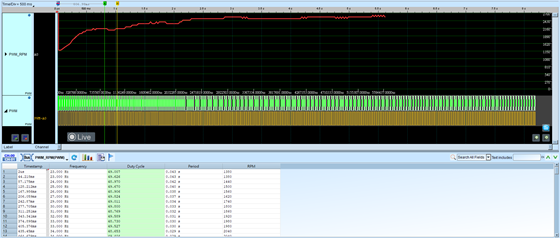

# PWM (Pulse Width Modulation)

## Decode Settings
<figure markdown>
  
  <figcaption>Decode Settings</figcaption>
</figure>

## Example
<figure markdown>
  
  <figcaption>Decode Example</figcaption>
</figure>
<figure markdown>
  
  <figcaption>Decode Figure</figcaption>
</figure>
<figure markdown>
  
  <figcaption>Decode Figure</figcaption>
</figure>
<figure markdown>
  
  <figcaption>Decode Figure</figcaption>
</figure>
<figure markdown>
  
  <figcaption>Decode Figure</figcaption>
</figure>

## What is PWM?

### Overview

Pulse Width Modulation (PWM) is a technique for controlling the average power delivered to an electrical load by rapidly switching between fully-on and fully-off states. Rather than varying voltage levels continuously (analog control), PWM maintains constant voltage levels but varies the proportion of time the signal spends in the "on" state versus the "off" state within each cycle. This ratio, called the duty cycle, directly determines the effective average power delivered to the load. A 75% duty cycle means the signal is high (on) for 75% of each period and low (off) for 25%, delivering 75% of the maximum power.

PWM has become ubiquitous in modern electronics because it combines simplicity, efficiency, and compatibility with digital control systems. Switching devices (transistors, MOSFETs) operating in full saturation (on) or complete cutoff (off) experience minimal power dissipation—virtually no current flows when off, and negligible voltage drop occurs when fully on—resulting in efficiencies often exceeding 90-95%. This contrasts sharply with analog voltage regulation where linear devices dissipate significant power as heat. Additionally, PWM's binary on/off nature aligns perfectly with digital control from microcontrollers, enabling precise, digitally-programmable control without requiring complex digital-to-analog converters.

### Historical Context

While PWM principles date back to early electrical engineering, the technique gained prominence with the advent of solid-state switching devices (transistors, then MOSFETs and IGBTs) that could switch rapidly with minimal losses. Modern microcontrollers universally include hardware PWM generators producing precise waveforms without software overhead, typically supporting 4-16 PWM channels per chip. The technique has evolved from simple on-off control to sophisticated algorithms including space-vector modulation for three-phase motor control and advanced LED dimming curves for human-perceived linear brightness.

## Technical Specifications

### Key Parameters

**Duty Cycle** (most important parameter):
- Expressed as percentage: 0% (always off) to 100% (always on)
- 50% duty cycle: Equal on and off times
- Determines effective power/voltage delivered
- Linearly related to average voltage in many applications

**Frequency** (PWM carrier frequency):
- Application-dependent, from Hz to MHz
- **Low frequency** (0.1-100 Hz): Electric heaters, thermal systems with high inertia
- **Medium frequency** (100 Hz - 20 kHz): DC motor control, LED dimming, analog simulation
- **High frequency** (20 kHz - 500 kHz): Switch-mode power supplies, Class-D audio amplifiers
- **Very high frequency** (>500 kHz): RF applications, resonant converters

**Period** (T):
- Time for one complete cycle: T = 1 / Frequency
- Example: 1 kHz PWM has 1ms period

**Pulse Width** (t_on):
- Duration signal is high in each cycle
- t_on = Duty Cycle × Period
- Example: 75% duty cycle at 1 kHz = 0.75ms on-time

### Frequency Selection Considerations

**Too Low**: Visible flicker (LEDs), audible noise (motors), slow response, large filter components

**Too High**: Increased switching losses, electromagnetic interference (EMI), reduced efficiency, difficult to filter

**Optimal Ranges**:
- **LED Dimming**: 200 Hz - 20 kHz (above human flicker fusion threshold ~50-90 Hz)
- **Motor Control**: 4-16 kHz (above audible range 20 kHz, but practical limits)
- **Power Supplies**: 50-500 kHz (balances efficiency, component size, EMI)
- **Audio (Class-D)**: 250-500 kHz (well above 20 kHz audible range, allows filtering)

## Applications by Domain

### LED Dimming and Lighting Control

**Advantages for LEDs**:
- LEDs respond instantaneously to current changes
- No color shift with brightness (unlike analog dimming)
- Wide dimming range (0.1% to 100%)
- High efficiency maintained across brightness levels

**Implementation**:
- **High-frequency** PWM (200 Hz - 20 kHz): Smooth, flicker-free to human perception
- **Current control**: PWM modulates LED driver current
- **RGB mixing**: Three independent PWM channels create millions of colors
- **Gradual fading**: Slowly changing duty cycle creates smooth transitions

### Motor Control

**DC Motors**:
- Speed control proportional to duty cycle
- Direction control via H-bridge configuration
- Dynamic braking using short-circuited PWM phases
- Soft-start reduces mechanical stress and inrush current

**Servo Motors**:
- Position control via pulse width (typically 1-2ms pulse, 50 Hz frequency)
- 1ms = full left, 1.5ms = center, 2ms = full right
- Industry-standard hobby servo protocol

**Brushless DC (BLDC) Motors**:
- Three-phase control requires three synchronized PWM signals
- Commutation based on rotor position feedback
- Electronic speed controllers (ESC) in drones, e-vehicles

**Stepper Motors**:
- Microstepping using PWM varies current to achieve fractional steps
- Smoother motion and reduced resonance vs. full stepping

### Power Regulation

**Switch-Mode Power Supplies**:
- PWM controls switching transistor on-time
- Feedback loop adjusts duty cycle to maintain regulated output
- Buck, boost, buck-boost topologies
- High efficiency (80-95% typical) vs. linear regulators (often <50%)

**Battery Charging**:
- PWM modulates charging current
- Reduces to trickle charge near full capacity
- Thermal management through duty cycle reduction

### Audio Amplification

**Class-D Amplifiers**:
- Audio signal encoded as PWM waveform at high carrier frequency (250-1000 kHz)
- Switching amplifier operates at high efficiency (85-90% vs. 50-70% for Class AB)
- Low-pass filter reconstructs analog audio
- Popular in portable devices, home theaters, automotive audio

### Communication and Signaling

**Analog Value Transmission**:
- PWM encodes analog values for digital transmission
- Receiver low-pass filters to recover analog equivalent
- Immune to voltage drops over long wires (only timing matters)

**RC Servo Control**:
- Standard 50 Hz PWM with 1-2ms pulse width
- Used in robotics, RC vehicles, model aircraft
- Simple interface from microcontroller GPIO

## PWM Generation Methods

**Hardware PWM** (Dedicated timers in microcontrollers):
- Precise timing, no CPU overhead
- Multiple independent channels
- Hardware deadtime insertion for H-bridges
- Center-aligned or edge-aligned modes

**Software PWM** (Bit-banging with timers):
- Flexible but consumes CPU cycles
- Limited accuracy and channel count
- Suitable for non-critical applications

**External PWM ICs**:
- Dedicated PWM generator ICs (e.g., PCA9685 for 16-channel LED control)
- Offload PWM generation from microcontroller
- I²C or SPI controlled

## Decoder Analysis Features

When analyzing PWM with a logic analyzer:

**Measurements**:
- **Duty Cycle**: Calculate percentage of high time vs. period
- **Frequency**: Determine carrier frequency from period measurement
- **Pulse Width**: Measure absolute on-time (t_on)
- **Period**: Measure time for one complete cycle

**Display Options**:
- **Waveform View**: Show actual PWM signal transitions
- **Percentage View**: Display duty cycle as numeric percentage overlay
- **Frequency View**: Show instantaneous or average frequency
- **Statistical Analysis**: Min/max/mean duty cycle over time

**Advanced Features**:
- **Jitter Analysis**: Measure timing variation between cycles
- **Ramp/Step Reconstruction**: Convert PWM back to equivalent analog waveform
- **Color Coding**: Visual indicators for different duty cycle ranges

## Decoder Configuration

When configuring a PWM decoder:

- **Signal Channel**: Assign logic analyzer channel to PWM signal
- **Frequency Range**: Specify expected PWM frequency (for filtering)
- **Duty Cycle Resolution**: Set measurement precision
- **Edge Detection**: Configure rising/falling edge trigger levels
- **Display Units**: Select percentage, microseconds, or frequency display
- **Averaging**: Enable averaging over multiple cycles for stable readings
- **Visualization**: Choose waveform overlay, numeric display, or reconstructed analog

## Common Applications

PWM is found everywhere in electronics:

**Consumer Electronics**:
- Laptop/phone display brightness control
- Cooling fan speed control
- Vibration motor control (haptics)
- Battery charging circuits

**Automotive**:
- Engine fuel injector control
- Radiator fan speed
- Instrument cluster backlighting
- Seat heaters

**Robotics**:
- Motor speed and torque control
- Servo positioning
- Gripper force control

**Industrial**:
- Variable frequency drives (VFDs)
- Welding equipment
- Heating elements
- Pump and blower control

**Home Automation**:
- Smart dimmer switches
- Thermostat-controlled heating
- Pool pump controllers
- Appliance motor control

## Advantages

- **High Efficiency**: Minimal power loss in switching elements
- **Digital Control**: Natural fit for microcontroller control
- **Wide Range**: 0-100% control range
- **Precise**: Digital timing provides accuracy
- **Low Noise**: Clean switching vs. analog ripple (after filtering)
- **Cost Effective**: Uses simple switching transistors
- **Simple Hardware**: No DAC or analog circuitry required

## Disadvantages

- **EMI**: Fast switching generates electromagnetic interference
- **Filtering Required**: Some applications need low-pass filtering
- **Audible Noise**: Motors and inductors can produce noise at PWM frequency
- **Resolution Limited**: Limited by timer resolution and frequency
- **Harmonic Content**: High-frequency harmonics require careful filtering

## Reference

- [SparkFun: Pulse Width Modulation](https://learn.sparkfun.com/tutorials/pulse-width-modulation)
- [Infineon: PWM Dimming Control](https://www.infineon.com/dgdl/Infineon-Whitepaper_lighting_ICs_XDP_digital_power_-_dimming_control_using_a_PWM_signal-WP-v01_00-EN.pdf)
- [PCB Cadence: PWM LEDs for Dimming Systems](https://resources.pcb.cadence.com/blog/2020-pwm-leds-pulse-width-modulation-for-dimming-systems-and-other-applications)
- [PCB Cadence: PWM Characteristics and Effects](https://resources.pcb.cadence.com/blog/2020-pulse-width-modulation-characteristics-and-the-effects-of-frequency-and-duty-cycle)
- [Texas Instruments: PWM Application Notes](https://www.ti.com/lit/pdf/sszt647)
