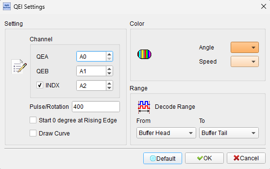
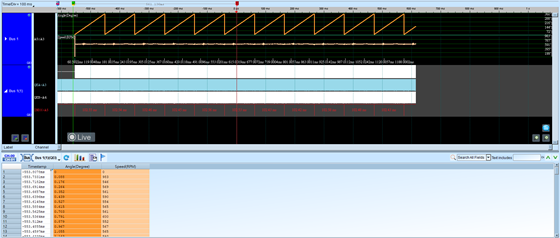
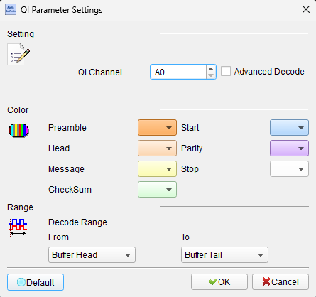
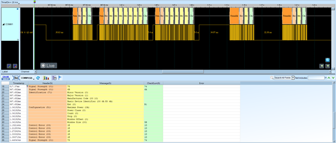

# QEI (Quadrature Encoder Interface)


## Decode Settings
<figure markdown>
  
  <figcaption>Decode Settings</figcaption>
</figure>

## Example
<figure markdown>
  
  <figcaption>Decode Example</figcaption>
</figure>
<figure markdown>
  
  <figcaption>Decode Figure</figcaption>
</figure>
<figure markdown>
  
  <figcaption>Decode Figure</figcaption>
</figure>

## What is QEI?

### Overview

QEI (Quadrature Encoder Interface) is a hardware interface and decoding method used to interpret signals from rotary or linear incremental encoders that produce two square-wave outputs in quadrature (90 degrees out of phase). These encoders are widely used in motor control systems, robotics, CNC machines, and user interface devices (rotary knobs, scroll wheels) to measure position, speed, and direction of rotation or linear motion. The quadrature relationship between the two signals (conventionally labeled A and B or CHA and CHB) allows the decoder to determine not only the amount of movement but also the direction, providing essential feedback for closed-loop control systems.

The fundamental principle of quadrature encoding is that when the encoder shaft rotates or moves, it generates two pulse trains (A and B) that are offset by 90 electrical degrees. By examining which signal leads or lags the other, the direction of motion can be determined: if A leads B, rotation is in one direction (typically clockwise), and if B leads A, rotation is in the opposite direction (counterclockwise). Each transition on either signal represents a fractional rotation or linear displacement, and by counting these transitions, the system can track absolute position changes from a reference point. Many encoders also provide an Index (Z) signal that pulses once per revolution, allowing the system to establish an absolute zero position reference.

QEI decoding can be implemented in software, dedicated hardware peripherals in microcontrollers, or external decoder ICs. Hardware QEI modules typically provide automatic edge detection on both signals, direction determination, position counting (up/down), velocity measurement, and index pulse handling. This offloads the CPU from real-time signal processing and ensures no counts are missed even at high encoder speeds. QEI has become a standard feature in motor control microcontrollers, industrial PLCs, servo drives, and motion control systems due to its reliability, simplicity, and cost-effectiveness compared to absolute encoder alternatives.

### Key Features

- **Quadrature Decoding**: Two signals 90° out of phase for direction detection
- **Bidirectional**: Detects forward and reverse motion
- **Position Tracking**: Incremental position counting from reference
- **Velocity Measurement**: Speed calculation from pulse frequency
- **Index Pulse Support**: Zero reference once per revolution (optional)
- **Edge Detection**: Counts on rising/falling edges (1×, 2×, or 4× decoding)
- **Hardware Acceleration**: Dedicated peripherals in MCUs
- **Noise Immunity**: Differential signaling in many implementations
- **High Resolution**: Pulse count per revolution (PPR) from 100 to 10,000+
- **Industry Standard**: Widely supported in motion control systems

## Technical Specifications

### Signal Description

**Primary QEI Signals** (2 or 3 signals)

- **CHA / Phase A**: First quadrature channel (square wave output)
- **CHB / Phase B**: Second quadrature channel (90° phase offset from A)
- **Index / Z** (optional): Index pulse, one pulse per revolution

**Signal Characteristics**
- **Output Type**: Push-pull (single-ended) or differential (A+/A-, B+/B-)
- **Voltage Levels**: 
  - TTL: 0V/5V
  - CMOS: 0V/3.3V or 0V/5V
  - Differential: RS-422 (±2V typical)
- **Frequency Range**: DC to several MHz (encoder and application dependent)
- **Duty Cycle**: Nominally 50%, but varies with encoder design

### Quadrature Relationship

**Phase Relationship**

The two channels are offset by 90 electrical degrees:
```
Clockwise (CW) Rotation - A leads B:
CHA:  ____|‾‾‾‾‾|_____|‾‾‾‾‾|_____|‾‾‾‾‾|_____
CHB:  ‾‾|_____|‾‾‾‾‾|_____|‾‾‾‾‾|_____|‾‾‾‾‾
      ↑     ↑     ↑     ↑  (A transitions before B)

Counter-Clockwise (CCW) Rotation - B leads A:
CHA:  ____|‾‾‾‾‾|_____|‾‾‾‾‾|_____|‾‾‾‾‾|_____
CHB:  ‾‾‾‾‾|_____|‾‾‾‾‾|_____|‾‾‾‾‾|_____|‾‾
            ↑     ↑     ↑     ↑  (B transitions before A)
```

**State Machine**

The quadrature decoder follows a state sequence:
```
CW:  00 → 10 → 11 → 01 → 00 (Gray code sequence)
CCW: 00 → 01 → 11 → 10 → 00 (Reverse sequence)
```

Any other transition indicates an error or invalid state.

### Decoding Modes

**1× Decoding (Single Edge)**
- Count on rising edge of CHA only
- 1 count per full quadrature cycle
- Lowest resolution, simplest

**2× Decoding (Both Edges of One Channel)**
- Count on rising and falling edges of CHA
- 2 counts per full quadrature cycle
- Medium resolution

**4× Decoding (Quadrature Mode)**
- Count on all edges of both CHA and CHB
- 4 counts per full quadrature cycle
- Highest resolution, most common
- Best noise rejection

**Resolution Calculation**
```
Effective Resolution = Encoder PPR × Decoding Mode
```
Example: 1000 PPR encoder with 4× decoding = 4000 counts/revolution

### Index Pulse (Z Signal)

**Purpose**
- Provides one pulse per revolution (or per unit of linear travel)
- Allows establishing absolute zero reference
- Synchronizes position to known mechanical position

**Characteristics**
- **Pulse Width**: Typically narrower than A/B pulses (90° or less)
- **Alignment**: Often aligned to specific A/B state (e.g., A and B both high)
- **Use Case**: Homing, zero position calibration

### Velocity Measurement

**Pulse Frequency Method**
```
Velocity (RPM) = (Count_Rate / PPR) × 60
```
Where Count_Rate is counts per second.

**Time-Between-Pulses Method**
- Measure time between edges
- More accurate at low speeds
- Less quantization error

### Encoder Types

**Optical Encoders**
- LED and photodetector with slotted disk
- High accuracy and resolution
- Common in precision applications

**Magnetic Encoders**
- Hall effect or magnetoresistive sensors
- Robust, resistant to dust and vibration
- Common in automotive and industrial

**Mechanical (Contact) Encoders**
- Brush contacts on conductive segments
- Lower resolution, used in user interfaces
- Examples: rotary knobs, mouse scroll wheels

## Common Applications

**Motor Control**
- Servo motor feedback (position and velocity)
- Stepper motor position verification
- Brushless DC (BLDC) motor commutation
- Industrial motor drives
- Robotic joint position sensing

**Robotics**
- Wheel odometry (mobile robots)
- Manipulator joint angle sensing
- End-effector position feedback
- AGV (Automated Guided Vehicle) navigation
- Collaborative robot (cobot) safety systems

**CNC and Machine Tools**
- Axis position feedback
- Spindle speed monitoring
- Tool position sensing
- Leadscrew position tracking
- Multi-axis coordinate systems

**Automotive**
- Throttle position sensing
- Steering angle sensors
- Transmission position sensing
- ABS wheel speed sensors
- Electric power steering feedback

**Industrial Automation**
- Conveyor belt position tracking
- Packaging machine control
- Printing press synchronization
- Material handling systems
- Assembly line automation

**Consumer Electronics**
- Volume control knobs (audio equipment)
- Scroll wheels (mice, trackpads)
- Tuning dials (radios)
- Camera lens position (autofocus)
- Gaming controllers (analog sticks)

**Measurement and Instrumentation**
- Linear position measurement
- Rotary position sensing
- Tension control systems
- Length measurement (wire, cable, fabric)
- Vibration analysis

## Decoder Configuration

When analyzing QEI signals with a logic analyzer, configure the following parameters:

### Signal Connections

**Minimum Configuration** (2 channels)
- CHA / Phase A
- CHB / Phase B

**With Index** (3 channels)
- CHA / Phase A
- CHB / Phase B
- Index / Z

**Differential Signals** (4 or 6 channels)
- CHA+, CHA- (differential pair for A)
- CHB+, CHB- (differential pair for B)
- Optional: Index+, Index- (differential index)

### Sampling Requirements

- **Minimum Sample Rate**: 10× the maximum expected edge rate
- For 1000 PPR at 6000 RPM: Max frequency = (1000 × 6000) / 60 = 100 kHz
  - With 4× decoding: Effective 400 kHz edge rate
  - Minimum sample rate: 4 MS/s
- **Recommended**: 10-50 MS/s for most encoder applications
- **High-Speed**: 100+ MS/s for very high RPM or high PPR encoders

### Decoder Parameters

- **Decoding Mode**: 1×, 2×, or 4× (quadrature)
- **Encoder PPR**: Pulses per revolution (or pulses per unit for linear)
- **Count Direction**: Specify CW increment or CCW increment
- **Initial Count**: Starting position value (typically 0)
- **Index Behavior**: Reset on index, capture position on index, or ignore
- **Edge Polarity**: Rising, falling, or both edges
- **Maximum RPM**: For velocity calculation range

### Display Options

- Show position count (up/down based on direction)
- Display direction indicator (CW/CCW or Forward/Reverse)
- Calculate and show velocity (RPM or linear speed)
- Annotate state transitions (00, 01, 11, 10)
- Highlight index pulses and position resets
- Display encoder angle (if PPR known)
- Show invalid state transitions (errors)

### Trigger Settings

- Trigger on CHA or CHB edge
- Trigger on specific position count
- Trigger on direction change
- Trigger on index pulse
- Trigger on invalid state transition (error detection)
- Trigger on velocity threshold

### Analysis Tips

1. **Verify Quadrature Relationship**
   - Check 90° phase offset between A and B
   - Measure actual phase relationship (should be close to 90°)
   - Poor phase relationship indicates encoder alignment issues

2. **Check Direction**
   - Rotate encoder CW, verify A leads B
   - Rotate encoder CCW, verify B leads A
   - Incorrect leads suggest wiring swap or reversed rotation sense

3. **Count Accuracy**
   - Rotate encoder one full revolution
   - Count should equal PPR × decoding mode
   - Example: 360 PPR, 4× decoding = 1440 counts per rev
   - Verify count returns to initial value after full rotation

4. **Validate Index Pulse**
   - Check for exactly one index pulse per revolution
   - Verify index alignment with A/B state (typically A=1, B=1)
   - Confirm consistent index position across multiple revolutions

5. **Velocity Measurement**
   - Calculate RPM from edge frequency
   - Compare to known motor speed (if available)
   - Check for velocity consistency

6. **Look for Noise and Glitches**
   - Short spikes or bounces can cause false counts
   - Differential signaling reduces noise susceptibility
   - Check for ringing on transitions

7. **State Machine Validation**
   - Ensure state sequence follows Gray code (only 1 bit changes)
   - Invalid transitions (e.g., 00→11 or 01→10) indicate errors
   - Common with noise, mechanical vibration, or loose connections

### Common Issues

**No Quadrature / Random States**
- **Symptom**: States don't follow proper sequence
- **Cause**: One channel not connected, signal integrity issues
- **Solution**: Verify both A and B connected, check signal quality

**Count Drifting / Accumulating Errors**
- **Symptom**: Position count doesn't return to zero after full rotation
- **Cause**: Noise, missed edges, invalid state transitions
- **Solution**: Add filtering, use differential signaling, check mechanical coupling

**Wrong Direction Detection**
- **Symptom**: Direction opposite of expected
- **Cause**: A and B channels swapped
- **Solution**: Swap A and B connections or invert direction in software

**Velocity Unstable**
- **Symptom**: Calculated velocity fluctuates wildly
- **Cause**: Low sample rate, quantization at low speeds
- **Solution**: Use time-between-edges method at low speed, increase sample rate

**Index Pulse Issues**
- **Symptom**: Multiple or missing index pulses per revolution
- **Cause**: Mechanical misalignment, damaged encoder disk
- **Solution**: Check encoder mounting, verify disk integrity

**Bouncing / Contact Chatter**
- **Symptom**: Multiple transitions for single mechanical detent (mechanical encoders)
- **Cause**: Contact bounce in mechanical encoders
- **Solution**: Debounce in software, use optical encoder

**High-Speed Overrun**
- **Symptom**: Missed counts at high RPM
- **Cause**: Sample rate too low, decoder can't keep up
- **Solution**: Increase sample rate, use hardware QEI peripheral, reduce RPM

### Advanced Analysis

**Phase Accuracy Measurement**
- Measure actual phase difference between A and B
- Should be 90° ± tolerance (typically ±5-10°)
- Deviation indicates encoder quality issues or misalignment

**Resolution Verification**
- Count edges over known distance or angle
- Calculate actual PPR
- Compare to encoder specification

**Jitter Analysis**
- Measure timing variation between successive edges
- Indicates mechanical runout, bearing issues, or electrical noise
- Important for high-precision applications

**Error Rate**
- Count invalid state transitions
- Calculate error rate (errors per million counts)
- Assess encoder reliability

**Mechanical Inspection via Signal**
- Irregular pulse spacing indicates mechanical issues
- Consistent velocity should produce uniform pulse frequency
- Variation suggests bearing wear, coupling slippage, or shaft wobble

## Reference

- [Quadrature Encoder Basics](https://www.encoder.com/article-what-is-an-encoder): Encoder Products Company
- [QEI Module Application Note](https://www.microchip.com/en-us/application-notes/an0895): Microchip AN895
- [Understanding Quadrature Encoders](https://www.cuidevices.com/blog/what-is-a-quadrature-encoder): CUI Devices
- [Incremental Encoder Guide](https://www.renishaw.com/en/incremental-encoders--6370): Renishaw
- [Rotary Encoder Tutorial](https://howtomechatronics.com/tutorials/arduino/rotary-encoder-works-use-arduino/): How to Mechatronics

---
**Last Updated**: 2026-02-02
