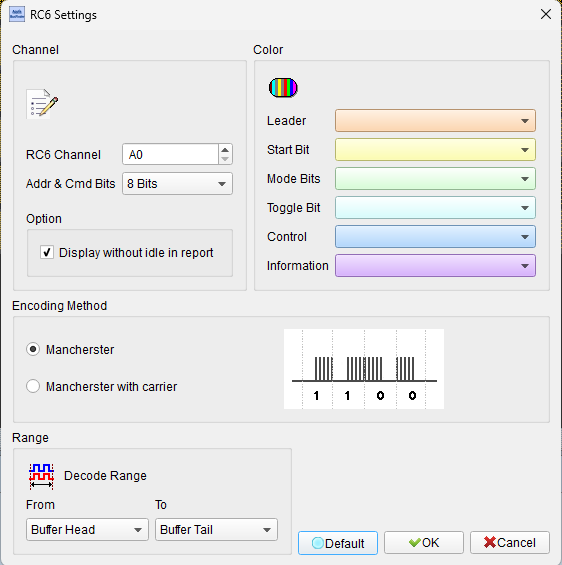
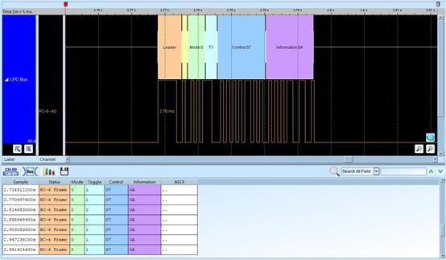
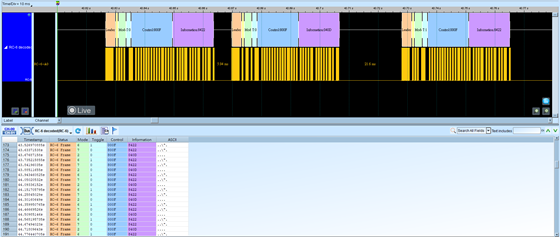

# RC-6 (Philips Remote Control Protocol)


## Decode Settings
<figure markdown>
  
  <figcaption>Decode Settings</figcaption>
</figure>

## Example
<figure markdown>
  
  <figcaption>Decode Example</figcaption>
</figure>
<figure markdown>
  
  <figcaption>Decode Figure</figcaption>
</figure>

## What is RC-6?

RC-6 is an advanced infrared remote control protocol developed by Philips as the successor to the widely-used RC-5 protocol, designed in the late 1990s to meet the evolving needs of modern consumer electronics and digital entertainment devices. While maintaining the core advantages of RC-5's Manchester encoding and 36 kHz carrier frequency, RC-6 introduces several enhancements including a more robust header structure with a leader symbol for improved receiver AGC (Automatic Gain Control), mode bits for protocol extensibility, a double-length trailer/toggle bit for enhanced reliability, and support for extended addressing schemes. RC-6 was specifically developed for and adopted by Microsoft for the Windows Media Center platform, making it the standard protocol for Media Center remotes and subsequently for Microsoft Xbox consoles, significantly increasing its deployment in home entertainment systems worldwide.

The RC-6 protocol's structure begins with a distinctive leader symbol consisting of a 6t (2.666 ms) pulse followed by a 2t (889 µs) silence, providing receivers ample time to stabilize gain before data reception. Following the leader is a start bit (always '1'), three mode bits that determine the protocol variant (Mode 0 being the standard consumer electronics mode), and a trailer bit that serves as a toggle bit but with double length (2t instead of 1t) for improved discrimination. In RC-6 Mode 0, the frame continues with an 8-bit address field and an 8-bit command field, both transmitted MSB first. The Manchester encoding is inverted compared to RC-5: a '1' bit is encoded as pulse-then-space, and a '0' bit as space-then-pulse. The basic timing unit (1t) is 444 µs (16 cycles of 36 kHz carrier), making RC-6 faster than RC-5 with its 1.778 ms bit time, allowing more responsive command transmission.

RC-6's adoption in Microsoft platforms led to widespread implementation in universal remotes, Media Center PCs, Xbox consoles, and third-party devices compatible with Windows ecosystem. The protocol's mode bits enable multiple variants including RC-6A (with extended headers and manufacturer-specific extensions), providing flexibility for future enhancements while maintaining backward compatibility. RC-6's improved robustness compared to RC-5—through its leader symbol, double-length toggle bit, and faster bit rate—makes it well-suited for modern RF-noisy home environments with numerous wireless devices. The protocol remains actively used in gaming consoles, HTPC (Home Theater PC) systems, streaming media devices, and legacy Windows Media Center equipment, with extensive library support in embedded systems and maker platforms for custom remote control applications.

## Technical Specifications

### Physical Layer

**Infrared Carrier:**
- **Carrier frequency**: 36 kHz (same as RC-5, chosen for TV scan immunity)
- **Wavelength**: 940 nm (standard infrared LED)
- **Duty cycle**: 25-50% (carrier on 25-50% of time)
- **Modulation**: Manchester (bi-phase) encoding

**Communication Range:**
- **Typical range**: 5-10 meters (line of sight)
- **Beam angle**: 30-60° cone (depends on LED and receiver)

### Timing Unit

**Base Timing (1t):**
- **1t = 444 µs** (16 cycles of 36 kHz carrier)
- All timing values are multiples of this base unit
- Faster than RC-5 (which uses 889 µs half-bits)

### Manchester Encoding (Inverted from RC-5)

**Encoding Rules:**
- **Logical '1'**: Pulse in first half + silence in second half (mark-then-space)
- **Logical '0'**: Silence in first half + pulse in second half (space-then-mark)
- **Bit duration**: 1t = 444 µs (except trailer bit which is 2t)

**Note**: RC-6 Manchester encoding is **inverted** compared to RC-5:
- RC-5: '1' = space-then-mark, '0' = mark-then-space
- RC-6: '1' = mark-then-space, '0' = space-then-mark

### Message Frame Format

**RC-6 Mode 0 Frame Structure:**

1. **Leader Symbol (LS)**
   - 6t pulse (2.666 ms) + 2t silence (889 µs)
   - Total: 8t = 3.555 ms
   - Purpose: AGC stabilization, receiver gain setup

2. **Start Bit (SB)**
   - Always '1' (1t pulse + 1t silence = 2t total)
   - Provides timing calibration

3. **Mode Bits (mb2, mb1, mb0)**
   - 3 bits defining protocol mode
   - Mode 0: mb2=0, mb1=0, mb0=0 (consumer electronics)
   - Mode 6: mb2=1, mb1=1, mb0=0 (RC-6A extended)
   - Each bit: 1t (444 µs)

4. **Trailer Bit (TR) / Toggle Bit**
   - **Double length**: 2t (888 µs total)
   - Toggles with each new button press
   - Remains constant during button hold
   - Double length makes toggle changes more distinguishable

5. **Address Field (Mode 0)**
   - 8 bits, MSB first
   - Supports 256 different devices (0x00-0xFF)
   - Each bit: 1t (444 µs)

6. **Command Field (Mode 0)**
   - 8 bits, MSB first
   - Supports 256 different commands (0x00-0xFF)
   - Each bit: 1t (444 µs)

**Total Mode 0 Frame Duration:**
- Leader: 8t
- Start: 2t
- Mode bits: 3t
- Trailer: 2t (double length)
- Address: 8t
- Command: 8t
- **Total: 31t = 31 × 444 µs = 13.764 ms (~13.8 ms)**

Much faster than RC-5's 24.9 ms!

### RC-6 Mode 0 (Standard Consumer Electronics)

**Address Field**: 8 bits
- **0x00**: TV, general video
- **0x01-0xFF**: Various device types and manufacturers
- Allows 256 independent devices

**Command Field**: 8 bits
- **256 possible commands per device**

**Common Microsoft Media Center Commands:**
- **0x0C**: Power toggle
- **0x10**: Volume up
- **0x11**: Volume down
- **0x0D**: Mute
- **0x20**: Channel up
- **0x21**: Channel down
- **0x37**: Play
- **0x38**: Pause
- **0x36**: Stop
- **0x3C**: OK/Select
- **0x5A**: Up
- **0x5B**: Down
- **0x5C**: Left
- **0x5D**: Right

### RC-6A (Extended Mode 6)

**Enhanced Structure:**
- Additional header fields
- Extended addressing (can support 15-bit addresses)
- Manufacturer-specific field
- Supports OEM-specific extensions
- Used for advanced features and proprietary implementations

### Toggle Bit Behavior

**Operation (same concept as RC-5):**
1. Button pressed: Trailer bit toggles (0→1 or 1→0)
2. Frame transmitted with new toggle state
3. Button held: Frames repeat with **same** toggle bit value
4. Button released and pressed again: Trailer bit toggles

**Double-Length Advantage:**
- 2t duration (888 µs) makes toggle transitions more reliable
- Easier for receivers to detect toggle state changes
- Reduces risk of misinterpreting noise as toggle change

### Frame Timing

**Single frame**: ~13.8 ms (Mode 0)

**Repeat interval** (button held): Variable, typically ~100-150 ms
- Microsoft Media Center: Approximately 113 ms repeat rate
- Faster response than RC-5's 114 ms

## Common Applications

RC-6 is primarily associated with Microsoft platforms and modern entertainment systems:

- **Microsoft Xbox**: Xbox 360 and Xbox One media remotes
- **Windows Media Center**: Official Media Center remotes (2000s-2010s)
- **Home Theater PCs**: HTPC builds with Media Center software
- **Philips consumer electronics**: TVs, DVD/Blu-ray players, audio systems
- **Universal remotes**: Logitech Harmony and other programmable remotes with RC-6 support
- **Streaming media devices**: Some set-top boxes and streaming players
- **Smart TVs**: Select models with Media Center compatibility
- **Gaming consoles**: Xbox ecosystem IR remote controls
- **PC-based DVRs**: Media recording and playback systems
- **Digital signage**: Interactive displays with IR input
- **Custom home automation**: Integration of Xbox/Media Center devices into smart homes
- **DIY projects**: Arduino, Raspberry Pi, ESP32 IR control of Xbox or Media Center systems
- **Industrial control**: Non-contact HMI (Human-Machine Interface) applications
- **Educational platforms**: Teaching advanced infrared protocols and Manchester encoding

## Decoder Configuration

When configuring a logic analyzer to decode RC-6 protocol:

### Signal Capture Method

**Option 1: IR Receiver Module Output (Recommended)**
- Use 36 kHz IR receiver module (TSOP2236, SFH506-36)
- Captures demodulated Manchester-encoded signal
- Clean digital output ready for protocol decoding

**Option 2: Raw IR Signal**
- Capture from photodiode for carrier analysis
- Requires high-speed sampling to resolve 36 kHz modulation
- Useful for validating carrier frequency and duty cycle

### Channel Assignment

**Essential Signal:**
- **IR_DATA**: Demodulated IR receiver output (digital)

**Optional Signals:**
- **TRIGGER**: External timing reference
- **POWER**: Device power state (context)

### Protocol Parameters

- **Protocol type**: RC-6 Mode 0 or RC-6A
- **Carrier frequency**: 36 kHz
- **Bit encoding**: Manchester (inverted from RC-5)
- **Base timing unit (1t)**: 444 µs
- **Address bits**: 8 bits (Mode 0)
- **Command bits**: 8 bits (Mode 0)
- **Trailer bit**: Double length (2t)

### Decoding Options

- **Frame decoding**: Parse leader, start, mode, trailer, address, command
- **Manchester decoding**: Extract data from bi-phase transitions (note inverted polarity)
- **Mode identification**: Decode mode bits (0 = Mode 0, 6 = RC-6A)
- **Toggle bit tracking**: Monitor trailer bit state changes
- **Address display**: Show device address in hex or decimal
- **Command display**: Show command code and name (e.g., "Play", "Volume Up")
- **Repeat detection**: Identify repeated frames (same trailer bit)
- **Timing measurement**: Verify 444 µs base unit and leader symbol timing
- **RC-6A extended decoding**: Parse extended headers if Mode 6 detected

### Trigger Configuration

- **Leader symbol**: Trigger on 6t pulse + 2t space pattern
- **Start of frame**: Trigger on start bit after leader
- **Toggle bit change**: Trigger when trailer bit toggles (new button press)
- **Specific mode**: Trigger on specific mode bits (e.g., Mode 0 only)
- **Specific address**: Trigger on specific device address
- **Specific command**: Trigger on specific command code
- **Address + command**: Trigger on specific device and command combination

### Analysis Tips

When analyzing RC-6 signals:

1. **Identify leader symbol**: Look for distinctive 6t pulse (2.666 ms) at frame start
2. **Verify base timing**: All bit times should be multiples of 444 µs
3. **Check Manchester polarity**: RC-6 uses inverted encoding compared to RC-5
4. **Validate start bit**: Should always be '1' (pulse-then-space in RC-6)
5. **Decode mode bits**: Usually 000 for Mode 0, 110 for RC-6A
6. **Monitor trailer bit**: Double-length bit (2t = 888 µs) that toggles on new presses
7. **Verify bit order**: Address and command transmitted MSB first
8. **Measure repeat interval**: Typically ~100-113 ms for Media Center remotes
9. **Check frame duration**: Mode 0 frames should be ~13.8 ms
10. **Compare with RC-5**: RC-6 is faster (13.8 ms vs. 24.9 ms) and has leader symbol

### Common Protocol Patterns

**Single Button Press:**
1. User presses button
2. Full frame transmitted (~13.8 ms) with trailer bit = '1' (example)
3. User releases immediately
4. No repeat frames

**Button Hold:**
1. User presses and holds button
2. First frame with trailer bit = '1'
3. After ~113 ms, second frame with trailer bit still '1'
4. Subsequent frames repeat every ~113 ms, trailer bit remains '1'
5. User releases button
6. Transmission stops

**New Button Press:**
1. User presses same button again (after release)
2. Frame transmitted with trailer bit = '0' (toggled from previous '1')
3. Receiver detects toggle, processes as new press event
4. If held, repeats with trailer = '0'

**Manchester Encoding Example (RC-6 Style):**

Logical '1' bit:
```
     222µs       222µs
   ¯¯¯¯¯¯|___________
   (mark)    (space)
              ↑ midpoint transition (1→0)
```

Logical '0' bit:
```
     222µs       222µs
   __________|¯¯¯¯¯¯¯¯
   (space)    (mark)
              ↑ midpoint transition (0→1)
```

**Leader Symbol Pattern:**
```
      2.666ms        889µs
   ¯¯¯¯¯¯¯¯¯¯¯¯|___________
   (6t mark)      (2t space)
```

## Reference

- [SB-Projects: Philips RC-6 IR Protocol Guide](https://www.sbprojects.net/knowledge/ir/rc6.php)
- [PCB Heaven: The Philips RC6 IR Remote Control Protocol](https://www.pcbheaven.com/userpages/The_Philips_RC6_Protocol/)
- [Linux Kernel Documentation: Remote Controller Protocols](https://docs.kernel.org/6.0/userspace-api/media/rc/rc-protos.html)
- [PicBasic: Protocol RC6 Remote Control](https://www.picbasic.nl/info_rc6_uk.htm)
- [Wikipedia: RC-5 Protocol (includes RC-6 comparison)](https://en.wikipedia.org/wiki/RC-5)
