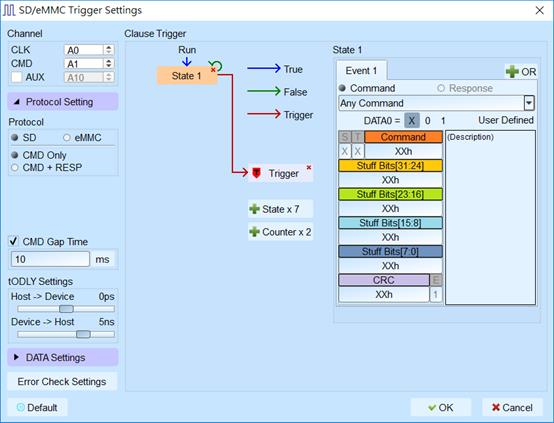
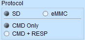

# SDIO/SD 3.0

## Decode Settings
<figure markdown>
  
  <figcaption>Decode Settings</figcaption>
</figure>

## Example
<figure markdown>
  
  <figcaption>Decode Example</figcaption>
</figure>

## What is SDIO/SD 3.0?

SDIO (Secure Digital Input Output) is an extension of the SD (Secure Digital) memory card standard that enables SD cards to perform I/O functions beyond simple data storage. Developed by the SD Card Association, SDIO cards utilize the same physical form factor and electrical interface as standard SD memory cards but incorporate additional functionality such as WiFi, Bluetooth, GPS, cameras, and other peripheral devices. The SDIO specification shares the underlying communication protocol with SD memory cards, allowing host controllers to support both storage and I/O functions through a unified interface.

SD 3.0 represents a significant evolution in the SD standard, introducing Ultra High Speed (UHS) interfaces that dramatically increased performance beyond the previous High Speed mode. The SD 3.0 specification family includes UHS-I supporting bus speeds up to 104 MB/s (SDR104 mode) and theoretical maximum of 312 MB/s in DDR mode, and later UHS-II achieving up to 312 MB/s with additional signal pins. The protocol uses a master-slave architecture where the host controller initiates all communications through commands sent on the CMD line, with data transferred via one or four DAT lines (and additional lanes in UHS-II). Voltage signaling levels were expanded to support 1.8V operation for high-speed modes while maintaining backward compatibility with 3.3V legacy devices.

SD/SDIO protocols have become ubiquitous in consumer electronics, portable devices, and embedded systems. The combination of removable media convenience (for SD cards), standardized electrical interface, scalable performance modes, and integrated I/O capabilities (for SDIO) has made SD/SDIO the dominant interface for removable storage and wireless connectivity modules. The specification continues to evolve with SD Express (PCIe and NVMe integration) and higher-speed UHS modes, while maintaining backward compatibility with billions of existing devices across cameras, phones, tablets, single-board computers, and IoT systems.

## Technical Specifications

### Physical Interface

**Signal Lines:**
- **CLK**: Clock signal (host to card)
- **CMD**: Bidirectional command/response line
- **DAT0-DAT3**: Four bidirectional data lines (standard SD mode)
- **DAT4-DAT7**: Additional four data lines (8-bit mode, rarely used in SD/SDIO)
- **VDD/VSS**: Power supply (3.3V or 1.8V) and ground
- **CD/DAT3**: Card detect (DAT3 line has dual function)

**UHS-II Additional Signals:**
- **RCLK**: Receive clock for full-duplex differential signaling
- **D0/D1**: Differential data pairs for increased bandwidth

**Bus Width Modes:**
- **1-bit mode**: DAT0 only (default mode, SPI-compatible)
- **4-bit mode**: DAT0-DAT3 (standard SD mode)
- **8-bit mode**: DAT0-DAT7 (eMMC primarily, rare in SD)

### Speed Modes and Data Rates

**Legacy Modes:**
- **Default Speed**: 25 MHz clock, up to 12.5 MB/s (4-bit) or 3.125 MB/s (1-bit)
- **High Speed (HS)**: 50 MHz clock, up to 25 MB/s (4-bit) or 6.25 MB/s (1-bit)

**UHS-I Modes (SD 3.0):**
- **SDR12**: 25 MHz clock SDR, up to 12.5 MB/s
- **SDR25**: 50 MHz clock SDR, up to 25 MB/s
- **SDR50**: 100 MHz clock SDR, up to 50 MB/s
- **SDR104**: 208 MHz clock SDR, up to 104 MB/s
- **DDR50**: 50 MHz clock DDR, up to 50 MB/s (data on both edges)

**UHS-II (SD 4.0+):**
- Full-duplex differential signaling
- Up to 312 MB/s (156 MB/s each direction simultaneously)

**Voltage Signaling:**
- **3.3V**: 2.7-3.6V for Default Speed and High Speed modes
- **1.8V**: 1.7-1.95V required for UHS-I and UHS-II modes

### Protocol Architecture

**Command Structure (48 bits):**
- **Start bit** (1 bit): Always 0
- **Transmission bit** (1 bit): 1 = host command, 0 = card response
- **Command index** (6 bits): CMD0-CMD63
- **Argument** (32 bits): Command-specific parameter (address, configuration, etc.)
- **CRC7** (7 bits): Cyclic redundancy check
- **End bit** (1 bit): Always 1

**Response Types:**
- **R1**: Normal response with card status (48 bits)
- **R2**: CID/CSD register (136 bits)
- **R3**: OCR register (48 bits, no CRC)
- **R4**: Fast I/O response (SDIO, 48 bits)
- **R5**: Interrupt request response (SDIO, 48 bits)
- **R6**: Published RCA response (48 bits)
- **R7**: Card interface condition (48 bits)

**Application-Specific Commands (ACMD):**
- Preceded by CMD55 (APP_CMD) to indicate next command is ACMD
- Example: ACMD41 (SD_SEND_OP_COND) for SD card initialization

### Common Commands

**Card Initialization:**
- **CMD0**: GO_IDLE_STATE (reset card)
- **CMD8**: SEND_IF_COND (check voltage range and pattern)
- **ACMD41**: SD_SEND_OP_COND (initialize and check card type)
- **CMD2**: ALL_SEND_CID (get card identification)
- **CMD3**: SEND_RELATIVE_ADDR (get card address)

**Card Selection and Configuration:**
- **CMD7**: SELECT_CARD (select card for data transfer)
- **CMD9**: SEND_CSD (get card-specific data)
- **CMD10**: SEND_CID (get card identification again)
- **ACMD6**: SET_BUS_WIDTH (switch to 4-bit mode)
- **CMD6**: SWITCH_FUNC (change speed mode and function)

**Data Read Operations:**
- **CMD17**: READ_SINGLE_BLOCK
- **CMD18**: READ_MULTIPLE_BLOCK
- **CMD12**: STOP_TRANSMISSION (stop multi-block transfer)

**Data Write Operations:**
- **CMD24**: WRITE_BLOCK (single block)
- **CMD25**: WRITE_MULTIPLE_BLOCK
- **ACMD23**: SET_WR_BLK_ERASE_COUNT (pre-erase for faster write)

**SDIO-Specific Commands:**
- **CMD52**: IO_RW_DIRECT (read/write single byte to I/O function)
- **CMD53**: IO_RW_EXTENDED (read/write multiple bytes or blocks to I/O function)
- **CMD5**: IO_SEND_OP_COND (SDIO card initialization)

**Status and Control:**
- **CMD13**: SEND_STATUS (get card status)
- **CMD55**: APP_CMD (indicate next command is ACMD)

### Data Transfer Protocol

**Data Block Format:**
- **Start bit**: 0
- **Data**: 512 bytes (default), or configurable block size
- **CRC16**: 16-bit CRC per DAT line (4 CRCs in 4-bit mode)
- **End bit**: 1

**CRC Tokens:**
- Transmitted after each data block in write operations
- Indicates data accepted, CRC error, or write error

## Common Applications

### SD Memory Cards
- **Digital cameras**: Photo and video storage
- **Camcorders**: High-definition video recording
- **Drones**: Flight logging and camera storage
- **Action cameras**: Sports and activity recording
- **Smartphones**: Expandable storage
- **Tablets**: External media storage
- **Portable audio players**: Music and audiobook storage
- **Single-board computers**: Raspberry Pi, BeagleBone boot and storage
- **GPS devices**: Map data storage
- **Industrial data loggers**: Sensor data recording

### SDIO Cards and Modules
- **WiFi modules**: Wireless LAN connectivity for embedded systems
- **Bluetooth modules**: Wireless personal area networking
- **GPS receivers**: Location services for portable devices
- **Cellular modems**: 3G/4G/LTE connectivity
- **NFC controllers**: Near-field communication interfaces
- **Camera modules**: Digital image capture interfaces
- **Barcode scanners**: Mobile scanning solutions
- **RFID readers**: Contactless card reading
- **Zigbee modules**: IoT and home automation connectivity
- **FM radio tuners**: Radio reception modules

## Decoder Configuration

When configuring a logic analyzer to decode SD/SDIO signals:

### Channel Assignment

**Minimum Required Signals:**
- **CLK**: Clock (required)
- **CMD**: Command/response line (required)
- **DAT0**: Data line 0 (required)

**Extended Signals (for 4-bit mode):**
- **DAT1**: Data line 1
- **DAT2**: Data line 2
- **DAT3**: Data line 3 (also card detect function)

### Protocol Parameters

- **Bus width**: Select 1-bit or 4-bit mode
- **Speed mode**: Configure for expected mode (Default, High Speed, SDR12-104, DDR50)
- **Clock frequency**: Set expected clock rate
- **Voltage level**: Set input threshold for 3.3V or 1.8V signaling
- **Card type**: SD memory, SDIO, or combo card

### Decoding Options

- **Command decoding**: Display command index (CMD/ACMD) and arguments
- **Response parsing**: Show response type and content
- **Data block display**: Show data payload in hex/ASCII format
- **CRC verification**: Check CRC7 (commands) and CRC16 (data) and flag errors
- **Status decoding**: Parse card status fields
- **SDIO function**: Decode CMD52/CMD53 I/O operations
- **Timing measurement**: Measure response times and data transfer rates

### Trigger Configuration

- **Command trigger**: Trigger on specific command index (e.g., CMD17 for read)
- **ACMD trigger**: Trigger on CMD55 followed by specific ACMD
- **Data transfer**: Trigger on data start bit
- **Error conditions**: Trigger on CRC errors or timeout
- **SDIO I/O**: Trigger on CMD52/CMD53 I/O access
- **Card insertion**: Trigger on DAT3/CD signal change

### Sampling Requirements

**Minimum Sampling Rates:**
- Default Speed (25 MHz): 100 MHz minimum (4× clock)
- High Speed (50 MHz): 200 MHz minimum
- SDR50 (100 MHz): 400 MHz minimum
- SDR104 (208 MHz): 832 MHz minimum
- DDR50 (50 MHz DDR): 400 MHz minimum

**Recommended**: 10× clock frequency for accurate timing analysis and waveform visualization.

### Analysis Tips

When analyzing SD/SDIO communications:

1. **Initialization sequence**: Capture from power-on to observe full initialization (CMD0, CMD8, ACMD41, CMD2, CMD3)
2. **Mode switching**: Watch for CMD6 commands that change speed mode or function
3. **Application commands**: Remember ACMD requires CMD55 prefix
4. **Busy signaling**: DAT0 held low indicates card is busy (during programming/erasing)
5. **Multi-block transfers**: Look for CMD18/CMD25 with CMD12 to stop transfer
6. **SDIO interrupts**: Monitor DAT1 for interrupt signaling from SDIO cards
7. **Performance measurement**: Calculate actual throughput including command overhead

### Common Protocol Patterns

**SD Card Read:**
1. CMD13 (check status)
2. CMD17 (read single block) or CMD18 (read multiple blocks)
3. Card sends data blocks on DAT lines
4. CMD12 (stop transmission, if multiple blocks)

**SD Card Write:**
1. CMD13 (check status)
2. CMD24 (write single block) or CMD25 (write multiple blocks)
3. Host sends data blocks on DAT lines
4. Card sends CRC status token
5. DAT0 busy (low) during programming
6. CMD12 (stop transmission, if multiple blocks)

**SDIO I/O Read (CMD52):**
1. CMD52 with read flag, function number, register address
2. Card responds with register data

**SDIO I/O Write (CMD53):**
1. CMD53 with block/byte mode, function number, address
2. Data transfer on DAT lines

## Reference

- [SD Association Official Specifications](https://www.sdcard.org/downloads/pls/)
- [SD Specifications Part 1: Physical Layer Simplified Specification](https://www.sdcard.org/)
- [SDIO Card Specification](https://www.sdcard.org/developers/sd-standard-overview/sdio-isdio/)
- [Arasan SDIO 3.0 Device IP](https://arasan.com/products/sd-emmc/sdio-3-0-device)
