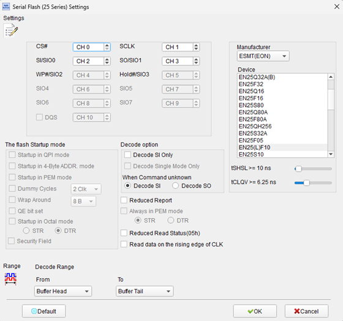
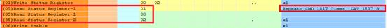
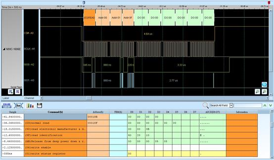
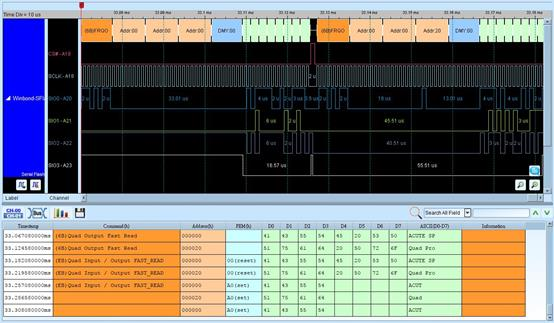
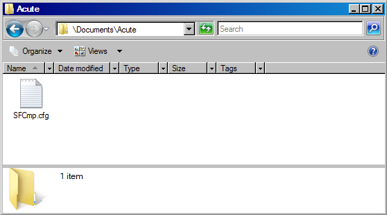
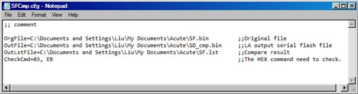
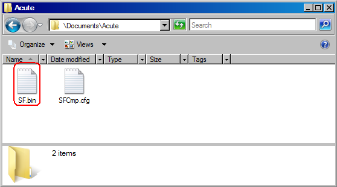
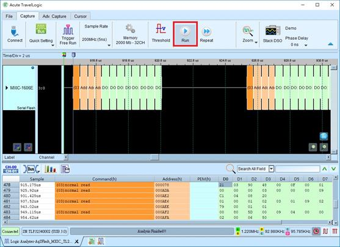
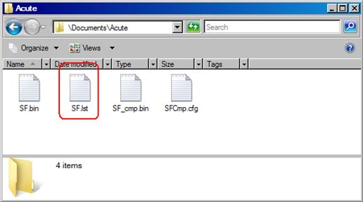
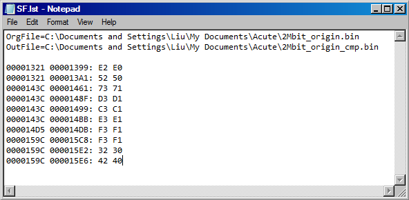

# Serial Flash

## Decode Settings
<figure markdown>
  
  <figcaption>Decode Settings</figcaption>
</figure>

## Example
<figure markdown>
  
  <figcaption>Decode Example</figcaption>
</figure>
<figure markdown>
  
  <figcaption>Decode Figure</figcaption>
</figure>
<figure markdown>
  
  <figcaption>Decode Figure</figcaption>
</figure>
<figure markdown>
  
  <figcaption>Decode Figure</figcaption>
</figure>
<figure markdown>
  
  <figcaption>Decode Figure</figcaption>
</figure>
<figure markdown>
  
  <figcaption>Decode Figure</figcaption>
</figure>
<figure markdown>
  
  <figcaption>Decode Figure</figcaption>
</figure>
<figure markdown>
  
  <figcaption>Decode Figure</figcaption>
</figure>
<figure markdown>
  
  <figcaption>Decode Figure</figcaption>
</figure>

## What is Serial Flash?

Serial Flash, commonly known as SPI NOR Flash, is a type of non-volatile memory device that communicates using the Serial Peripheral Interface (SPI) protocol. Unlike parallel NAND flash that requires many I/O pins and complex controllers, Serial Flash operates with just four to six pins, making it ideal for cost-sensitive and space-constrained applications. These devices typically use NOR flash memory technology, which provides fast random-access read capabilities, execute-in-place (XIP) functionality, and high data reliability without requiring sophisticated error correction algorithms.

The Serial Flash interface is standardized by JEDEC (Joint Electron Device Engineering Council) through several specifications including JESD216 (Serial Flash Discoverable Parameters - SFDP), JESD251 (xSPI for expanded interface modes), and related standards. Standard SPI mode operates with single data line in each direction (MOSI/MISO), while advanced modes include Dual SPI (2 I/O lines), Quad SPI (4 I/O lines), and Octal SPI (8 I/O lines) for increased throughput. Modern Serial Flash devices support data rates from 80 MHz in standard SPI mode to 400 MB/s in xSPI DDR octal mode, with typical capacities ranging from 512 KB to 2 GB.

Serial Flash has become ubiquitous in embedded systems for firmware storage, boot code, and configuration data. The devices offer several advantages including low pin count, simple interface, wide voltage range support (1.8V, 2.5V, 3.3V), low power consumption in standby modes, and industry-standard command sets. JEDEC SFDP (Serial Flash Discoverable Parameters) enables automatic device detection and configuration, allowing generic controllers to work with diverse Serial Flash parts without device-specific drivers. This standardization combined with competitive pricing has made Serial Flash the dominant choice for code storage in microcontrollers, FPGAs, embedded controllers, and IoT devices.

## Technical Specifications

### Physical Interface

**Standard SPI Mode (4-pin):**
- **CS# (Chip Select)**: Active-low device select
- **SCK (Serial Clock)**: Clock signal generated by master
- **MOSI/SI (Master Out Slave In)**: Serial data input to flash device
- **MISO/SO (Master In Slave Out)**: Serial data output from flash device

**Extended Modes (6-pin):**
- **WP# (Write Protect)**: Active-low write protection control (becomes IO2 in Quad mode)
- **HOLD#/RESET#**: Hold operation or reset (becomes IO3 in Quad mode)

**Quad SPI Mode:**
- **IO0**: MOSI in SPI mode, bidirectional in Quad mode
- **IO1**: MISO in SPI mode, bidirectional in Quad mode
- **IO2**: WP# in SPI mode, bidirectional in Quad mode
- **IO3**: HOLD# in SPI mode, bidirectional in Quad mode

**Octal SPI Mode (xSPI):**
- **IO[7:0]**: Eight bidirectional data lines
- **DQS**: Data strobe for DDR mode synchronization

### Memory Organization

**Hierarchical Structure:**
- **Byte**: Smallest addressable unit
- **Page**: 256 bytes - minimum program unit
- **Sector**: 4 KB (4,096 bytes): minimum erase unit
- **Block**: 32 KB or 64 KB - larger erase unit
- **Chip**: Complete device (512 KB to 2 GB typical)

### Data Rates and Modes

**SPI Modes:**
- **Standard SPI**: 80-133 MHz clock, single I/O, up to 133 Mbps
- **Dual SPI**: 100-133 MHz clock, 2 I/O, up to 266 Mbps
- **Quad SPI**: 133 MHz clock, 4 I/O, up to 532 Mbps (4 × 133 MHz)
- **Dual Data Rate (DDR)**: Data on both clock edges, doubles effective rate
- **Octal SPI (xSPI)**: 200 MHz clock, 8 I/O DDR, up to 3200 Mbps (400 MB/s)

**Performance Characteristics:**
- **Read access time**: 8-25 ns (initial access after address)
- **Page program time**: 0.4-3 ms typical
- **Sector erase time**: 20-150 ms typical
- **Block erase time**: 100-500 ms typical
- **Chip erase time**: 15-100 seconds typical
- **Endurance**: 100,000 program/erase cycles typical
- **Data retention**: 20+ years typical

### Command Set

**Read Commands:**
- **03h**: Read Data (standard speed, up to 50 MHz)
- **0Bh**: Fast Read (higher speed with dummy cycles)
- **3Bh**: Dual Output Fast Read
- **6Bh**: Quad Output Fast Read
- **BBh**: Dual I/O Fast Read
- **EBh**: Quad I/O Fast Read
- **5Ah**: Read SFDP (Serial Flash Discoverable Parameters)

**Write/Program Commands:**
- **06h**: Write Enable (required before any write/erase operation)
- **04h**: Write Disable
- **02h**: Page Program (write up to 256 bytes)
- **32h**: Quad Input Page Program

**Erase Commands:**
- **20h**: Sector Erase (4 KB)
- **52h**: Block Erase (32 KB)
- **D8h**: Block Erase (64 KB)
- **60h/C7h**: Chip Erase (entire device)

**Status and Configuration:**
- **05h**: Read Status Register
- **01h**: Write Status Register
- **35h**: Read Status Register 2
- **15h**: Read Status Register 3
- **9Fh**: Read JEDEC ID (manufacturer and device ID)
- **90h**: Read Manufacturer/Device ID
- **4Bh**: Read Unique ID

**Protection and Security:**
- **36h**: Individual Block Lock
- **39h**: Individual Block Unlock
- **3Dh**: Read Block Lock Status
- **E8h**: Enable Reset
- **99h**: Reset Device

**Power Management:**
- **B9h**: Deep Power-down
- **ABh**: Release from Deep Power-down / Device ID

### Command Structure

Typical command sequence:
1. Assert CS# (low)
2. Send command byte on MOSI
3. Send address bytes (if required, typically 3 bytes for addressing)
4. Send/receive data
5. De-assert CS# (high)

## Common Applications

Serial Flash is widely deployed across electronic systems:

- **Microcontroller firmware storage**: Boot code and application program storage
- **FPGA configuration**: Bitstream storage for field-programmable gate arrays
- **Embedded system boot**: System initialization code for embedded processors
- **BIOS/UEFI storage**: PC and server firmware storage
- **IoT devices**: Firmware and configuration for connected devices
- **Network equipment**: Router, switch, and access point firmware
- **Automotive electronics**: ECU firmware and calibration data
- **Consumer electronics**: Smart TVs, set-top boxes, and appliances
- **Industrial controllers**: PLC and automation controller programs
- **Medical devices**: Embedded firmware in medical equipment
- **Security modules**: Secure boot code storage
- **Data logging**: Store configuration and logged data
- **Audio/video equipment**: Firmware for A/V processors and DSPs
- **Printer controllers**: Printer firmware and font storage
- **Gaming devices**: Firmware for gaming peripherals and consoles
- **Measurement instruments**: Test equipment firmware storage

## Decoder Configuration

When configuring a logic analyzer to decode Serial Flash signals:

### Channel Assignment - Standard SPI Mode

**Minimum Required Signals:**
- **CS#**: Chip Select (required)
- **SCK**: Serial Clock (required)
- **MOSI/SI**: Master Out Slave In (required)
- **MISO/SO**: Master In Slave Out (required)

**Optional Signals:**
- **WP#**: Write Protect
- **HOLD#**: Hold/Reset

### Protocol Parameters

- **SPI Mode**: Select SPI Mode 0 (CPOL=0, CPHA=0) or Mode 3 (CPOL=1, CPHA=1) as used by the device
- **Clock polarity (CPOL)**: Idle state of clock (typically 0 for Serial Flash)
- **Clock phase (CPHA)**: Data sampling edge (typically 0 for Serial Flash)
- **Bit order**: MSB first (most significant bit first)
- **Data width**: 8 bits per byte

### Decoding Options

- **Command interpretation**: Display command names (Read, Page Program, Sector Erase, etc.)
- **Address display**: Show 24-bit or 32-bit addresses in hexadecimal
- **Data payload**: Display read/write data in hex/ASCII format
- **Status register decoding**: Parse status register bits (WIP, WEL, BP bits, etc.)
- **JEDEC ID parsing**: Decode manufacturer and device identification
- **Timing analysis**: Measure command execution times
- **Dummy byte display**: Show dummy cycles for Fast Read commands

### Trigger Configuration

- **CS# edge**: Trigger on CS# assertion (falling edge) to capture command start
- **Specific command**: Trigger when specific command byte detected (e.g., 02h for Page Program)
- **Address match**: Trigger when specific address is accessed
- **Write Enable**: Trigger on 06h command before write/erase operations
- **Status register**: Trigger when status register shows specific conditions

### Capture Considerations

**Sampling Rate:**
- Minimum: 4× the SCK frequency
- Recommended: 10× or higher for clear waveform visualization
- Example: For 100 MHz SCK, use at least 400 MHz sampling rate

**Buffer Depth:**
- Consider operation duration:
  - Read commands: Microseconds to milliseconds (depends on data length)
  - Page Program: Up to 3 ms
  - Sector Erase: Up to 150 ms
  - Block Erase: Up to 500 ms
  - Chip Erase: Several seconds to minutes
- Use segmented capture or post-trigger for long operations

### Analysis Tips

When analyzing Serial Flash communications:

1. **Command sequences**: Look for Write Enable (06h) before any Program/Erase command
2. **Status polling**: After Program/Erase, observe repeated Read Status (05h) until WIP bit clears
3. **Addressing**: Verify address increments correctly for sequential reads
4. **Timing compliance**: Check tCS (CS# setup time), tCH (CS# hold time), tSU (data setup time)
5. **Write protection**: Monitor WP# pin and status register BP bits to understand protection state
6. **Power-down mode**: Observe Deep Power-down (B9h) and Release (ABh) commands for power management
7. **Error conditions**: Look for unexpected NAK or stuck in busy state (WIP bit set for too long)

### Common Command Sequences

**Read Data:**
1. CS# asserted
2. Command 03h or 0Bh (Fast Read)
3. 3-byte address
4. Dummy bytes (for Fast Read)
5. Data bytes clocked out on MISO
6. CS# de-asserted

**Page Program:**
1. CS# asserted, 06h (Write Enable), CS# de-asserted
2. CS# asserted, 02h (Page Program)
3. 3-byte address
4. Up to 256 data bytes on MOSI
5. CS# de-asserted
6. Wait for program completion (poll status 05h until WIP=0)

**Sector Erase:**
1. CS# asserted, 06h (Write Enable), CS# de-asserted
2. CS# asserted, 20h (Sector Erase)
3. 3-byte sector address
4. CS# de-asserted
5. Wait for erase completion (poll status 05h until WIP=0)

## Reference

- [JEDEC JESD216G: Serial Flash Discoverable Parameters (SFDP)](https://www.jedec.org/standards-documents/docs/jesd216b)
- [JEDEC JESD251C: xSPI for Non-Volatile Memory](https://www.jedec.org/standards-documents/docs/jesd251c)
- [JEDEC Serial Flash Standards](https://www.jedec.org/standards-documents/focus/flash/serial-flash)
- [Winbond W25Q Series Datasheet](https://www.espruino.com/W25)
