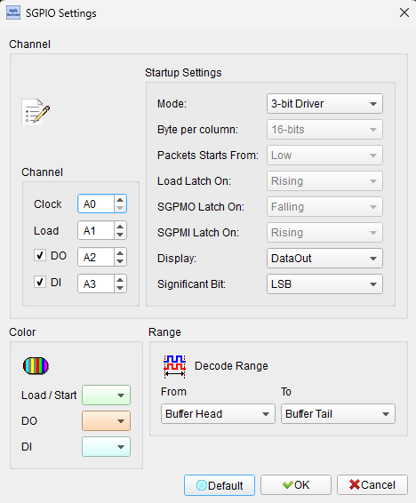
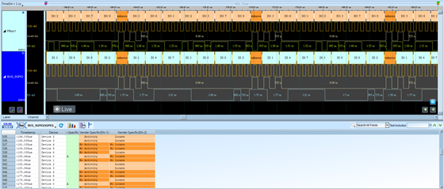

# SGPIO (Serial GPIO)


## Decode Settings
<figure markdown>
  
  <figcaption>Decode Settings</figcaption>
</figure>

## Example
<figure markdown>
  
  <figcaption>Decode Example</figcaption>
</figure>

## What is SGPIO?

### Overview

SGPIO (Serial GPIO or Serial General Purpose Input/Output) is a specialized serial bus protocol primarily used in storage systems to control and monitor the status LEDs on disk drive bays in servers, storage arrays, and RAID enclosures. Developed by Intel and standardized in the SFF (Small Form Factor) specifications (particularly SFF-8485), SGPIO provides a simple, efficient method for a storage controller, backplane controller, or expander to communicate LED status information (activity, locate, fault, etc.) to multiple drive bays using just a few wires. This is far more scalable than dedicating individual GPIO pins for each LED on each drive, which would be impractical in systems with dozens of drive bays.

The SGPIO interface uses a 3 or 4-wire synchronous serial bus consisting of a clock (SClock), serial data output (SDataOut), data load signal (SLoad), and optional

 serial data input (SDataIn). Data is shifted out serially from the controller to daisy-chained LED driver chips or backplane logic, with each device in the chain capturing its designated bits and passing the rest along. The SLoad signal latches the data into the output registers, updating all LEDs simultaneously for a glitch-free display. Typical SGPIO clock rates are 1-10 MHz, and the protocol supports various data stream formats for different numbers of drives and LED types.

SGPIO has become the de facto standard for drive bay LED control in enterprise storage systems, supported by SAS/SATA expanders, RAID controllers, and server backplane designs from major vendors. The protocol's simplicity and daisy-chain topology make it cost-effective and scalable, while its standardization ensures interoperability between controllers and backplanes from different manufacturers. Understanding SGPIO is essential for debugging storage system LED issues, developing custom storage enclosures, and interfacing RAID controllers with backplane hardware.

### Key Features

- **Serial Bus**: 3-4 wire interface (SClock, SDataOut, SLoad, optional SDataIn)
- **Daisy-Chain Topology**: Multiple devices on single bus
- **LED Control**: Drive activity, locate, fault, rebuild status
- **Synchronous**: Clock-driven data transmission
- **Bidirectional Capable**: Optional data input for status readback
- **Scalable**: Supports 4 to 24+ drive bays per bus
- **Industry Standard**: SFF-8485 specification
- **Low Bandwidth**: Typically 1-10 MHz clock
- **Glitch-Free Update**: Simultaneous latch via SLoad
- **Simple Protocol**: Easy to implement in hardware or firmware

## Technical Specifications

### Signal Description

**SGPIO Signals** (3 or 4 wires)

- **SClock**: Serial clock output from initiator (controller)
- **SDataOut**: Serial data output from initiator to target(s)
- **SLoad**: Data load/latch signal (active high or low)
- **SDataIn** (optional): Serial data input from target(s) to initiator

**Electrical Characteristics**
- **Voltage Levels**: Typically 3.3V CMOS (sometimes 5V tolerant)
- **Clock Frequency**: 1-10 MHz typical (up to 15 MHz in some implementations)
- **Data Rate**: Equals clock frequency (1 bit per clock)
- **Drive Strength**: Standard CMOS output drive

### Data Frame Structure

**Typical SGPIO Frame**

A frame consists of multiple bits, with each drive typically allocated 3-4 bits:
- **Activity Bit**: LED indicates drive activity (blink pattern)
- **Locate Bit**: LED for drive identification (solid or blink)
- **Fail/Error Bit**: LED indicates drive fault condition
- **Optional Bits**: Rebuild, predict failure, hot spare, etc.

**Example for 4 drives (12 bits total, 3 bits per drive)**
```
|  Drive 0  |  Drive 1  |  Drive 2  |  Drive 3  |
| Act|Loc|Err| Act|Loc|Err| Act|Loc|Err| Act|Loc|Err|
```

### Timing Specifications

**Typical Timing Parameters**
- **SClock Frequency**: 1 MHz to 10 MHz
- **SClock Period**: 100 ns (10 MHz) to 1 µs (1 MHz)
- **SClock Duty Cycle**: 40-60% typical
- **Setup Time**: Data stable before SClock rising edge (10-20 ns)
- **Hold Time**: Data stable after SClock rising edge (10-20 ns)
- **SLoad Pulse Width**: Minimum 50 ns to several µs

**Frame Timing**
- **Frame Length**: Number of bits = (Drives × Bits_per_drive)
- **Frame Period**: Time to shift out all bits + SLoad time
- **Update Rate**: Typically 10-100 Hz (10-100 ms per frame)

### Data Transfer Sequence

**Typical SGPIO Transaction**

1. **Idle State**: SClock idle, SLoad inactive
2. **Clock and Shift Data**: SClock toggles, SDataOut carries bit stream
3. **All Bits Shifted**: Complete data for all drives transmitted
4. **Latch Data**: SLoad pulses to latch data into output registers
5. **LEDs Update**: All LEDs update simultaneously
6. **Return to Idle**: Wait for next update cycle

**Timing Diagram**
```
SClock: __|‾|_|‾|_|‾|_|‾|_|‾|_|‾|_|‾|_|‾|_ (continuous)
SDataOut: D0 |D1 |D2 |D3 |D4 |D5 |D6 |D7 | (serial bits)
SLoad:  ______|‾‾‾‾‾‾|_____________ (pulse after all data)
```

### Daisy-Chain Configuration

**Multi-Device Topology**

- **Initiator**: RAID controller or expander (generates SClock, SDataOut, SLoad)
- **Target 1**: First LED driver or backplane logic (captures N bits)
- **Target 2**: Second device (captures next M bits)
- **Target N**: Last device (captures remaining bits)

Each device:
1. Captures its designated bits on SClock edges
2. Shifts remaining bits to next device via SDataOut
3. All devices latch data simultaneously on SLoad

**Bit Allocation**
- Typically 3-4 bits per drive
- Initiator must know total bit count (drives × bits/drive)
- Last device may have pull-up/pull-down to prevent floating output

### SFF-8485 Specification

**Standard Bit Definitions**

According to SFF-8485, common bit assignments per drive:
- **Bit 0**: Activity LED (blink = active, off = idle)
- **Bit 1**: Locate LED (solid = locate active)
- **Bit 2**: Error LED (solid = fault detected)

**Frame Format**
- Data shifted MSB first or LSB first (vendor specific)
- Typically starts with Drive 0 bits, then Drive 1, etc.

### Blink Patterns

**Common LED Behaviors**

Implemented by initiator updating bits at regular intervals:
- **Solid On**: Bit continuously high
- **Solid Off**: Bit continuously low
- **Slow Blink**: Toggle at 1-2 Hz (activity, locate)
- **Fast Blink**: Toggle at 4-8 Hz (rebuild, predictive failure)
- **Complex Patterns**: Multiple LEDs with coordinated blinks

## Common Applications

**Server and Storage Systems**
- 2U/4U servers with front-accessible drive bays
- SAS/SATA storage enclosures (JBODs)
- RAID controllers with LED management
- Direct-attached storage (DAS)
- Storage area networks (SAN)

**Backplane Interfaces**
- SAS expanders with SGPIO output
- SATA port multipliers with LED control
- Intelligent backplane controllers
- Hot-swap drive bay management

**RAID and HBA Cards**
- Hardware RAID controllers (LSI, Adaptec, etc.)
- Host bus adapters (HBAs)
- SAS/SATA controller cards
- PCIe storage controllers

**Disk Enclosures**
- Multi-bay external enclosures
- Tower and rackmount chassis
- Hot-swap drive caddies
- Disk array cabinets

**Network Attached Storage (NAS)**
- Enterprise NAS appliances
- SMB/SOHO NAS devices
- Video surveillance storage
- Backup and archive systems

**Industrial and Embedded**
- Industrial PC storage systems
- Embedded RAID solutions
- Medical imaging storage
- Video production storage arrays

## Decoder Configuration

When analyzing SGPIO communication with a logic analyzer, configure the following parameters:

### Signal Connections

**Minimum Configuration** (3 channels)
- SClock - Serial clock
- SDataOut - Serial data output
- SLoad - Data load/latch

**With Data Input** (4 channels)
- Add SDataIn - Serial data input (for readback/status)

### Sampling Requirements

- **Minimum Sample Rate**: 20 MS/s (2× the maximum 10 MHz clock)
- **Recommended**: 50-100 MS/s for reliable capture
- For 1 MHz SClock: 10 MS/s minimum

### Decoder Parameters

- **Number of Drives**: Specify total drive count
- **Bits Per Drive**: Typically 3 or 4
- **Bit Order**: MSB-first or LSB-first
- **Clock Edge**: Rising or falling (typically rising)
- **SLoad Polarity**: Active high or active low
- **Frame Length**: Auto-calculate from drives × bits/drive

### Display Options

- Show data bits organized by drive number
- Decode bit meanings (Activity, Locate, Error)
- Display LED states (On, Off, Blink from pattern)
- Annotate SLoad events (latch points)
- Show frame boundaries
- Calculate and display update rate (frames per second)

### Trigger Settings

- Trigger on SLoad edge (start or end of frame)
- Trigger on SClock edge (for timing analysis)
- Trigger on specific bit pattern in SDataOut
- Trigger on data change (detect updates)

### Analysis Tips

1. **Count Bits Per Frame**
   - Count SClock edges between SLoad pulses
   - Divide by bits/drive to determine drive count
   - Example: 24 bits, 3 bits/drive = 8 drives

2. **Verify Clock Frequency**
   - Measure SClock period
   - Typical: 100 kHz to 10 MHz
   - Check for clock stability

3. **Check SLoad Timing**
   - SLoad should pulse after all bits shifted
   - Pulse width should meet minimum spec (50+ ns)
   - SLoad causes simultaneous LED update

4. **Decode Bit Patterns**
   - Extract bits for each drive
   - Interpret according to bit definitions
   - Watch for blink patterns (toggling bits)

5. **Validate Daisy-Chain**
   - If SDataIn connected, compare to SDataOut
   - SDataIn should be delayed copy of SDataOut
   - Delay = propagation through all devices

6. **Calculate Update Rate**
   - Measure time between SLoad pulses
   - Typical: 10-100 Hz (10-100 ms period)
   - Faster updates create blink patterns

7. **Observe Blink Patterns**
   - Capture multiple frames
   - Look for bit toggling (activity blink)
   - Measure blink frequency (1-8 Hz typical)

### Common Issues

**No LED Response**
- **Symptom**: LEDs don't change despite SGPIO activity
- **Cause**: SLoad not pulsing, wrong bit order, hardware fault
- **Solution**: Verify SLoad present, check bit polarity, test LED drivers

**Wrong Drive LEDs Lit**
- **Symptom**: LEDs on wrong drive bays
- **Cause**: Incorrect bit allocation or drive ordering
- **Solution**: Verify frame structure, check which drive is which

**Flickering LEDs**
- **Symptom**: LEDs flicker randomly
- **Cause**: Noisy SClock, SLoad glitches, electrical interference
- **Solution**: Check signal integrity, add filtering, verify ground

**LEDs Not Blinking**
- **Symptom**: Expected blink pattern not visible
- **Cause**: Update rate too slow, bit not toggling
- **Solution**: Verify frame update rate (should be >10 Hz for visible blink)

**Data Corruption**
- **Symptom**: Random LED states, not matching expected
- **Cause**: Timing violations, signal integrity issues
- **Solution**: Check setup/hold times, reduce clock speed, improve routing

**SLoad Timing Issues**
- **Symptom**: Partial updates, tearing effect on LEDs
- **Cause**: SLoad pulse too short, devices not latching properly
- **Solution**: Increase SLoad pulse width, verify device specifications

### Advanced Analysis

**Multi-Frame Pattern Analysis**
- Capture 10-100 frames
- Decode blink patterns for each drive
- Identify activity correlation with drive I/O
- Verify locate function activates correct drive

**Timing Margin Verification**
- Measure setup/hold times relative to SClock
- Check SLoad timing relative to last data bit
- Verify compliance with device datasheets
- Assess margin for temperature/voltage variations

**Signal Integrity**
- Check SClock edge rates and jitter
- Verify SDataOut signal quality at each device
- Measure propagation delay through daisy-chain
- Identify crosstalk or noise issues

**Frame Efficiency**
- Calculate bandwidth utilization
- Assess update rate overhead
- Optimize frame length if possible
- Balance update rate vs. LED responsiveness

## Reference

- [SFF-8485 Specification](https://www.snia.org/technology-communities/sff/specifications): SGPIO standard
- [Intel SGPIO Implementation Guide](https://www.intel.com/): Application notes
- [LSI SAS Expander SGPIO](https://www.broadcom.com/): Broadcom/LSI documentation
- [LED Control in Storage Systems](https://www.snia.org/): SNIA technical papers
- [SAS/SATA Backplane Design](https://www.t13.org/): T10/T13 standards

---
**Last Updated**: 2026-02-02
