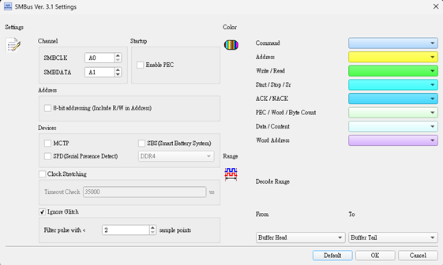
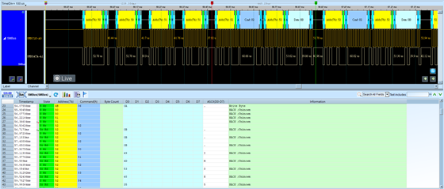
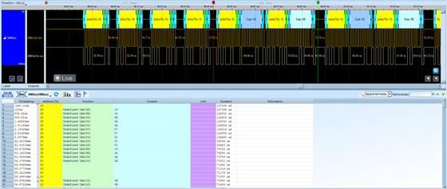
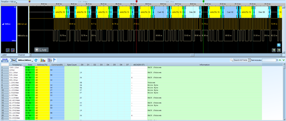

# SMBus (System Management Bus)

## Decode Settings
<figure markdown>
  
  <figcaption>Decode Settings</figcaption>
</figure>

## Example
<figure markdown>
  
  <figcaption>Decode Example</figcaption>
</figure>
<figure markdown>
  
  <figcaption>Decode Figure</figcaption>
</figure>
<figure markdown>
  
  <figcaption>Decode Figure</figcaption>
</figure>

## What is SMBus?

### Overview

SMBus (System Management Bus) is a standardized two-wire communication protocol derived from I²C, specifically designed for system management and power-related communications in computers, embedded systems, and battery-powered devices. Developed in the mid-1990s by Intel, Duracell, and others, SMBus defines a tightly controlled subset of I²C with stricter electrical specifications, mandatory timeout requirements, and standardized command sets for specific applications like battery charging, thermal monitoring, and system configuration. While electrically compatible with I²C, SMBus adds protocol-layer requirements that enhance reliability and enable interoperability across diverse system management components.

The protocol is maintained by the System Management Interface Forum (SMIF), with the current specification being version 3.3.1 (released October 20, 2024). SMBus serves as the foundation for related specifications including Smart Battery System (SBS), PMBus (Power Management Bus for power converters), and AVSBus (Adaptive Voltage Scaling Bus). These specifications layer additional commands and features atop the SMBus transport, creating an ecosystem of interoperable power management and system monitoring standards widely adopted in computers, servers, telecommunications equipment, and industrial systems.

### SMBus vs. I²C

While SMBus devices can generally work on I²C buses and vice versa, key differences exist:

**Electrical**:
- SMBus: Fixed voltage levels (2.1V low max, 0.8V high min at 3.3V)
- I²C: More flexible voltage specifications

**Timing**:
- SMBus: Mandated timeouts (25-35ms) prevent bus lockup
- I²C: No timeout requirements (devices can clock-stretch indefinitely)

**Clock Speed**:
- SMBus: Typically 10-100 kHz (100 kHz most common)
- I²C: Supports up to 3.4 MHz (high-speed mode), though standard mode 100 kHz common

**Address Resolution Protocol (ARP)**:
- SMBus: Defines ARP for dynamic address assignment
- I²C: No standard dynamic addressing mechanism

## Technical Specifications

### Protocol Layers

**Transport Layer** (SMBus 2-wire interface):
- **SMBCLK**: Clock line, similar to I²C SCL
- **SMBDAT**: Data line, similar to I²C SDA
- **SMBALERT#** (optional): Interrupt line for slave-to-master alerts
- **SMBSUS#** (optional): Suspend line for power management

**Operating Frequencies**:
- Minimum: 10 kHz
- Maximum: 100 kHz (fast mode, most common)
- Some implementations support 400 kHz (fast mode plus)

### Transaction Types

SMBus defines several standardized transaction protocols:

**Quick Command**:
- No data bytes, only R/W bit acts as simple command
- Used for simple on/off control

**Send/Receive Byte**:
- Single data byte transmitted
- Simple sensors or basic commands

**Read/Write Byte**:
- Command code + one data byte
- Most common single-register access

**Read/Write Word**:
- Command code + two data bytes (16-bit value)
- Little-endian byte order (low byte first)

**Process Call**:
- Write word, read word in same transaction
- Atomic read-modify-write operations

**Block Read/Write**:
- Command code + byte count + multiple data bytes
- Variable-length data transfer (up to 32 bytes typically)
- Used for transferring larger data structures

**I2C Block Read/Write**:
- Similar to block operations but different format for I²C compatibility

### Packet Error Checking (PEC)

SMBus optionally supports PEC:
- 8-bit CRC appended to messages
- Calculated using polynomial x^8 + x^2 + x^1 + 1
- Significantly improves reliability in noisy environments
- Recommended for critical applications

## SMBus Alert Response Protocol (ARP)

SMBus defines mechanisms for devices to alert the host and for dynamic address assignment:

**Alert#** Signal:
- Devices can assert SMBALERT# line (open-drain, active low)
- Host detects alert and queries devices using Alert Response Address (0x0C)
- Alerting device responds with its address
- Enables interrupt-driven system management

**Address Resolution Protocol**:
- Dynamic address assignment for plug-and-play devices
- Unique device identifier (UDID) allows addressing before address assignment
- Resolves conflicts when multiple devices request same address

## Smart Battery System (SBS)

SMBus is the foundation for Smart Battery specifications:

**Smart Battery Data (SBD)**:
- Voltage, current, temperature readings
- Remaining capacity and charge state
- Cycle count and health status
- Manufacturer information and serial numbers

**Smart Battery Charger (SBC)**:
- Charging current and voltage control
- Charging algorithm management
- Battery status monitoring

**Standardized Commands**:
- 0x09: Temperature
- 0x0A: Voltage
- 0x0B: Current
- 0x0F: Remaining Capacity
- 0x16: State of Charge (%)
- And many others per SBS specification

## PMBus (Power Management Bus)

PMBus extends SMBus for power converter control:

**Applications**:
- DC-DC converters
- Point-of-load regulators
- Power supplies
- Battery chargers

**Features**:
- Standard command set for power devices
- Telemetry (voltage, current, temperature, power)
- Fault reporting and protection
- Margining and sequencing control

## Decoder Configuration

When configuring an SMBus decoder:

- **Signal Assignment**: Map SMBCLK and SMBDAT channels
- **Clock Speed**: Set to 10-100 kHz (typically 100 kHz)
- **Address Display**: Show 7-bit addresses with R/W bit
- **Protocol Version**: Select SMBus 2.0 or 3.x for proper timeout expectations
- **Transaction Type**: Decode and display transaction type (Quick, Byte, Word, Block, etc.)
- **PEC Validation**: If PEC used, enable CRC verification
- **Command Interpretation**: Load device-specific command names (e.g., SBS commands for batteries)
- **Timeout Monitoring**: Flag transactions exceeding SMBus timeout limits

## Common Applications

SMBus is essential in:

**Computer Systems**:
- Motherboard temperature/voltage monitoring (hardware monitors like LM75, LM90)
- CPU temperature reporting
- RAM SPD (Serial Presence Detect) EEPROM reading
- Fan speed monitoring and control
- BIOS/UEFI firmware access to system information

**Battery Management**:
- Laptop battery packs (Smart Battery System)
- Power tool batteries
- Medical device batteries
- E-bike battery management systems (BMS)

**Power Management**:
- PMBus power supplies
- Point-of-load regulators
- Battery chargers
- Power sequencing controllers

**Servers and Data Centers**:
- Intelligent Platform Management Interface (IPMI)
- Baseboard Management Controller (BMC) communication
- Hot-swap controller monitoring
- Power supply telemetry

**Embedded Systems**:
- Thermal management
- Board-level monitoring
- Peripheral configuration
- Module identification

## Advantages

- **Standardized**: Clear specifications ensure interoperability
- **Proven Reliability**: Decades of deployment in critical systems
- **Timeout Protection**: Prevents bus lockup from misbehaving devices
- **Simple Implementation**: Based on widely-supported I²C hardware
- **Error Detection**: PEC provides robust error checking
- **Ecosystem**: Broad component and tool support
- **Dynamic Addressing**: ARP enables plug-and-play devices

## Reference

- [SMBus Specification 3.3.1 (October 2024)](https://smbus.org/specs/SMBus_3_3_1_20241020.pdf)
- [SMBus Specifications Index](https://smbus.org/specs/index.html)
- [PMBus Current Specifications](https://pmbus.org/current-specifications/)
- [PMBus FAQ](https://pmbus.org/resources/faq/)
- [SBS Implementer's Forum](http://www.sbs-forum.org)
