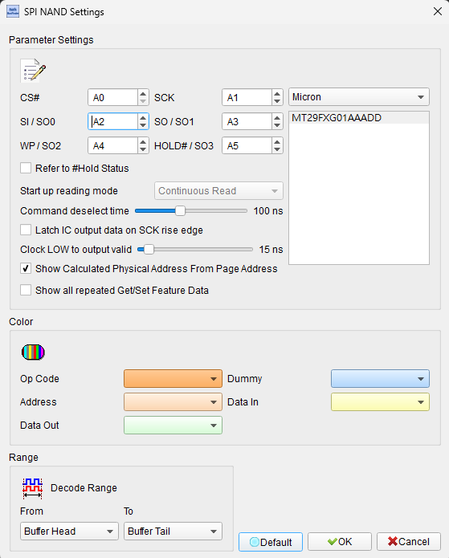
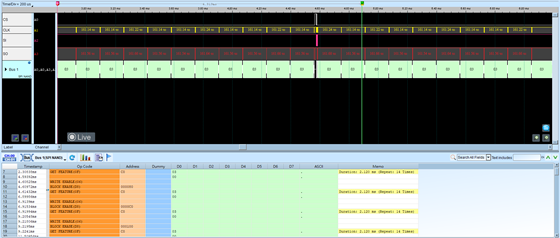

# SPI NAND

## Decode Settings
<figure markdown>
  
  <figcaption>Decode Settings</figcaption>
</figure>

## Example
<figure markdown>
  
  <figcaption>Decode Example</figcaption>
</figure>

## What is SPI NAND?

SPI NAND is a NAND flash memory variant that uses the Serial Peripheral Interface (SPI) protocol for communication with host controllers, combining the high density and low cost of NAND flash with the simplicity and ease of integration of SPI. Introduced in the early 2010s by manufacturers like Micron, Winbond, GigaDevice, and Macronix, SPI NAND was developed to address the growing complexity of parallel NAND interfaces while maintaining compatibility with widely-adopted SPI infrastructure. Unlike parallel NAND which requires 16+ I/O pins and complex timing management, SPI NAND operates with as few as 4-6 pins using standard SPI bus protocols, making it ideal for space-constrained embedded systems and applications requiring simpler PCB routing.

The SPI NAND architecture inherits the block-and-page structure of traditional NAND flash (typically 2KB or 4KB pages organized in 64-page or 128-page blocks) while adding an internal SRAM buffer (page cache) and built-in Error Correction Code (ECC) engine. Commands are sent serially over the SPI bus using opcodes similar to SPI NOR flash, but the underlying NAND architecture requires explicit page read, program, and erase operations. Most SPI NAND devices support standard SPI (single data line), Dual SPI (x2), and Quad SPI (x4) for enhanced throughput, achieving clock frequencies up to 133 MHz and effective read speeds of 50-70 MB/s in Quad mode, significantly faster than standard SPI but slower than parallel NAND or eMMC interfaces.

SPI NAND has gained widespread adoption in cost-sensitive embedded applications including IoT devices, set-top boxes, automotive infotainment systems, and consumer electronics where its simplified interface, lower pin count, and reduced controller complexity outweigh the performance limitations compared to parallel NAND. The integration of ECC, bad block management features, and compatibility with existing SPI flash controllers makes SPI NAND an attractive drop-in alternative to SPI NOR flash when higher densities (typically 1Gb to 8Gb) are required at lower per-bit costs.

## Technical Specifications

### Physical Interface

**Standard SPI Mode (4 pins minimum):**
- **/CS**: Chip Select (active low)
- **CLK**: Serial Clock (up to 133 MHz)
- **DI (IO0)**: Data Input / bidirectional I/O in Quad mode
- **DO (IO1)**: Data Output / bidirectional I/O in Quad mode

**Quad SPI Mode (6 pins):**
- **/WP (IO2)**: Write Protect / bidirectional I/O in Quad mode
- **/HOLD (IO3)**: Hold function / bidirectional I/O in Quad mode

**Package Types:**
- WSON8 (8-pin, 6mm × 5mm or 8mm × 6mm)
- TFBGA24 (24-ball BGA for higher pin count devices)
- SO8, SO16 (Small Outline packages)

**Operating Voltage:**
- **VCC**: 2.7V–3.6V (3.3V devices) or 1.7V–1.95V (1.8V devices)
- **VCCQ**: Separate I/O voltage supply on some devices (1.8V or 3.3V)

### Memory Organization

**Page Structure:**
- **Page size**: 2048 bytes (2KB) + 64-byte spare area (most common)
- Alternative: 4096 bytes (4KB) + 256-byte spare area
- **Spare area**: Used for ECC parity, bad block markers, metadata

**Block Structure:**
- **Block size**: 64 pages/block (128KB for 2KB pages) or 128 pages/block (256KB)
- **Plane**: Multiple planes support parallel operations (device-dependent)
- **Total capacity**: Common sizes 1Gb, 2Gb, 4Gb, 8Gb

**Internal Architecture:**
- **Page buffer/cache**: Internal SRAM (2KB or 4KB) for staging read/write operations
- **ECC engine**: Built-in hardware ECC (typically 1-bit to 8-bit per 512-byte sector)

### Clock Frequencies and Data Rates

**Clock Speed:**
- **Standard operating**: Up to 104-133 MHz
- **Read operations**: 50-104 MHz typical
- **Program/Erase**: Lower frequency (20-50 MHz typical)

**Effective Throughput:**
- **Standard SPI (x1)**: ~13 MB/s at 104 MHz
- **Dual SPI (x2)**: ~26 MB/s at 104 MHz
- **Quad SPI (x4)**: ~50-70 MB/s at 104 MHz

**Latency:**
- **Page read latency**: 25-60µs (transfer from NAND array to cache)
- **Page program**: 200-400µs
- **Block erase**: 2-5ms
- **SPI transfer time**: Additional time for clocking data over serial interface

### Command Set

**Device Management:**
- **0Fh**: GET FEATURES (read status/configuration registers)
- **1Fh**: SET FEATURES (write configuration registers)
- **9Fh**: READ ID (manufacturer and device ID)
- **FFh**: RESET

**Read Operations:**
- **13h**: PAGE READ (transfer page from array to cache buffer)
- **03h**: READ FROM CACHE (standard SPI, 1-bit)
- **3Bh**: READ FROM CACHE (Dual Output, x2)
- **6Bh**: READ FROM CACHE (Quad Output, x4)
- **BBh**: READ FROM CACHE (Dual I/O, x2 address + data)
- **EBh**: READ FROM CACHE (Quad I/O, x4 address + data)

**Program Operations:**
- **02h**: PROGRAM LOAD (standard SPI, load data to cache)
- **32h**: PROGRAM LOAD (Quad Input, x4)
- **84h**: PROGRAM LOAD RANDOM DATA (update specific bytes)
- **10h**: PROGRAM EXECUTE (write cache to NAND array)

**Erase Operations:**
- **D8h**: BLOCK ERASE

**Protection:**
- **06h**: WRITE ENABLE
- **04h**: WRITE DISABLE

### Status Registers

**Status Register (C0h):**
- **Bit 0 (OIP)**: Operation In Progress
- **Bit 2 (WEL)**: Write Enable Latch
- **Bit 3 (E_FAIL)**: Erase failure
- **Bit 5 (P_FAIL)**: Program failure
- **Bit 6 (ECC status)**: ECC error threshold
- **Bit 7 (ECCS)**: ECC status indicator

**Configuration Register (B0h):**
- **ECC enable/disable**: Control internal ECC
- **Buffer mode**: Buffered or continuous read
- **Output driver strength**: Adjust signal drive
- **Block protection bits**: Write protection configuration

## Common Applications

SPI NAND is widely used in cost-sensitive embedded applications:

- **IoT and connected devices**: Smart home devices, sensors, wearables
- **Set-top boxes and streaming devices**: Firmware and content storage
- **Automotive infotainment**: Navigation maps, multimedia storage
- **Industrial controllers**: Data logging, configuration storage
- **Consumer electronics**: Smart speakers, digital cameras, drones
- **Networking equipment**: Routers, switches, access points (firmware and logs)
- **Point-of-sale terminals**: Transaction logging, application storage
- **Printer and scanner firmware**: Embedded system storage
- **Smart meters**: Energy/utility meter data logging
- **Surveillance systems**: Low-resolution video buffering and configuration
- **Medical devices**: Patient data and diagnostic storage (non-critical applications)
- **Embedded Linux systems**: Root filesystem and boot storage
- **Single-board computers**: Cost-effective storage for Raspberry Pi alternatives
- **Code storage**: Microcontroller external program memory
- **Boot code storage**: Primary or secondary boot device

## Decoder Configuration

When configuring a logic analyzer to decode SPI NAND signals:

### Channel Assignment

**Essential Signals:**
- **/CS**: Chip Select (required)
- **CLK**: Serial Clock (required)
- **DI/IO0**: Data Input/Output (required)
- **DO/IO1**: Data Output/Input (required)

**For Quad SPI Decoding:**
- **IO2**: Write Protect / I/O 2
- **IO3**: Hold / I/O 3

### Protocol Parameters

- **SPI mode**: Standard SPI (x1), Dual SPI (x2), or Quad SPI (x4)
- **Clock polarity (CPOL)**: Typically CPOL=0 (clock idle low)
- **Clock phase (CPHA)**: Typically CPHA=0 (sample on leading edge)
- **Bit order**: MSB first (standard for SPI NAND)
- **Page size**: 2048 bytes or 4096 bytes
- **Spare area size**: 64 bytes or 256 bytes

### Decoding Options

- **Command decoding**: Translate opcodes (13h → "PAGE READ", 02h → "PROGRAM LOAD")
- **Address display**: Show page address or column address depending on command
- **Data payload**: Display read/write data in hex/ASCII format
- **Status register**: Decode OIP, WEL, E_FAIL, P_FAIL, ECC status bits
- **Feature register**: Parse configuration register settings
- **Multi-step operation tracking**: Link PAGE READ → READ FROM CACHE sequences
- **ECC status monitoring**: Flag ECC errors from status register

### Trigger Configuration

- **Command trigger**: Trigger on specific opcode (e.g., PAGE READ, PROGRAM EXECUTE)
- **Address trigger**: Trigger when specific page address is accessed
- **Status error**: Trigger on P_FAIL or E_FAIL bit in status register
- **ECC error**: Trigger when ECC status indicates uncorrectable error
- **Chip select**: Trigger on /CS assertion to capture complete transactions

### Analysis Tips

When analyzing SPI NAND communications:

1. **Understand two-step read**: Unlike SPI NOR, reading requires PAGE READ (13h) to load cache, then READ FROM CACHE (03h/6Bh) to transfer data
2. **Monitor status polling**: After PAGE READ or PROGRAM EXECUTE, host polls status register (0Fh command to register C0h) until OIP bit clears
3. **Track program sequence**: WRITE ENABLE (06h) → PROGRAM LOAD (02h) with data → PROGRAM EXECUTE (10h) → status poll → verify P_FAIL
4. **Identify Quad mode switches**: Watch for transition between standard and Quad commands (03h vs. 6Bh, 02h vs. 32h)
5. **Check ECC status**: After reads, examine ECC status bits to identify correctable vs. uncorrectable errors
6. **Verify addressing**: Page address in PAGE READ command, column address in READ/PROGRAM FROM CACHE
7. **Measure timing**: Ensure adequate delay after PROGRAM EXECUTE or BLOCK ERASE before status polling

### Common Protocol Patterns

**Read Page Sequence:**
1. Assert /CS
2. Send command 13h (PAGE READ)
3. Send 8-bit dummy byte (00h)
4. Send 16-bit page address
5. Deassert /CS
6. Wait tRD (page read time, ~25-60µs)
7. Poll status register (0Fh to C0h) until OIP=0
8. Assert /CS
9. Send command 6Bh (READ FROM CACHE x4) or 03h (standard)
10. Send 16-bit column address
11. Send dummy byte(s)
12. Clock out data (2048+ bytes)
13. Deassert /CS

**Program Page Sequence:**
1. Send 06h (WRITE ENABLE)
2. Send 02h or 32h (PROGRAM LOAD)
3. Send 16-bit column address
4. Send 2048+ bytes of data
5. Send 10h (PROGRAM EXECUTE) with page address
6. Poll status register until OIP=0
7. Check P_FAIL bit for success/failure

**Erase Block Sequence:**
1. Send 06h (WRITE ENABLE)
2. Send D8h (BLOCK ERASE)
3. Send 24-bit block address
4. Poll status register until OIP=0
5. Check E_FAIL bit for success/failure

## Reference

- [Micron SPI NAND Flash Memory Datasheet (MT29F4G01)](https://static.chipdip.ru/lib/387/DOC022387567.pdf)
- [Winbond W25N01GW SPI NAND Datasheet](https://www.mouser.com/datasheet/2/949/Winbond_Electronics_Corporation_09_05_2024_W25N01G-3500974.pdf)
- [Winbond QspiNAND Product Family](https://www.winbond.com/hq/product/code-storage-flash-memory/qspinand-flash/)
- [Wikipedia: Flash Memory](https://en.wikipedia.org/wiki/Flash_memory#NAND_flash)
- [GigaDevice SPI NAND Product Brief](https://www.gigadevice.com/products/nand-flash/spi-nand-flash/)
