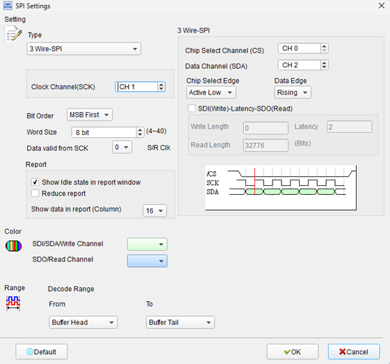
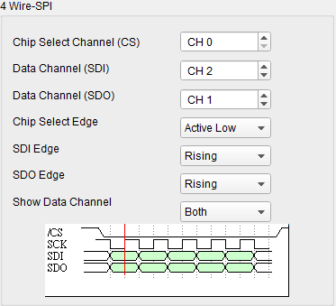
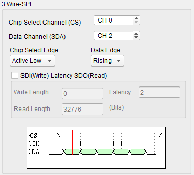
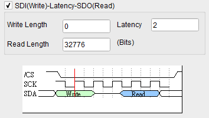
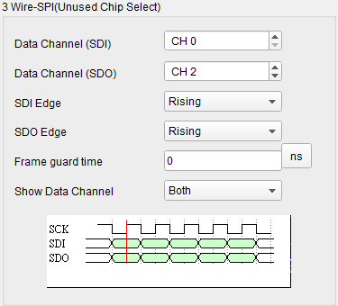
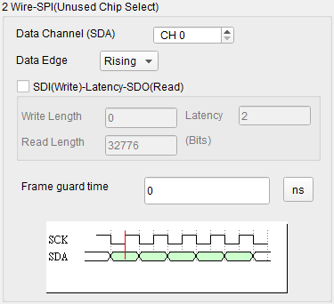
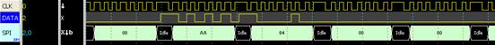
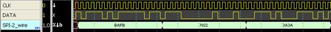
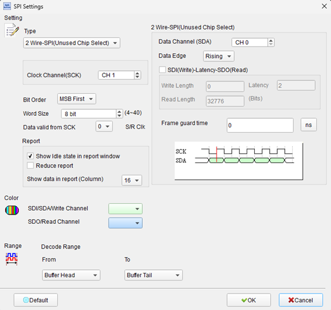
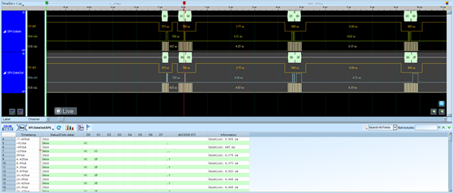

# SPI (Serial Peripheral Interface)

## Decode Settings
<figure markdown>
  
  <figcaption>Decode Settings</figcaption>
</figure>

## Example
<figure markdown>
  
  <figcaption>Decode Example</figcaption>
</figure>
<figure markdown>
  
  <figcaption>Decode Figure</figcaption>
</figure>
<figure markdown>
  
  <figcaption>Decode Figure</figcaption>
</figure>
<figure markdown>
  
  <figcaption>Decode Figure</figcaption>
</figure>
<figure markdown>
  
  <figcaption>Decode Figure</figcaption>
</figure>
<figure markdown>
  
  <figcaption>Decode Figure</figcaption>
</figure>
<figure markdown>
  
  <figcaption>Decode Figure</figcaption>
</figure>
<figure markdown>
  
  <figcaption>Decode Figure</figcaption>
</figure>
<figure markdown>
  
  <figcaption>Decode Figure</figcaption>
</figure>
<figure markdown>
  
  <figcaption>Decode Figure</figcaption>
</figure>

## What is SPI?

### Overview

SPI (Serial Peripheral Interface) is a synchronous serial communication protocol originally developed by Motorola in the mid-1980s for short-distance communication between microcontrollers and peripheral devices such as sensors, memory chips, displays, and communication modules. Despite never being formally standardized by a standards body like IEEE or ISO, SPI has become a de facto standard supported by virtually every microcontroller and peripheral manufacturer worldwide. Its popularity stems from its simplicity, full-duplex capability, and high-speed performance—factors that make it ideal for embedded systems where fast, efficient communication is required.

SPI operates on a master-slave architecture where the master device generates the clock signal and initiates all communications. Multiple slave devices can share the same bus through individual chip select lines, allowing the master to address each slave uniquely. Unlike I²C which uses a two-wire bidirectional interface, SPI uses separate lines for transmit and receive, enabling true full-duplex communication where data flows simultaneously in both directions. This architectural difference gives SPI a speed advantage, with clock rates ranging from hundreds of kilohertz to over 50 MHz in many implementations, though it requires more pins than I²C.

### Historical Context

Motorola (now part of NXP Semiconductors) introduced SPI in the 1980s as part of its 68000-series microcontrollers. The lack of formal standardization has led to minor variations in implementation details across different vendors, but the core four-wire interface and fundamental operating principles remain consistent. This flexibility has allowed SPI to adapt to diverse applications while maintaining broad compatibility.

## Technical Specifications

### Signal Lines (Four-Wire Interface)

**SCLK (Serial Clock) / SCK**:
- Generated by master device
- Synchronizes data transfer
- Typical frequencies: 1-50 MHz (device-dependent)
- Continuous or gated during transfers
- Rising or falling edge active (mode-dependent)

**MOSI (Master Out, Slave In) / SDO / DI**:
- Data line from master to slave(s)
- Carries command, address, and write data
- Master drives, slave(s) receive
- Alternative names: SDO (Serial Data Out), DI (Data In), SIMO (Slave In, Master Out)

**MISO (Master In, Slave Out) / SDI / DO**:
- Data line from slave to master
- Carries read data and responses
- Slave drives when selected, master receives
- Alternative names: SDI (Serial Data In), DO (Data Out), SOMI (Slave Out, Master In)
- Tri-state when slave not selected

**SS (Slave Select) / CS (Chip Select)**:
- Individual select line for each slave device
- Active low in most implementations (active high in some)
- Master asserts to activate specific slave
- Only selected slave drives MISO line
- Deassert between transactions or frame bytes (device-dependent)

### SPI Modes (CPOL and CPHA)

SPI timing is defined by two parameters:

**CPOL (Clock Polarity)**:
- CPOL=0: Clock idles low, active high
- CPOL=1: Clock idles high, active low

**CPHA (Clock Phase)**:
- CPHA=0: Data sampled on first (leading) clock edge, shifted on second (trailing) edge
- CPHA=1: Data shifted on first clock edge, sampled on second clock edge

**Four SPI Modes**:
- **Mode 0** (CPOL=0, CPHA=0): Idle low, sample on rising edge
- **Mode 1** (CPOL=0, CPHA=1): Idle low, sample on falling edge
- **Mode 2** (CPOL=1, CPHA=0): Idle high, sample on falling edge
- **Mode 3** (CPOL=1, CPHA=1): Idle high, sample on rising edge

Master and slave must use the same mode. Mode 0 and Mode 3 are most common.

### Multi-Slave Configurations

**Independent Slave Select**:
- Each slave has dedicated SS line from master
- Master activates one slave at a time
- Scalability limited by available GPIO pins on master
- Most common approach

**Daisy-Chain**:
- MISO of slave N connects to MOSI of slave N+1
- All slaves share single SS line
- Data propagates through all slaves
- Longer transactions but fewer pins

**Shared Chip Select**:
- Multiple slaves share SS if they have unique addresses
- Requires protocol-level addressing
- Less common, device-specific

## Data Transfer

**Simultaneous Transmit/Receive**:
Every SPI transaction exchanges data in both directions:
1. Master asserts SS for target slave
2. Master generates SCLK pulses
3. On each clock cycle: Master shifts out bit on MOSI, shifts in bit from MISO
4. Slave simultaneously: Shifts out bit on MISO, shifts in bit from MOSI
5. After N bits: Master deasserts SS

Even write-only operations receive data (discarded), and read operations transmit dummy data.

**Word Sizes**:
- 8-bit: Most common (standard byte)
- 16-bit: Some devices (DACs, ADCs)
- 12-bit, 10-bit: ADCs with specific resolutions
- Variable: Some devices support arbitrary bit counts

## Protocol Layers

### Physical Layer

- Point-to-point master-slave connections
- CMOS/TTL logic levels typical (3.3V or 5V)
- Short distance (typically <3 meters; PCB-level <30cm without buffering)
- No defined maximum speed (limited by device capabilities and signal integrity)
- Full-duplex operation on separate MOSI/MISO lines

### Transaction Layer

**Typical Transaction Sequence**:
1. Idle: SS high, SCLK in idle state, MISO tri-stated
2. Master asserts SS low
3. Optional delay (setup time)
4. Master generates SCLK pulses while data exchanges
5. Optional delay (hold time)
6. Master deasserts SS high
7. Return to idle

**Command/Response Patterns**:
Many SPI devices use multi-byte protocols:
- Byte 1: Command opcode or register address
- Byte 2: Sub-address or parameter
- Bytes 3+: Data payload

Example (Flash Read):
- Master sends: \[0x03\]\[Address High\]\[Address Mid\]\[Address Low\]\[Dummy\]\[Dummy\]...
- Slave sends: \[Dummy\]\[Dummy\]\[Dummy\]\[Dummy\]\[Data 1\]\[Data 2\]...

## Common Applications

SPI is ubiquitous in embedded systems:

**Memory Devices**:
- Serial Flash (NOR Flash)
- Serial EEPROM
- FRAM (Ferroelectric RAM)
- SD cards (SPI mode)

**Sensors**:
- Accelerometers, gyroscopes
- Temperature sensors
- Pressure sensors
- Magnetic sensors

**Display Drivers**:
- LCD controllers
- OLED displays
- E-paper displays
- LED drivers

**Communication**:
- Wireless modules (WiFi, Bluetooth, LoRa)
- Ethernet controllers
- CAN controllers
- RF transceivers

**Data Acquisition**:
- ADCs (Analog-to-Digital Converters)
- DACs (Digital-to-Analog Converters)
- Digital potentiometers

**Audio**:
- Audio codecs
- Amplifier control
- DSP interfaces

## Advantages

- **High Speed**: Much faster than I²C (MHz vs. kHz)
- **Full-Duplex**: Simultaneous bidirectional communication
- **Simple Protocol**: No complex addressing or arbitration
- **Flexible**: No standard limits on speed or word size
- **Low Overhead**: Minimal protocol complexity
- **Hardware Support**: Built into virtually all microcontrollers

## Disadvantages

- **More Pins**: 4 wires + 1 per slave (vs. I²C's 2 wires total)
- **No Acknowledgment**: No built-in error checking or flow control
- **Short Distance**: Designed for PCB-level, not cable connections
- **No Standard**: Variations exist between implementations
- **No Multi-Master**: Single master limits topology options
- **Interrupt-Based**: Typically requires interrupt or polling for slave data ready

## Decoder Configuration

When configuring an SPI decoder:

- **Signal Assignment**: Map SCLK, MOSI, MISO, SS/CS channels
- **SPI Mode**: Select Mode 0, 1, 2, or 3 (CPOL/CPHA)
- **Clock Speed**: Specify expected SCLK frequency
- **Word Size**: Set bits per word (typically 8, but 12, 16, etc.)
- **Bit Order**: MSB first (common) or LSB first
- **CS Polarity**: Active low (typical) or active high
- **Protocol Interpretation**: Load device-specific command decoder if available

## Reference

- [Wikipedia: Serial Peripheral Interface](https://en.wikipedia.org/wiki/Serial_Peripheral_Interface)
- [Microchip: Motorola SPI Protocol](https://onlinedocs.microchip.com/oxy/GUID-199548F4-607C-436B-80C7-E4F280C1CAD2-en-US-1/GUID-E0991B55-E5C3-419C-AD24-6746DD6BA228.html)
- [Intel: Motorola SPI Protocol](https://www.intel.com/content/www/us/en/docs/programmable/683567/23-1/motorola-spi-protocol.html)
- [Motorola SPI Modes](https://onlinedocs.microchip.com/oxy/GUID-199548F4-607C-436B-80C7-E4F280C1CAD2-en-US-1/GUID-CDD740F8-D1F7-49C2-A44E-381CF56858C7.html)
