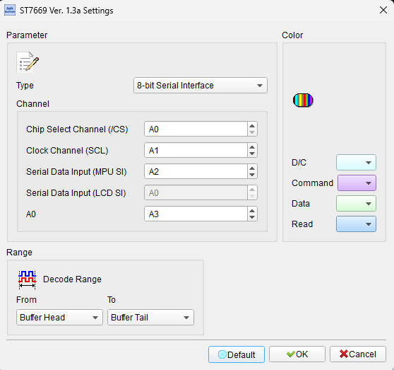
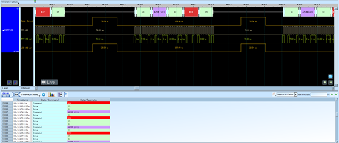

# ST7669 (LCD Controller)

## Decode Settings
<figure markdown>
  
  <figcaption>Decode Settings</figcaption>
</figure>

## Example
<figure markdown>
  
  <figcaption>Decode Example</figcaption>
</figure>

## What is ST7669?

The ST7669 is a 262K-color dot-matrix LCD controller and driver IC manufactured by Sitronix Technology, designed to control small to medium-sized color TFT (Thin-Film Transistor) LCD panels with resolutions up to 132×162 pixels. This controller integrates RAM for display data storage, timing generation for LCD refresh, DC-DC converters for LCD bias voltages, and driver circuits to directly control the LCD panel's row and column electrodes. The ST7669 communicates with host microcontrollers through industry-standard parallel (8080/6800-style) or serial (SPI) interfaces, receiving commands, configuration parameters, and pixel data to render images on the connected display. As an all-in-one display solution, the ST7669 simplifies embedded system design by eliminating the need for external driver circuits, power supplies, and complex timing control.

The ST7669 supports 262,144 colors (18-bit RGB with 6 bits per color channel) and includes built-in display RAM (GRAM) to store the full frame buffer, allowing the host processor to update the display asynchronously without continuous data streaming. The controller handles all LCD-specific timing (horizontal and vertical sync, frame rate, blanking intervals), gamma correction for improved color rendering, and power management modes (sleep, partial display, display on/off) to reduce power consumption in battery-operated devices. Communication protocols support both 8-bit parallel interfaces (similar to Intel 8080 or Motorola 6800 bus timing) and 3-wire or 4-wire SPI serial interfaces, providing flexibility for different microcontroller platforms and PCB routing constraints.

The ST7669 is commonly found in portable electronics, industrial displays, medical instruments, and consumer products requiring compact, low-power color displays. Its integration reduces component count and simplifies software development, as manufacturers provide initialization sequences and pixel-writing routines compatible with common microcontroller platforms (Arduino, STM32, ESP32, etc.). From a logic analyzer perspective, decoding ST7669 communication involves capturing and interpreting the command and data transactions between the host microcontroller and the LCD controller, verifying correct initialization, monitoring pixel data transfers, and troubleshooting display issues such as incorrect colors, partial updates, or timing problems.

## Technical Specifications

### Display Specifications

**Resolution and Color Depth:**
- **Resolution**: 132 × 162 pixels (RGB)
- **Color Support**: 262,144 colors (18-bit RGB, 6 bits per channel)
- **Display RAM (GRAM)**: On-chip frame buffer for full display content

**Integrated Features:**
- DC-DC converters for LCD bias voltages
- Gamma correction for improved color rendering
- Timing generator for LCD refresh control
- Row and column drivers integrated

### Communication Interfaces

**Parallel Interface (8-bit):**

**Intel 8080 Mode:**
- **Data Bus**: D[7:0] - 8-bit bidirectional data
- **Control Signals**:
  - CS# (Chip Select): Active low, enables device
  - WR# (Write): Active low, write strobe
  - RD# (Read): Active low, read strobe
  - D/C (Data/Command): High for data, low for command
  - RESET#: Hardware reset (active low)

**Motorola 6800 Mode:**
- **Data Bus**: D[7:0] - 8-bit bidirectional data
- **Control Signals**:
  - CS# (Chip Select): Active low
  - R/W: Read/Write direction (high=read, low=write)
  - E (Enable): Clock/strobe signal
  - D/C (Data/Command): High for data, low for command
  - RESET#: Hardware reset

**Serial Interface (SPI):**

**4-Wire SPI:**
- **SCL (SCLK)**: Serial clock
- **SDA (MOSI)**: Master-out-slave-in data
- **SDO (MISO)**: Master-in-slave-out data (optional, for reading)
- **CS# (Chip Select)**: Active low
- **D/C**: Data/command select
- **RESET#**: Hardware reset

**3-Wire SPI:**
- **SCL**: Serial clock
- **SDA**: Bidirectional data (9-bit protocol: 1-bit D/C + 8-bit data)
- **CS#**: Chip select
- **RESET#**: Hardware reset

**Timing:**
- **Parallel write cycle**: ~100-200 ns typical
- **SPI clock**: Up to 10-20 MHz typical (device-specific)
- **Frame rate**: 60-80 Hz typical

### Command Set

**Common Commands:**
- **SLPIN / SLPOUT**: Sleep in / Sleep out (power management)
- **DISPOFF / DISPON**: Display off / Display on
- **CASET**: Column address set (define X range for pixel write)
- **RASET**: Row address set (define Y range for pixel write)
- **RAMWR**: Memory write (write pixel data to GRAM)
- **RAMRD**: Memory read (read pixel data from GRAM)
- **MADCTL**: Memory data access control (rotation, mirroring, color order)
- **COLMOD**: Color mode set (16-bit, 18-bit color formats)
- **Gamma settings**: Gamma curve adjustment commands

### Power and Electrical

**Supply Voltages:**
- **VDD**: Digital logic supply (1.8V or 2.8V typical)
- **VDDIO**: I/O interface supply (1.8V to 3.3V)
- **LCD voltages**: Generated internally by DC-DC converters

**Power Consumption:**
- Display-dependent (varies with content and brightness)
- Sleep mode reduces power significantly

## Common Applications

The ST7669 LCD controller is used in color display applications:

**Portable Electronics:**
- Handheld gaming devices
- Portable media players
- GPS navigation units
- Digital cameras and camcorders (viewfinders, menus)

**Industrial Instruments:**
- Process control displays
- Test and measurement equipment front panels
- Data loggers with graphical display
- Embedded HMI (Human-Machine Interface)

**Medical Devices:**
- Portable diagnostic instruments
- Patient monitors (compact modules)
- Medical imaging equipment UI
- Wearable health monitors

**Consumer Products:**
- Smart thermostats and home automation panels
- Fitness trackers and smartwatches
- E-readers and digital notepads
- Toys and educational electronics

**Automotive:**
- Aftermarket displays (backup cameras, dashcams)
- Gauge clusters (custom instrumentation)
- Climate control interfaces

**Development and Prototyping:**
- Microcontroller development boards (Arduino, STM32)
- Display breakout modules for prototyping
- Education and maker projects

## Decoder Configuration

When configuring a logic analyzer to decode ST7669 communication:

### Channel Assignment

**For Parallel Interface (8080 Mode):**
- **D[7:0]**: 8-bit data bus (8 channels)
- **CS#**: Chip select
- **WR#**: Write strobe
- **RD#**: Read strobe (optional if only writing)
- **D/C**: Data/command select
- **RESET#**: Reset signal (optional, for initialization capture)

**For Parallel Interface (6800 Mode):**
- **D[7:0]**: 8-bit data bus (8 channels)
- **CS#**: Chip select
- **R/W**: Read/write direction
- **E**: Enable (clock)
- **D/C**: Data/command select
- **RESET#**: Reset signal (optional)

**For Serial Interface (4-Wire SPI):**
- **SCL**: Serial clock
- **SDA**: Serial data (MOSI)
- **SDO**: Serial data out (MISO): optional
- **CS#**: Chip select
- **D/C**: Data/command select
- **RESET#**: Reset signal (optional)

**For Serial Interface (3-Wire SPI):**
- **SCL**: Serial clock
- **SDA**: Bidirectional data
- **CS#**: Chip select
- **RESET#**: Reset signal (optional)

### Protocol Parameters

**Interface Type:**
Select decoder mode:
- Intel 8080 parallel (8-bit)
- Motorola 6800 parallel (8-bit)
- SPI 4-wire
- SPI 3-wire (9-bit protocol)

**SPI Settings (if applicable):**
- **Clock polarity (CPOL)**: Typically 0 or 1 (device-specific)
- **Clock phase (CPHA)**: Typically 0 or 1
- **Bit order**: MSB-first (most significant bit first)
- **Clock speed**: Up to 10-20 MHz

**Decoding Options:**
- **Command interpretation**: Display command names (RAMWR, CASET, etc.)
- **Data vs. Command**: Distinguish commands from data using D/C signal
- **Pixel data visualization**: Show RGB pixel values, optionally as color swatches
- **Address tracking**: Track current X,Y position during RAMWR

### Trigger Settings

**Common trigger configurations:**
- **RESET# pulse**: Trigger on hardware reset to capture initialization
- **Specific command**: Trigger on RAMWR, DISPON, or other key commands
- **CS# assertion**: Trigger on start of transaction (CS# goes low)
- **Data/Command transition**: Trigger on D/C changes
- **Frame update**: Trigger on start of pixel data write (RAMWR command)

### Display Options

**Visualization:**
- **Command/Data annotation**: Label transactions as command or data
- **Pixel data display**: Show pixel values in hex (e.g., RGB666: 0x3F, 0x00, 0x00 for red)
- **Transaction grouping**: Group related commands (e.g., CASET, RASET, RAMWR)
- **Timing measurements**: Show write cycle timing, setup/hold times

### Analysis Tips

**Initialization Sequence Capture:**
Capture from device power-up or RESET# assertion to observe the full initialization sequence. Verify all necessary configuration commands are sent (sleep out, display on, pixel format, orientation, gamma, etc.).

**Pixel Data Verification:**
When debugging display issues (wrong colors, partial updates), capture RAMWR transactions and verify:
- Correct number of pixels written
- Correct RGB values (check byte order: some use RGB, others BGR)
- CASET/RASET define correct region before RAMWR

**Timing Compliance:**
For parallel interfaces, measure write cycle timing (tWC), setup time (tSU), and hold time (tH). Ensure microcontroller meets ST7669 timing requirements. Violations cause corrupted data.

**SPI Mode and Speed:**
Verify SPI clock polarity/phase settings match ST7669 requirements. If clock speed is too high, data may be corrupted. Reduce clock speed if communication errors observed.

**Command Sequence:**
Certain commands must be sent in specific order (e.g., SLPOUT before DISPON). Verify initialization follows datasheet recommended sequence. Out-of-order commands cause display malfunction.

**D/C Signal Timing:**
The D/C (Data/Command) signal must be stable before and during write cycles. Glitches or incorrect timing cause commands to be interpreted as data (or vice versa).

**GRAM Address Wraparound:**
When writing pixels beyond defined region (CASET/RASET), GRAM address wraps around. Verify address region is set correctly before pixel write to avoid unexpected behavior.

## Reference

- [Sitronix ST7669 Datasheet](https://crystalfontz.com/controllers/Sitronix/ST7669): Official IC specifications
- [ST7669 Controller Information](https://crystalfontz.com/controllers/datasheet-viewer.php?id=316): Datasheet viewer
- [LCD Controller Datasheets](https://www.crystalfontz.com/controllers/): Reference collection
- [Adafruit GFX Library](https://github.com/adafruit/Adafruit-GFX-Library): Common graphics library supporting similar controllers
- ST7669 datasheet (PDF): Full technical specifications (available from Sitronix or distributors)
