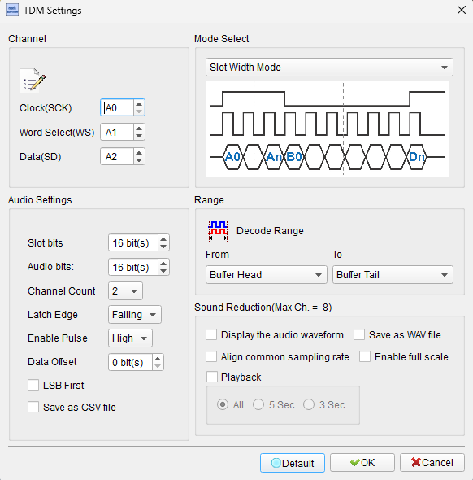
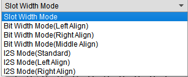
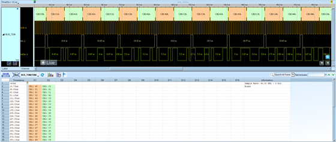

# TDM (Time Division Multiplexing Audio Interface)


## Decode Settings
<figure markdown>
  
  <figcaption>Decode Settings</figcaption>
</figure>

## Example
<figure markdown>
  
  <figcaption>Decode Example</figcaption>
</figure>
<figure markdown>
  
  <figcaption>Decode Figure</figcaption>
</figure>

## What is TDM?

### Overview

TDM (Time Division Multiplexing) is a serial audio interface protocol that enables the transmission of multiple audio channels over a single data line by dividing time into discrete slots, with each slot carrying data for a specific channel. In the context of digital audio hardware, TDM typically refers to a synchronous serial interface where multiple audio channels are transmitted sequentially within each frame period, synchronized by a frame sync pulse and bit clock. This approach allows efficient use of bus bandwidth while supporting high channel counts, making TDM ideal for multi-channel audio systems such as automotive audio, professional audio mixing, voice communication systems, and multi-microphone arrays.

The TDM audio interface is closely related to I2S and PCM protocols but is specifically designed for more than two channels. A TDM frame begins with a short frame sync pulse (typically one bit clock period), followed immediately by sequential time slots for each channel. Each slot typically contains 16, 24, or 32 bits of audio data. The total number of channels supported depends on the bit clock frequency, slot size, and desired sample rate. For example, with a 12.288 MHz bit clock and 32-bit slots at 48 kHz sampling, eight channels can be supported (12.288 MHz / 48 kHz / 32 bits = 8 channels).

TDM has become a standard interface in modern audio processors, CODECs, DSPs, and microcontrollers with multi-channel audio capability. Unlike analog multi-channel solutions or parallel digital buses, TDM provides a compact serial interface that minimizes pin count and routing complexity while maintaining sample-accurate synchronization across all channels. The protocol is widely supported by audio chipset manufacturers including Analog Devices, Texas Instruments, Cirrus Logic, and others, though specific timing details and configurations may vary between implementations.

### Key Features

- **Multi-Channel**: Supports 2 to 32+ audio channels on one data line
- **Time-Slotted**: Sequential channel data within each frame
- **Synchronous**: Frame sync and bit clock for precise timing
- **Scalable Bandwidth**: Channel count determined by clock frequency
- **Sample-Accurate**: All channels synchronized to same sample clock
- **Bidirectional**: Separate TX and RX data lines for full-duplex
- **Variable Slot Size**: 16, 24, or 32 bits per slot typical
- **Standard Sample Rates**: 8 kHz to 192 kHz and beyond
- **Industry Standard**: Widely supported in audio ICs
- **Low Pin Count**: Minimal interface compared to parallel alternatives

## Technical Specifications

### Signal Description

**TDM Interface Signals** (typically 4 signals for full-duplex)

- **BCLK / SCK (Bit Clock)**: Serial bit clock for data synchronization
- **FS / SYNC (Frame Sync)**: Frame synchronization pulse marking start of frame
- **SDATA_TX / TX (Transmit Data)**: Serial data output from master to slave
- **SDATA_RX / RX (Receive Data)**: Serial data input from slave to master

**Optional Signals**
- **MCLK (Master Clock)**: System master clock (256× or 512× sample rate)

### Frame Structure

**TDM Frame Organization**

A TDM frame consists of:
1. **Frame Sync Pulse**: Short pulse (typically 1 BCLK period) marking frame start
2. **Channel Slots**: Sequential time slots for each channel
3. **Each Slot**: Contains one audio sample (16/24/32 bits)
4. **Frame Boundary**: Frame sync repeats at sample rate interval

**Timing Diagram (4-channel example, 32-bit slots)**
```
FS:      _|‾|__________________________________|‾|____
BCLK:    _|‾|_|‾|_|‾|_|‾|_|‾|_|‾|_|‾|_|‾|_|‾|_|‾|_
SDATA:   X| CH0 (32 bits)  | CH1 (32 bits)  | CH2 (32 bits)  | CH3 (32 bits)  |X
         Start  Slot 0       Slot 1           Slot 2           Slot 3         Next Frame
```

### Clock Relationships

**Bit Clock (BCLK)**
```
BCLK = Sample_Rate × Channels × Bits_Per_Slot
```

**Examples:**
- 48 kHz, 4 channels, 32-bit slots: BCLK = 48,000 × 4 × 32 = 6.144 MHz
- 48 kHz, 8 channels, 32-bit slots: BCLK = 48,000 × 8 × 32 = 12.288 MHz
- 48 kHz, 16 channels, 32-bit slots: BCLK = 48,000 × 16 × 32 = 24.576 MHz

**Frame Sync Frequency**
```
FS = Sample_Rate
```
FS repeats once per sample period for all channels

**Master Clock (MCLK)**
- Typically 256× or 512× sample rate
- 48 kHz: MCLK = 12.288 MHz (256×) or 24.576 MHz (512×)
- Provides reference for internal PLLs and oversampling

### Slot Configuration

**Slot Width**
- **16-bit**: Compact, suitable for voice applications
- **24-bit**: Professional audio quality
- **32-bit**: Highest precision, alignment convenience

**Data Alignment within Slot**
- **MSB First**: Standard (most significant bit transmitted first)
- **Left-Aligned**: Data starts at beginning of slot, padding in LSBs
- **Right-Aligned**: Data ends at slot boundary, padding in MSBs

**Active Bits within Slot**
- 16-bit data in 32-bit slot: Can be left-aligned (bits 31-16) or right-aligned (bits 15-0)
- 24-bit data in 32-bit slot: Often left-aligned (bits 31-8) for convenience

### Frame Sync Variations

**Early Frame Sync**
- FS pulse occurs 1 BCLK before first data bit (I2S-like)
- First data bit appears after FS transition

**Aligned Frame Sync**
- FS pulse coincides with first data bit
- More common in TDM implementations

**Pulse Width**
- **1 BCLK period**: Most common
- **1 Slot width**: Alternative (FS high for entire first slot)
- **Configurable**: Some CODECs allow programming

### TDM Modes and Standards

**Common TDM Variants**

1. **TDM Mode A** (Early FS, 1 bit offset)
   - Similar to I2S timing
   - Data delayed 1 BCLK after FS

2. **TDM Mode B** (Aligned FS)
   - Data starts with FS
   - More common in DSP applications

3. **Network Mode / DSP Mode**
   - Alternative terminology used by some manufacturers
   - Generally refers to TDM with aligned frame sync

4. **Pulse Frame Sync**
   - Short pulse (1 BCLK) for FS
   - Most efficient, standard TDM

### Bidirectional Operation

**Separate TX and RX**
- Independent data lines for transmit and receive
- Full-duplex multi-channel audio
- Common in audio CODECs and interfaces

**Same Clock Domain**
- BCLK and FS shared between TX and RX
- Simplifies synchronization
- All channels across TX and RX sample-synchronous

## Common Applications

**Automotive Audio**
- Multi-channel amplifier interfaces (6, 8, 12+ channels)
- DSP to amplifier connections
- Microphone array inputs (4-8 mics for ANC, voice)
- Head unit to processor audio distribution
- Active noise cancellation systems

**Professional Audio**
- Audio mixing consoles (multi-track I/O)
- Digital audio workstation (DAW) interfaces
- Stage monitor systems
- Multi-channel recording equipment
- Broadcast audio processing

**Telecommunications**
- VoIP gateways (multiple voice channels)
- PBX and telephony systems
- Conference room audio (multi-microphone)
- Multi-line telephone systems
- Voice processing cards

**Consumer Audio**
- Soundbars with multi-channel processing
- AV receivers (surround sound processing)
- Smart speakers with microphone arrays
- Home theater processors
- Multi-room audio systems

**Embedded Systems**
- Microcontroller audio applications
- DSP-based audio processing
- Multi-microphone voice recognition
- Audio routing and mixing
- Intercom systems

**Industrial and Commercial**
- Public address (PA) systems
- Audio distribution systems
- Hearing assistance systems
- Audio conferencing equipment
- Audio surveillance systems

## Decoder Configuration

When analyzing TDM audio interfaces with a logic analyzer, configure the following parameters:

### Signal Connections

**Minimum Configuration** (3 channels for unidirectional)
- BCLK - Bit clock
- FS - Frame sync
- SDATA - Serial data (TX or RX)

**Full-Duplex Configuration** (4 channels)
- BCLK - Bit clock
- FS - Frame sync
- SDATA_TX - Transmit data
- SDATA_RX - Receive data

**With Master Clock** (5 channels)
- Add MCLK - Master clock

### Sampling Requirements

- **Minimum Sample Rate**: 10× BCLK frequency
- For 6.144 MHz BCLK (48 kHz, 4ch, 32-bit): Minimum 61.44 MS/s
- For 24.576 MHz BCLK (48 kHz, 16ch, 32-bit): Minimum 245.76 MS/s
- **Recommended**: 50-100 MS/s for typical multi-channel audio

### Decoder Parameters

- **Number of Channels**: Specify total channel count (2-32)
- **Slot Width**: 16, 24, or 32 bits per slot
- **Active Bits**: Actual data width within slot (e.g., 24 bits in 32-bit slot)
- **Data Alignment**: MSB-first (standard), left or right-aligned
- **Frame Sync Mode**: Early (I2S-like) or Aligned with data
- **FS Polarity**: Active high or active low
- **Clock Edge**: Specify rising or falling edge for data capture
- **Sample Rate**: For display purposes (calculated or specified)

### Display Options

- Show each channel separately with slot boundaries
- Display channel data in hex, signed decimal, or audio waveform
- Annotate channel numbers and slot positions
- Indicate frame boundaries (FS pulse)
- Display calculated sample rate and bit clock frequency
- Show inactive/padding bits if applicable
- Highlight errors or unexpected patterns

### Trigger Settings

- Trigger on frame sync edge (start of frame)
- Trigger on specific channel slot
- Trigger on data pattern in specific channel
- Trigger on all-channels-active condition
- Trigger on silence-to-audio transition in any channel
- Pre-trigger to capture previous frame context

### Analysis Tips

1. **Identify Channel Count**
   - Count BCLK periods between FS pulses
   - Divide by slot width to get channel count
   - Example: 128 BCLK periods, 32-bit slots = 4 channels

2. **Verify Frame Sync Timing**
   - Check FS pulse width (typically 1 BCLK)
   - Verify FS frequency matches sample rate
   - Confirm alignment (early vs. aligned)

3. **Validate Clock Frequencies**
   - Measure BCLK frequency
   - Calculate: BCLK / (Channels × Slot Width) = Sample Rate
   - Verify MCLK ratio (256× or 512× Fs)

4. **Check Data in Each Slot**
   - Verify active data in expected bit positions
   - Check for padding bits (should be 0 or don't-care)
   - Look for channel-specific patterns

5. **Channel Order**
   - Slot 0 = Channel 0 (typically left in stereo)
   - Slot 1 = Channel 1 (typically right in stereo)
   - Subsequent slots = additional channels
   - Verify channel order matches system design

6. **Audio Content Analysis**
   - Check for expected audio in each channel
   - Verify channels aren't swapped
   - Look for silence (all zeros) in unused channels
   - Check for clipping (max/min values)

7. **Synchronization**
   - All channels should be sample-synchronous
   - Check for phase relationships (important for arrays)
   - Verify no bit slips or frame sync errors

### Common Issues

**Wrong Channel Count**
- **Symptom**: Audio distorted, channels mixed up
- **Cause**: Decoder configured for wrong number of channels
- **Solution**: Count BCLK periods per frame, recalculate channel count

**Slot Size Mismatch**
- **Symptom**: Garbled data, incorrect decoding
- **Cause**: Slot width doesn't match actual transmission
- **Solution**: Try different slot widths (16/24/32), observe data patterns

**Frame Sync Alignment Error**
- **Symptom**: Channels offset or misaligned
- **Cause**: Wrong FS mode (early vs. aligned)
- **Solution**: Try different FS alignment modes, check first bit position

**Data Truncation**
- **Symptom**: Reduced audio quality, quantization
- **Cause**: Active bits set wrong (e.g., 16-bit when actually 24-bit)
- **Solution**: Examine data in slot, identify MSB and LSB positions

**Clock Instability**
- **Symptom**: Intermittent errors, dropouts
- **Cause**: BCLK jitter, frequency drift
- **Solution**: Check clock source quality, verify PLL lock

**Channel Crosstalk**
- **Symptom**: Audio from one channel bleeding into another
- **Cause**: Incorrect slot assignment, software routing error
- **Solution**: Verify each channel carries unique content, check routing configuration

**Missing Channels**
- **Symptom**: Some channels always silent
- **Cause**: Transmitter not populating all slots, or decoder not capturing them
- **Solution**: Verify transmitter enables all channels, check full frame capture

### Advanced Analysis

**Multi-Device Synchronization**
- Multiple TDM interfaces synchronized to same master clock
- Verify phase alignment across buses
- Critical for beamforming and multi-room audio

**Slot Utilization**
- Calculate actual bandwidth usage
- Identify unused slots (optimization opportunity)
- Analyze efficiency of TDM configuration

**Audio Quality Metrics**
- Measure SNR per channel
- Check for DC offset
- Analyze frequency response (via FFT)
- Detect clipping and distortion

**Timing Margins**
- Measure setup/hold times at BCLK edges
- Check FS to data alignment accuracy
- Verify BCLK-to-MCLK phase relationship
- Analyze jitter on BCLK

**Channel Routing Verification**
- Map physical slots to logical channels
- Verify audio routing matches documentation
- Check for channel swapping or mirroring
- Validate multi-language or multi-zone audio

## Reference

- [TI TDM Audio Interface Guide](https://www.ti.com/lit/an/slaa557/slaa557.pdf): Texas Instruments
- [ADI Multi-Channel Audio](https://www.analog.com/media/en/technical-documentation/application-notes/AN-1057.pdf): Analog Devices
- [Cirrus Logic TDM Specification](https://www.cirrus.com/): CODEC documentation
- [Audio Codec '97 (AC'97) Specification](https://www.intel.com/content/www/us/en/standards/high-definition-audio-specification.html): Related multi-channel standard
- [I2S Specification](https://www.sparkfun.com/datasheets/BreakoutBoards/I2SBUS.pdf): Basis for TDM timing

---
**Last Updated**: 2026-02-02
