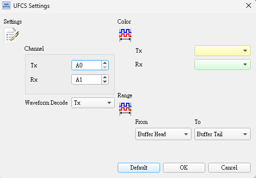
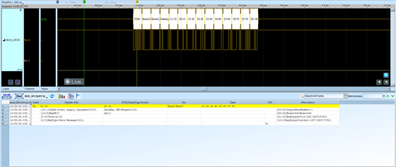

# UFCS (Universal Fast Charging Specification)

## Decode Settings
<figure markdown>
  
  <figcaption>Decode Settings</figcaption>
</figure>

## Example
<figure markdown>
  
  <figcaption>Decode Example</figcaption>
</figure>

## What is UFCS?

UFCS (Universal Fast Charging Specification), also known as the Fusion Fast Charging Protocol, is a unified fast charging standard collaboratively developed by the China Academy of Information and Communications Technology (CAICT), major Chinese smartphone manufacturers including Huawei, OPPO, Vivo, Xiaomi, and leading charging IC suppliers. First released on May 28, 2021, UFCS was created to address the fragmentation and incompatibility issues plaguing the fast charging ecosystem, where different manufacturers employed proprietary charging protocols (Huawei SuperCharge, OPPO VOOC, Xiaomi Turbo Charge, etc.) that prevented universal charger and cable compatibility. The specification aims to establish a standardized communication protocol and power delivery framework that enables any UFCS-certified charger to safely and optimally charge any UFCS-compatible device, regardless of brand, eliminating consumer confusion and reducing electronic waste from incompatible charging accessories.

The UFCS protocol implements bidirectional digital communication between the charging adapter and the mobile device over the USB data lines (typically D+ and D-), using packet-based messages to negotiate power delivery parameters including voltage, current, and charging mode. The specification defines four programmable voltage levels—5V, 10V, 20V, and 30V—with adaptive current control, allowing power delivery up to 240W in high-performance implementations. During the charging handshake, the device identifies itself to the charger, communicates its battery status and charging capabilities, and the charger responds with its available power profiles. The protocol includes comprehensive safety mechanisms such as real-time temperature monitoring, overvoltage protection, overcurrent protection, and thermal throttling to ensure safe charging under all conditions. UFCS also mandates the PowerChange feature, which enables real-time power adjustment based on battery temperature, state of charge, and device thermal conditions.

UFCS has gained significant traction in the Chinese market and is expanding internationally, with over 100 UFCS-certified products including smartphones, tablets, chargers, and power management ICs as of 2024. The release of UFCS 2.0 in May 2025 introduced enhanced features including support for reverse charging (allowing devices to charge other devices regardless of brand), permission to use non-certified accessories for charging up to 40W, and improved backwards compatibility with existing USB PD (Power Delivery) infrastructure. Major smartphone brands including Huawei, Honor, OPPO, Vivo, Xiaomi, Realme, OnePlus, and others have adopted UFCS in their flagship and mid-range devices, positioning UFCS as a potential global standard alongside USB Power Delivery for high-wattage fast charging applications in mobile devices and beyond.

## Technical Specifications

### Physical Layer

**Communication Interface:**
- **Connection**: USB Type-C or Type-A/B connectors
- **Data lines**: D+ and D- pins on USB connector
- **Communication protocol**: Proprietary digital communication over USB data lines
- **Voltage levels**: USB-compatible signaling (typically 0-3.3V for data)

**Power Delivery Lines:**
- **VBUS**: Power delivery line (5V to 30V depending on negotiated level)
- **GND**: Ground reference
- **CC (Configuration Channel)**: USB Type-C CC pins for orientation, cable detection, and basic power delivery

### Voltage and Power Levels

**Programmable Voltage Levels:**
- **5V**: Standard USB voltage for backwards compatibility
- **10V**: Mid-range fast charging (up to 100W typical)
- **20V**: High-speed charging for flagship devices (up to 200W)
- **30V**: Ultra-fast charging for maximum power delivery (up to 240W)

**Current Range:**
- **Minimum**: 0.5A (USB minimum)
- **Maximum**: 8A+ (depending on voltage level and cable rating)
- **Step control**: Fine-grained current adjustment (typically 50mA steps)

**Power Profiles (Examples):**
- 5V @ 3A = 15W
- 10V @ 6A = 60W
- 20V @ 5A = 100W
- 20V @ 6.5A = 130W
- 20V @ 10A = 200W
- 30V @ 8A = 240W

### Communication Protocol

**Handshake Sequence:**

1. **Detection Phase**
   - Charger detects device connection via CC pins or D+/D- voltage levels
   - Initial VBUS at 5V for safe default

2. **Identification Phase**
   - Device sends identification packet with UFCS capability flag
   - Device reports battery capacity, current state of charge, temperature
   - Device specifies supported voltage and current ranges

3. **Capability Exchange**
   - Charger responds with available power profiles
   - Charger reports maximum voltage, current, and total power capability
   - Charger indicates supported charging modes

4. **Negotiation Phase**
   - Device requests specific voltage and current based on battery needs
   - Charger confirms capability to deliver requested power
   - Both agree on initial charging parameters

5. **Power Transfer Phase**
   - Charger adjusts VBUS to negotiated voltage
   - Current delivery begins at requested level
   - Real-time communication continues for parameter adjustments

6. **Dynamic Adjustment (PowerChange)**
   - Device monitors battery temperature, voltage, current
   - Device sends adjustment requests to increase/decrease power
   - Charger complies with adjustment requests
   - Thermal throttling, constant current/constant voltage transitions

7. **Completion Phase**
   - Device signals charging complete when battery reaches 100%
   - Charger reduces power or enters trickle charge mode
   - May transition to maintenance mode

### Protocol Messages (Typical)

**Device-to-Charger Messages:**
- **ID Request**: Device identification and capability announcement
- **Power Request**: Request specific voltage and current
- **Power Adjust**: Request increase or decrease in power delivery
- **Status Update**: Battery state, temperature, SOC (State of Charge)
- **Charge Complete**: Signal end of charging cycle
- **Emergency Stop**: Immediate power cutoff request (safety)

**Charger-to-Device Messages:**
- **ID Response**: Charger identification and capability list
- **Power Confirm**: Acknowledge power request and confirm delivery
- **Power Adjust Confirm**: Acknowledge adjustment request
- **Status Query**: Request device status information
- **Alert**: Warning messages (over-temperature, over-current, etc.)

### Safety and Protection Features

**Overvoltage Protection (OVP):**
- Charger monitors VBUS voltage
- Immediately cuts power if voltage exceeds safe threshold
- Typical tolerance: ±5% of target voltage

**Overcurrent Protection (OCP):**
- Charger limits current delivery to negotiated maximum
- Device monitors input current
- Both can trigger cutoff if overcurrent detected

**Over-Temperature Protection (OTP):**
- Device monitors battery and charging IC temperature
- Charger monitors internal temperature
- Thermal throttling reduces power automatically
- Emergency shutdown if critical temperature reached

**Short Circuit Protection:**
- Charger detects VBUS short to GND
- Immediate power cutoff within microseconds

**Cable Detection:**
- Protocol verifies cable current rating (via USB Type-C eMarker)
- Limits power delivery to cable's rated capacity
- Prevents cable overheating

### UFCS 2.0 Enhancements (2025)

**Key Improvements:**
- **Reverse Charging Support**: Devices can act as power source to charge other devices
- **Non-Certified Accessory Support**: Up to 40W charging with non-certified cables/chargers
- **Enhanced PowerChange**: More granular real-time power adjustment
- **Improved Compatibility**: Better interoperability with USB PD devices
- **Extended Diagnostics**: Enhanced telemetry and fault reporting

## Common Applications

UFCS is primarily deployed in Chinese market devices with growing international adoption:

- **Smartphones**: Huawei, Honor, OPPO, Vivo, Xiaomi, Realme, OnePlus flagship and mid-range models
- **Tablets**: Chinese brand tablets with fast charging support
- **Laptops**: Ultrabooks and portable laptops with USB-C charging
- **Power banks**: UFCS-certified portable battery chargers
- **Wall chargers**: Multi-port USB chargers with UFCS support
- **Car chargers**: Automotive fast charging adapters
- **Wireless charging bases**: Qi wireless chargers with UFCS wired fallback
- **Gaming devices**: Portable gaming consoles and handheld devices
- **Wearables**: Smartwatches with fast charging (lower power levels)
- **Drones**: Consumer drones with high-power charging requirements
- **Power tools**: Cordless tools with universal charging
- **E-bikes and scooters**: Electric mobility devices
- **Bluetooth speakers**: Portable audio with fast recharge
- **Cameras**: Digital cameras and action cameras
- **Medical devices**: Portable medical equipment requiring fast recharge

## Decoder Configuration

When configuring a logic analyzer to decode UFCS protocol:

### Signal Capture Method

**USB Data Line Monitoring:**
- Tap USB D+ and D- data lines for protocol analysis
- Use USB 2.0 compatible differential probes or single-ended monitoring
- May require level shifting if logic analyzer inputs are not 3.3V tolerant

**Power Line Monitoring (Optional):**
- Monitor VBUS voltage with analog channel or high-voltage probe
- Monitor charging current with current probe or sense resistor
- Correlate power delivery with protocol messages

### Channel Assignment

**Essential Signals:**
- **D+**: USB Data Plus (required for protocol decoding)
- **D-**: USB Data Minus (required for protocol decoding)

**Optional Signals:**
- **VBUS**: Power delivery voltage (analog, 0-30V range)
- **IBUS**: Charging current (via current probe or sense resistor)
- **CC1/CC2**: USB Type-C configuration channel (for cable orientation and detection)

### Protocol Parameters

- **Protocol type**: UFCS (specify version 1.0 or 2.0 if known)
- **Data encoding**: Typically proprietary packet-based encoding
- **Bit rate**: Varies by implementation (often similar to USB 2.0 speeds or slower)
- **Packet structure**: Manufacturer-dependent (requires UFCS specification for full decode)

### Decoding Options

- **Handshake phase identification**: Mark detection, identification, negotiation phases
- **Message type decoding**: Parse and display message types (ID, Power Request, Status, etc.)
- **Voltage/current display**: Extract and show negotiated voltage and current values
- **Power calculation**: Compute real-time power (V × I)
- **State machine tracking**: Display current charging state (handshake, CC, CV, complete)
- **Safety event flagging**: Highlight OVP, OCP, OTP events
- **Timing analysis**: Measure handshake duration, message intervals
- **PowerChange tracking**: Monitor dynamic power adjustments

### Trigger Configuration

- **Handshake start**: Trigger on initial device identification message
- **Power negotiation**: Trigger on power request or confirm messages
- **Voltage change**: Trigger when VBUS transitions to new voltage level
- **Safety event**: Trigger on emergency stop or protection activation
- **Charge complete**: Trigger on charging completion message
- **Specific power level**: Trigger when specific voltage/current negotiated

### Analysis Tips

When analyzing UFCS charging sessions:

1. **Capture full handshake**: Begin capture before device connection to catch complete negotiation
2. **Monitor VBUS transitions**: Correlate protocol messages with actual voltage changes on VBUS
3. **Track power adjustments**: Observe PowerChange messages and their effect on charging current
4. **Identify charging phases**: Constant current, constant voltage, trickle charge phases
5. **Check safety margins**: Verify voltage and current stay within negotiated limits
6. **Measure response times**: Ensure charger responds promptly to device requests
7. **Observe thermal throttling**: Look for power reduction messages as temperature rises
8. **Verify cable detection**: Confirm charger respects cable current rating
9. **Compare with USB PD**: Note similarities and differences with USB Power Delivery protocol
10. **Test compatibility**: Analyze handshake with various chargers (certified and non-certified)

### Common Protocol Patterns

**Successful Charge Session:**
1. Device connected, charger detects via CC or D+/D-
2. Charger provides 5V on VBUS (safe default)
3. Device sends ID request with UFCS capability
4. Charger responds with capability list
5. Device requests 20V @ 5A for fast charging
6. Charger confirms and ramps VBUS to 20V
7. Charging begins at 100W (constant current phase)
8. Device periodically sends status updates
9. As battery approaches full, device requests power reduction
10. Transition to constant voltage phase
11. Current tapers as battery reaches 100%
12. Device signals charge complete
13. Charger reduces to trickle or standby mode

**Dynamic Power Adjustment (PowerChange):**
1. Device charging at 20V @ 6A (120W)
2. Battery temperature rises to threshold
3. Device sends power adjustment request: reduce to 20V @ 4A
4. Charger confirms and reduces current delivery
5. Temperature stabilizes
6. After cooling, device requests increase to 20V @ 5A
7. Charger confirms and increases current
8. Charging continues at new power level

**Non-Certified Charger (UFCS 2.0):**
1. Device detects non-certified charger
2. Device limits negotiation to maximum 40W
3. Requests 10V @ 4A or 20V @ 2A
4. Charger confirms capability
5. Charging proceeds at reduced power
6. User notified of non-certified accessory usage

## Reference

- [TinkerVault: Universal Fast Charging Specification (UFCS 1.0/2.0)](https://www.tinkervault.com/usb-fast-charging-protocols/ufcs)
- [ChargerLAB: UFCS Fast Charging Certified Products Exceed Eighty Models](https://www.chargerlab.com/ufcs-fast-charging-certified-products-exceed-eighty-models/)
- [MashDigi: China Promotes UFCS 2.0 Integrated Fast Charging Standard](https://mashdigi.com/en/china-promotes-ufcs-2-0-integrated-fast-charging-standard-and-mobile-phone-brands-including-huawei-honor-oppo-and-vivo-are-the-first-to-join/)
- [Mobility Arena: Universal Fast Charging Specification (UFCS)](https://mobilityarena.com/universal-fast-charging-specification-ufcs/)
- [Hynetek: HUSB335 Supporting UFCS Protocol](https://en.hynetek.com/2631.html)
- [ITU-T L.1004: Universal Fast-Charging Solution](https://www.itu.int/rec/T-REC-L.1004)
