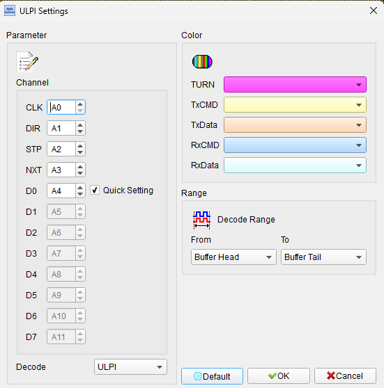
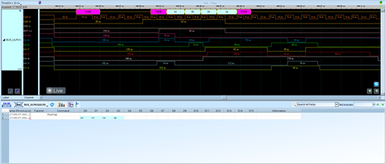
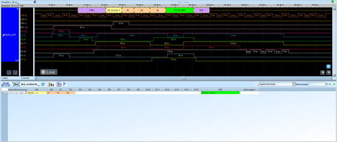

# ULPI (UTMI+ Low Pin Interface)

## Decode Settings
<figure markdown>
  
  <figcaption>Decode Settings</figcaption>
</figure>

## Example
<figure markdown>
  
  <figcaption>Decode Example</figcaption>
</figure>
<figure markdown>
  
  <figcaption>Decode Figure</figcaption>
</figure>

## What is ULPI?

### Overview

ULPI (UTMI+ Low Pin Interface) is a standardized interface specification developed by the USB Implementers Forum (USB-IF) and member companies to reduce pin count and simplify connections between USB controllers and USB PHY (Physical Layer) transceivers. Originally introduced to support USB 2.0 implementations, ULPI provides a more compact alternative to the parallel UTMI (USB Transceiver Macrocell Interface) or UTMI+ interfaces, which typically require 20-30 pins. ULPI accomplishes this reduction by serializing the 8-bit parallel UTMI data bus onto a shared bidirectional data bus, using a synchronous DDR (Double Data Rate) protocol clocked at 60 MHz. This reduces the interface to just 12 pins while maintaining full USB 2.0 High-Speed (480 Mbps) performance.

The ULPI specification defines the electrical, timing, and protocol characteristics for communication between a USB Link (the digital USB controller, often integrated in an SoC or ASIC) and a USB PHY (the analog transceiver that interfaces directly with USB signals). Beyond data transfer, ULPI provides mechanisms for register access, allowing the Link to configure PHY parameters, read status information, and control power management features. The interface supports both USB Host and Device implementations, handles chirp sequences for speed negotiation, and provides status signals for line state and VBUS detection. ULPI has become a de facto standard interface for USB 2.0 PHY integration.

ULPI is widely adopted in embedded systems, mobile devices, and consumer electronics where both USB functionality and compact design are required. The interface's ability to multiplex data, control, and status information onto a minimal pin set makes it particularly valuable in space-constrained applications like smartphones, tablets, and IoT devices. Modern USB 3.0 and USB 3.1 systems often use PIPE (PHY Interface for PCI Express) for SuperSpeed connections while retaining ULPI or UTMI for USB 2.0 backwards compatibility. Understanding ULPI is essential for debugging USB connectivity issues, validating PHY integration, and optimizing USB performance in embedded designs.

### Key Features

- **Low Pin Count**: Only 12 pins vs 20-30 for parallel UTMI/UTMI+
- **Bidirectional Data Bus**: 8-bit shared bus for TX and RX data
- **DDR Signaling**: 60 MHz clock with double data rate (120 MHz effective)
- **USB 2.0 Support**: Full support for High-Speed (480 Mbps), Full-Speed, and Low-Speed
- **Register Access**: Read/write PHY configuration and status registers
- **Synchronous Protocol**: Clock-driven, deterministic timing
- **Flow Control**: STP (Stop) signal for Link control of PHY
- **Direction Control**: DIR signal indicates data direction (PHY→Link or Link→PHY)
- **PHY Management**: VBUS detection, line state reporting, power management
- **Carkit/UART Mode**: Support for USB-to-UART bridges (optional)

## Technical Specifications

### Pin Configuration

**ULPI Interface Signals** (12 pins total)

**Data Bus** (8 pins)
- **DATA[7:0]**: Bidirectional 8-bit data bus, DDR signaling

**Control Signals** (4 pins)
- **CLK**: Clock output from PHY (60 MHz), drives DDR transfers
- **DIR**: Direction control from PHY (0 = Link→PHY transmit, 1 = PHY→Link receive)
- **STP**: Stop signal from Link to PHY (terminates transfers)
- **NXT**: Next signal from PHY to Link (indicates PHY ready for next byte)

**Pin Count Comparison**
- **UTMI**: ~27 pins (8-bit data each direction, separate TX/RX, control signals)
- **ULPI**: 12 pins (50% reduction through bidirectional bus and DDR)

### Electrical Characteristics

**Signal Levels**
- **CMOS Logic**: Standard 1.8V or 3.3V CMOS (IO voltage dependent)
- **VIH**: 0.7 × VDDIO (minimum)
- **VIL**: 0.3 × VDDIO (maximum)
- **VOH**: VDDIO - 0.2V (minimum)
- **VOL**: 0.2V (maximum)

**Timing**
- **Clock Frequency**: 60 MHz ± 500 ppm
- **Data Rate**: DDR operation = 120 MT/s (mega-transfers per second)
- **Setup Time**: 2 ns minimum (data to clock)
- **Hold Time**: 2 ns minimum (data after clock)
- **Clock Duty Cycle**: 45-55%

### DDR Data Transfer

ULPI uses Double Data Rate signaling:
- Data transferred on **both rising and falling edges** of CLK
- **Effective rate**: 120 MHz byte rate (60 MHz × 2 edges)
- **Throughput**: 960 Mbps (120 Mbps × 8 bits): sufficient for USB 2.0 HS (480 Mbps)

### Data Transfer Protocol

**Transmit Operation** (Link sending data to PHY for USB transmission)

1. **Link drives DATA[7:0]** with USB packet data
2. **DIR = 0** (indicates Link→PHY direction)
3. **CLK edges**: Data sampled by PHY on each rising and falling edge
4. **NXT signal**: PHY asserts NXT when ready for more data
5. **STP signal**: Link asserts STP to terminate transmission

**Receive Operation** (PHY sending received USB data to Link)

1. **PHY drives DATA[7:0]** with received USB packet data
2. **DIR = 1** (indicates PHY→Link direction)
3. **CLK edges**: Data sampled by Link on each rising and falling edge
4. **NXT signal**: PHY asserts NXT when valid data present
5. **STP signal**: Link can assert STP to abort/reject data

**Turnaround**
- **DIR change**: When PHY switches from transmit to receive or vice versa
- **One clock cycle**: Required for turnaround when DIR changes
- **Tri-state period**: DATA bus tri-stated during turnaround

### Command/Register Access

ULPI supports register read/write for PHY configuration:

**Register Write**
1. Link drives DATA with: `[1][1][RegAddr[5:0]]` (command byte)
2. Next cycles: Link drives data byte(s) to write
3. NXT indicates PHY acceptance
4. STP terminates write

**Register Read**
1. Link drives DATA with: `[1][0][RegAddr[5:0]]` (command byte)
2. DIR changes to 1 (turnaround)
3. PHY drives DATA with register value
4. STP terminates read

**Extended Register Access**
- Supports 8-bit addressing via extended register command sequences
- Access to vendor-specific registers
- Function control registers

### ULPI Register Set

**Standard Registers** (defined by ULPI spec)

- **0x00-0x03**: Vendor ID and Product ID
- **0x04**: Function Control
- **0x05**: Interface Control
- **0x06**: OTG Control
- **0x07**: USB Interrupt Enable Rising
- **0x08**: USB Interrupt Enable Falling
- **0x09**: USB Interrupt Status
- **0x0A**: USB Interrupt Latch
- **0x0B-0x0F**: Debug and test registers
- **0x10-0x3F**: Vendor-specific registers

**Function Control Register (0x04)**
- **XcvrSelect**: Select HS/FS/LS transceiver
- **TermSelect**: Enable/disable terminations
- **OpMode**: Normal/Non-driving/Disable bit-stuff
- **Reset**: PHY reset control
- **SuspendM**: PHY suspend mode

### USB 2.0 Speed Support

**High-Speed (480 Mbps)**
- Negotiated via chirp sequences during enumeration
- ULPI carries HS data with sufficient bandwidth (960 Mbps effective)
- PHY handles analog HS signaling

**Full-Speed (12 Mbps)**
- ULPI easily accommodates FS data rates
- PHY switches to FS transceiver configuration

**Low-Speed (1.5 Mbps)**
- Typically used for USB Host supporting LS devices
- PHY configured for LS mode via registers

### VBUS and Line State

**VBUS Detection**
- PHY monitors VBUS voltage (USB power line)
- Status reported to Link via register reads or data bus encoding
- Critical for OTG (On-The-Go) and device role determination

**Line State**
- D+ and D- line states (SE0, J, K) reported to Link
- Used for USB suspend/resume detection
- Speed detection and chirp sequence monitoring

## Common Applications

**Mobile Devices**
- Smartphones and tablets (USB connectivity)
- USB OTG implementations
- Application processor to USB PHY interface
- Charging and data communication

**Embedded Systems**
- Single-board computers (Raspberry Pi, BeagleBone)
- Microcontrollers with external USB PHY
- Industrial controllers with USB
- IoT devices requiring USB connectivity

**Consumer Electronics**
- Set-top boxes and streaming devices
- Smart TVs with USB ports
- Digital cameras and camcorders
- Portable media players

**Computer Peripherals**
- USB hubs with separate controller and PHY
- USB-to-Ethernet adapters
- USB docking stations
- KVM switches

**Automotive**
- Infotainment systems with USB
- USB connectivity for smartphones
- Diagnostic interfaces
- Rear-seat entertainment systems

**Medical Devices**
- Portable diagnostic equipment
- Patient monitoring devices with USB
- Medical imaging systems
- USB-connected instruments

## Decoder Configuration

When analyzing ULPI communication with a logic analyzer, configure the following parameters:

**Signal Connections**
- **DATA[7:0]**: Connect to 8-bit data bus (8 channels)
- **CLK**: Connect to 60 MHz clock from PHY
- **DIR**: Connect to direction signal from PHY
- **STP**: Connect to stop signal from Link
- **NXT**: Connect to next signal from PHY

**Minimum Channels**: 12 (8 data + 4 control)

**Sampling Requirements**
- **Minimum Sample Rate**: 500 MS/s (8-10× clock rate for DDR)
- **Recommended**: 1 GS/s for reliable DDR edge detection
- **Clock Recovery**: Use CLK as sampling clock or external trigger

**Decoder Parameters**
- **DDR Mode**: Enable double data rate decoding (both clock edges)
- **Clock Edge**: Sample on both rising and falling edges of CLK
- **Direction Control**: Use DIR signal to determine data direction
- **Command/Data Parsing**: Decode register access vs data transfer

**Protocol Decoding**
- **Data Direction**: Indicate TX (Link→PHY) or RX (PHY→Link) based on DIR
- **USB Packets**: Parse USB packet structure (PID, data, CRC)
- **Register Access**: Decode register read/write commands and addresses
- **RXCMD Packets**: Decode receive command bytes (line state, VBUS, errors)

**Display Options**
- Show data direction (TX/RX) for each transfer
- Display USB packet types (SETUP, IN, OUT, DATA0, DATA1, etc.)
- Show register addresses and values for configuration accesses
- Indicate turnaround cycles when DIR changes
- Display RXCMD information (line state, VBUS status)
- Show timing between transfers and idle periods

**Trigger Settings**
- Trigger on DIR transitions (start of RX or TX burst)
- Trigger on STP assertion (end of transfer)
- Trigger on specific USB PIDs (e.g., SETUP token for control transfers)
- Trigger on register access commands (bit[7]=1, bit[6]=read/write)
- Trigger on specific register addresses

**Analysis Tips**
- Verify CLK is running at 60 MHz (±500 ppm)
- Check DIR signal timing - should change one cycle before PHY drives bus
- Verify turnaround cycles are respected (one idle cycle when DIR changes)
- Monitor NXT for flow control - PHY not ready if NXT low
- Decode first byte of TX burst to identify USB PID
- Check RXCMD bytes for PHY status (VBUS, line state, errors)
- Verify STP timing - asserted by Link to stop PHY
- Look for register accesses during USB enumeration

**Common Issues**
- **No Communication**: CLK not running, PHY not powered, incorrect connections
- **Data Corruption**: Setup/hold violations, insufficient sample rate for DDR
- **DIR Timing Violations**: DIR not changing early enough before turnaround
- **STP Not Recognized**: Timing issues, PHY not responding to stop
- **Register Access Failures**: Wrong register addresses, PHY not implementing register
- **USB Enumeration Fails**: Incorrect PHY configuration, VBUS issues
- **Turnaround Errors**: Bus contention during DIR change

**Advanced Analysis**
- Measure actual CLK frequency and jitter
- Analyze setup/hold margins for DATA relative to CLK edges
- Decode complete USB transactions (token, data, handshake)
- Monitor register configuration sequence during initialization
- Identify speed negotiation (chirp sequences via register status)
- Analyze VBUS detection and OTG role determination
- Measure latency from USB packet arrival (DIR=1) to Link response
- Verify PHY power state transitions (suspend/resume)

**Register Decoding Examples**
- **Write Function Control**: `[11][000100][data]` - configure PHY mode
- **Read Interface Control**: `[10][000101]` → turnaround → `[data]`
- **Read Interrupt Status**: `[10][001001]` → turnaround → `[status]`

**USB Packet Identification**
After DIR=0 (TX) and DATA valid, first byte is USB PID:
- **0xC3**: SETUP token
- **0x69**: IN token
- **0xE1**: OUT token
- **0xC3**: DATA0 packet
- **0x4B**: DATA1 packet
- **0xD2**: ACK handshake

## Reference

- [ULPI Specification v1.1](https://www.usb.org/document-library/utmi-low-pin-interface-ulpi-specification-v11): USB-IF official specification
- [USB 2.0 Specification](https://www.usb.org/document-library/usb-20-specification): USB protocol reference
- [SMSC USB3300 Datasheet](https://www.microchip.com/wwwproducts/en/USB3300): Example ULPI PHY
- [NXP ISP1504 Datasheet](https://www.nxp.com/): Common USB PHY with ULPI
- [UTMI+ Specification](https://www.usb.org/document-library/utmi-specification-version-13): Parallel interface comparison

---
**Last Updated**: 2026-02-02
