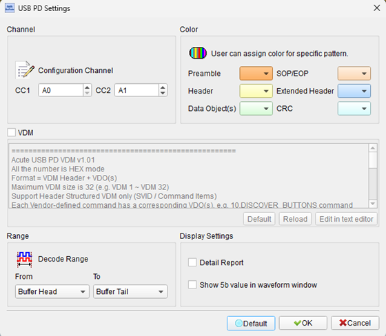
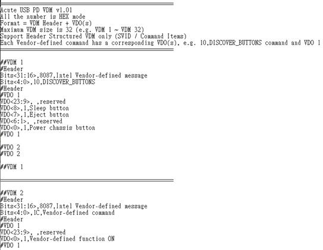
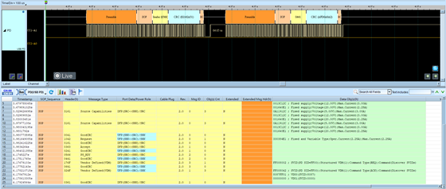

# USB Power Delivery

## Decode Settings
<figure markdown>
  
  <figcaption>Decode Settings</figcaption>
</figure>

## Example
<figure markdown>
  
  <figcaption>Decode Example</figcaption>
</figure>
<figure markdown>
  
  <figcaption>Decode Figure</figcaption>
</figure>

## What is USB Power Delivery?

USB Power Delivery (USB-PD) is a power negotiation protocol developed by the USB Implementers Forum (USB-IF) that enables USB devices to negotiate higher power levels beyond the basic USB power specifications. Initially released in 2012 and substantially revised through multiple versions, USB-PD allows devices to dynamically request and supply power up to 240 watts over USB Type-C connections. The protocol enables intelligent power management by allowing devices to communicate their power requirements and capabilities, replacing the need for proprietary charging solutions.

The protocol operates over the Configuration Channel (CC) line in USB Type-C cables, using Biphase Mark Code (BMC) encoding at 300 kbps for reliable low-level communication. USB-PD supports bidirectional power flow, allowing devices to swap power roles dynamically and enabling features like laptop charging through the same port used for peripherals. The specification includes safety mechanisms for power negotiation, cable capability detection, and fault protection, ensuring safe operation across a wide range of power levels.

USB Power Delivery has become the universal standard for fast charging and power delivery across consumer electronics. USB PD 3.1, released in May 2021, introduced Extended Power Range (EPR) supporting up to 240W at 48V, enabling charging for high-power devices including gaming laptops and professional workstations. The protocol also supports Programmable Power Supply (PPS) for fine-grained voltage control in 20mV steps, optimizing charging efficiency and reducing heat generation in modern smartphones and tablets.

## Technical Specifications

### Power Specifications

**Standard Power Range (SPR): up to 100W:**
- **5V**: 0.5A to 3A (2.5W to 15W)
- **9V**: up to 3A (27W)
- **15V**: up to 3A (45W)
- **20V**: up to 5A (100W maximum)

**Extended Power Range (EPR): 100W to 240W:**
- **28V**: up to 5A (140W): for power above 100W
- **36V**: up to 5A (180W): for power above 140W
- **48V**: up to 5A (240W): for power above 180W

**Programmable Power Supply (PPS):**
- Voltage range: 3.3V to 21V (SPR) or up to 48V (EPR)
- Voltage resolution: 20mV steps
- Current resolution: 50mA steps
- Enables optimized charging with reduced heat generation

### Physical Layer

USB-PD communicates over the Configuration Channel (CC) pins in USB Type-C connectors:

- **Encoding**: BMC (Biphase Mark Code): USB PD 2.0 and later
- **Data rate**: 300 kbps (BMC encoded)
- **Voltage levels**: 0V to 5V logic levels on CC line
- **Signal type**: DC-coupled, low-frequency modulation
- **Cable detection**: Resistor-based cable capability advertisement

The CC line serves multiple purposes: cable orientation detection, power role determination, and PD message communication. USB PD 1.0 used BFSK encoding on the VBUS line but was deprecated in favor of BMC encoding on the CC line for improved reliability and reduced EMI.

### Protocol Architecture

USB-PD uses a layered protocol stack:

- **Physical Layer**: BMC encoding on CC line
- **Protocol Layer**: Message framing, CRC, and retransmission
- **Policy Engine**: Power negotiation and role management
- **Device Policy Manager**: Application-level power requirements

### Message Types

**Control Messages:**
- GoodCRC, Accept, Reject, PS_RDY (Power Supply Ready)
- Get_Source_Cap, Get_Sink_Cap
- PR_Swap (Power Role), DR_Swap (Data Role), VCONN_Swap

**Data Messages:**
- Source_Capabilities (advertises available power profiles)
- Request (requests specific voltage/current)
- Sink_Capabilities (declares power requirements)
- Vendor_Defined (manufacturer-specific extensions)

### Power Data Objects (PDOs)

PDOs define available power profiles:
- **Fixed Supply PDO**: Standard voltage levels (5V, 9V, 15V, 20V)
- **Variable Supply PDO**: Voltage range with min/max limits
- **Battery PDO**: Power range specification
- **Augmented PDO**: PPS and AVS (Adjustable Voltage Supply)

## Common Applications

USB Power Delivery is implemented across diverse device categories:

- **Laptop charging**: Universal laptop power adapters up to 240W
- **Smartphone fast charging**: Rapid charging with optimized voltage/current
- **Tablet and e-reader charging**: Mid-range power delivery up to 45W
- **Monitor power**: Display power and data over single USB-C cable
- **Docking stations**: Laptop charging while connecting peripherals
- **Power banks**: Bidirectional power for charging and discharging
- **Gaming laptops**: High-power charging up to 240W with EPR
- **Professional cameras**: Field charging for battery systems
- **Portable SSDs**: Bus-powered high-speed storage devices
- **USB-C hubs**: Powered hub with device charging capability
- **Development boards**: Programmable power for testing and prototyping
- **Medical devices**: Standardized power for portable medical equipment
- **Electric vehicles**: Low-voltage auxiliary charging systems
- **Industrial equipment**: Universal power for field-replaceable instruments
- **Audio equipment**: Powered speakers and audio interfaces

## Decoder Configuration

When configuring a logic analyzer to decode USB Power Delivery signals:

### Channel Assignment

- **CC1 or CC2**: Assign to one of the Configuration Channel lines from the USB Type-C connector

USB Type-C connectors have two CC lines (CC1 and CC2). Only one CC line carries PD communication at a time, determined by cable orientation. Probe both CC lines or identify the active CC line by detecting BMC-encoded traffic.

### Protocol Parameters

- **Encoding**: BMC (Biphase Mark Code)
- **Bit rate**: 300 kbps
- **Preamble**: 64-bit alternating pattern for synchronization
- **Start of Packet (SOP)**: Ordered set indicating message start
- **CRC**: 32-bit CRC for error detection

### Decoding Options

- **Message type display**: Show control vs. data messages
- **PDO parsing**: Decode Source_Capabilities and Request messages to show voltage/current
- **Role identification**: Indicate source, sink, cable, and debug roles
- **PPS analysis**: Parse Programmable Power Supply augmented PDOs
- **Timing analysis**: Measure message intervals and response times
- **Error detection**: Flag CRC errors and malformed messages

### Trigger Configuration

- **Preamble detection**: Trigger on 64-bit BMC preamble pattern
- **Specific message type**: Trigger on Source_Capabilities, Request, or Accept messages
- **Voltage transition**: Trigger when voltage changes in Request message
- **PR_Swap or DR_Swap**: Trigger on power or data role swap negotiation

### Capture Considerations

USB-PD messages occur during power negotiation events, typically within the first second after cable connection and when power requirements change. For complete analysis, begin capture before connecting the cable or use a long pre-trigger buffer. Sample rate should be at least 3 MHz (10x the bit rate) for reliable BMC decoding. Monitor the VBUS line separately to observe actual voltage transitions following successful PD negotiations.

### Analysis Tips

Key negotiation sequences to observe:
1. **Initial connection**: Source sends Source_Capabilities PDO
2. **Power request**: Sink sends Request message with desired voltage/current
3. **Acceptance**: Source sends Accept followed by PS_RDY
4. **Voltage transition**: VBUS changes to negotiated voltage
5. **Role swaps**: PR_Swap or DR_Swap messages for role changes

Look for proper timing between Accept and PS_RDY messages (typically 10-30ms), and verify that VBUS voltage stabilizes before the device begins drawing current.

## Reference

- [USB Power Delivery Specification v3.1](https://usb.org/document-library/usb-power-delivery)
- [USB-IF Power Delivery Documentation](https://documentation.truetesting.org/usbcable/specs/USB-PD.html)
- [Microchip AN1974: Introduction to USB Power Delivery](https://www.microchip.com/content/dam/mchp/documents/OTH/ApplicationNotes/ApplicationNotes/00001974A.pdf)
- [Granite River Labs: PD 3.1 Specification Introduction](https://www.graniteriverlabs.com/en-us/technical-blog/usb-power-delivery-specification-3-1)
