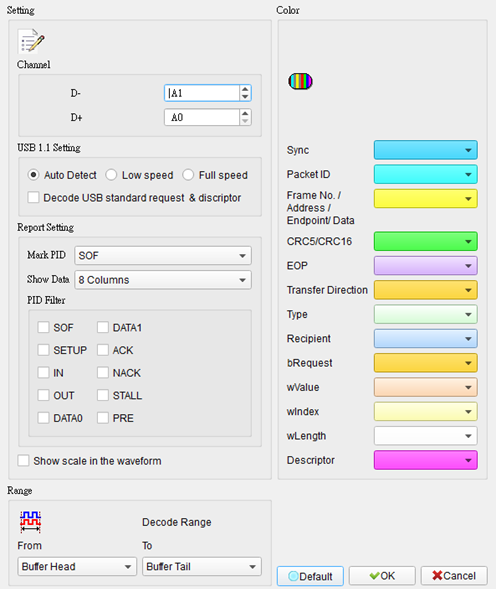
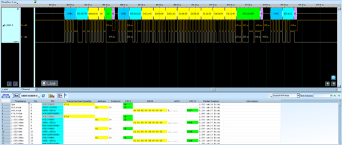

# USB 1.1

## Decode Settings
<figure markdown>
  
  <figcaption>Decode Settings</figcaption>
</figure>

## Example
<figure markdown>
  
  <figcaption>Decode Example</figcaption>
</figure>

## What is USB 1.1?

USB 1.1 (Universal Serial Bus version 1.1) is a serial communication protocol and physical interface standard released in August 1998 by a consortium of companies including Compaq, Intel, Microsoft, and NEC. The specification, formally finalized on September 23, 1998, corrected significant issues present in the original USB 1.0 standard released in January 1996, making USB 1.1 the first widely adopted version of the USB standard. The protocol was designed to replace multiple legacy connection standards including RS-232 serial ports, parallel ports, PS/2 keyboard and mouse connectors, and game ports with a single universal interface.

USB 1.1 introduced a tiered star topology supporting up to 127 devices connected through hubs, with automatic device detection, enumeration, and configuration. The bus provides bidirectional data transfer along with electrical power delivery over a four-wire cable, enabling bus-powered peripherals without external power supplies. The protocol supports two speed modes: Full-Speed at 12 Mbps for higher-bandwidth devices and Low-Speed at 1.5 Mbps for human interface devices with lower data rate requirements. USB 1.1 employs differential signaling with NRZI (Non-Return-to-Zero Inverted) encoding and bit stuffing for clock recovery.

USB 1.1 became the dominant peripheral interface standard from the late 1990s through the early 2000s, enabling the plug-and-play ecosystem that modernized computer peripheral connectivity. While superseded by USB 2.0 (2000), USB 3.x, and USB4 specifications, USB 1.1 remains fundamentally important as all later USB versions maintain backward compatibility with USB 1.1 devices and protocols. The standard's success established USB as the universal peripheral interface, influencing decades of computer and consumer electronics design.

## Technical Specifications

### Data Rates

USB 1.1 defines two operational speeds:

- **Full-Speed (FS)**: 12 Mbps (1.5 MB/s): for higher-bandwidth peripherals
- **Low-Speed (LS)**: 1.5 Mbps (187.5 KB/s): for human interface devices

Speed detection occurs during device enumeration based on pull-up resistor placement on the data lines. Full-Speed devices use a pull-up on D+, while Low-Speed devices use a pull-up on D-.

### Physical Layer

**Cable and Connector:**
- **Cable**: 4-wire shielded cable with twisted pair for differential data
- **Wire gauge**: Typically 28 AWG for signal pairs, 20-28 AWG for power
- **Maximum cable length**: 5 meters for Full-Speed, 3 meters for Low-Speed
- **Power delivery**: +5V DC on VBUS, up to 500 mA per device
- **Connector types**: Type A (host/upstream), Type B (device/downstream)

**Signal Characteristics:**
- **Signaling**: Differential signaling on D+ and D- data lines
- **Voltage levels**: 3.6V maximum differential (3.0V nominal)
- **Common mode**: 0-3.6V range
- **Termination**: 1.5 kΩ pull-up to 3.6V on one data line (speed detection)
- **Idle state**: J-state (D+ high, D- low for Full-Speed; reversed for Low-Speed)

### Data Encoding

**NRZI (Non-Return-to-Zero Inverted):**
- Logical "1": No transition (level stays the same)
- Logical "0": Transition (level changes from previous state)

**Bit Stuffing:**
- After 6 consecutive "1" bits, a "0" is automatically inserted
- Receiver removes stuffed bits to recover original data
- Provides guaranteed transitions for clock synchronization

**Packet Delimiters:**
- **Sync pattern**: 8-bit synchronization field (KJKJKJKK) at packet start
- **End of Packet (EOP)**: SE0 (Single-Ended Zero - both D+ and D- low) for 2 bit times, followed by J-state for 1 bit time

### Protocol Architecture

**Topology:**
- Tiered star topology with root hub at host controller
- Up to 7 tiers (including root hub and device)
- Maximum 127 devices (7-bit addressing)
- Hub-based connectivity for multiple device connections

**Transfer Types:**
- **Control transfers**: Device configuration and command transport (bidirectional)
- **Bulk transfers**: Large data transfers with error correction (Full-Speed only)
- **Interrupt transfers**: Low-latency periodic data for human input devices
- **Isochronous transfers**: Guaranteed bandwidth for real-time data streams (Full-Speed only)

**Packet Structure:**
- **Token packets**: Initiate transactions (SETUP, IN, OUT, SOF)
- **Data packets**: Carry payload data (DATA0, DATA1 for toggle synchronization)
- **Handshake packets**: Acknowledge or report errors (ACK, NAK, STALL)

### Frame Structure

USB uses a frame-based timing structure:
- **Frame interval**: 1 millisecond (1 ms ± 500 ns)
- **SOF (Start of Frame)**: Broadcast every 1 ms for synchronization
- **Frame number**: 11-bit counter for frame identification

## Common Applications

USB 1.1 was implemented across virtually all computer peripherals in the late 1990s and early 2000s:

- **Human interface devices**: Keyboards, mice, trackballs, joysticks, game controllers
- **Input devices**: Graphics tablets, touchpads, barcode scanners
- **Printers and scanners**: Document printing and image scanning
- **External storage**: Floppy drives, CD-ROM drives, early USB flash drives
- **Digital cameras**: Photo transfer from cameras to computers
- **Audio devices**: USB speakers, microphones, headsets, MIDI interfaces
- **Modems**: Dial-up and early broadband modems
- **Hubs**: Multi-port USB expansion for additional device connections
- **Card readers**: Memory card readers for digital photography
- **Webcams**: Low-resolution video capture for video conferencing
- **PDAs and handheld devices**: Synchronization and charging
- **Laboratory instruments**: Test equipment and measurement devices
- **Point-of-sale equipment**: Receipt printers, cash drawers, barcode scanners
- **Industrial control**: Sensors, actuators, and control interfaces
- **Legacy system upgrades**: USB-to-serial, USB-to-parallel adapters

## Decoder Configuration

When configuring a logic analyzer to decode USB 1.1 signals:

### Channel Assignment

- **D+ (Data Plus)**: Assign to positive differential data line
- **D- (Data Minus)**: Assign to negative differential data line

Both data lines must be captured simultaneously for proper differential decoding. Probe at the connector pins or along the cable, ensuring good signal quality and minimal probe loading.

### Protocol Parameters

- **Speed mode**: Select Full-Speed (12 Mbps) or Low-Speed (1.5 Mbps)
- **NRZI decoding**: Enable NRZI decode with bit stuffing removal
- **Sampling rate**: Minimum 48 MHz for Full-Speed, 6 MHz for Low-Speed (4x oversampling recommended)

### Decoding Options

- **Packet type display**: Show Token, Data, Handshake, and SOF packets
- **Address and endpoint**: Display device address and endpoint numbers
- **Data payload**: Show data packet contents in hex/ASCII
- **CRC verification**: Check 5-bit (token) and 16-bit (data) CRC fields
- **Transfer type identification**: Identify Control, Bulk, Interrupt, or Isochronous transfers
- **Error detection**: Flag CRC errors, bit stuff errors, protocol violations

### Trigger Configuration

- **Sync pattern**: Trigger on SYNC field (KJKJKJKK pattern)
- **Specific device address**: Trigger on packets to/from specific USB address
- **Endpoint number**: Trigger on specific endpoint transactions
- **Token type**: Trigger on IN, OUT, SETUP, or SOF tokens
- **Data pattern**: Trigger when specific data content appears in payload
- **Error conditions**: Trigger on CRC errors or protocol violations

### Signal States

Recognize these USB line states:
- **J-state (Idle)**: D+ high, D- low (Full-Speed); reversed for Low-Speed
- **K-state**: Opposite of J-state
- **SE0 (Single-Ended Zero)**: Both D+ and D- low (EOP, reset, disconnect)
- **SE1 (Single-Ended One)**: Both D+ and D- high (illegal state, indicates error)

### Analysis Tips

When capturing USB 1.1 traffic, begin with a capture during device enumeration to observe the full initialization sequence including reset, device descriptor requests, and configuration. This provides context for understanding subsequent data transfers. Monitor SOF packets to verify the 1 ms frame timing and ensure the host controller is functioning properly.

For differential signal capture, maintain matched probe impedances and equal cable lengths to both D+ and D- to preserve signal integrity. If only single-ended capture is available, capture both data lines separately and reconstruct the differential signal in software.

Pay attention to the handshake packets: ACK indicates successful transfer, NAK indicates the device is not ready, and STALL indicates an error or unsupported request. High NAK rates may indicate bandwidth saturation or device timing issues.

## Reference

- [USB 1.1 Specification (PDF)](https://fabiensanglard.net/usbcheat/usb1.1.pdf)
- [Wikipedia: USB History](https://en.wikipedia.org/wiki/USB)
- [USB Implementers Forum - Legacy Specifications](https://www.usb.org/documents)
- [Lammert Bies: USB Specification Overview](https://www.lammertbies.nl/comm/info/usb-specification)
