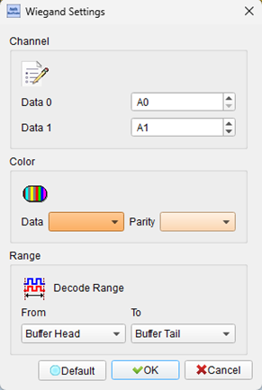
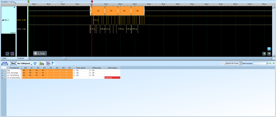

# Wiegand (Access Control Protocol)

## Decode Settings
<figure markdown>
  
  <figcaption>Decode Settings</figcaption>
</figure>

## Example
<figure markdown>
  
  <figcaption>Decode Example</figcaption>
</figure>

## What is Wiegand?

The Wiegand interface is a de facto wiring standard and communication protocol used extensively in the physical security industry to connect card readers (proximity, magnetic stripe, barcode, biometric) to access control panels and door controllers. Named after John R. Wiegand who discovered the Wiegand effect (a magnetic phenomenon) in the 1970s, the Wiegand interface originally referred to card technology using ferromagnetic wires, but the term now primarily describes the electrical signaling protocol used to transmit card credential data from readers to controllers regardless of the underlying card technology. The protocol's simplicity, long-distance capability (up to 500 feet / 150 meters), immunity to electromagnetic interference, and vendor-neutral standardization have made it the dominant interface standard for physical access control installations in commercial buildings, government facilities, educational institutions, healthcare, industrial sites, and residential security systems worldwide.

The Wiegand protocol uses three wires: common ground (GND) and two data transmission lines designated DATA0 (D0) and DATA1 (D1), both pulled high to +5 VDC when idle through pull-up resistors in the controller. Binary data is transmitted asynchronously using inverse logic where a '0' bit is sent by pulling DATA0 low (while DATA1 remains high), and a '1' bit is sent by pulling DATA1 low (while DATA0 remains high). Each data bit is represented by a low-going pulse of 20-100 microseconds width (typically 50 µs), with inter-pulse intervals of 200 microseconds to 20 milliseconds (typically 1-2 ms). This differential signaling approach ensures that DATA0 and DATA1 never pulse simultaneously, and the self-clocking nature of the protocol requires no separate clock signal, simplifying wiring and improving noise immunity essential for long cable runs through conduits and across buildings.

While Wiegand can support various data formats ranging from 4 bits to over 100 bits, the industry-standard 26-bit Wiegand format (standardized by the Security Industry Association as SIA AC-01-1996.10) is by far the most common, encoding 8 bits of facility code (identifying the site or customer, 0-255), 16 bits of card ID number (0-65,535), and 2 parity bits for basic error detection. This format allows organizations to issue up to 65,536 unique credentials per facility code, sufficient for most installations. Extended formats including 32-bit, 34-bit, 35-bit, 37-bit, and proprietary formats support larger numbers of users, additional data fields, enhanced security features, and custom information. The Wiegand interface's universal adoption, backwards compatibility across decades of equipment, and support by virtually all access control manufacturers has cemented its position as the standard physical layer for access control despite the emergence of higher-security alternatives like OSDP (Open Supervised Device Protocol).

## Technical Specifications

### Physical Interface

**Wiring:**
- **3-wire connection** between card reader and access control panel
  - **GND**: Common ground reference
  - **DATA0 (D0)**: Data line for transmitting '0' bits
  - **DATA1 (D1)**: Data line for transmitting '1' bits

**Additional Wires (typical installation):**
- **+12V**: Reader power supply (separate from signaling)
- **LED control**: Reader LED indicator control (optional)
- **Beeper control**: Reader beeper control (optional)
- **Tamper/Aux**: Tamper switch or auxiliary input (optional)

Total typical cable: 6-8 conductors in shielded twisted-pair or multi-conductor cable

**Electrical Characteristics:**
- **Voltage levels**: +5 VDC logic (TTL-compatible)
- **Idle state**: Both DATA0 and DATA1 pulled HIGH (+5V) via pull-up resistors (typically 1-10 kΩ) in controller
- **Active state**: Reader pulls appropriate data line LOW (0V) to transmit bit
- **Drive capability**: Open-collector or open-drain outputs in reader
- **Current**: Typically 5-20 mA per data line when active

**Cable Distance:**
- **Maximum run**: 500 feet (150 meters) typical specification
- **Extended runs**: Up to 1000 feet possible with low-capacitance cable and appropriate pull-ups
- **Limitations**: Cable capacitance, signal integrity, pulse distortion

### Timing Specifications

**Pulse Width Time (PWT):**
- **Specification**: 20 µs to 100 µs
- **Typical default**: 50 µs (50 microseconds)
- **Function**: Duration of LOW pulse on DATA0 or DATA1 representing one bit

**Pulse Interval Time (PIT):**
- **Specification**: 200 µs to 20 ms
- **Typical default**: 1-2 ms (1000-2000 microseconds)
- **Function**: Time between consecutive bit pulses (center-to-center or start-to-start)

**Timing Rules:**
- **Non-overlapping**: DATA0 and DATA1 never pulse simultaneously
- **Asynchronous**: No separate clock signal; receiver detects pulse timing
- **Self-clocking**: Pulse edges provide timing reference for bit extraction

**Example Timing:**
- Bit 0 transmitted: DATA0 goes LOW for 50 µs, returns HIGH
- Wait 1 ms
- Bit 1 transmitted: DATA1 goes LOW for 50 µs, returns HIGH
- Wait 1 ms
- Next bit...

### Data Formats

**26-Bit Wiegand (Standard Format - SIA AC-01):**

**Bit Layout:**
- **Bit 1**: Even parity bit (calculated over bits 2-13)
- **Bits 2-9**: Facility code (8 bits, value 0-255)
- **Bits 10-25**: Card ID number (16 bits, value 0-65,535)
- **Bit 26**: Odd parity bit (calculated over bits 14-25)

**Parity Calculation:**
- **Even parity (bit 1)**: Count of '1' bits in bits 2-13 must be even
- **Odd parity (bit 26)**: Count of '1' bits in bits 14-25 must be odd

**Example:**
- Facility code = 123 (0x7B = 01111011 binary)
- Card ID = 45678 (0xB26E = 1011001001101110 binary)
- Bit 1 (even parity over bits 2-13)
- Bits 2-9 = 01111011
- Bits 10-25 = 1011001001101110
- Bit 26 (odd parity over bits 14-25)

**32-Bit Format:**
- Typically 1-bit even parity + 30 bits data (facility + card ID) + 1-bit odd parity
- Supports larger card ID ranges

**34-Bit, 35-Bit, 37-Bit Formats:**
- Vendor-specific or extended formats
- Support additional data fields, higher user counts, site codes

**Proprietary Formats:**
- Manufacturers may define custom bit layouts
- Can include manufacturer ID, custom fields, enhanced security

**Variable-Length Formats:**
- 4-bit to 100+ bits supported by protocol
- Application-specific (keypad PIN, barcode, fingerprint template hash)

### Protocol Operation

**Card Read Sequence:**
1. User presents credential (card, fob, mobile device) to reader
2. Reader reads credential data (RF proximity, magnetic stripe, barcode, etc.)
3. Reader formats data according to configured Wiegand format (e.g., 26-bit)
4. Reader transmits bits serially over DATA0 and DATA1 lines
5. Controller receives bits, assembles into complete data word
6. Controller validates parity bits
7. Controller compares credential against access control database
8. Controller grants or denies access (unlocks door or denies entry)
9. Controller optionally sends LED/beeper control signals back to reader for user feedback

**Timing Diagram (26-bit transmission):**
- Total transmission time for 26 bits at 1 ms inter-pulse interval: ~26 ms
- Total transmission time at 2 ms interval: ~52 ms

### Unidirectional Communication

**Reader to Controller:**
- Wiegand protocol is **unidirectional** from reader to controller
- No acknowledgment or response from controller to reader via Wiegand data lines
- Reader has no confirmation that controller received data correctly

**Feedback to Reader (separate signals):**
- LED control (separate wire): Controller can illuminate LED (green = granted, red = denied)
- Beeper control (separate wire): Controller can activate reader beep for audible feedback
- Not part of Wiegand data protocol itself

## Common Applications

Wiegand protocol is ubiquitous in physical access control systems:

- **Office buildings**: Employee badge access to doors, turnstiles, elevators
- **Data centers**: Secure areas with multi-factor authentication (card + PIN)
- **Government facilities**: Federal, state, municipal buildings, courthouses
- **Healthcare institutions**: Hospitals, clinics, pharmaceutical secure areas
- **Educational institutions**: Universities, schools, dormitories, labs
- **Industrial facilities**: Manufacturing plants, warehouses, restricted production areas
- **Airports and transportation**: Secure zones, employee access, baggage handling
- **Hotels**: Guest room door locks (less common than RFID, but in older systems)
- **Residential buildings**: Apartment complexes, condominiums, gated communities
- **Parking garages**: Vehicle access control, gate entry
- **ATMs and bank vaults**: Security access to cash handling areas
- **Laboratories**: Research labs, clean rooms with restricted access
- **Prisons and corrections**: Secure perimeter, cell block access
- **Military installations**: Base access, secure facilities
- **Retail**: Employee-only areas, stockrooms, cash rooms
- **Gyms and fitness centers**: Member check-in, locker room access
- **Libraries and archives**: Special collections, restricted stacks

## Decoder Configuration

When configuring a logic analyzer to decode Wiegand protocol:

### Channel Assignment

**Essential Signals:**
- **DATA0 (D0)**: Data line for '0' bits (required)
- **DATA1 (D1)**: Data line for '1' bits (required)

**Optional Signals:**
- **GND**: Ground reference (for voltage level context)
- **LED**: Reader LED control from controller (feedback visualization)
- **Beeper**: Reader beeper control (feedback visualization)

### Protocol Parameters

- **Pulse width**: Expected LOW pulse duration (20-100 µs, typically 50 µs)
- **Inter-pulse interval**: Time between pulses (200 µs - 20 ms, typically 1-2 ms)
- **Data format**: 26-bit standard, 32-bit, 34-bit, or custom format
- **Idle state**: DATA0 and DATA1 should be HIGH when idle
- **Timeout**: Maximum time to wait for next bit before declaring end of transmission (e.g., 50 ms)

### Decoding Options

- **Bit extraction**: Detect pulses on DATA0 (bit = 0) and DATA1 (bit = 1)
- **Format identification**: Auto-detect or specify 26-bit, 32-bit, etc.
- **Facility code extraction**: Parse and display facility code (bits 2-9 in 26-bit)
- **Card ID extraction**: Parse and display card ID number (bits 10-25 in 26-bit)
- **Parity validation**: Check even and odd parity bits, flag errors
- **Decimal conversion**: Display facility code and card ID in decimal
- **Hexadecimal display**: Show raw bit pattern in hex
- **Timing measurement**: Measure pulse width and inter-pulse intervals
- **Transmission duration**: Calculate total time for complete credential transmission

### Trigger Configuration

- **Start of transmission**: Trigger on first pulse (bit 1)
- **Facility code**: Trigger when specific facility code detected
- **Card ID**: Trigger when specific card ID detected
- **Parity error**: Trigger when parity validation fails
- **DATA0 or DATA1 pulse**: Trigger on any pulse on either data line
- **End of transmission**: Trigger after complete credential received (timeout after last bit)

### Analysis Tips

When analyzing Wiegand signals:

1. **Verify idle state**: DATA0 and DATA1 should both be HIGH when no transmission active
2. **Measure pulse width**: Ensure pulses are within specification (20-100 µs)
3. **Check inter-pulse timing**: Verify intervals are consistent and within spec (200 µs - 20 ms)
4. **Validate parity**: Confirm even parity on bit 1 and odd parity on bit 26 (for 26-bit format)
5. **Decode facility and card ID**: Extract and display in decimal for readability
6. **Look for transmission errors**: Missing bits, overlapping pulses, timing violations
7. **Correlate with access events**: Link Wiegand transmissions to door unlock/deny events
8. **Test cable length effects**: Long cables may distort pulses or add noise
9. **Observe multiple reads**: Same card should produce identical bit patterns
10. **Check for format consistency**: Ensure all transmissions use expected bit count

### Common Protocol Patterns

**26-Bit Credential Transmission:**
1. User taps card on reader
2. Reader reads card UID or data
3. Reader begins Wiegand transmission:
   - Bit 1 (even parity): DATA0 or DATA1 pulses LOW for 50 µs
   - Wait 1 ms
   - Bit 2 (facility code MSB): DATA0 or DATA1 pulses
   - Wait 1 ms
   - ...continues for all 26 bits...
   - Bit 26 (odd parity): Final pulse
4. Total transmission: ~26 ms
5. Controller receives, validates parity, checks credential
6. Controller grants/denies access

**Decoded Example (26-bit):**
- **Raw bits**: 01101110110110010011011101
- **Bit 1 (even parity)**: 0
- **Facility code (bits 2-9)**: 11011101 = 221 decimal
- **Card ID (bits 10-25)**: 1011001001101110 = 45678 decimal
- **Bit 26 (odd parity)**: 1
- **Result**: Facility 221, Card 45678

**Access Granted Sequence:**
1. Wiegand transmission completes
2. Controller validates credential → match found
3. Controller activates door unlock relay
4. Controller sends LED control signal → reader green LED turns on
5. Controller sends beeper control signal → reader beeps once
6. User opens door

**Access Denied Sequence:**
1. Wiegand transmission completes
2. Controller validates credential → no match found
3. Controller does not unlock door
4. Controller sends LED control → reader red LED blinks
5. Controller sends beeper control → reader beeps twice (error tone)
6. Door remains locked

## Reference

- [Wikipedia: Wiegand Interface](https://en.wikipedia.org/wiki/Wiegand_interface)
- [Honeywell: Wiegand Readers Data Sheet](https://prod-edam.honeywell.com/content/dam/honeywell-edam/hbt/en-us/documents/literature-and-specs/datasheets/hon-ba-td5027-rev0500.pdf)
- [Security Industry Association: SIA AC-01-1996.10 Standard](https://www.securityindustry.org/industry-standards/sia-ac-01-1996-10/)
- [Baltech: Wiegand Specification](https://docs.baltech.de/developers/wiegand.html)
- [Wiegand Format Documentation (PDF)](https://proximus.su/files/docs/Wiegand%20Format.pdf)
