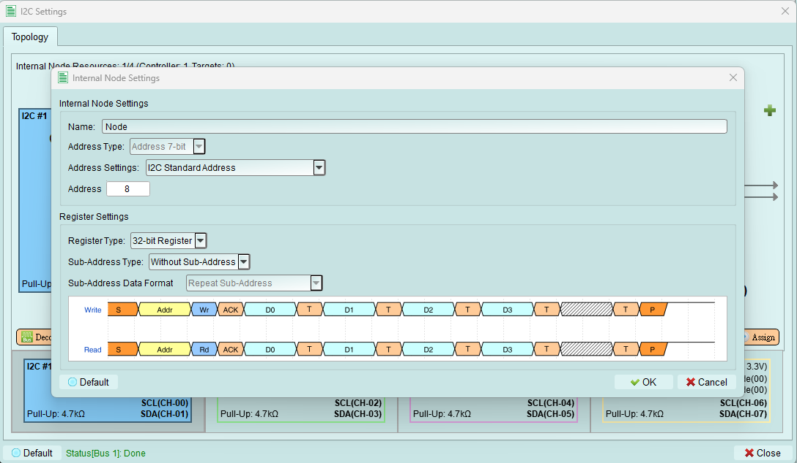
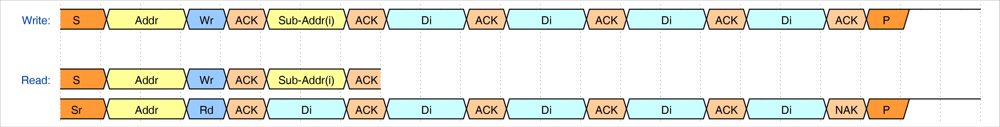
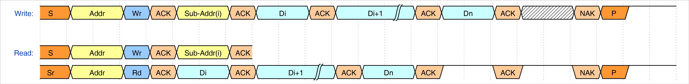
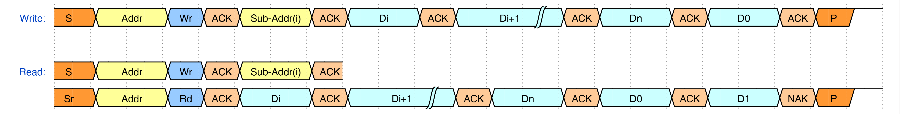

# Internal Node

Create internal nodes. After completing all necessary settings, press the `Assign` button to place it on the bus.

1. Name: Set the Name for this node to help users identify it.
2. Address Type: Set the Address Type of this node. We now only support 7-bit mode.
3. Address Settings:
    1. I2C Standard Address: User can only set the standard address value (0x08 ~ 0x77).
    2. I2C Address (Include Reserved Address): User can set all the available address value (0x00 ~ 0x7F).
4. Address: Set the Address value.
5. Register Settings:
    1. Register Type: Set the Register Type. We now only support 32-bit Register.
    2. Sub-Address Type:
        1. Without Sub-Address: Do not use Sub-Address.
        2. 8-bit Sub-Address: Sub-Address type. We now only support 8-bit Sub-Address.
    3. Sub-Address Data Format: This setting only avaliable while the `Sub-Address Type` is set to `8-bit Sub-Address`
        1. Repeat Sub-Address
        
        2. Increment Sub-Address
        
        3. Increment Loop Sub-Address
        
        4. Ignore Sub-Address
        
