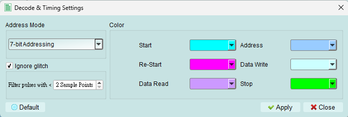
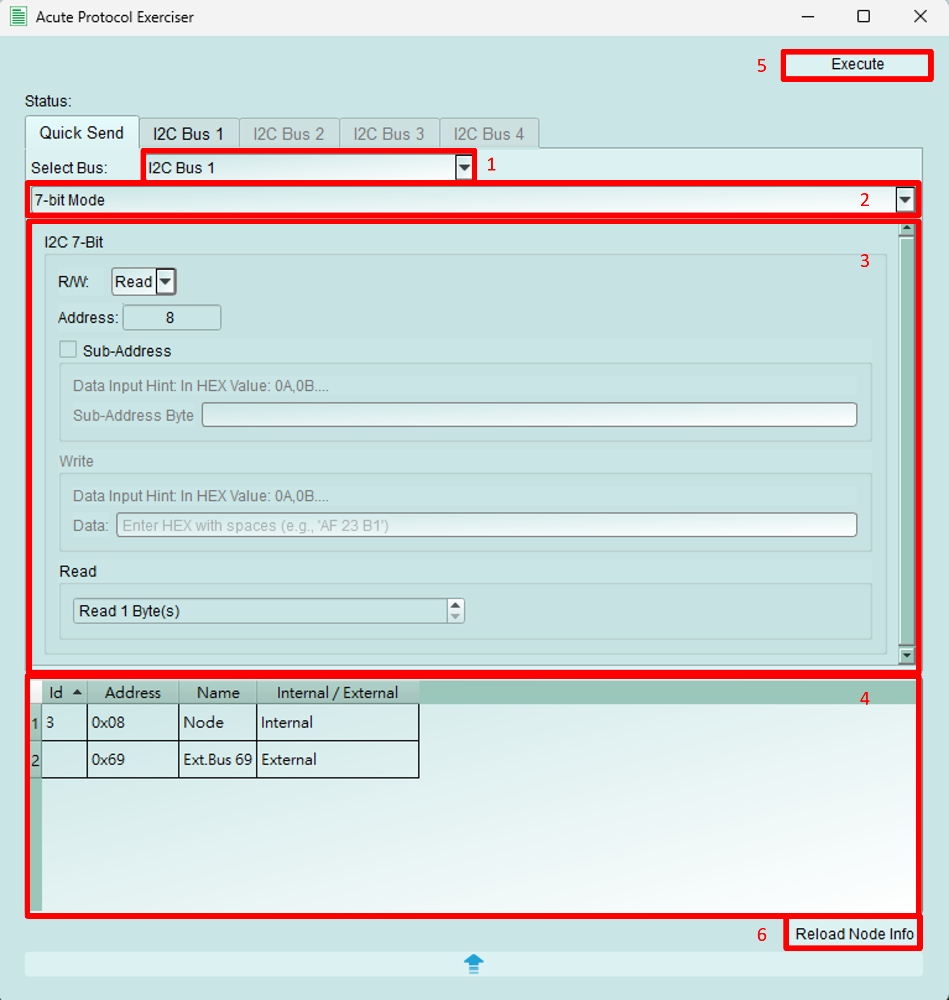
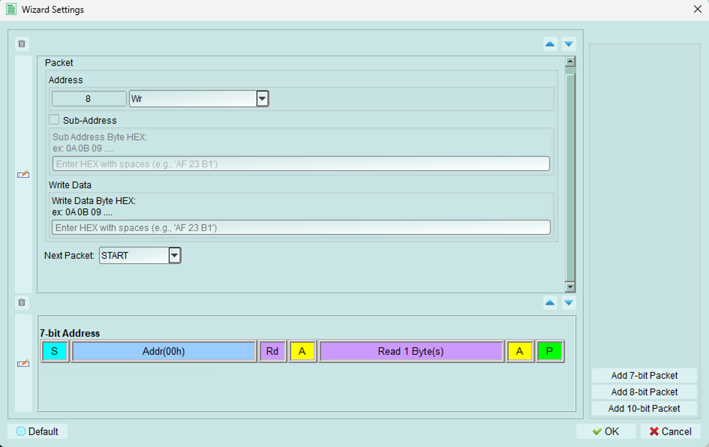

# Controller Mode

## Timing Settings

User can adjust I2C timing, including:

1. Clock Frequency, {++range from 1kHz to 1000kHz.++}
2. Each components, {++scale from 5ns to 20us.++}
    * User can drag the slider bar to adjust the Setup and Hold time of Data.

## Functions

### Assign
Assign the edited topology to the Exerciser device, so it can clearly understand the status of the bus and send commands or response data correctly.
The topology including the number of controller, internal node, the address, the type of internal node, etc.

### Reload
Reload the topology from the Exerciser divice and display it.

### Scan External Node
Scan all the available address, from 0x08 to 0x77. If any node return ACK, it will appear on the topology.

### Decode Settings

Set the parameters for LA to decode I2C signal.

## Send packet
To open the wizard, please check the [Wizard](px.md/#wizard)

### Quick Send

1. User can decide to send packet from any bus.
2. User can choose to build 7-bit, 8-bit or 10-bit mode packet. {++*In this document, we use 7-bit mode packet as example.*++}
3. User can specifically set the detail of the packet:
    1. R / W: Set this packet is WRITE or READ operation.
    2. Address: Set the address.
    3. Sub-Address: Set the sub-address value while enable this funciton.
    4. Write Data: Set the data for writing.
    5. Read Byte Count: Set the read byte count while doing READ operation.
4. Display address table. It will display information of internal and exteranl nodes.
5. Send out the packet.
6. Reload the address table.

### Packet Constructor

Switch to bus tab, click the buttom right `Add` button, it allows user to add 7-bit, 8-bit or 10-bit WRITE or READ packet.
After edit the packets, click the `Execute` to send out the packets.
As the same, we take 7-bit packet as example.

#### Edit Packet

1. Adjust the packet order.
2. Open the detail editing dialog.
    
    1. Add WRITE or READ packet.
    2. Detailly edit the packet.
        
        1. Address: User can set the packet address and WRITE or READ operation.
        2. Sub-Address: Set the sub-address if this function is enabled.
        3. Write Data: Data for writing. If the operation is switched to READ, user can set the read byte count.
        4. Next Packet: User can decide there is START or REPEAT START between two packets.
    3. Drop the packet.
    4. Adjust the order of packets.