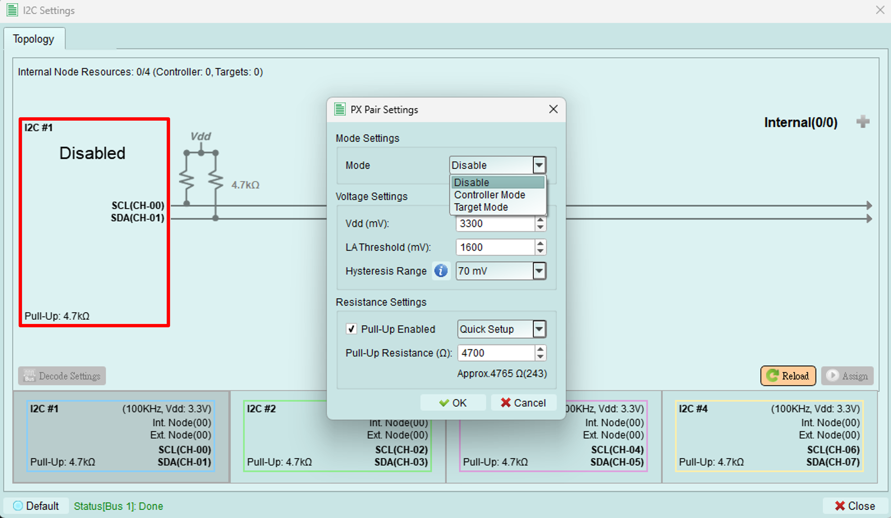

# Px Pair Settings

Pressing the button on the left side (in the red box) of this dialog, it will pop out a new dialog called "PX Pair Settings".

## Mode Settings
User can set the mode to:
1. Controller mode: Set Exerciser as controller on this bus.
2. Target mode: Set Exerciser as target on this bus.
3. or Disable
* {++No matter in Controller or Target mode, user can create virtual internal nodes for simulate multiple targets on the bus.++}
* {++The total number of controllers and internal nodes shall not exceed 4.++}

## Voltage Settings
All units for these settings are in {++*mV*++}.
1. Vdd: Set the working voltage.
2. LA Threshold: Set the LA threshold for decoding.
3. Hysteresis Range: Set the Hysteresis range.

## Resistance Settings
1. Pull-Up Enabled: User can activate this function by checking the checkbox.
2. Pull-Up Resistance: User can set the resistance by typing the value, or select some common resistance values.