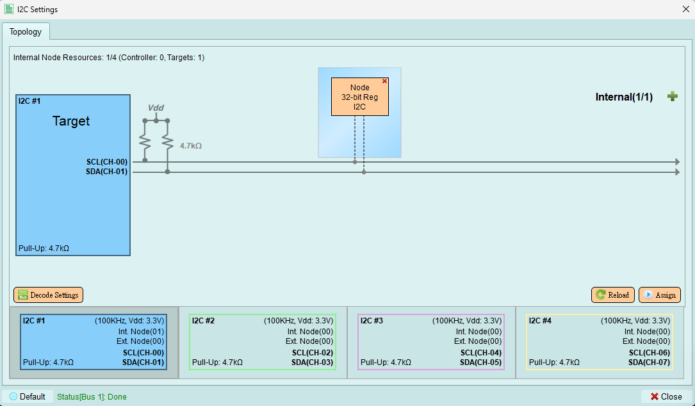
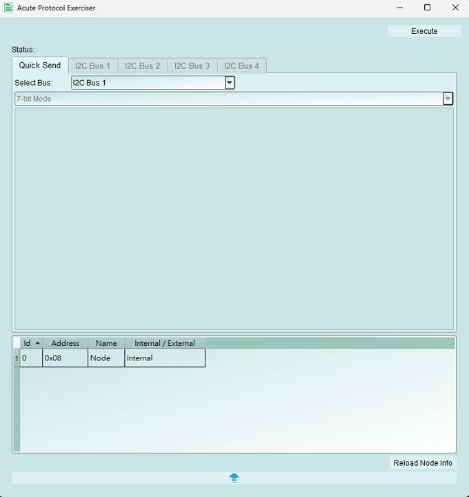

# Target Mode

All the buttons in Target Mode is the same in Controller Mode, but without `Timing Settings` and `Scan External Node`. Please reference the description of [buttons in Controller Mode](controller.md#functions).

And in Target Mode, users are NOT allowed to send out any packet. Therefore the buttons of I2C wizard are all disable.