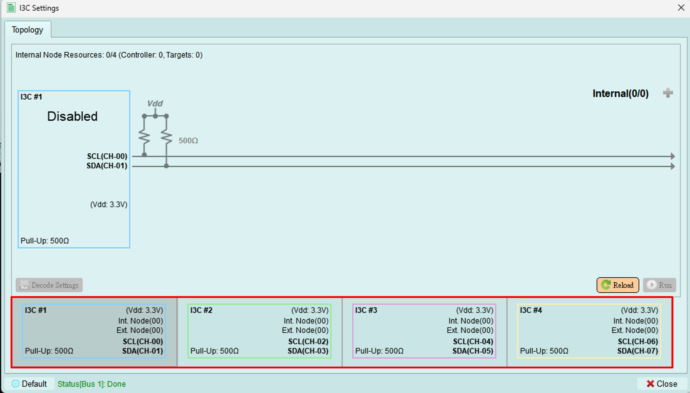

# Bus Select

There are two main bus configurations for MIPI I3C. The first is MIPI I3C with multiple data lanes[^1], which, in addition to the original clock and data signals, allows additional data lines to be added according to the specifications defined by the MIPI Alliance. The second is the traditional two-wire MIPI I3C configuration. In this mode, users are allowed to add up to four MIPI I3C buses[^1].

[^1]: Multi-Lane Function & Additional Buses will be released in the future.
{++Caution: All the channel for each bus is fixed, user can NOT adjust it arbitrarily.++}