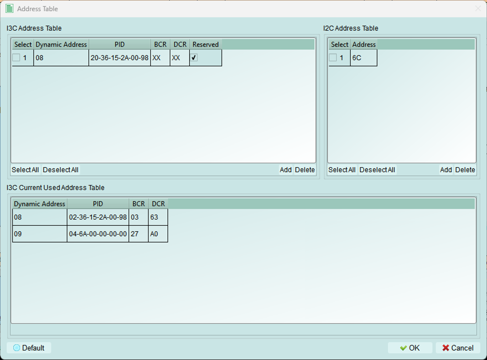
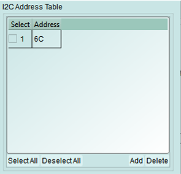
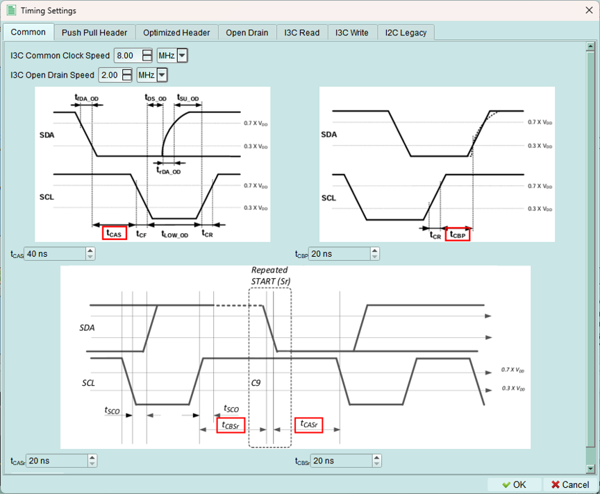
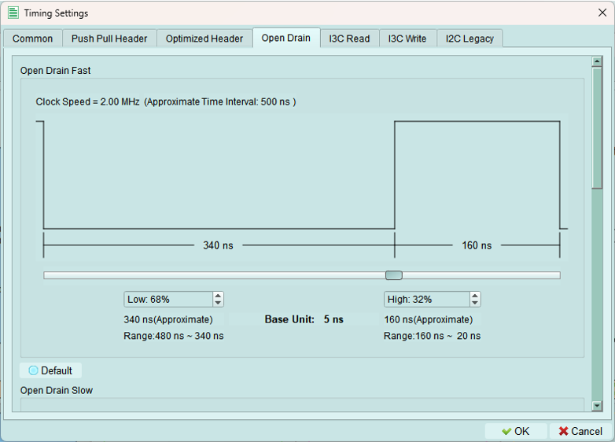
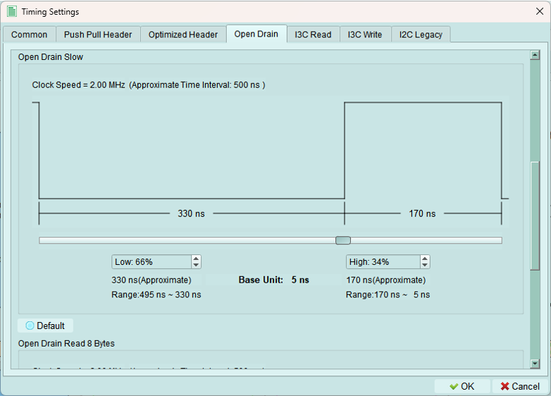
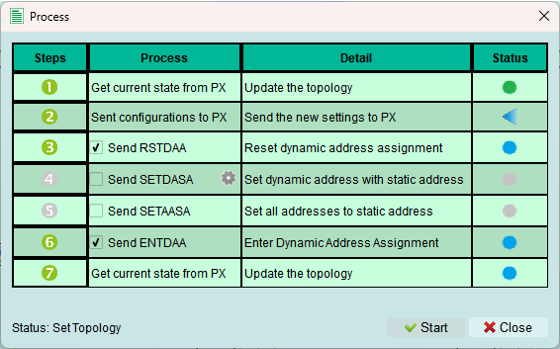
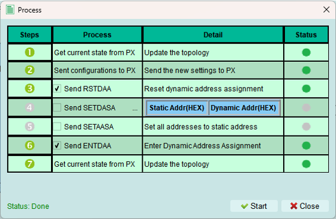

# Controller Mode

## Address Table

### I3C Address Table
Add the PID, BCR, and DCR to reserve a dynamic address for assignment by the controller. If the dynamic address is already in use, the controller will increment the value until an available address is found.
(X = Don't Care) 

### I2C Address Table
Add the I2C Nodes especially external I2C device to controller

### In-Used Table
Display the I3C nodes that are already in use. 

## Decode Settings
Set the parameters for LA to decode I3C signal.

1. **Color**: Select the colors for the LA decode elements
2. **Starup Mode**: Select the startup mode for the LA decode. Ususally, you can keep it default(SDR mode).
3. **Extended Specification**: Enable MIPI I3C Debug information
4. **Report Detail Option**: Enable more detail for the decode

## Timing Settings
The base unit for Acute Exerciser is *5 ns*. Users are not allowed to set the value under *5 ns*.

### Common settings

1. The clock speed range of the I3C is ***13MHz ~ 100Hz*** 
2. The Open Drain clock speed range is ***5MHz ~ 100Hz***
3. tCAS, tCBP, tCASr, tCBSr value adjustment (**Base Unit is 5 ns**)

### Push Pull Header

### Optimized Header

### Open Drain
1. Open Drain Fast:

2. Open Drain Slow

3. Open Drain Read 8 Bytes

### I3C Read
*This is Push Pull Speed*

### I3C Write
*This is Push Pull Speed*

### Legacy I2C
Speed Range for Legacy I2C is ***1MHz ~ 100Hz***

## Run
Assign the edited topology to the Exerciser device, so it can clearly understand the status of the bus and send commands or response data correctly. 

Some of the steps of the process are optional.

(The topology including the number of controller, internal node, the address, the type of internal node, etc.)

 : Error Occured. Check the Status.
 : Wait for processing
 : Skip this process
 : Process succeed

When the process succeed:

## Reload
If you build up the topology via python code, you may use the Reload button to refresh the current status of the exerciser topology.
