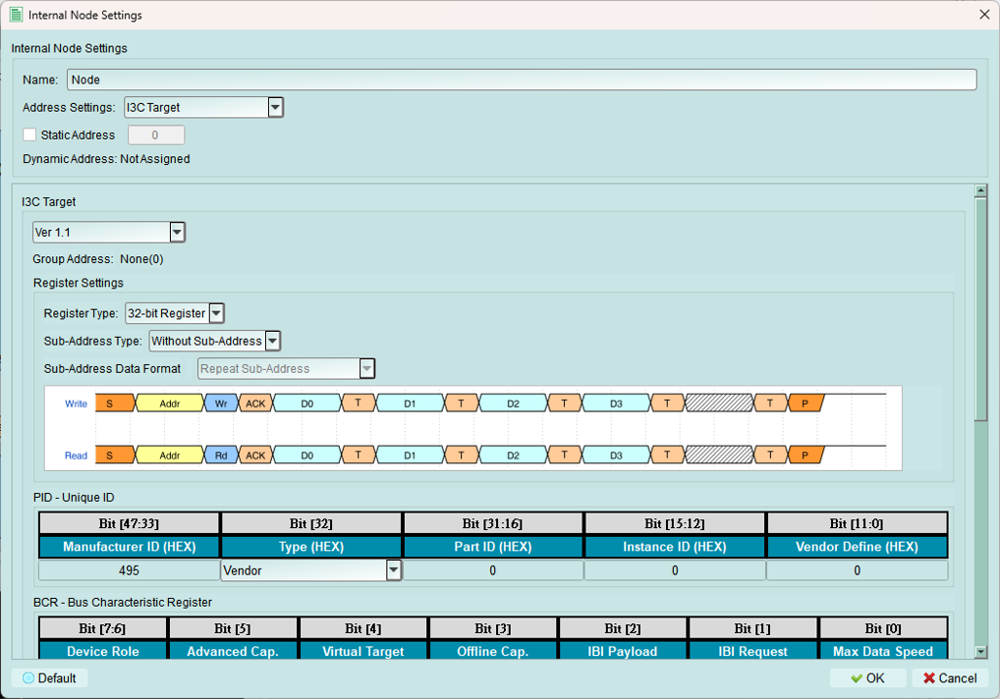
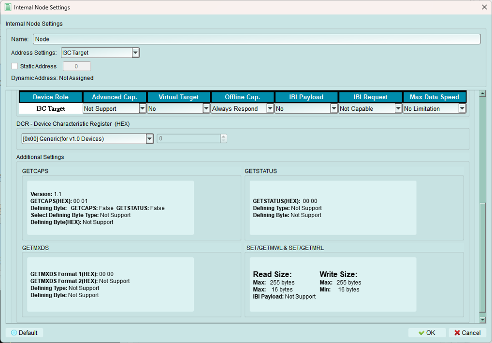
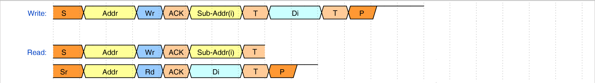
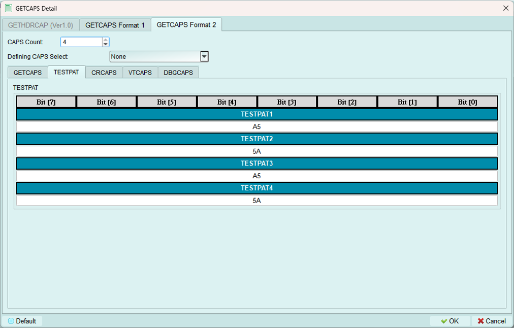
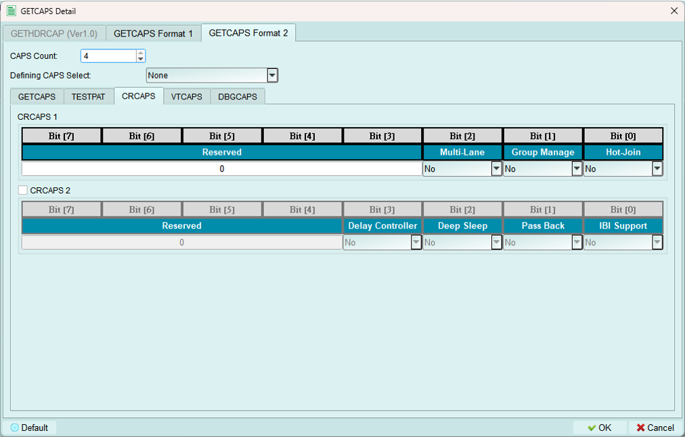
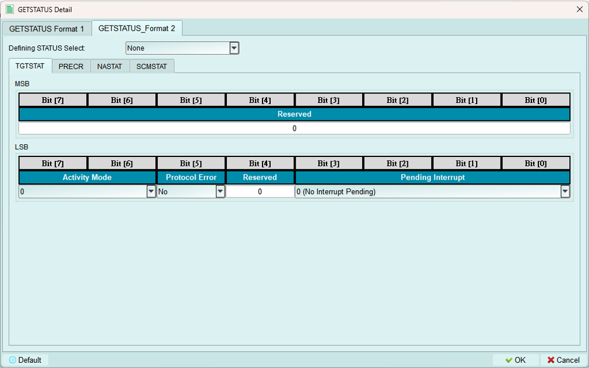
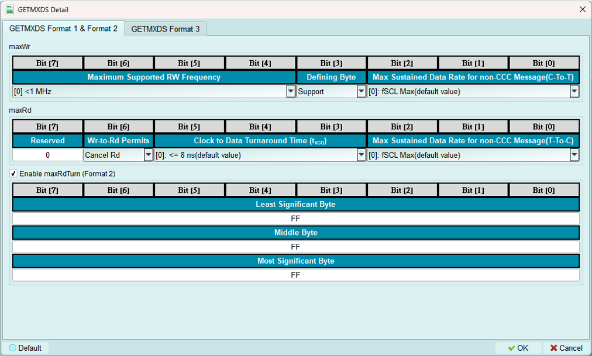
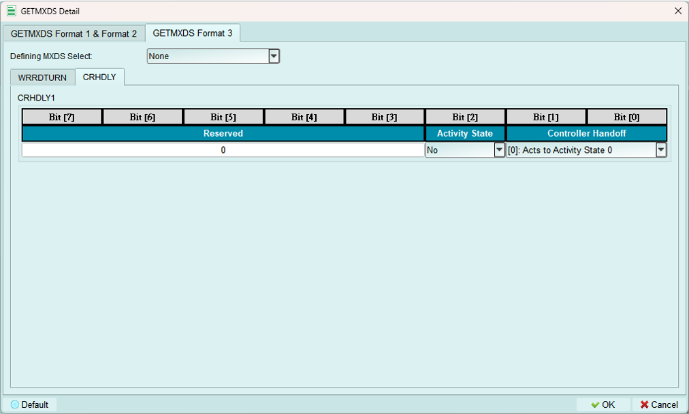
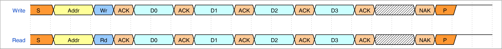

# Internal Node

## I3C Node

1. Name: Set the Name for this node to help users identify it.
2. Static Address: Set the Address value.
3. Register Settings:
    1. Register Type: Set the Register Type. We now only support 32-bit Register.
    2. Sub-Address Type:
        1. Without Sub-Address: Do not use Sub-Address.
        
        2. 8-bit Sub-Address: Sub-Address type. We now only support 8-bit Sub-Address.
    3. Sub-Address Data Format: This setting only avaliable while the `Sub-Address Type` is set to `8-bit Sub-Address`
        1. Repeat Sub-Address
        
        2. Increment Sub-Address
        
        3. Increment Loop Sub-Address
        
        4. Ignore Sub-Address
        

4. I3C Node Information:
    1. PID: Build the Unique ID
    2. BCR: Build the Bus Characteristic Register (This settings will affect other settings)
    3. DCR: Device Characteristic Register (Select **Custom** allows to type in the value in the spinbox ) 
    4. Additional Settings: 
        1. GETCAPS:
        
        This only enabled when selecting Version 1.0

        Format 1:
        
        Set CAPS Defining bit will enable the GETCAPS Format 2
        Set STATUS Defining bit will enable the GETSTATUS Format 2
        
        Format 2:
        *Defining Byte Format only support 1 kind of defining byte.*
        
        This is the same as the GETCAPS Format 1

        TESTPAT: 
        
        
        CRCAPS: 
        
        
        VRCAPS: 
        
        
        DBGCAPS:
        

        2. GETSTATUS:
        GETSTATUS Format 1:
        

        GETSTATUS Format 2:
        *Defining Byte Format only support 1 kind of defining byte.*
        
        This is the same as the GETSTATUS Format 1

        NASTAT:
        

        PRECR:
        

        SCMSTAT:
        

        
        3. GETMXDS:
        Format 1 & 2:
        

        Select *Support* in Defining Byte slot will enable the Defining byte format(Format 3) 

        Format 3
        *Defining Byte Format only support 1 kind of defining byte.*
        

        This is the same as the GETMXDS Format 1 or 2

        CRHDLY:
        

        4. MWL & MRL:
        *IBI Size only enabled when BCR IBI related bit set to Support*
        
        

## Legacy I2C Node

1. Name: Set the Name for this node to help users identify it.
2. Static Address: Set the Address value.
3. Register Settings:
    1. Register Type: Set the Register Type. We now only support 32-bit Register.
    2. Sub-Address Type:
        1. Without Sub-Address: Do not use Sub-Address.
        

        2. 8-bit Sub-Address: Sub-Address type. We now only support 8-bit Sub-Address.
    3. Sub-Address Data Format: This setting only avaliable while the `Sub-Address Type` is set to `8-bit Sub-Address`
        1. Repeat Sub-Address
        

        2. Increment Sub-Address
        

        3. Increment Loop Sub-Address
        

        4. Ignore Sub-Address
        

## I3C Stress Test

Continuously send out IBI packet for testing the ability of controller to deal with the great amount of IBI.