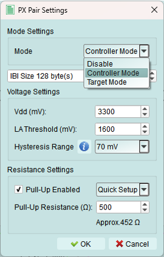
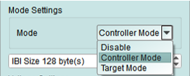

# Px Pair Settings

When you pressed the big button on the left side of the topology dialog, it will pop out a new dialog called "PX Pair Settings". You are able to setup your parameters here.

## Mode Settings
The Acute PX device allows you to assign multiple Targets and Controllers. As a result, you can simulate the instrument as Targets Only or as a Controller with Targets by selecting {++Targets Mode++} or {++Controller Mode++}, respectively.

Modes Seletion:
1. Disable: Disable the I3C-Bus functions.
2. Controller mode: Allow exerciser to simulates controller & targets on this bus. 
The purpose of configuring the IBI Size is to define the amount of IBI data that the virtual controller is allowed to accept.
3. Target mode: Allow exerciser to simulates targets on this bus.
{++No matter in Controller or Target mode, user can create virtual internal nodes for simulate multiple targets on the bus.++}

## Voltage Settings
All units for these settings are in {++*mV*++}.

1. Vdd: Set the working voltage.
2. LA Threshold: Set the LA threshold for decoding.
3. Hysteresis Range: Set the Hysteresis range.

## Resistance Settings

1. Pull-Up Enabled: User can activate this function by checking the checkbox.
2. Pull-Up Resistance: User can set the resistance by typing the value, or select some common resistance values.