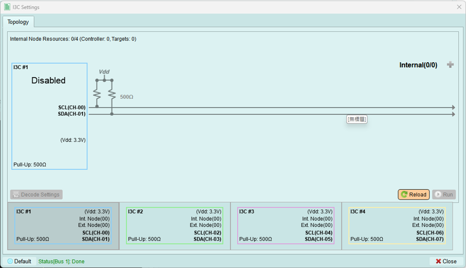

*Version Support: 1.2 & below*

# Quick Start
1. Activate the [selecting bus](bus_select.md) by clicking the left box.

2. Set up the [PX-Pod parameters](px_pair_settings.md) including pull-up resistance, Vdd, threshold and mode.

3. Set up the [{++Address Table++}](controller.md#address-table), [{++Timing Settings++}](controller.md#timing-settings) (Those are not available in Target Mode.)
4. Set up the [Decode settings](controller.md/#decode-settings) for LA waveform.
5. *(Optional)* Add [Internal nodes](internal_node.md).
6. *(Optional)* Enable the [DC power supply](../px.md#power-supply).
7. Press [Run](controller.md#run) to activate and send the topology settings to exerciser.
8. Send commands using [MIPI I3C wizard](wizard.md) in [Controller Mode](controller.md) only.