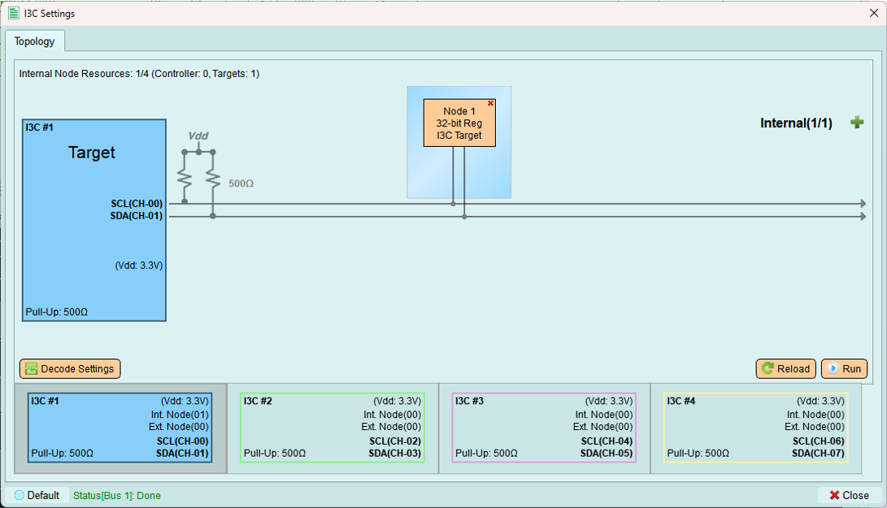
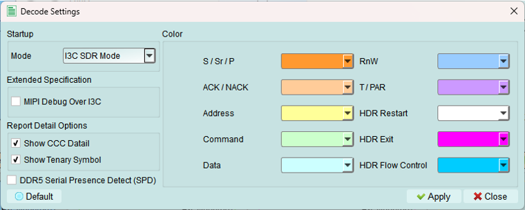
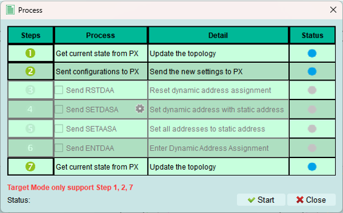

# Target Mode
If you have your own external controller, you may use the Target Mode to simulates the targets for your controller.

## Decode Settings
Same as the Controller Mode.
Set the parameters for LA to decode I3C signal.

1. **Color**: Select the colors for the LA decode elements
2. **Starup Mode**: Select the startup mode for the LA decode. Ususally, you can keep it default(SDR mode).
3. **Extended Specification**: Enable MIPI I3C Debug information
4. **Report Detail Option**: Enable more detail for the decode

## Run
Assign the edited topology to the Exerciser device, so it can clearly understand the status of the bus and send commands or response data correctly. 

Some of the steps of the process are not available in Target Mode.

(The topology including detail of internal nodes, etc.)

 : Error Occured. Check the Status.
 : Wait for processing
 : Skip this process
 : Process succeed

When the process succeed:

## Reload
Same as the Controller Mode.
If you build up the topology via python code, you may use the Reload button to refresh the current status of the exerciser topology.
